## Java 深入浅出设计模式
tags: Java 设计原则 设计模式

### 六大设计原则

#### 1. 基础原则——开闭原则（Open-Closed Principle, OCP）

定义：一个软件实体应当对扩展开放，对修改关闭。即软件实体应尽量在不修改原有代码的情况下进行扩展。

在设计一个模块的时候，应当使这个模块可以在不被修改的前提下被拓展。从另外一个角度讲，就是所谓的“对可变性封装原则”，而此也意为着两点：
- 一种可变性不应当分散于很多代码片段中，而应当被封装到一个对象里面。同一种可变性的不同表象意味着同一个继承等级结构中的具体子类。
- 一种可变性不应当与另一种可变性混合在一起。类的设计应该具备特定的可变性而不是众多的可变性。

假设要用代码描述一个汽车类Car，其中要定义汽车的名称和发动机的类型，代码如下：

**代码片段1 Car.java**
```java
/**
* 违反开闭原则的汽车类
*/
public class Car{
  /**
  * 汽车名称
  */
  private String name;
  
  /**
  * 汽车引擎
  */
  private String engine;
  
  public String getName(){
    return name;
  }
  
  public void setName(String name){
    this.name = name;
  }
  
  public String getEngine(){
    return engine;
  }
  
  public void setEngine(String engine){
    this.engine = engine;
  }
  
  public void print(){
    System.out.println("引擎是" + engine + "的" + name);
  }
  
  public static void main(String[] args){
    Car car = new Car();
    car.setEngine("V4发动机");
    car.setName("皮卡");
    car.print();
    //运行结束
    //引擎是V4的皮卡
  }
}
```
可见，虽然这个类的使用是没有问题的，但是要更换其中的发动机类型将变得很复杂（上面的例子中使用的是字符串，效果不明显，假设发动机是一个单独的类这个问题就明显了），所以发动机类型这种变化应该被独立设定出来。

修改后的代码如下：

**代码片段2 CarModi.java**
```java
/**
* 符合开闭原则的汽车类
*/
public class CarModi{
  /**
    * 汽车名称
    */
    private String name;
    
    /**
    * 汽车引擎
    */
    private IEng engine;
    
    public String getName(){
      return name;
    }
    
    public void setName(String name){
      this.name = name;
    }
    
    public IEng getEngine(){
      return engine;
    }
    
    public void setEngine(IEng engine){
      this.engine = engine;
    }
    
    public void print(){
      System.out.println("引擎是" + engine.getEngine() + "的" + name);
    }
    
    public static void main(String[] args){
      Car car = new Car();
      car.setEngine(new V4Eng());
      car.setName("皮卡");
      car.print();
      car.setEngine(new V8Eng());
      car.print();
      //运行结束
      //引擎是V4的皮卡
      //引擎是V8的皮卡
    }
    
    /**
    * 引擎接口
    */
    interface IEng{
      String getEngine();
    }
    
    /**
    * V4引擎
    */
    class V4Eng implements IEng{
      private String eng = "V4";
      
      public String getEngine(){
        return eng;
      }
    }
    
    /**
    * V8引擎
    */
    class V4Eng implements IEng{
      private String eng = "V8";
          
      public String getEngine(){
        return eng; 
      }
    }
}
```
由代码可见，现在已经可以自由地更换引擎而不用修改汽车对象本身了。

#### 2. 单一职责原则（Single Responsibility Principle, SRP）

定义：一个类只负责一个功能领域中的相应职责，或者可以定义为：就一个类而言，应该只有一个引起它变化的原因。

在构造对象时，应将对象的不同职责分离至多个类中，从而确保引起该类变化的原因只有一个。使用此原则可以提高内聚，降低耦合度。

比如有一个文档类，这个类目前的职责是负责维护文档内容和打印，代码如下：

**代码片段3 Document.java**
```java
/**
* 违反SRP的文档类
*/
public class Document{
  /**
  * 文档内容
  */
  private String content;
  
  public String getContent(){
    return content;
  }
  
  public void setContent(String content){
    this.content = content;
  }
  
  /**
  * 打印方法
  */
  public void printMethod(){
    System.out.println("将文档内容打印至控制台");
  }
}
```
由代码可见，Document类有两种使其改变的因素，一个是文档内容的改变，这个是此类的本分职责；另一个是如果现在需要将文档传送至文件或者网络进行打印，那么势必要修改
Document中的print方法。这样一来，Document类就有了两种使其改变的因素，违反了SRP原则。修改方法就是将print方法放在另一个职责中：

**代码片段4 DocumentModi.java**
```java
/**
* 符合单一职责原则的文档类
*/
public class DocumentModi{
  /**
   * 文档内容
   */
  private String content;
    
  public String getContent(){
    return content; 
  }
    
  public void setContent(String content){
    this.content = content; 
  }
  
  /**
  * 打印对象
  */
  private IPrint print;
  
  public IPrint getPrint(){
    return print;
  }
  
  public void setPrint(IPrint print){
    this.print = print;
  }
  
  /**
  * 打印方法
  */
  public void printMethod(){
    print.print();
  }
} 

/**
* 打印接口
*/
interface IPrint{
  void print();
}

/**
* 控制台打印
*/
class ConsolePrint implements IPrint{
  @Override
  public void print(){
    System.out.println("将内容打印至控制台");
  }
}

/**
* 文件打印
*/
class ConsolePrint implements IPrint{
  @Override
  public void print(){
    System.out.println("将内容输出至文件");
  }
}
```
有代码可见，经过修改后的代码中Document和IPrint类的职责都很单一，这样耦合度就会降低，从而带来可维护性的好处。

#### 3. 里氏替换原则（Liskov Substitution Principle, LSP）

定义：若对每个类S的对象O1，都存在一个类T的对象O2，使得在所有针对T编写的程序P中，用O1替换O2后，程序P行为功能不变，则S是T的子类。

该原则的具体应用体现在继承关系上，在实现继承时，子类必须能替换掉它们的基类。如果一个软件代码中使用的是基类的话那么也一定可以使用其子类，但反过来的
代换则可以不成立。

下面的例子解决了一个问题：为什么正方形不可以设计为矩形的子类：

**代码片段5 Rectangle.java**
```java
/**
* 违反里氏替换原则的继承
*/
public class Rectangle{
  /**
  * 长方形可以单独设计宽和高
  */
  private int width;
  private int height;
  
  public int getWidth(){
    return width;
  }
  
  public void setWidth(int width){
    this.width = width;
  }
  
  public int getHeight(){
    return height;
  }
  
  public void setHeight(int height){
    this.height = height;
  }
}

class Square extends Rectangle{
  /**
  * 正方形的宽和高等长所以将对高的操作全部转移至宽中
  */
  public int getHeight() {
    return getWidth();
  }
  
  public void setHeight(int height){
    this.setWidth(height);
  }
}
```
代码中将正方形设计为矩形的子类，但是实际上正方形的特点和矩形不一样，因为它的宽和高不能独立变化，就会所以就会在编码过程中出现问题。修改后如下：

**代码片段6 RectangleModi.java**
```java
/**
* 符合里氏替换原则的继承
*/
public class RectangleModi{
   /**
    * 长方形可以单独设计宽和高
    */
    private int width;
    private int height;
    
    public int getWidth(){
      return width;
    }
    
    public void setWidth(int width){
      this.width = width;
    }
    
    public int getHeight(){
      return height;
    }
    
    public void setHeight(int height){
      this.height = height;
    }
}

class SquareModi {
  /**
  * 正方形的宽和高等长
  */
  private int length;
  
  public int getLength(){
    return length;
  }
  
  public void setLength(int length){
    this.length = length;
  }
}
```

#### 4. 依赖倒转原则（Dependency Inversion  Principle, DIP）

定义：抽象不应该依赖于细节，细节应当依赖于抽象。换言之，要针对接口编程，而不是针对实现编程。

依赖倒转原则要求我们在程序代码中传递参数时或在关联关系中，尽量引用层次高的抽象层类，即使用接口和抽象类进行变量类型声明、参数类型声明、方法返回类型
声明，以及数据类型的转换等，而不要用具体类来做这些事情。为了确保该原则的应用，一个具体类应当只实现接口或抽象类中声明过的方法，而不要给出多余的方法，
否则将无法调用到在子类中增加的新方法。

在引入抽象层后，系统将具有很好的灵活性，在程序中尽量使用抽象层进行编程，而将具体类写在配置文件中，这样一来，如果系统行为发生变化，只需要对抽象层进
行扩展，并修改配置文件，而无须修改原有系统的源代码，在不修改的情况下来扩展系统的功能，满足开闭原则的要求。
      
#### 5. 接口隔离原则（Interface  Segregation Principle, ISP）

定义：使用多个专门的接口，而不使用单一的总接口，即客户端不应该依赖那些它不需要的接口。其意图是不要强迫客户依赖于他们不需要的方法，应用接口将两者隔离。

在使用接口隔离原则时，我们需要注意控制接口的粒度，接口不能太小，如果太小会导致系统中接口泛滥，不利于维护；接口也不能太大，太大的接口将违背接口隔离
原则，灵活性较差，使用起来很不方便。一般而言，接口中仅包含为某一类用户定制的方法即可，不应该强迫客户依赖于那些它们不用的方法。

#### 6. 迪米特法则（Law of Demeter, LoD）

定义：迪米特法则又称为最少知识原则(LeastKnowledge Principle, LKP)，是指一个软件实体应当尽可能少地与其他实体发生相互作用。

如果一个系统符合迪米特法则，那么当其中某一个模块发生修改时，就会尽量少地影响其他模块，扩展会相对容易，这是对软件实体之间通信的限制，迪米特法则要求
限制软件实体之间通信的宽度和深度。迪米特法则可降低系统的耦合度，使类与类之间保持松散的耦合关系。

迪米特法则还有几种定义形式，包括：不要和“陌生人”说话、只与你的直接朋友通信等，在迪米特法则中，对于一个对象，其朋友包括以下几类：

 (1) 当前对象本身(this)；

 (2) 以参数形式传入到当前对象方法中的对象；

 (3) 当前对象的成员对象；

 (4) 如果当前对象的成员对象是一个集合，那么集合中的元素也都是朋友；

 (5) 当前对象所创建的对象。

### 面向对象的23种设计模式

设计模式的优点如下：
- 复用解决方案。设计模式的主要思想就是“复用”，通过复用已经确认的设计，能够在解决问题的过程中使用最小的成本获得最大的效益，不用再为那些总是会重复
出现的问题设计解决方案。
- 设计模式将设计方法标准化。
- 设计模式可以可以提高个人和团队的设计能力。
- 设计模式使软件更容易修改和维护。其原因在于：这些模式都是久经考验的解决方案。

#### *创建型模式*
用于创建对象。对象的创建会消耗掉系统的很多资源，所以单独对对象的创建进行研究，以便能够高效地创建对象就是创建型模式要探讨的问题。
#### 1. 工厂方法模式（Factory Method）

工厂方法模式定义了一个用户创建对象的接口，让子类决定实例化哪一个类。工厂方法模式使一个类的实例化延迟到其子类。

通用类图如下：


工厂模式分为三种：    
1. 简单工厂模式（Simple Factory） 
1. 工厂方法模式（Factory Method） 
1. 抽象工厂模式（Abstract Factory）

[简单工厂模式(Simple Factory Pattern)](https://design-patterns.readthedocs.io/zh_CN/latest/creational_patterns/simple_factory.html)：又称为静态工厂方法(Static Factory Method)模式，它属于类创建型模式。在简单工厂模式中，可以根据参数的不同返回不同类的实例。简单工厂模式专门定义一个类来负责创建其他类的实例，被创建的实例通常都具有共同的父类。

[工厂方法模式(Factory Method Pattern)](https://design-patterns.readthedocs.io/zh_CN/latest/creational_patterns/factory_method.html):又称为工厂模式，也叫虚拟构造器(Virtual Constructor)模式或者多态工厂(Polymorphic Factory)模式，它属于类创建型模式。在工厂方法模式中，工厂父类负责定义创建产品对象的公共接口，而工厂子类则负责生成具体的产品对象，这样做的目的是将产品类的实例化操作延迟到工厂子类中完成，即通过工厂子类来确定究竟应该实例化哪一个具体产品类。

下一节会具体介绍抽象工厂模式。

#### 2. 抽象工厂模式（Abstract Factory）

抽象工厂模式提供一个创建一系列相关或相互依赖对象的接口，而无须指定它们的具体类。

通用类图如下：


[抽象工厂模式(Abstract Factory Pattern)](https://design-patterns.readthedocs.io/zh_CN/latest/creational_patterns/abstract_factory.html)

也可参考：https://juejin.im/entry/58f5e080b123db2fa2b3c4c6

#### 3. 建造者模式（Builder Factory）

建造者模式将一个复杂对象的构建与他的表示相分离，使得同样的构建过程可以创建不同的表示。

通用类图如下：

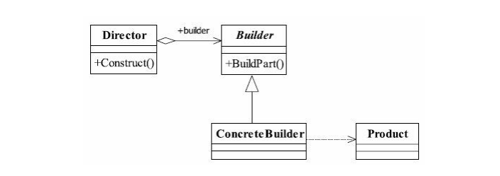

[建造者模式(Builder Pattern)](https://design-patterns.readthedocs.io/zh_CN/latest/creational_patterns/builder.html)，它是一步一步创建一个复杂的对象，它允许用户只通过指定复杂对象的类型和内容就可以构建它们，用户不需要知道内部的具体构建细节。建造者模式属于对象创建型模式。根据中文翻译的不同，建造者模式又可以称为生成器模式。

#### 4. 原型模式（Prototype）

原型模式用原型实例指定创建对象的种类，并且通过拷贝这些原型来创建新的对象。

通用类图如下：


#### 5. 单例模式（Singleton）

单例模式确保一个类只有一个实例，而且自行实例化并向整个系统提供这个实例。这个类成为单例类。

由定义可总结出三个要点：一是单例类只能有一个实例；二是它必须自行创建这个实例；三是它必须自行向整个系统提供这个实例。

通用类图如下：

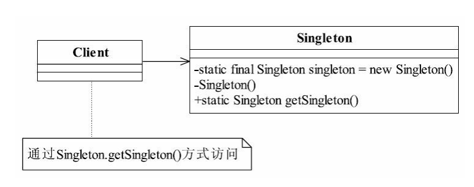

[单例模式（Singleton）](https://design-patterns.readthedocs.io/zh_CN/latest/creational_patterns/singleton.html)

#### *结构性模式*
用于构建类间的关系。如何设计对象的结构、继承和依赖关系会影响到后续程序的维护性，代码的健壮性、耦合性等。
#### 6. 适配器模式（Adapter）

适配器模式在编程过程中是一个经常用到的模式，它的作用是将一个类的接口转换成客户希望的另外一个接口。Adapter模式使得原本由于接口不兼容而不能一起工作
的那些类可以一起工作。

通用类图如下：

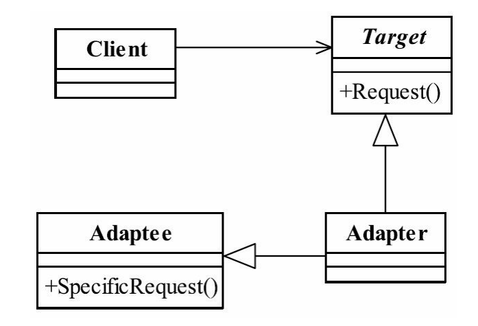

[适配器模式(Adapter Pattern)](https://design-patterns.readthedocs.io/zh_CN/latest/structural_patterns/adapter.html) ：将一个接口转换成客户希望的另一个接口，适配器模式使接口不兼容的那些类可以一起工作，其别名为包装器(Wrapper)。适配器模式既可以作为类结构型模式，也可以作为对象结构型模式。

这里有一个很好的[例子](http://blog.csdn.net/carson_ho/article/details/54910430).

#### 7. 桥接模式（Bridge）

桥接模式将抽象部分与实现部分分离，使它们都可以独立变化。

通用类图如下：

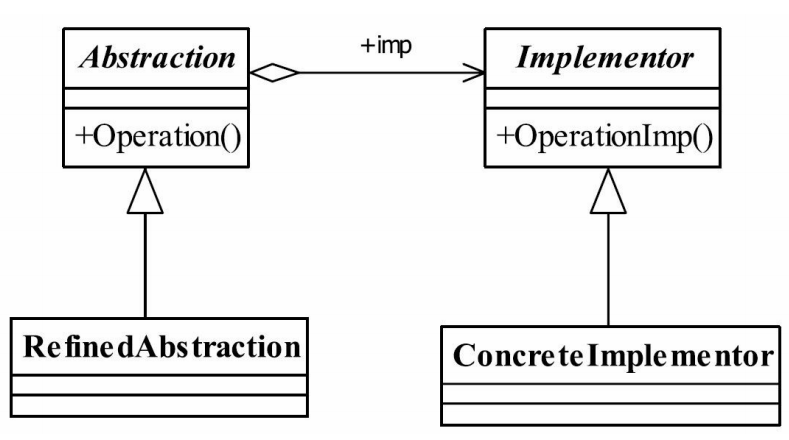

[桥接模式(Bridge Pattern)](https://design-patterns.readthedocs.io/zh_CN/latest/structural_patterns/bridge.html)它是一种对象结构型模式,又称为柄体(Handle and Body)模式或接口(Interface)模式。

#### 8. 代理模式（Proxy）

代理模式为其他对象提供一种代理以控制对这个对象的访问。 

普通代理通用类图如下：

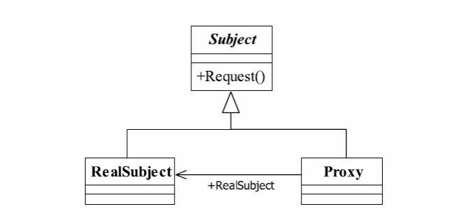

动态代理

- 动态代理是一种较为高级的代理模式，它的典型应用就是Spring AOP。
- 在传统的代理模式中，客户端通过Proxy调用RealSubject类的request()方法，同时还在代理类中封装了其他方法(如preRequest()和postRequest())，可以处理一些其他问题。
- 如果按照这种方法使用代理模式，那么真实主题角色必须是事先已经存在的，并将其作为代理对象的内部成员属性。如果一个真实主题角色必须对应一个代理主题角色，这将导致系统中的类个数急剧增加，因此需要想办法减少系统中类的个数，此外，如何在事先不知道真实主题角色的情况下使用代理主题角色，这都是动态代理需要解决的问题。

动态代理通用类图如下：

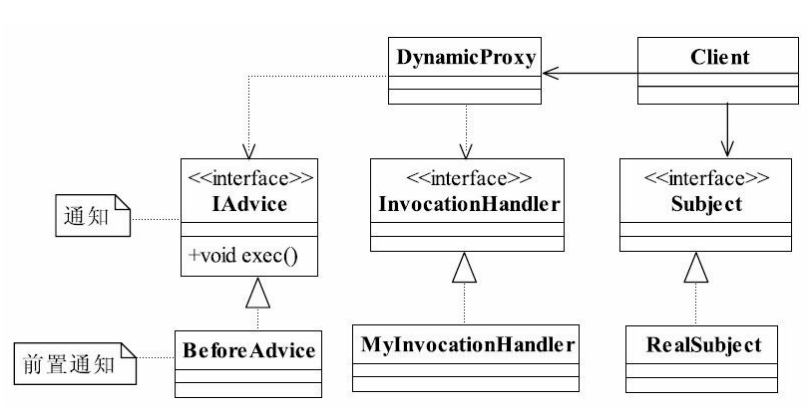

[代理模式(Proxy Pattern)](https://design-patterns.readthedocs.io/zh_CN/latest/structural_patterns/proxy.html#id4)文叫做Proxy或Surrogate，它是一种对象结构型模式。

[打怪升级理解代理模式](http://www.cnblogs.com/cbf4life/archive/2010/01/27/1657438.html).

#### 9. 外观模式（Facade）

外观模式的意图是为了给系统中的一组接口提供一个一致的界面，外观模式定义了一个高层接口，这个接口使得这一子系统更加容易使用。

通用类图如下：

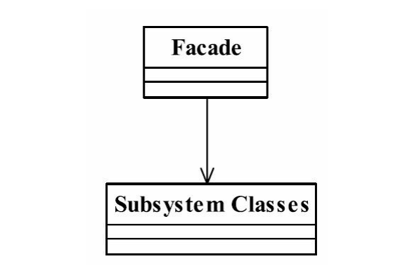

[外观模式(Facade Pattern)](https://design-patterns.readthedocs.io/zh_CN/latest/structural_patterns/facade.html)：外观模式又称为门面模式，它是一种对象结构型模式。

#### 10. 装饰模式（Decorator）

装饰模式可以动态地给一个对象添加一些额外的职责。

在实际应用中，装饰模式通常用做给现有的类增加功能，可以根据应用的需要，对装饰模式的类进行任意顺序的包装，最后生成符合要求的对象。

通用类图如下：

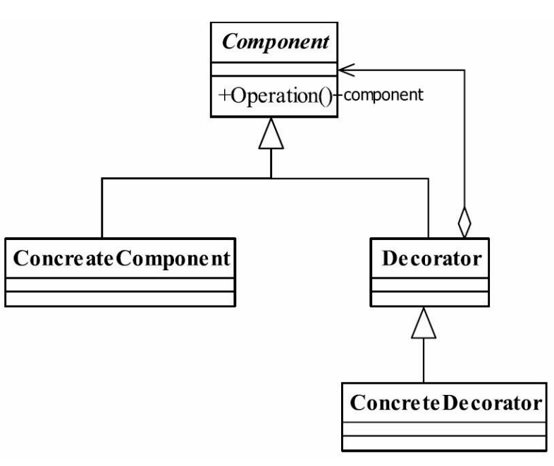

[装饰模式(Decorator Pattern)](https://design-patterns.readthedocs.io/zh_CN/latest/structural_patterns/decorator.html) ：动态地给一个对象增加一些额外的职责(Responsibility)，就增加对象功能来说，装饰模式比生成子类实现更为灵活。其别名也可以称为包装器(Wrapper)，与适配器模式的别名相同，但它们适用于不同的场合。根据翻译的不同，装饰模式也有人称之为“油漆工模式”，它是一种对象结构型模式。

#### 11. 组合模式（Composite）

组合模式将对象组合成树形结构以表示部分整体的关系，Composite使得用户对单个对象和组合对象的使用具有一致性。

通用类图如下：


#### 12. 享元模式（Flyweight）

享元模式的意图是用共享技术有效地支持大量的细粒度对象。

通用类图如下：


[享元模式(Flyweight Pattern)](https://design-patterns.readthedocs.io/zh_CN/latest/structural_patterns/flyweight.html)：运用共享技术有效地支持大量细粒度对象的复用。系统只使用少量的对象，而这些对象都很相似，状态变化很小，可以实现对象的多次复用。由于享元模式要求能够共享的对象必须是细粒度对象，因此它又称为轻量级模式，它是一种对象结构型模式。

#### *行为性模式*
用于控制对象的行为。如果对象的行为设计得好，那么对象的行为就会更清晰，它们之间的协作效率就会更高。
#### 13. 命令模式（Command）

命令模式将一个请求封装为一个对象，从而使你可以用不同的请求对客户进行参数化，对请求排队和记录请求日志，以及支持可撤销的操作。

通用类图如下：

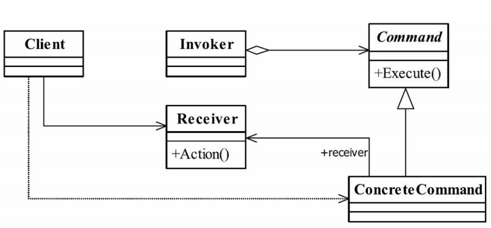

[命令模式(Command Pattern)](https://design-patterns.readthedocs.io/zh_CN/latest/behavioral_patterns/command.html)：命令模式是一种对象行为型模式，其别名为动作(Action)模式或事务(Transaction)模式。

#### 14. 观察者模式（Observer）

观察者模式的意图是定义对象间一对多的依赖关系，当一个对象的状态发生改变时，所有依赖于它的对象都得到通知自动更新。

通用类图如下：

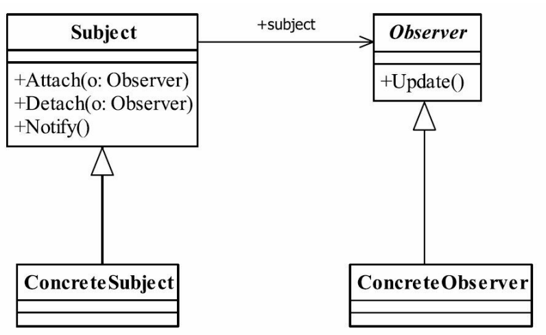

[观察者模式(Observer Pattern)](https://design-patterns.readthedocs.io/zh_CN/latest/behavioral_patterns/observer.html)：观察者模式又叫做发布-订阅（Publish/Subscribe）模式、模型-视图（Model/View）模式、源-监听器（Source/Listener）模式或从属者（Dependents）模式。

#### 15. 责任链模式（Chain of Responsibility）

责任链模式使多个对象都有机会处理请求（Request），从而避免请求的送发者和接收者之间的耦合关系。该模式将这些对象连成一条链，并沿着这条链传递该请求，
直到有一个对象处理请求为止。 

通用类图如下：

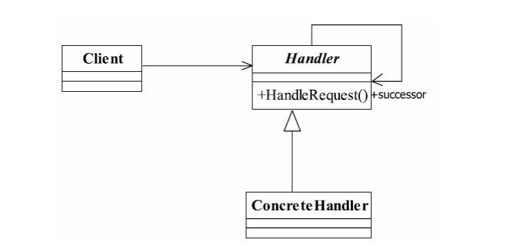

#### 16. 迭代器模式（Iterator）

迭代器模式提供一个方法顺序访问一个聚合对象的各个元素，而又不需要暴露该对象的内部细节。

通用类图如下：


#### 17. 访问者模式（Visitor）

访问者模式定义一个作用于某对象结构中的各元素的操作，它使你可以在不改变各元素类的前提下定义作用于这个元素的新操作。

通用类图如下：

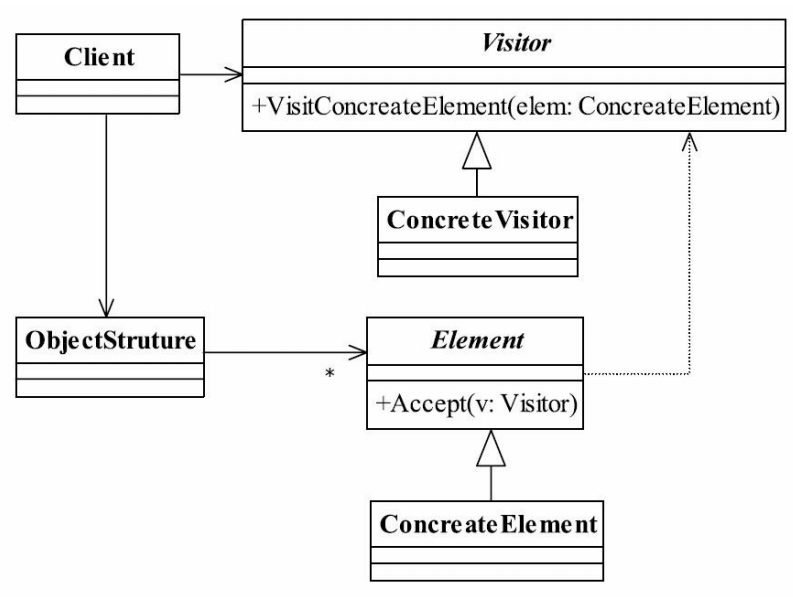

#### 18. 状态模式（State）

状态模式允许对象在其内部状态改变时改变他的行为，对象看起来似乎改变了他的类一样。

通用类图如下：

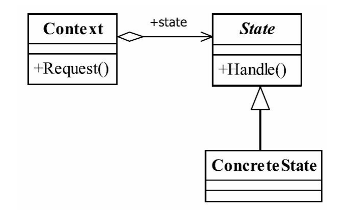

[状态模式(State Pattern)](https://design-patterns.readthedocs.io/zh_CN/latest/behavioral_patterns/state.html) 

#### 19. 备忘录模式（Memento）

备忘录模式可以在不破坏对象的前提下，捕获一个对象的内部状态，并在该对象之外保存这个状态。这样以后在需要时就可以将该对象恢复到原先保存的状态。 

通用类图如下：


#### 20. 策略模式（Strategy）

策略模式的目的是定义一系列的算法，把它们一个个封装起来，使它们可以互相替换，从而使得算法可以独立于使用它们的客户而发生变化。

通用类图如下：


[策略模式(Strategy Pattern)](https://design-patterns.readthedocs.io/zh_CN/latest/behavioral_patterns/strategy.html)：也称为政策模式(Policy)。

#### 21. 调停者模式（Mediator）

调停者模式（中介者模式）定义了一组对象之间的相互影响的行为的对象，这样可以使用松耦合的方式联系一组对象，避免对象之间互相显式地直接引用，从而当改变了某些对象之间
的关系时，就可以不影响其他的对象了。

通用类图如下：


[中介者模式(Mediator Pattern)定义](https://design-patterns.readthedocs.io/zh_CN/latest/behavioral_patterns/mediator.html)：中介者模式又称为调停者模式，它是一种对象行为型模式。

#### 22. 模板方法模式（Template Method）

模板方法模式的设计意图是由抽象父类控制顶级逻辑，并把基本操作的实现推迟到子类中去实现，这是通过继承的手段来达到对对象的复用。

通用类图如下：

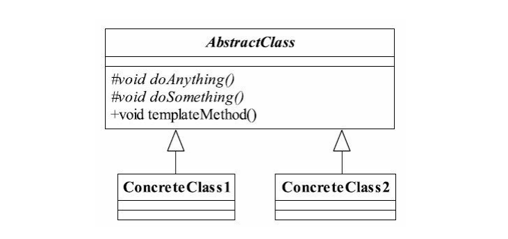

#### 23. 解释器模式（Interpreter）

解释器模式给定一种语言，定义它的文法标识，并定义一个解释器，然后这个解释器将使用该文法标识来解释语言中的句子。

通用类图如下：


