## 来了解一下栈吧：最近杠上了 `LeetCode` 的计算器

前言：在平时的工作中，栈出现的频率似乎不是很高，但并不意味着它不重要，在某些场景下，栈还是有着独特优势的。

#### 一、什么是栈

**栈** （stack）是限制删除和插入在一个位置上进行的表，该位置是表的末端，叫作栈的顶（top）。对栈的基本操作有 push （入栈）和 pop （出栈），前者相当于插入，后者相当于删除最后插入的元素。栈有时又叫作 LIFO（后进先出）表。

#### 二、栈的实现

由于栈是一个表，因此任何实现表的方法都能实现栈。显然，`ArrayList` 和 `LinkedList` 都支持栈操作；99% 的时间他们都是最合理的选择。我们将给出两个流行的实现方法，一种方法使用链式结构，另一种方法则使用数组。

##### 2.1 栈的链表实现

栈的第一种实现方式是单链表。通过在表的顶端插入来实现 `push` ，通过删除表顶端元素实现 `pop`。`top` 操作知识考查表顶端元素并返回它的值。有时 `pop` 操作和 `top` 操作合二为一。

##### 2.2 栈的数组实现

另一种方法避免了链而且可能是更流行的解决方案。由于模仿 `ArrayList` 的 `add` 操作，因此相应的实现方法非常简单。与每个栈相关联的操作是 `theArray` 和 `topOfStcak`，对于空栈它是 -1（这就是空栈初始化的做法）。为将某个元素 `x` 推入栈中，我们使 `topOfStack` 增 1 然后置 `theArray[topOfStack] = x`。为了弹出栈元素，我们置返回值为 `theArray[topOfStack]` 然后使 `topOfStack` 减 1 。

#### 三、用 `Stack` 来做题吧

##### 3.1 热身：有效的括号

> `leetcode # 20有效的括号` : https://leetcode-cn.com/problems/valid-parentheses/
>
> 给定一个只包括 '('，')'，'{'，'}'，'['，']' 的字符串，判断字符串是否有效。
>
> 有效字符串需满足：
>
>     左括号必须用相同类型的右括号闭合。
>     左括号必须以正确的顺序闭合。
>
> 注意空字符串可被认为是有效字符串。

这道题很显然，栈是一个很好的选择。众所周知，栈有一个很典型的应用——平衡符号，用来检验每种括号是否为成对出现的。序列 `[()]` 是合法的，但 `[(])` 是错误的。于是算法简单的可以写为：

```
做一个空栈。读入字符，如果字符是一个开放符号，则将其入栈；如果字符是一个封闭符号，则当栈为空时报错，否则，将栈顶元素出栈。如果出栈符号不是对应的开放符号，则报错（即为无效括号）。
```

代码如下：

```java
public boolean isValid(String s) {
  if (s == null || s.equals("")) {
    return true;
  }
  char[] chars = s.toCharArray();
  Stack<Character> stack = new Stack<>();
  for (char c : chars) {
    if (isLeft(c)) {
      stack.push(c);
    } else if (stack.isEmpty() || !isMatch(stack.pop(), c)) {
      return false;
    }
  }
  return stack.isEmpty();
}

private boolean isMatch(char a, char b) {
  return (a == '(' && b == ')') || (a == '[' && b == ']') || (a == '{' && b == '}');
}

private boolean isLeft(char a) {
  return a == '(' || a == '[' || a == '{';
}
```

##### 3.2 `RPN-calculator` ：逆波兰计算器

> `leetcode  #150 逆波兰表达式求值`：https://leetcode-cn.com/problems/evaluate-reverse-polish-notation/
>
> 根据逆波兰表示法，求表达式的值。
>
> 有效的运算符包括 +, -, *, / 。每个运算对象可以是整数，也可以是另一个逆波兰表达式。
>
> 说明：
>
>     整数除法只保留整数部分。
>     给定逆波兰表达式总是有效的。换句话说，表达式总会得出有效数值且不存在除数为 0 的情况。
>

首先，我们先了解一下什么是逆波兰表示法。假如我们要计算下面的表达式：

```
4.99 * 1.06 + 5.99 + 6.99 * 1.06 = 
```

其计算顺序可以是将 4.99 和 1.06 相乘并存为 `A1`，然后将 5.99 和 `A1` 相加，再将结果存入 `A1` ；我们再将 6.99 与 1.06 相乘并将答案存为 `A2`，最后将 `A1` 和 `A2` 相加并将最后结果存入 `A1`。我们可以将这种操作顺序书写如下：

```
4.99 1.06 * 5.99 + 6.99 1.06 * +
```

这种记法叫作 **后缀**（postfix）或 **逆波兰**（reverse Polish）记法，其求值过程恰好就是上面所描述的过程。计算这种问题最容易的一个方法是用一个栈。当见到一个数时就把它推入栈中；在遇到一个运算符是该运算符就作用于该栈弹出的两个数（符号）上，再将所得结果推入栈中。例如，后缀表达式：

```
6 5 2 3 + 8 * + 3 + *
```

前四个字符放入栈中，此时栈变成

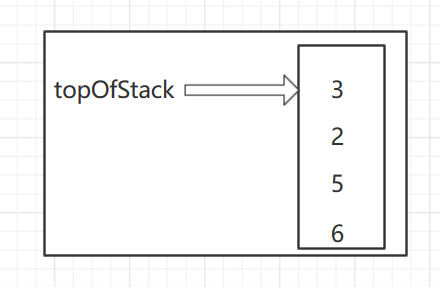

下面读到一个 ‘ + ’ 号，所以 3 和 2 从栈中弹出并且它们的和 5 被压入栈中

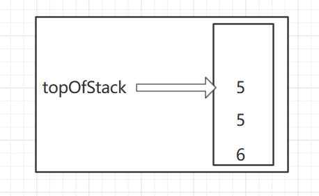

接着，8 进栈

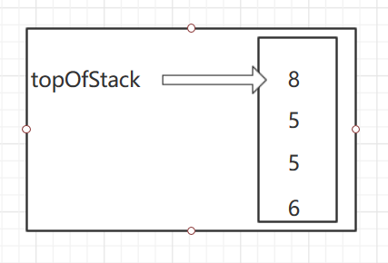

现在见到一个 ‘ * ’ 号，因此 8 和 5 弹出并且 5 * 8 = 40 进栈


接着又见到一个 ‘ + ’ 号，因此 40 和 5 被弹出且 40 + 5 = 45 进栈

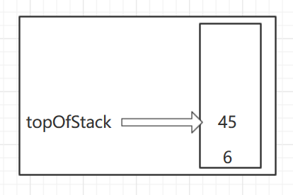

现在将 3 压入栈中

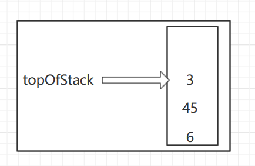

然后 ‘ + ’ 使得 3 和 45 出栈并将 45 + 3 = 48 压入栈中

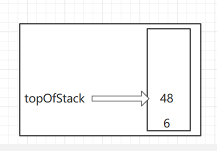

最后，遇到一个 ‘ * ’ 号，从栈中弹出 48 和 6；并将结果 6 * 48 = 288 压入栈中

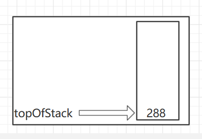

> 计算一个后缀表达式花费的时间是 O(N)，因为对输入中的每个元素的处理都是由一些栈操作组成从而花费常数的时间。注意，当一个表达式用后缀记法给出时，没有必要知道任何优先的规则，这是一个明显的优点。

那么，代码也就呼之欲出了：

```java
public int evalRPN(String[] tokens) {
    Stack<Integer> stack = new Stack<>();
    int result;
    for (String t : tokens) {
      switch (t) {
        case "+":
          result = stack.pop() + stack.pop();
          break;
        case "*":
          result = stack.pop() * stack.pop();
          break;
        case "/":
          // 除法需要保持顺序，比如 "13", "5", "/" => 应该是 13 / 5 而不是 5 / 13
          int last = stack.pop();
          result = stack.pop() / last;
          break;
        case "-":
          // 减法顺序和除法一样
          last = stack.pop();
          result = stack.pop() - last;
          break;
        default:
          result = Integer.parseInt(t);
          break;
      }
      // 将计算结果或者元素本身推入栈中
      stack.push(result);
    }
    return stack.pop();
  }
```

##### 3.3 基本计算器

> `leetcode #224 基本计算器`：https://leetcode-cn.com/problems/basic-calculator/
>
> 实现一个基本的计算器来计算一个简单的字符串表达式的值。
>
> 字符串表达式可以包含左括号 `(` ，右括号 `)`，加号 `+` ，减号 `-`，**非负**整数和空格 ` `。
>
> ```
> 输入: "(1+(4+5+2)-3)+(6+8)"
> 输出: 23
> ```

在我初看这道题目时，觉得，嗯，挺简单的啊，再细看这道题目时，呃，不愧是被标记为“困难”的一道题啊！

苦思冥想之后，我看到了上面的那道题，于是便想，可不可以转成 `rpn` 记法，再通过栈来计算呢？翻了一下题解，果然有这么想的！即我们可以先将表达式转为 `rpn` 记法（后缀表达式），然后再做计算。

因此栈不仅可以用来计算后缀表达式的值，而且还可以用栈将一个标准形式的表达式（或叫作中缀表达式（infix））转换成后缀表达式。我们通过只允许操作 `+` ，`*`，`(` ，`)`，并坚持普通的优先级法则而将一般的问题浓缩成小规模的问题。此外，还要进一步假设表达式是合法的。假设将中缀表达式 `a + b * c + (d * e + f) * g` 转换成后缀表达式 `a b c * + d e * f + g * +` 。

- 当读到一个操作数的时候，立即把它放到输出中。操作符不立即输出，从而必须先存在某个地方。正确的做法是将已经见到过但尚未放到输出中的操作符推入栈中。当遇到左括号时我们也要将其推入栈中。计算从一个空栈开始。
- 如果见到一个右括号，那么就将栈元素弹出，将弹出的符号写出直至遇到一个（对应的）左括号，但是这个左括号只被弹出并不输出。
- 如果我们见到任何其他的符号 `( +`，`*`，`()`，那么我们从栈中弹出栈元素的直到发现优先级更低的元素为止。有一个例外：除非是在处理一个 `)` 的时候，否则我们决不从栈中移出 `(` 。对于这种操作，`+` 的优先级最低，而 `(` 的优先级最高。当从栈弹出元素的工作完成后，我们再将操作符压入栈中。
- 最后，如果读到输入的末尾，我们将栈元素弹出变成空栈，将符号写入到输出中。

针对上面的转换过程，首先，符号 `a` 被读入，由于不是运算符，于是它被传向输出。然后，`+` 被读入并放入栈中。接下来 `b` 被读入并流向输出：

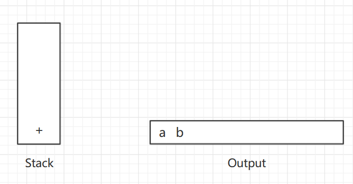

接着 `*` 号被读入。操作符栈的栈顶元素比 `*` 的优先级低，故没有输出且 `*` 进栈。接着，`c` 被读入并输出。至此，我们有

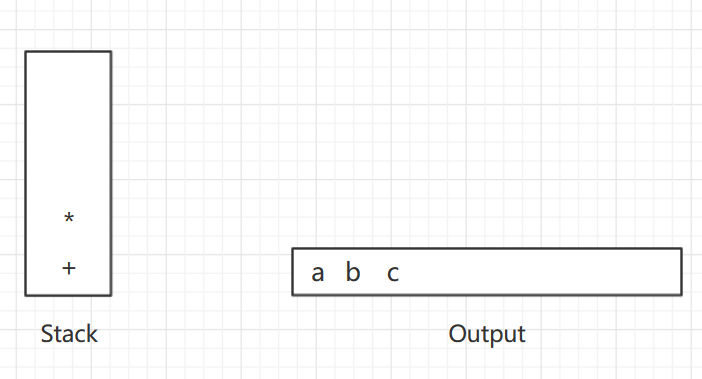

后面的符号是一个 `+` 号。检查一下我们发现，需要将 `*` 从栈中弹出并把它放到输出中；弹出栈中剩下的 `+` 号，该算符并不比刚刚遇到的 `+` 号的优先级低而是有相同的优先级；然后，将刚才的 `+` 号压入栈中

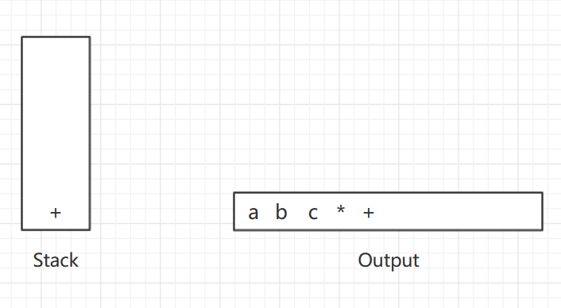

下一个被读到的符号是一个 `(` ，由于具有最高的优先级，因此它被放进栈中。然后，`d` 读入并输出

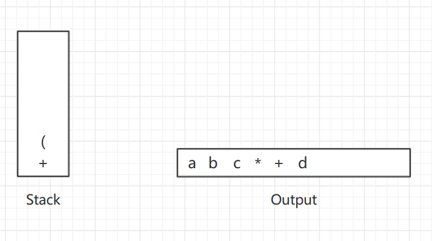

继续进行，我们又读到一个 `*`。由于除非正在处理闭括号否则开括号不会从栈中弹出，因此没有输出。下一个是 `e` ，它被读入并输出

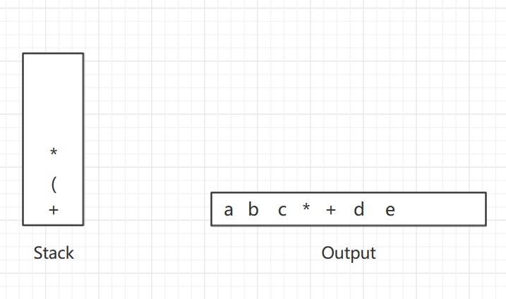

再往后读到的符号是 `+` 。我们将 `*` 弹出并输出，然后将 `+` 压入栈中。这以后，我们读到 `f` 并输出

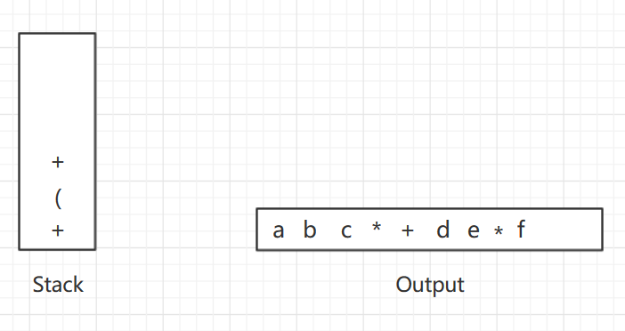

现在，我们读到一个 `)` ，因此将栈元素直到 `(` 弹出，我们将一个 `+` 号输出

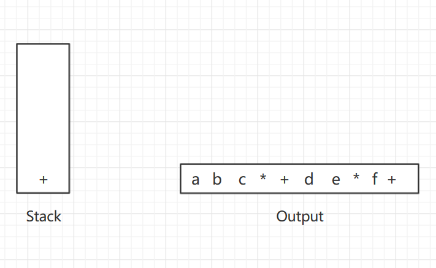

下面又读到一个 `*` ；该算符被压入栈中。然后，`g` 被读入并输出

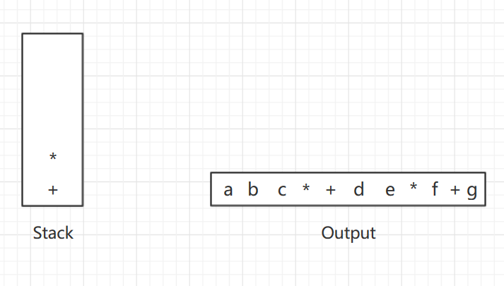

现在输入为空，因此我们将栈中的符号全部弹出并输出，直到栈变成空栈

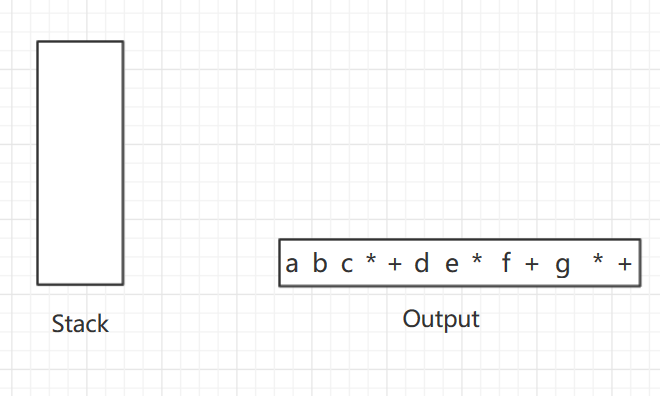

至此，我们变完成了中缀表达式到后缀表达式的转换。如我们所见，这种转换只需要 `O(N)` 时间并经过一趟输入后即可完成。可以通过指定减法和加法有相同的优先级以及乘法和除法有相同的优先级而将减法和除法添加到指令集中去。需要注意的是，表达式 `a - b - c` 应该转换成 `a b - c -` 而不是 `a b c - -` ，即顺序问题。那么，接下来便是代码时刻了，由于题目中不包含 `*`、`/` 号，所以代码里也就没有考虑，想要完善的同学可以自行补全：

```java
   public int calculate(String s) {
        int result = 0;
        Stack<Integer> stack = new Stack<>();
        int operand = 0;
        int sign = 1; // 1 代表正，-1 代表负

        int length = s.length();
        for (int i = 0; i < length; i++) {
            char ch = s.charAt(i);
            if (Character.isDigit(ch)) {
                // 形成操作数，因为它可能超过一位数
                operand = 10 * operand + (ch - '0');
            } else if (ch == '+') {
                // 使用结果，符号，操作数计算左边的表达式
                result += sign * operand;
                // 保存最近遇到的 '+' 号
                sign = 1;
                // 重置操作数
                operand = 0;
            } else if (ch == '-') {
                result += sign * operand;
                sign = -1;
                operand = 0;
            } else if (ch == '(') {
                // 将结果入栈，为了等下的计算
                // 先是结果，再是符号
                stack.push(result);
                stack.push(sign);
                // 重置操作数和结果，接着开始计算新的子表达式
                sign = 1;
                result = 0;
            } else if (ch == ')') {
                // 使用结果，符号，操作数计算左边的表达式
                result += sign * operand;
                // ')' 在一组括号内标记表达式的结尾
                // 其结果乘以堆栈顶部的符号，因为stack.pop() 是括号前的符号
                result *= stack.pop();
                // 然后加上栈顶的下一个操作数
                // (operand on stack) + (sign on stack * (result from parenthesis))
                result += stack.pop();
                // 重置操作数
                operand = 0;
            }
        }
        return result + (sign * operand);
    }

```

#### 四 、总结

到这儿，抽象数据类型（`ADT`）—— 栈的介绍就告一段落了，除了本文所介绍的应用，栈还可以用于记录方法调用等等，可以帮助我们更好的理解和解释递归，这些就由大家自行探索吧。文章中若有错误或纰漏，欢迎指出和交流。

### 链接参考

- 个人 `leetcode` 题解 `repo`：

  https://github.com/lq920320/algorithm-java-test/blob/master/src/test/java/leetcode/LeetCode.md

- 功能更完整的 `RPN-calculator`：

  https://github.com/monkey-play/rpn-calculator

- 参考：《数据结构与算法分析——Java语言描述》(第3章  表、栈和队列)