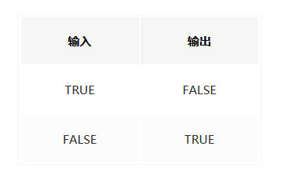
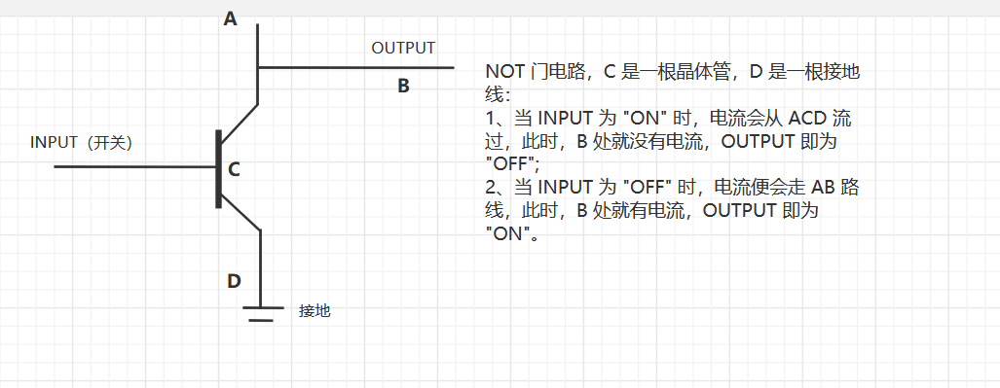
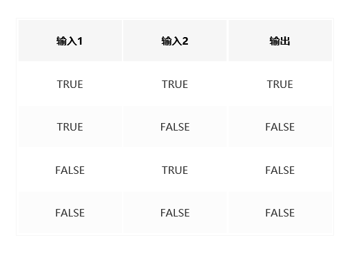
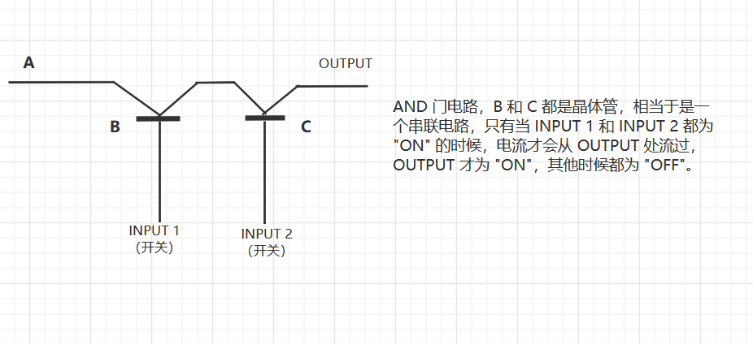
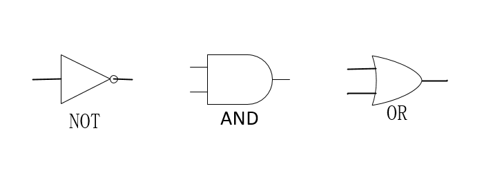
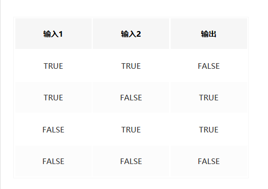
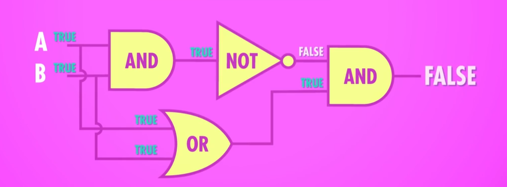

## 老婆饼里没老婆之用位运算实现加减乘除

众所周知，老婆饼里是没有老婆的，夫妻肺片是里没有夫妻的，那么四则运算中可以没有 `+`、`-`、`×`、`÷` 这四个运算符吗？当然是可以的。本文会先从基础知识介绍起，再通过代码实现，最后，我们还可以探讨一下计算机运算器的起点及其哲学。

### 1. 位运算实现四则运算的原理及其基础知识

#### 1.1 原码、反码与补码

众所周知，计算机的世界是由 0 和 1 组成的，我们平时也会称其为一个“二进制”的世界。一个数在计算机中的二进制表示，叫作这个数的**机器数**，其中，最高位表示该数的符号，正数为 0，负数为 1。另外，我们也将带有符号位的机器数对应的真正数值称为机器数的**真值**。

**原码（true form）**：原码就是我们上段提到的真值的概念。直观点讲，例如，用 8 位二进制表示一个数，`+11` 的原码为 `0，0001011`，`-11` 的原码为 `1，0001011`。

**反码（Inverse code）**：机器数是正数时，反码和原码是一样的；为负数时，反码就是原码除符号位外，其他位按位取反。直观来说，`+0` 和 `-0` 的反码，`+0` 的原码是 `0,0000000` ，则反码为 `0,0000000`；`-0` 的原码为 `1,0000000`，则反码为 `1,1111111` 。

**补码（two's complement representation）**：在计算机系统中，数值一律用补码来表示和存储（请记住这一点）。原因在于，使用补码，可以将符号位和数值域统一处理；同时，加法和减法也可以统一处理。

介绍完三者的概念，我们来演示一下，补码是怎么计算得来的。

首先，我们要先介绍一下“模”的概念：“模”是指一个计量系统的计数范围，如过去计量粮食用的斗、时钟等。计算机也可以看成一个计量机器，因为计算机的字长是定长的，即存储和处理的位数是有限的，因此它也有一个计量范围，即都存在一个“模”。如：时钟的计量范围是0~11，模=12。表示n位的计算机（32位，64位）计量范围是 0~$2^{n}$ -1，模即为 $2^{n}$ 。“模”实质上是计量器产生“溢出”的量，它的值在计量器上表示不出来，计量器上只能表示出模的余数。任何有模的计量器，均可化减法为加法运算。

假设当前时针指向8点，而准确时间是6点，调整时间可有以下两种拨法：一种是倒拨2小时，即`8-2=6`；另一种是顺拨10小时，`8+10=12+6=6`，即`8-2=8+10=8+12-2(mod  12)`。在12为模的系统里，加10和减2效果是一样的，因此凡是减2运算，都可以用加10来代替。若用一般公式可表示为：`a-b=a-b+mod=a+mod-b`。对“模”而言，2和10互为补数。实际上，以12为模的系统中，11和1，8和4，9和3，7和5，6和6都有这个特性，共同的特点是两者相加等于模。对于计算机，其概念和方法完全一样。n位计算机，设n=8，所能表示的最大数是11111111，若再加1成100000000(9位)，但因只有8位，最高位1自然丢失。又回到了 00000000，所以8位二进制系统的模为 $2^{8}$ 。在这样的系统中减法问题也可以化成加法问题，只需把减数用相应的补数表示就可以了。把补数用到计算机对数的处理上，就是补码。即计算机中的 `a-b` 等于 a 加上 b 的补码。

*原码求补码，以及补码求原码，大家感兴趣的话可以自己手动算一下，这里直接给结论。*

##### 1.1.1 原码求补码

**正数**：正数的补码与原码相同。

**负数**：负数的补码，将其原码除符号位外的所有位取反（0变1，1变0，符号位为1不变）后加1。

##### 1.1.2 补码求原码

⑴如果补码的符号位为“0”，表示是一个正数，其原码就是补码。

⑵如果补码的符号位为“1”，表示是一个负数，那么求给定的这个补码的补码就是要求的原码，即除符号位外取反后加1。

#### 1.2 四则（加减乘除）运算的原理

##### 1.2.1 加法

加法是运算中最简单的一个。小学我们学的加法，都是十进制的，个位加个位，十位加十位，逢十进位，各个位上的数值再加上进位就得到了结果，“和”。同理，计算机二进制的世界也是一样的，无非是 `1 + 0 = 1`，`1 + 1 = 0`，`0 + 0 = 0`，逢 2 进位。学过逻辑运算的应该都知道，前面的这种等式可以使用 “异或” 来进行实现，运算符为 `^`，也是计算机中位运算的一种，然后再记录进位就可以了。

##### 1.2.2 减法

既然解决了加法，那么减法就很容易了，`a - b = a + (-b)`，而上面提到的补码的知识在这里就有用了，求 `b 的反码加1` 即为 `-b` 的补码。这里我们用到的运算为取反，位运算符为 `~b`

##### 1.2.3 乘法

乘法的含义即为被乘数个乘数相加，说白了还是加法。

##### 1.2.4 除法

除法的含义即为不停地用除数去减被除数，直到被除数小于除数时，此时所减的次数就是我们需要的商，而此时的被除数就是余数。 

### 代码实现

了解完基本原理，写代码就是很简单的事了。注：这里的代码只是简单地实现了一下原理，感兴趣的同学可以写出更优的代码，也可以使用其他语言实现一下。

#### 1. 加法

```java
   /**
     * 实现 a + b 
     *
     * @param a
     * @param b
     * @return a 与 b 和
     */
    public static int add(int a, int b) {
        int sum = 0;
        // 进位
        int carry;
        while (b != 0) {
            sum = a ^ b;
            // 对应位和的进位，既然是进位，就要整体左移一位
            carry = (a & b) << 1;
            a = sum;
            b = carry;
        }
        return sum;
    }
```

#### 2. 减法

```java
    /**
     * 实现 a - b，其实就是 a + (-b)
     *
     * @param a
     * @param b
     * @return a - b 的差
     */
    public static int subtract(int a, int b) {
        // 引入 c = -b
        int c = add(~b, 1);

        return add(a, c);
    }
```

#### 3. 乘法

```java
   /**
     * 实现 a * b，即将被乘数累加乘数次得到的结果，先计算绝对值累加，再求符号
     *
     * @param a
     * @param b
     * @return
     */
    public static int multiply(int a, int b) {
        // 将乘数和被被乘数都取绝对值
        int multiplier = a < 0 ? add(~a, 1) : a;
        int multiplicand = b < 0 ? add(~b, 1) : b;

        // 计算绝对值的乘积
        int product = 0;
        int count = 0;

        while (count < multiplier) {
            product = add(product, multiplicand);
            count = add(count, 1);
        }

        // 计算乘积的符号
        if ((a ^ b) < 0) {
            product = add(~product, 1);
        }
        return product;
    }
```

#### 4. 除法

```java
    /**
     * 计算 a / b 的值，即不停地用除数去减被除数，直到被除数小于除数时，此时所减的次数就是我们需要的商，而此时的被除数就是余数。注意符号。
     *
     * @param a
     * @param b
     * @return
     */
    public static int divide(int a, int b) {
        // 对被除数和除数去绝对值
        int dividend = a < 0 ? add(~a, 1) : a;
        int divisor = b < 0 ? add(~b, 1) : b;

        // 对被除数和除数的绝对值求商
        int remainder = dividend;
        int quotient = 0;

        while (remainder >= divisor) {
            remainder = subtract(remainder, divisor);
            quotient = add(quotient, 1);
        }

        // 求商的符号
        if ((a ^ b) < 0) {
            quotient = add(~quotient, 1);
        }

        return quotient;
    }
```

### “抽象”与“封装”

从上面的代码我们可以看出，当有了加法之后，减法、乘法、除法皆可以在之前的基础上完成运算，这里我们还可以抽离出几个方法，比如，求一个数的相反数：

```java
//求a的相反数：将各位取反加一
int negative(int a)  {
    return add(~a, 1);
}
```

这样，减法的代码就可以写作：

```java
    public static int subtract(int a, int b) {
        return add(a, negative(b));
    }
```

是不是比之前的代码简洁了许多。我们把求反码的过程“封装”成一个函数，然后将这个函数“抽象”为取相反数，这样我们就可以忽略封装的内容，直接使用抽象出来的方法就可以了。就像我们首先封装了加法，其他运算也是直接使用加法的函数，而不去深究加法具体是怎么实现的，这就是 **抽象** 的好处和魅力，它让我们不用去管底层细节，把精力用来构建更复杂的系统。

众所周知，假如你知道的话，计算机硬件上由控制器、运算器、存储器、输入输出设备组成，其硬件实现也从最开始的继电器、真空管，再到晶体管，计算机内部电路的复杂程度和计算能力可能远超过我们的想象。不过，再复杂的东西也都是由最简单的组件构成的，小组件可以构成大一点的组件后，大一点的组件可以组成更大的组件，其思想就是利用 “抽象” 和 “封装” 来降低我们对于复杂度的认知。至少在计算机和软件工程领域如此，如果你跟我说毕加索的 “抽象” 艺术，那当我没说。

那么想必你也知道，电路中有电流流过，我们就把它认为是“1”，也可以表示为 “true”，电路中没有电流流过，我们就把它认为是“0”，也可以表示为 “false”，那么该如何来表示和计算呢？在数学领域，有一整个数学分支，专门处理“真”和“假”，而且它已经解决了所有法则和运算，称为“布尔代数”（Boolean Algebra）！与常规的计算不同，布尔代数的运算并不是加减法，而是逻辑运算，其中有三个基本的逻辑运算：`NOT` 、`AND` 和 `OR`。

**NOT**：`NOT` 运算有一个输入，一个输出，输入为 `true` 时，输出 `false`；输入为 `false` 时，输出为 `true`。我们可以列出其“真值表”以及画出其电路实现。





**AND**：`AND` 运算有两个输入，必须两个输入都为 `true`，输出才为 `true`；否则，输出为 `false`。





**OR**：`OR` 运算也有两个输入，当两个输入有其中一个为 `true` 时，输出便为 `true`；否则，输出则为 `false`。


接着，我们可以进行一次抽象。可以将 `NOT` 门电路、`AND` 门电路、`OR` 门电路抽象成如下符号，电路本身的晶体管和电线还是在的，只是换了一种表现方式：



然后我们就可以用这些抽象出来的符号，构建更大的组件，而且也不会变更很复杂。比如，我们可以用来构建另外一个很重要的布尔操作，“异或”（XOR-Exclusive OR），代码里的位运算符为 `^` ，就是我们实现加法的那个。其真值表为：



以及我们可以按照下面的步骤通过其他的逻辑门电路实现一个异或的电路：



然后我们可以再进行一次抽象，将异或用下面的符号表示：


这样，我们就可以把 “异或” 放入工具箱，下一次便可直接使用它来构建其他组件，而不用顾虑 `XOR` 具体用了几个门电路，以及这几个门电路又是怎么用晶体管拼的，电子是怎么流过半导体的。

### 总结

本文先是不用 `+` 、`-` 、`×` 、`÷` 四种符号实现了简单的四则运算，来说明了计算机底层是如何完成计算这一任务的。之后又简单介绍了一下逻辑运算，与逻辑门电路的实现，给大家初步展示了一下计算机中 “抽象” 的艺术。总之，在抽象的基础之上，计算机工程师在设计处理器时，很少会在晶体管层面上思考，而是用更大的组件思考，比如逻辑门什么的；开发工程师在开发功能时，也极少会考虑逻辑是怎样在物理层面实现的，而是会专注于业务逻辑实现。以致于当前最流行的 `Serverless` 、`Faas` 等等云计算相关的技术，大多也得益于这种思想。希望大家也会有所启发。

### 链接

- 用基本位运算实现加减乘除：https://www.cnblogs.com/kiven-code/archive/2012/09/15/2686922.html
- 相关代码（Java 版）：https://github.com/lq920320/algorithm-java-test/blob/master/src/test/java/other/calculator/Calculator.java
- 【计算机科学速成课】：https://www.bilibili.com/video/BV1EW411u7th
- 阮一峰 `XOR` 教程：https://mp.weixin.qq.com/s/dVOyUMaJRRIsND0yz4Llvg

