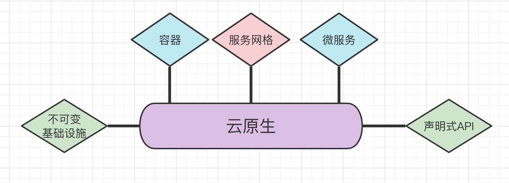
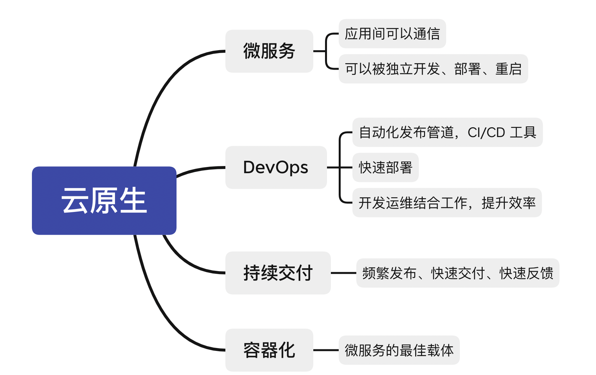
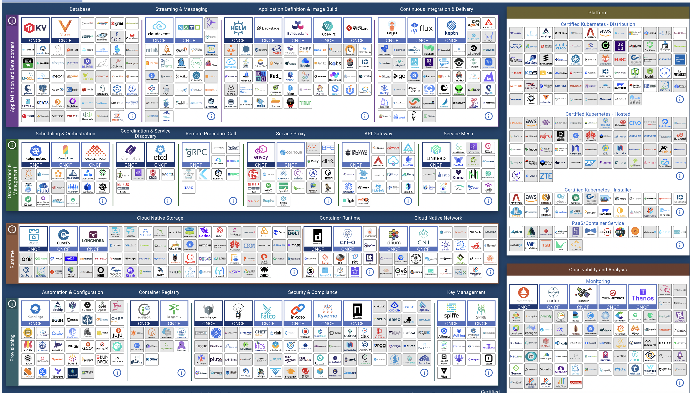

## DevOps系列-00：云原生是什么？

接下来，我们会开始一个新的系列——DevOps，在此之前，我们要先了解一下 DevOps 发展的前提，云原生是什么？

随着云计算技术的发展，好像一切都可以放到云上，一切都可以运行在云上。云原生也便应运而生。

### 云原生的概念

CNCF 全称是 Cloud Native Computing
Foundation（云原生计算基金会），由Linux基金会发起成立于2015年12月11日。CNCF基金会的成立标志着云原生正式进入高速发展轨道，Google、Cisco、Docker各大厂纷纷加入，并逐步构建出围绕 Cloud
Native 的具体工具，而云原生这个的概念也逐渐变得更具体化。

CNCF 给出的云原生定义为：

> 云原生技术有利于各组织在公有云、私有云和混合云等新型动态环境中，构建和运行可弹性扩展的应用。云原生的代表技术包括容器、服务网格、微服务、不可变基础设施和声明式API。
>
> 这些技术能够构建容错性好、易于管理和便于观察的松耦合系统。结合可靠的自动化手段，云原生技术使工程师能够轻松地对系统作出频繁和可预测的重大变更。
>
> 云原生计算基金会（CNCF）致力于培育和维护一个厂商中立的开源生态系统，来推广云原生技术。我们通过将最前沿的模式民主化，让这些创新为大众所用。

**云原生（Could Native）** 我们可以分成两部分来理解，“云”就是数据、软件、程序，甚至于函数存放和运行的环境，而原生则是更侧重于使用云平台和云计算本身的优势和特点，比如弹性扩展、系统分布式等等。

云原生的代表技术主要以 `Kubernetes(k8s)` 为主，包括容器、服务网格、微服务、不可变基础设施和声明式API等：

最新关于云原生的几个要点被总结为：DevOps + 持续交付 + 微服务 + 容器。**
总而言之，符合云原生架构的应用程序应该是：采用开源堆栈进行容器化，基于微服务架构提高灵活性和可维护性，借助敏捷方法、DevOps支持持续迭代和运维自动化，利用云平台设施实现弹性伸缩、动态调度、优化资源利用率。**

我们会在后面的系列文章详细介绍和说明各个部分。

### 云原生可以做什么

云原生技术可以做什么？当然是可以构建云原生应用了。（我们可以简单浏览一下云原生大家庭）

好像是说了一句有用的废话，那么什么是云原生应用，它有什么特点呢？

云原生应用，就是天生具备云计算基因，以云计算的思想构建并适用于云计算环境的应用。它应该具备我们提到的特性：**可以通过网络访问、远端部署执行、可扩展弹性伸缩、共享、按需使用自主服务、高可用、可远程监控计费审计、标准化交付与位置无关等**
。有人说轻量、无状态是不是云原生的特征？我们并不认为是。**轻量、无状态是容器的特征，容器非常适合部署微服务应用，但微服务应用并不一定是云原生应用**。

**弹性**

弹性是云计算的重要特征，理论上不受资源限制，可以无限占用资源（当然需要按使用量付费）。云原生应用弹性，应该包括应用使用资源的弹性和应用实例弹性扩展的弹性。

**共享**

云计算分三种类型：IaaS、PaaS、SaaS，这就涉及三个层级的共享：资源共享、平台共享、应用共享。云原生应用是SaaS层服务，部署于IaaS或PaaS层。应用有一份基准代码，多份部署，也是共享，是从应用开发角度考虑，但不是云应用共享意义。

云应用可以对所有人开放，大家共享云应用提供的服务。云应用需要部署在云计算平台上，使用云计算资源，这就实现了平台共享和资源共享。

**自治**

云应用部署与位置无关，你不知道它会被部署到什么位置，底层对用户透明。所以云原生应用的依赖包、配置文件、后端服务等就需要和应用一起同生共死，成为一个整体，实现自管理自治理。

微服务的设计也遵循自治原则，和云原生应用非常相似。这可能也是把它们放一起讨论的原因。因此我们在用微服务实现云原生应用的时候，自治是一个重要的判断标准。这是分布式中心的好处，自成一体。就像人，每个人都是一个分布式中心，具备自我管理的能力。

**交付标准化，与位置无关**

云应用构建可以在本地或者云端，运行一定在云端，那就要按照一定的标准交付，比如容器镜像，使交付标准化。标准交付就可以在云端任何支持标准的位置部署，或者根本不需要知道被部署到了什么位置运行，和环境无关。

**高可用性**

多实例部署、弹性、自治等特性是高可用的保证。

**可监控审计**

用户对应用的访问调用，应用的运行情况状态，不管通过日志或者接口能实时获取到这些信息，用于计量计费、监控和后期审计等。

**按需访问自助服务**

云应用部署在云端，根据客户自己的需求，通过网络访问，自助使用服务。类似于一些 `Serverless` 服务，用户可能不愿意购买服务器或者编写大量代码，但是使用一些已有的云函数同样可以实现业务需求。

**可配置**

云应用往往依赖配置中心，实现不同环境应用的部署运行。比如开发、测试和生产环境，一些参数的配置可能是不一样的。很多时候又不方便把所有的配置文件都和应用打包在一起，所以可以通过配置中心来统一管理应用配置文件，甚至可以实现运行时参数更新。

**敏捷**

敏捷不管从应用开发部署角度或者运维运营角度，都是需要的。但我们觉得它不是云原生应用的关键特性。敏捷通常和轻量、微服务组件化相关，小了，轻了相对就敏捷多了。很多时候敏捷和架构相关，不只是技术架构，也和组织架构相关。敏捷更多的是流程、管理或体验的需求。

### 云原生的优势与缺陷的对比

云原生固然有很多优势，但也不是一点缺点没有，我们可以简单对比一下。

##### 对比一：

**优势**：

不用购买服务器，租赁机房，成本会降低。对于一些大型应用的扩展，更加灵活与方便，不用再去临时加购一些物理机或者随时准备一些物理机造成成本的浪费。

**缺陷**：

对于一个完整的小型项目，我们可以在一台物理机上完成部署和配置，而且完全满足需求，比如我们可以在一台机器上运行应用程序，安装对应的数据库、运行环境等。而使用云技术，则需要采购基础的云服务器、云数据库等等特定的“云组件”，需要购买很多云产品才能构建出一个完整的小型应用。

**总结：** 对于一些小型应用或者内部应用，我们不一定都要部署在云上，还是要灵活合适地选择技术栈的。

##### 对比二：

**优势**：

采用各种 DevOps 工具，可以更快捷地交付项目，也可以实现灵活扩展，统一配置管理等等开发和运维工作。

**缺陷**：

初期学习成本太高，比如 Kubernetes、容器代表 Docker、流水线配置等等一些技术，并不能在初期很好地帮助到我们。

**总结**：项目启动时，依旧不能唯技术论，要结合实际，等到时机成熟时，再来应用这些技术。

##### 对比三：

**优势**：

将应用容器化之后，大大降低了维护的时间成本和资金成本，可以有更多的精力用到新的功能开发上。

**缺陷**：

云化之后的安全问题，包括云上数据的安全、云配置的正确性等等。

**总结**：安全性一直是软件工程极其重要的一环，不仅仅是云应用，传统应用同样面临挑战，所以，这不是云技术所独有的，只是云技术要解决安全性问题，所遇到的问题和挑战更多，需要我们付出更多的精力来保证云安全。

还有很多其他方面的对比，大家可以自行思考一下。第一次开发和部署云原生应用时，我们可能觉得和传统应用并没有什么不同，但是对于一些特定场景和需求，我们就会逐渐感受到云应用的魅力了。

### 总结

本文我们简单介绍了一下云原生是什么，云原生应用的特征，以及简单谈到了云原生的一些优势与相对应的缺点，想必大家对云原生应该有了一个初步的认识。而 DevOps
的目标也就是更好、更快、更安全地持续交付云原生应用，来进行构建软件，接下来，就让我们开始了解一下 DevOps 是如何帮助我们完成一些自动化的工作的。

### 链接

- CNCF 云原生的定义： https://github.com/cncf/toc/blob/main/DEFINITION.md

- CNCF Cloud Native Interactive Landscape： https://landscape.cncf.io/

- 什么是云原生： https://blog.csdn.net/weixin_45481821/article/details/125129711

- “云原生”究竟是什么？“云原生应用”是什么？： https://zhuanlan.zhihu.com/p/129738714

- 云原生的漏洞与威胁有哪些？云原生安全性如何？： https://zhuanlan.zhihu.com/p/112461841
