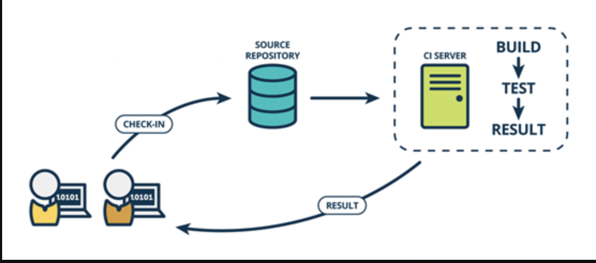
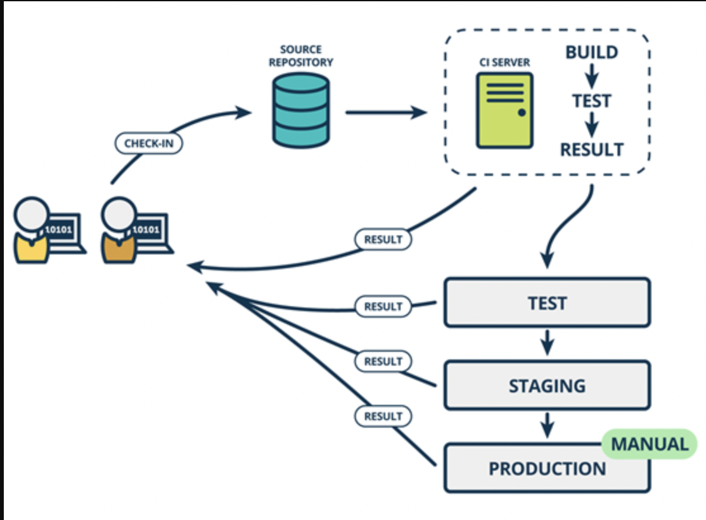
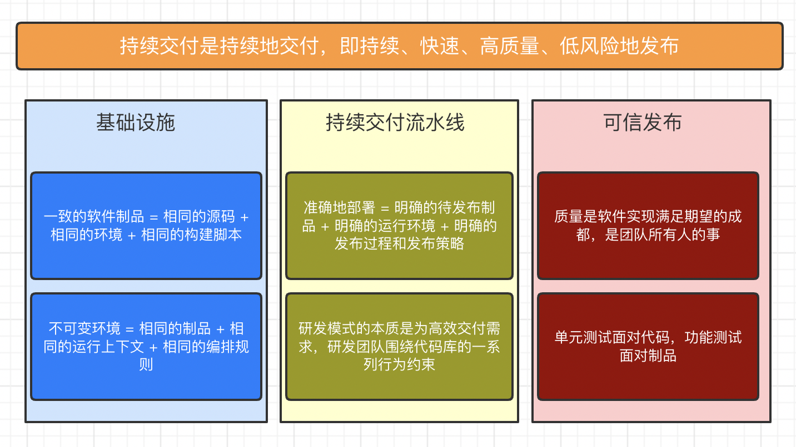
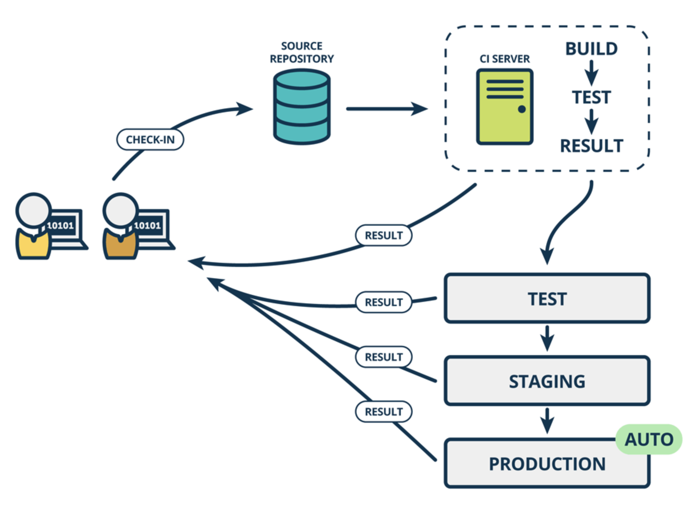
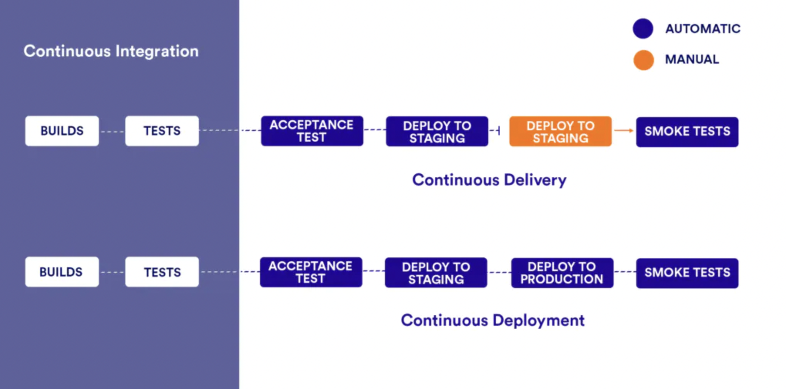
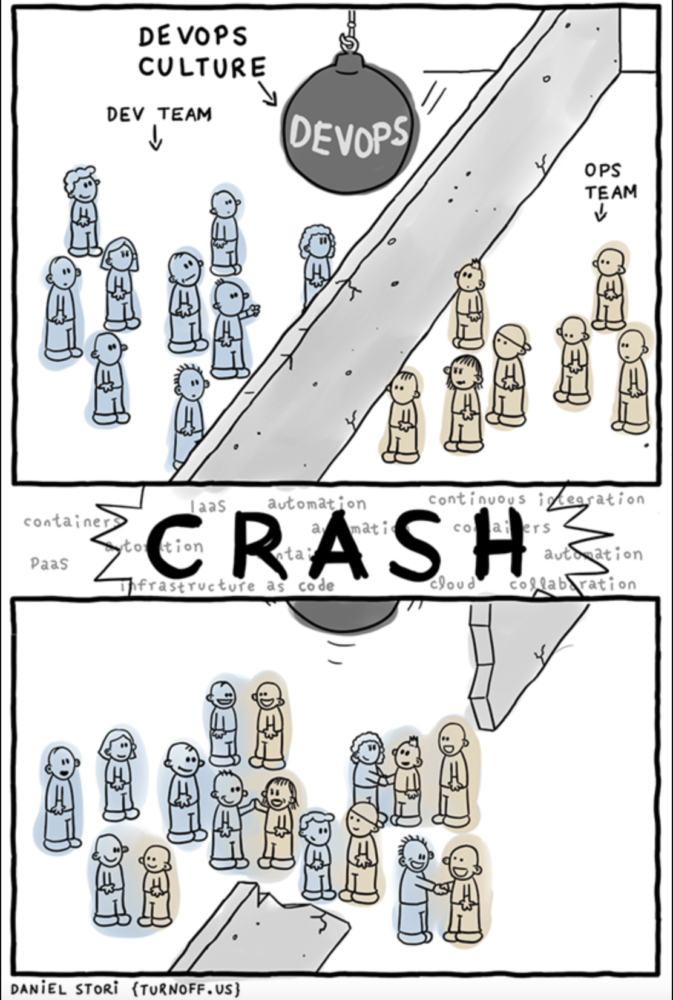
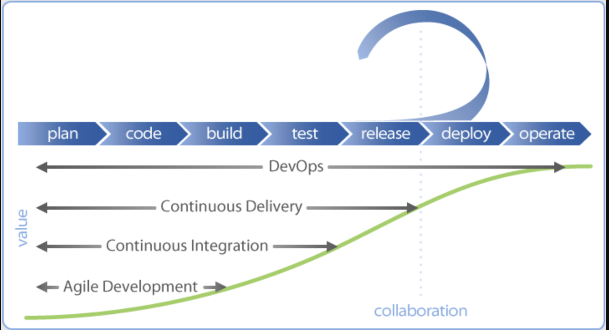
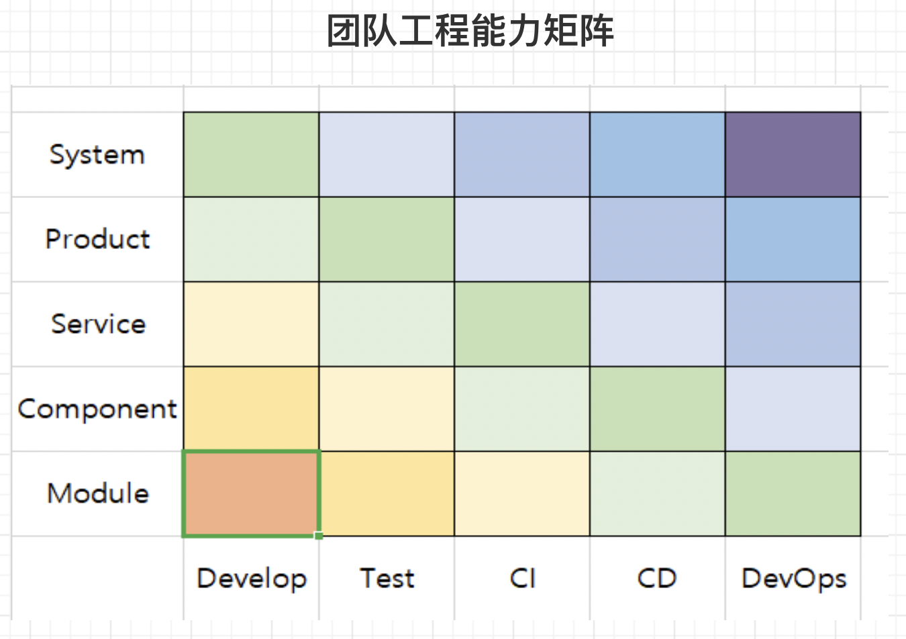

## DevOps系列-01：CI、CD 与 DevOps 是什么？

本篇我们来介绍一下，CI、CD以及DevOps的基本概念和范畴。CI、CD都是衡量成功实践 DevOps 的主要方法，我们也会讨论一下它们是如何让 DevOps 实践起来更轻松的。借助 DevOps，开发人员可以通过用户行为和监控工具获得反馈，进而更好地监控和测试他们在流水线中的代码。

### CI 是什么？

CI 的英文全称为 `Continuous Interation`，中文翻译为：持续集成。

持续集成（CI）是在源代码变更后自动检测、拉取、构建和（在大多数情况下）进行单元测试的过程。持续集成的目标是快速确保开发人员新提交的变更是好的，并且适合在代码库中进一步使用。CI的流程执行和理论实践让我们可以确定新代码和原有代码能否正确地集成在一起。

这是提高部署效率的关键一步。 CI 不断地将代码更改集成到现有代码库中，以快速识别和修复不同开发人员代码更改之间的任何冲突。

如果开发团队没有频繁提交到共享源代码存储库中的公共分支，那么他们就没有成功地进行持续集成。 此外，如果测试和构建过程是自动化的，但开发人员在孤立的分支上工作，这些分支通常不集成到共享分支中，这也不是持续集成。

### CD 是什么？

CD 既可以指，**持续交付**  `Continuous Delivery`，也可以指 **持续部署** `Continuous Deployment`。

CD 是自动化整个软件发布过程的实现。 一旦代码通过了所有测试，部署（交付）就成为该过程的最后一步。

#### 持续交付

完成 CI 中构建及单元测试和集成测试的自动化流程后，持续交付可自动将已验证的代码发布到存储库。为了实现高效的持续交付流程，务必要确保 CI 已内置于开发管道。持续交付的目标是拥有一个可随时部署到生产环境的代码库。

持续交付遵循下述步骤：

- 更改暂存环境和发布时间表

- 一个人手动批准此代码

- 终于部署完成

在持续交付中，每个阶段（从代码更改的合并，到生产就绪型构建版本的交付）都涉及测试自动化和代码发布自动化。在流程结束时，运维团队可以快速、轻松地将应用部署到生产环境中或发布给最终使用的用户。

#### 持续部署

对于一个成熟的CI/CD管道（Pipeline）来说，最后的阶段是持续部署。作为持续交付——自动将生产就绪型构建版本发布到代码存储库——的延伸，持续部署可以自动将应用发布到生产环境。

持续部署意味着所有的变更都会被自动部署到生产环境中。持续交付意味着所有的变更都可以被部署到生产环境中，但是出于业务考虑，可以选择不部署。如果要实施持续部署，必须先实施持续交付。

这两者不是相互排斥的，而是相互包含的。 他们的总体目标是相同的——使软件开发和发布过程更快、更健壮。 它们之间的主要区别在于应用的自动化范围。

通过持续交付，该过程允许开发人员单击几下便可以随时部署新版本来提高工作效率。 另一方面，持续部署是持续交付的一个进步，因为源代码中的每一次更改都会自动部署到生产中。 此部署不需要开发人员的批准。

### CI/CD的益处

在软件开发生命周期中实施 CI/CD 有很多好处。 让我们来看看其中的一些：

- **提升速度**：借助自动化的 CI/CD 管道，团队可以每小时、每天、每周、每月等发送更改，我们可以优化流程的每个阶段。 可以快速启动新的更改和功能，从而能够响应新趋势并解决出现的任何问题。

- **易于维护**：当需要执行日常维护时，你并不希望所有系统立即关闭。 为了解决这个问题，可以在代码架构中创建微服务，以便将系统的各个区域而不是整个系统进行维护。

- **改进的协作和可见性**：CI/CD 管道允许许多人参与到流程中，这促进了不同团队和组织之间的可见性和协作。

- **实时反馈**：定期发布更新可以让你从用户那里获得更即时的反馈。 它还允许你尝试不同的功能和修复，然后在部署后不久了解它们的性能。

- **持续可靠性和持续测试**：持续可靠性或测试可靠性在 CI/CD 管道中得到改进。 这是因为一次实施一项增量更改，从而可以连续进行更精确和准确的测试。

- **高质量代码**：使用 CI/CD，您的代码会得到定期测试。 这意味着您将更快地发现错误并更快地修复它们。

### DevOps 是什么？

DevOps是`Development`和`Operations`的组合，是一种方法论，是一组过程、方法与系统的统称，用于促进应用开发、应用运维和质量保障（QA）部门之间的沟通、协作与整合。以期打破传统开发和运营之间的壁垒和鸿沟。

DevOps是一种重视“软件开发人员（Dev）”和“IT运维技术人员（Ops）”之间沟通合作的文化、运动或惯例。通过自动化“软件交付”和“架构变更”的流程，来使得构建、测试、发布软件能够更加地快捷、频繁和可靠。具体来说，就是在软件交付和部署过程中提高沟通与协作的效率，旨在更快、更可靠地发布更高质量的产品。

也就是说DevOps是一组过程和方法的统称，并不指代某一特定的软件工具或软件工具组合。各种工具软件或软件组合可以实现DevOps的概念方法。其本质是一整套的方法论，而不是指某种或某些工具集合，是一种理论或过程或方法的抽象或代称。

### 不止于此

#### CI/CD 与 DevOps的关系

 一图胜千言，可以说持续集成和持续交付是组成整个 DevOps 流程非重要的环节。

#### CT（Continous Test）持续测试

虽然 CI 和 CD 在加速产品发布中至关重要，但 CT 将质量因素带入了这些频繁的发布中。 在 CI/CD 管道或 DevOps 管道中，有时 CT 被省略，即使它是任何管道中的关键组件。 如果缺乏自动化测试，就不会真正感受到采用 CI/CD 的真正好处。

CT 是持续反馈的主要推动者。 在开始 DevOps 之旅时，它不仅被认为是朝着正确方向迈出的第一步，而且作为一种持续的反馈机制，它通过软件开发周期 (SDLC) 推动了软件交付。 它允许 DevOps 团队在本地环境中启用部署和部署后测试。

#### CI/CD的一些常用工具

一个好的 CI/CD 工具可以帮助你构建一条健壮的 CI/CD 流水线，当前比较常用的有：

- **Jenkins**：Jenkins 是一个开源的、基于 Java 的自动化服务器，支持构建、部署和自动化软件开发过程。

- **CircleCI**：CircleCI 支持软件开发和发布。 可实现自动化整个流水线，并与 GitHub、GitHub Enterprise 和 Bitbucket 等服务集成，以便在提交代码时执行构建。

- **GitLab**：GitLab 提供了一套用于管理软件开发生命周期的工具。 可以执行构建、运行测试和部署代码。 它还允许你在 VM、Docker 容器或其他服务器中构建 job。

此外，还可以使用一些云产品来帮助完成 CI/CD 流程。国外的话比如 `Azure DevOps`，`Aws CodePipeline`等等，国内的话比如阿里云的云效，华为云的 DevCloud等。

#### 其他

推行并实践 DevOps 文化，除了对基本概念和流程有一定了解之外，对于团队的整体能力也有一定的要求：

横轴可以指整个开发团队的技术能力，比如开发、测试、CI、CD，到 DevOps；纵轴指输出产品，从一个模块，到组件、服务、产品、系统。我们都希望达到的目标是最右上角紫色的方块，所以在这期间还是需要付出很多努力的。

### 总结

本文带大家简单了解了一些 CI/CD 以及 DevOps 的基本概念，并列举了几个 CI/CD 的工具，大家感兴趣的话，可以尝试去探索一下。后面的系列，我们会谈到一些部署方面的技术。

### 链接：

- DevOps漫谈之一：DevOps、CI、CD都是什么鬼： https://blog.jjonline.cn/linux/238.html

- Explaining CI, CD, CT in DevOps & How to Make Them Work Together： https://www.bunnyshell.com/blog/what-is-ci-cd-ct-devops

- What is CI/CD in DevOps? ： https://www.educative.io/blog/what-is-ci-cd-devops

- Key Differences Between CI/CD and DevOps： https://www.spiceworks.com/tech/devops/articles/cicd-vs-devops/

- What is CI/CD： https://www.redhat.com/en/topics/devops/what-is-ci-cd
