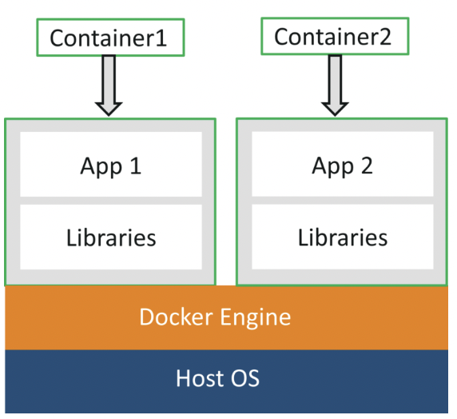
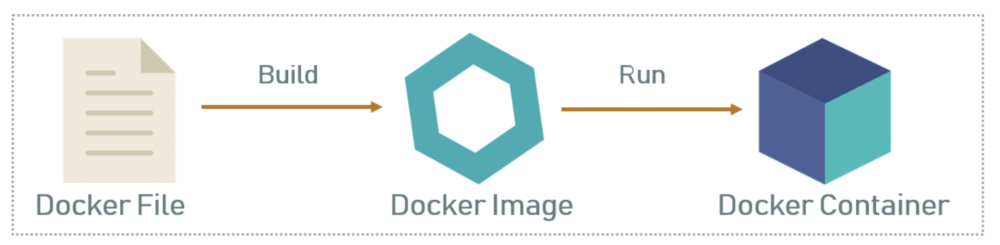

## DevOps系列-02：Docker 篇

本篇我们来看一下容器技术的介绍以及其使用。说到容器，大多数现代开发人员都记得容器是始于2013年，Docker 在这一年诞生，其实不然，早在几十年前就出现在 FreeBDS Jalis 和 AIX Workload Partitions 等版本中。二者也可谓相辅相成吧，Docker 因为容器技术受到关注，容器技术也因 Docker 提升了流行度。今天我们就以 Docker 为主来了解一下容器的使用。

### 容器是什么？

容器是软件的可执行单元，它采用通用方式封装了应用程序代码及其库和依赖项，因此可以随时随地运行容器（无论是在桌面、传统 IT 还是云端）。

#### 容器与虚拟机

人们考虑虚拟化时，通常会想到虚拟机 (VM)。事实上，虚拟化可以采用多种形式，容器就是其中之一。那么，VM 和容器之间的区别是什么？

大体说来，VM 虚拟化基础硬件，让多个操作系统 (OS) 实例可以在相同的硬件上运行。每个 VM 运行一个 OS，并有权访问表示基础硬件的虚拟化资源。

VM 有许多好处。其中包括，能够在同一服务器上运行不同操作系统，还可以更高效、更经济地利用物理资源，更快完成服务器配置。另一方面，每个 VM 都包含 OS 映像、库、应用程序等，因此可能会变得相当大。

容器虚拟化基础 OS，并使容器化应用能够感知其本身具备 OS，包括 CPU、内存、文件存储和网络连接。由于对基础 OS 和基础结构的差异进行了抽象，因此只要基本映像一致，就可以在任何地方部署并运行容器。对于开发人员来说，这有很大的吸引力。

由于容器共享主机 OS，因此它们不需要启动 OS 或加载库。这使得容器更加高效和轻量。容器化应用程序可以在几秒钟内启动，与 VM 方案相比，应用程序的更多实例可以适应计算机。共享 OS 方法具有额外的好处，即减少维护（如修补和更新）开销。

尽管容器可移植，但它们限制在为其定义的操作系统。例如，适用于 Linux 的容器无法在 Windows 上运行，反之亦然。

#### 容器与虚拟机的软件部署方式

为此，容器利用操作系统 (OS) 虚拟化形式，这里会利用操作系统的功能（在 Linux 内核中，即名称空间和 cgroups 原语）来隔离进程，并控制这些进程有权访问的 CPU、内存和磁盘的数量。

容器小巧轻便、速度快且可移植；与虚拟机不同，容器可以在单个操作系统中运行多个容器，而不需要在每个实例中都包含访客操作系统，可以共享操作系统的内核，同时只加载其不同的二进制文件/库。我们可以看下虚拟机部署应用与（Docker）容器部署应用的区别：


#### 为什么要选择容器？

- **灵活**：开发人员生成应用程序并将其打包到容器中，提供给 IT 以在标准化平台上运行是，这将减少部署应用程序的总体工作量，并可以简化整个开发和测试周期。这还可以促进开发和运营团队协作，并提升其工作效率，以加快应用交付。

- **可移植性**：容器提供打包和保存运行所需应用程序的所有必要组件的标准化格式。这解决了“它能否在我的计算机上正常工作”这一典型问题，实现 OS 平台和云之间的移植。在任何位置部署容器时，它都会在一致的环境中执行，该环境在多次部署中保持不变。现在，从开发框一直到生产环境，你都会拥有一致的格式。

- **可快速伸缩**：由于容器没有 VM 的典型开销（包括单独的 OS 实例），因此同一基础结构上可以支持更多容器。容器的轻量特性意味着可以快速启动和停止它们，从而实现快速伸缩的方案。

### 什么是 Docker？

在我们开始之前，来先总结我们已经了解了什么：

- VM 速度很慢，而且需要很长时间启动。

- 容器速度快，启动速度快，因为它使用主机操作系统并共享相关库。、

- 与虚拟机不同，容器不会浪费或阻塞主机资源。

- 容器具有特定于其正在运行的应用程序的独立库和二进制文件。

- 容器由容器化引擎处理。

- Docker是可用于创建和运行容器的容器化平台之一。

**Docker**，*[ˈdɒkə(r)] / [ˈdɑːkər]*，直译过来是“码头工人”，顾名思义就是在码头搬运货物的工人。如果把我们的软件程序比作货物的话，那 Docker 就是把货物装进 **集装箱 （Container）** 的工人，也算是“物如其名”了。所以，Docker 的图标也便设计成了一头托着集装箱的鲸鱼。


Docker 是一个平台，它将应用程序及其所有依赖项以容器的形式打包在一起。此容器化方面可确保应用程序在任何环境中工作。

正如你在图中所看到的，每个应用程序都在单独的容器上运行，并有自己的一组依赖项和库。这确保了每个应用程序都独立于其他应用程序，使开发人员可以确保他们可以构建不会相互干扰的应用程序。



因此，开发人员可以构建一个容器，上面安装了不同的应用程序，并将其提供给 QA 团队。然后，QA 团队只需运行容器即可复制开发人员的环境。

下面让我们接着了解一些关于 Docker 的基本概念：Dockerfile、镜像、容器等等。

#### Dockerfile、Images（镜像）和Containers（容器）

Dockerfile、Docker 镜像 和 Docker 容器是在使用 Docker 时需要了解的三个重要术语。



从图上可以看出，可以通过 Dockerfile 来构建（**Build**） Docker 镜像，而运行（**Run**）之后的镜像，便成了 Docker 容器。

**Dockerfile**：Dockerfile是一个文本文档，其中包含用户可以在命令行上调用以组装镜像的所有命令。因此，Docker 可以通过读取 Dockerfile 中的指令来自动构建镜像。你可以使用 `docker build` 命令来创建一个自动构建过程，可以连续执行多个命令行指令。

**Docker 镜像**：通俗地说，Docker 镜像可以与用于创建 Docker 容器的模板进行比较。因此，这些只读模板是容器的构建基块。你可以使用 `docker run` 命令来运行镜像进而创建一个容器。

Docker 映像存储在 Docker 注册表中。它可以是用户的本地存储库，也可以是公共存储库，如 Docker Hub，它允许多个用户协作构建应用程序。

**Docker 容器**：它是 Docker 映像的运行实例，因为它们包含运行应用程序所需的整个包。所以，这些基本上是从 Docker 镜像创建的现成应用程序，这是Docker的终极程序。

#### Docker 初体验

可以按照下面的步骤来创建一个 Dockerfile，镜像和容器。

**Step 1：** 第一步你必须安装Docker。大家可以参照一下[官方文档](https://docs.docker.com/engine/install/) : https://docs.docker.com/engine/install/ ，选择适合自己系统的Docker。

**Step 2：** 安装完成之后，你可以使用下面的命令来查看 Docker 版本。

```docker
docker -v
```


**Step 3：** 现在可以创建一个文件夹，你可以把创建的 Dockerfile 放在这里，然后把当前的工作目录也设置为这个目录。

```docker
mkdir images
cd images
```


**Step 4.1：** 现在可以使用编辑器创建一个 Dockerfile，这个例子里，我用的是 nano 编辑器。（你可以使用vim，或者熟悉的编辑器）

```
nano Dockerfile
```

**Step 4.2：** 打开一个 Dockerfile 文件之后，你可以如下写入指令：

```dockerfile
FROM ubuntu:latest
MAINTAINER Sahiti (email@domain.com)
RUN apt-get update
RUN apt-get install -y nginx
ENTRYPOINT ["/usr/sbin/nginx","-g","daemon off;"]
EXPOSE 80
```

- **FROM**：指定必须下载的镜像

- **MAINTAINER**：拥有图像的所有者的数据，即作者数据

- **RUN**：指定会执行的命令

- **ENTRYPOINT**：指定将首先执行的命令

- **EXPOSE**：指定容器要暴露的端口

**Step 4.3：** 编写完成之后，保存文件。

**Step 5：** 使用下面的命令来构建 Dockerfile。

```
docker build .
```

**“.“ 表示在当前目录构建 Dockerfile。**


**Step 6：** 执行上述命令后，将创建相应的 docker 镜像。若要检查是否已创建 Docker 镜像，可以使用以下命令。

```
docker images
或者
docker images -a
```

**Step 7：** 现在你可以基于这个镜像来创建容器，你需要执行下面的命令：

```
docker run -it -p <server_port>:<container_port> -d <image_id>
```

其中 `-it` 用于确保容器是交互式的，`-p` 用于端口转发，`-d` 用于在后台运行守护程序。输出的结果是容器的 ID。


**Step 8：** 现在你可以用下面的命令来查看你创建的容器：

```
docker ps
```


至此，我们就完整地体验了一次从下载 Docker 到成功创建了一个 Docker 容器的过程。

### 使用 Docker 的好处

Docker 确实令使用容器创建、部署和运行应用程序变得更加容易，容器允许开发人员将应用程序与其所需的所有部分（如库和其他依赖项）打包在一起，并将其作为一个包发布。通过这样做，开发人员可以确保应用程序将在任何其他 Linux 计算机上运行，而不管该计算机可能具有的任何自定义设置，这些设置可能与用于编写和测试代码的计算机不同。

- 采用者将他们的容器乘以五。Docker 采用者在使用的第一个月到第十个月之间，大约是他们在生产中运行的平均容器数量的五倍。

- PHP、Ruby、Java、以及 Node 这些主要框架都在容器中使用。

那么使用的 Docker 的好处有哪些呢？

#### 投资回报和成本节约

使用 docker 的第一个优点是投资回报率。在选择新产品时，大多数管理决策的最大驱动因素是投资回报。解决方案越能在提高利润的同时降低成本，解决方案就越好，特别是对于需要长期产生稳定收入的大型成熟公司。

从这个意义上说，Docker 可以通过大幅减少基础设施资源来帮助促进这种类型的节省。Docker 的本质是运行同一应用程序所需的资源更少。由于 Docker 的基础架构要求降低，组织能够节省从服务器成本到维护它们所需的员工的所有费用。Docker 允许工程团队变得更小，更有效。

#### 标准化和生产力

Docker 容器可确保跨多个开发和发布周期的一致性，从而标准化您的环境。基于 Docker 的架构的最大优势之一实际上是标准化。

Docker 提供可重复的开发、构建、测试和生产环境。在整个管道中标准化服务基础结构允许每个团队成员在生产奇偶校验环境中工作。通过这样做，工程师更有能力有效地分析和修复应用程序中的错误。这减少了浪费在缺陷上的时间，并增加了可用于功能开发的时间。

正如我们提到的，Docker 容器可以提交对 Docker 镜像的更改并对其进行版本控制。例如，如果执行的组件升级破坏了整个环境，则很容易回滚到 Docker 镜像的历史版本。整个过程可以在几分钟内完成测试。Docker 速度很快，可以快速进行复制并实现冗余。此外，启动 Docker 映像的速度与运行计算机进程一样快。

#### CI 效率

Docker 能够构建容器镜像，并在部署过程的每个步骤中使用相同的镜像。这样做的一个巨大好处是，能够分离非依赖步骤并并行运行它们。从构建到生产所需的时间可以显著加快。

#### 兼容性和可维护性

一劳永逸地消除“它在我的机器上工作”的问题。整个团队都会欣赏的好处之一是平价。就 Docker 而言，奇偶校验意味着无论在哪个服务器或谁的笔记本电脑上运行，镜像都运行相同，创建同样的容器。对于开发人员来说，这意味着花在设置环境、调试特定于环境的问题上的时间更少，以及带来了一个更便携且易于设置的代码库。奇偶校验还意味着你的生产基础架构将更可靠且更易于维护。

#### 简单和更快的配置

Docker 的主要好处之一是它简化了事情。用户可以采用自己的配置，将其放入代码中，然后毫无问题地进行部署。由于 Docker 可以在各种环境中使用，因此基础结构的要求不再与应用程序的环境相关联。

#### 加快部署

Docker 设法将部署减少到几秒钟。这是因为它为每个进程创建一个容器并且不启动操作系统。 可以创建和销毁数据，而不必担心再次启动数据的成本会高于可承受的成本。

#### 持续部署和测试

Docker 可确保从开发到生产的一致环境。Docker 容器配置就是在内部维护的所有配置和依赖项；可以在从开发到生产期间使用相同的容器，以确保没有差异或手动干预。

如果需要在产品的发布周期内执行升级，则可以轻松地对 Docker 容器进行必要的更改，对其进行测试，并对现有容器实施相同的更改。这种灵活性是使用 Docker 的另一个关键优势。Docker 可以跨多个服务器部署镜像，来构建、测试和发布。

#### 多云平台

Docker 最大的好处之一是可移植性。在过去几年中，所有主要的云计算提供商，包括亚马逊网络服务（AWS）和谷歌计算平台（GCP），都接受了 Docker的可用性，并增加了个人支持。Docker 容器可以在 Amazon EC2 实例、Google Compute Engine 实例、Rackspace 服务器或 VirtualBox 中运行，前提是主机操作系统支持 Docker。如果是这种情况，则在 Amazon EC2 实例上运行的容器可以轻松地在环境之间移植，例如移植到 VirtualBox，从而实现类似的一致性和功能。此外，Docker可以很好地与Microsoft Azure和OpenStack等其他提供商配合使用，并且可以与Chef，Puppet和Ansible等各种配置管理器一起使用。

#### 隔离性

Docker 可以确保应用程序和资源是隔离和分隔的。Docker 确保每个容器都有自己的资源，这些资源与其他容器隔离。你可以为运行完全不同的堆栈的单独应用程序使用各种容器。Docker 可帮助你确保干净的应用程序删除，因为每个应用程序都在自己的容器上运行。如果不再需要某个应用程序，只需删除其容器即可。它不会在您的主机操作系统上留下任何临时文件或配置文件。

除了这些好处之外，Docker 还确保每个应用程序仅使用分配给它们的资源。特定应用程序不会使用所有可用资源，而（使用所有资源）通常会导致其他应用程序的性能下降或完全停机。

#### 安全性

使用 Docker 的最后一个好处是安全性。从安全角度来看，Docker 可确保在容器上运行的应用程序完全隔离，从而能够完全控制流量和管理。没有 Docker 容器可以查看在另一个容器中运行的进程。从体系结构的角度来看，每个容器都有自己的一组资源，从处理到网络堆栈。

### 总结

本文我们简单了解了一下什么是 Docker，以及使用 Docker 的一些好处。除此之外，我们还有很多事情要做，比如如何选择更安全的镜像，如何使用分层构建更快地构建镜像，如何压缩构建镜像的大小等等，还要掌握一些常用的 linux 命令和 doker 命令。这个就需要大家多多投入了。

### 链接：

- 十分钟明白什么是容器技术： https://www.cnblogs.com/qcloud1001/p/9273549.html

- What Is Docker & Docker Container： https://www.edureka.co/blog/what-is-docker-container

- What is Docker： https://www.edureka.co/blog/docker-explained/

- Top 10 Benefits of Docker： https://dzone.com/articles/top-10-benefits-of-using-docker

- What Is Docker Container? How Does It Work： https://info.support.huawei.com/info-finder/encyclopedia/en/Docker+Container.html

- 渣翻：Dockerfile最佳实践： https://mp.weixin.qq.com/s/XwHzHQPRoQK3SOONVGIrQw

- Docker 备忘清单 & docker cheatsheet & Quick Reference： https://wangchujiang.com/reference/docs/docker.html
