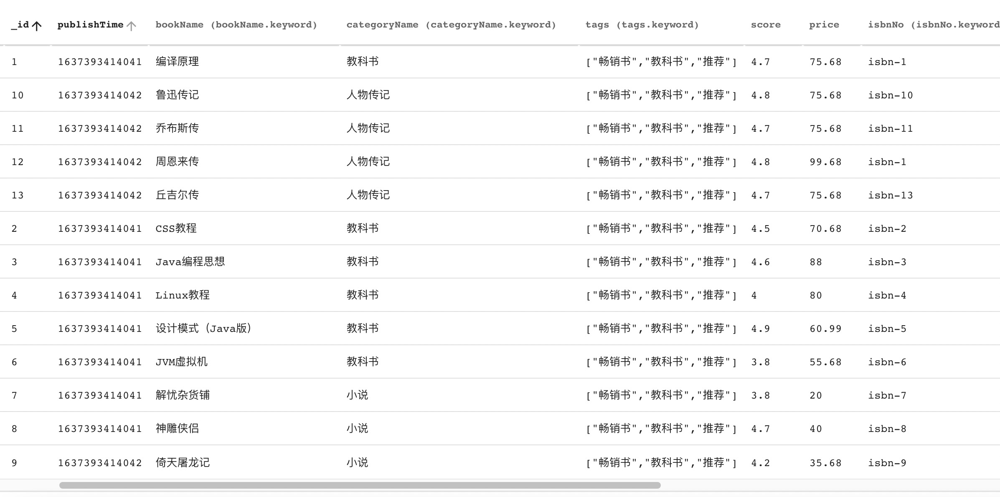

## Elasticsearch不完全入门指北（五）：聚合搜索


Elasticsearch 除了最基本的搜索，数据分析功能也是十分强大，今天我们就来认识一下 ES 的聚合搜索功能，也可以叫分组搜索，类似于SQL语句中的 `group by`。

### 1. 什么是聚合搜索

聚合可以将你的数据进行汇总，让其称为各种维度的指标，统计数据。聚合可以很好地回答你下面的几个问题：

- 我的网站的平均加载时间是多少？
- 根据交易量，谁是我最有价值的客户？
- 什么会被视为网络上的大文件？
- 每个产品类别中有多少产品？

Elasticsearch 将聚合分为三类：

- 从字段值计算指标（例如总和或平均值）的指标聚合。 
- 基于字段值、范围或其他标准将文档分组到桶中的桶聚合，也称为桶。 
- 从其他聚合而不是文档或字段获取输入的管道聚合。 

下面我们就看一下如何来实现这样聚合。

### 2. 基本DSL语法

我们首先往 `book` 索引中插入几条数据，然后就可以来看一下具体效果。



#### 2.1 指标聚合

比如我们想要得到索引里价格的平均值，那么就可以如下这么写：

```
GET /book/_search

{
    "aggs": {
        "avg_bucket": {
            "avg": {
                "field": "price"
            }
        }
    }
}
```

其中 `aggs` 是  `aggregrations` 的缩写，代表是聚合搜索的意思，跟我们之前使用的搜索使用的 `query` 代表的是常规搜索一样。然后 `avg_bucket` 是我们自己定义的聚合搜索的名称，其下一层的属性 `avg` 表示的是要进行的计算，这里的关键字只有 `avg` 、`sum`、`max`、`min` 几种运算，下一层的 `field` 属性就是要计算的字段，然后我们就可以得到所有图书的平均价格，返回如下结果:

```json
{
    "took": 62,
    "timed_out": false,
    "_shards": {
        "total": 3,
        "successful": 3,
        "skipped": 0,
        "failed": 0
    },
    "hits": {
        ...
    },
    "aggregations": {
        "avg_bucket": {
            "value": 65.64846185537485
        }
    }
}
```

其中 `aggregations` 就是我们计算得到的结果了，还有如果我们只想返回计算结果，不想返回搜索得到的 `hits` 值怎么办呢？那么就需要将搜索的 `size` 设置为0：

```
GET /book/_search
{
    "size": 0,
    "aggs": {
        "avg_bucket": {
            "avg": {
                "field": "price"
            }
        }
    }
}
```

就可以得到下面的结果：

```json
{
    "took": 43,
    "timed_out": false,
    "_shards": {
        "total": 3,
        "successful": 3,
        "skipped": 0,
        "failed": 0
    },
    "hits": {
        "total": {
            "value": 13,
            "relation": "eq"
        },
        "max_score": null,
        "hits": []
    },
    "aggregations": {
        "avg_bucket": {
            "value": 65.64846185537485
        }
    }
}
```

#### 2.2 桶聚合

下面呢，我们可以搞一个比较复杂的桶聚合，比如说，我们要看每个图书类目下，价格最贵的一本书是哪本。那么基本逻辑就是，先要按照图书类目进行分组，然后每个类目分组中要有一个价格 top1 的图书。这种就需要使用桶聚合进行搜索了：

```
GET /book/_search
{
    "size": 0,
    "aggs": {
        "group": {
            "terms": {
                "field": "categoryId"
            },
            "aggs": {
                "price_top_1": {
                    "top_hits": {
                        "size": 1,
                        "_source": {
                            "includes": [ // 注：为了节省返回数据，这里我们定义只返回这些字段
                                "id",
                                "bookName",
                                "categoryId",
                                "categoryName",
                                "price"
                            ]
                        },
                        "sort": [
                            {
                                "price": {
                                    "order": "desc"
                                }
                            }
                        ]
                    }
                }
            }
        }
    }
}
```

 我们一层一层地看，最外层的 `aggs` 即为最初的聚合搜索条件，里面的 `terms` 表示我们需要根据某个字段进行分组，这里设置分组字段为类目ID `categoryId` ；下面还有一个 `aggs` 这个聚合搜索为要查询类目下面的内容，属于最外层的 sub_aggregration ，然后我们并不是取的类目下的所有数据，而是只取一条，所以这里是用的 `top_hits` 的方法，`price_top_1` 为我们自定义的聚合搜索名称，`top_hits` 为聚合搜索的关键字，表示这里取部分数据；然后 `top_hits` 中的属性，就是和我们正常搜索的属性差不多，定义 `size: 1` ，按照价格 `price` 倒序排列，表明我们按照价格倒序只取第一条。那么最后得到结果：

```json
{
    "took":23,
    "timed_out":false,
    "_shards":{
        "total":3,
        "successful":3,
        "skipped":0,
        "failed":0
    },
    "hits":{
        "total":{
            "value":13,   // 文档总数
            "relation":"eq"
        },
        "max_score":null,
        "hits":[]
    },
    "aggregations":{
        "group":{
            "buckets":[ // 桶数组，下面即为有多少分组
                {
                    "key":1,  // 这里就是分组的值，即为 categoryId
                    "doc_count":6, // 这是表示这里命中了6个文档
                    "price_top_1":{ // 自定义的top1聚合结果
                        "hits":{
                            "total":{
                                "value":6, // 文档数
                                "relation":"eq"
                            },
                            "hits":[ // 这里就是拿到的 类目1 下的价格最高的图书
                                {
                                    "_index":"book",
                                    "_type":"_doc",
                                    "_id":"3",
                                    "_score":null,
                                    "_source":{
                                        "price":88,
                                        "id":3,
                                        "bookName":"Java编程思想",
                                        "categoryName":"教科书",
                                        "categoryId":1
                                    }
                                }
                            ]
                        }
                    }
                },
                {
                    "key":3,
                    "doc_count":4,
                    "price_top_1":{
                        "hits":{
                            "total":{
                                "value":4,
                                "relation":"eq"
                            },
                            "max_score":null,
                            "hits":[
                                {
                                    "_index":"book",
                                    "_type":"_doc",
                                    "_id":"12",
                                    "_source":{
                                        "price":99.68,
                                        "id":12,
                                        "bookName":"周恩来传",
                                        "categoryName":"人物传记",
                                        "categoryId":3
                                    }
                                }
                            ]
                        }
                    }
                },
                {
                    "key":2,
                    "doc_count":3,
                    "price_top_1":{
                        "hits":{
                            "total":{
                                "value":3,
                                "relation":"eq"
                            },
                            "max_score":null,
                            "hits":[
                                {
                                    "_index":"book",
                                    "_type":"_doc",
                                    "_id":"8",
                                    "_source":{
                                        "price":40,
                                        "id":8,
                                        "bookName":"神雕侠侣",
                                        "categoryName":"小说",
                                        "categoryId":2
                                    }
                                }
                            ]
                        }
                    }
                }
            ]
        }
    }
}
```

最后我们得到了分组结果，以及想要的数据。

*注：想必聪明的你已经从搜索得到的分组结果里看出来了，分组的排序并不是按照类目ID进行排序的。这里分组的默认排序条件有两个：一个是 `doc_count` ，即分组中的文档数量，默认是降序排列，文档数越多越靠前；另一个是 `_key`，即分组的key值，默认是生序排序，基本就是数字排序或者字符排序了。那么该怎么定义聚合搜索排序呢？这个大家可以自行探索一下。*

### 3. Java代码

那么问题来了，我们怎么通过 Java 代码来实现 2.2 中的 DSL 语句呢？

套路还是固定的，首先需要构建一个搜索请求，然后组装搜索条件，只不过由原先的查询条件，变成了现在的聚合条件，代码如下：

```java
    private SearchResponse searchGroupData() {
        // 构建搜索请求
        SearchRequest searchRequest = new SearchRequest(EsConstant.BOOK_INDEX_NAME);

        AggregationBuilder groupAggregation = AggregationBuilders
                // 这里是定义的最外层聚合的名字
                .terms("group")
                // 这是返回的分组的数量，默认是10
                // 大家可以根据自己的需要改返回的总数，最大不能超过设置的 max_result_window
                .size(10)
                // 要分组的字段
                .field("categoryId");

        SearchSourceBuilder searchSourceBuilder = new SearchSourceBuilder();
        // 不需要返回hits中的数据，设置 size 为 0
        searchSourceBuilder.size(0);

        // TOP hits 取图书的 top1
        // 定义返回的字段
        String[] includes = {"id", "bookName", "categoryId", "categoryName", "price"};
        String[] excludes = {};
        AggregationBuilder topHits = AggregationBuilders
                // 自定义的topHits名称
                .topHits("price_top_1")
                // 按照价格倒序
                .sort(SortBuilders.fieldSort("price").order(SortOrder.DESC))
                .fetchSource(includes, excludes)
                // 只取1条
                .size(1);
        // 将两个聚合结合起来，topHits 作为分组的子聚合
        groupAggregation.subAggregation(topHits);

        // 求分组之后的总数
        CardinalityAggregationBuilder totalAggregation = AggregationBuilders.cardinality("total")
                .field("categoryId");
        // 把聚合放在搜索构造器里
        searchSourceBuilder.aggregation(groupAggregation);
        searchSourceBuilder.aggregation(totalAggregation);

        searchRequest.source(searchSourceBuilder);
        try {
            return client.search(searchRequest, COMMON_OPTIONS);
        } catch (IOException e) {
            log.error("Failed to aggregations search data", e);
        }
        return null;
    }
```

上面就是我们的查询代码，然后就算得到了结果，怎么解析得到我们想要的结果呢？我简单写了一个示例，大家可以自行参考：

```java
    @Override
    public List<CategoryGroup> categoryGroup() {
        SearchResponse groupSearchResponse = searchGroupData();
        if (Objects.isNull(groupSearchResponse)) {
            return Collections.emptyList();
        }
        Aggregations aggregations = groupSearchResponse.getAggregations();
        List<CategoryGroup> groupList = new ArrayList<>();
        if (Objects.nonNull(aggregations)) {
            // 获取最外层的分组
            // 这里我们分组的条件是categoryId，ES类型为long，所以需要使用 ParsedLongTerms 来接收结果
            ParsedLongTerms group = aggregations.get("group");
            // 获取总数的 aggregation
            ParsedCardinality totalCount = aggregations.get("total");
            // 这里的总数我们暂时不返回，只是打印
            log.info("得到分组的总数：{}", totalCount);
            // 遍历得到的桶
            for (Terms.Bucket bucket : group.getBuckets()) {
                // 获取每个桶中的top1数据
                ParsedTopHits topHits = bucket.getAggregations().get("price_top_1");
                SearchHits groupHits = topHits.getHits();
                SearchHit[] hits = groupHits.getHits();
                List<Book> books = new ArrayList<>();
                Arrays.stream(hits).forEach(hit -> {
                    Map<String, Object> sourceAsMap = hit.getSourceAsMap();
                    Book book = BeanUtil.mapToBean(sourceAsMap, Book.class, false, new CopyOptions());
                    if (Objects.nonNull(book.getId())) {
                        books.add(book);
                    }
                });
                CategoryGroup categoryGroup = new CategoryGroup();
                // 键值即为类目ID
                categoryGroup.setCategoryId(Integer.valueOf(bucket.getKeyAsString()));
                categoryGroup.setBooks(books);
                groupList.add(categoryGroup);
            }
        }

        return groupList;
    }
```


### 总结

本文我们简单展示了一下聚合搜索可以做的事情，但是不只是这些，还有一些未展示的内容，需要大家自己去尝试，比如聚合后结果如何进行分页，如何统计分组总数，排序是怎么自定义的等等。如果你遇到了问题，或者有了自己的方法，我们也可以一起交流一下，共同探讨。

### 链接

- [Elasticsearch Guide Aggregations](https://www.elastic.co/guide/en/elasticsearch/reference/current/search-aggregations.html)
- [代码地址](https://github.com/lq920320/es-rest-client-demo)：https://github.com/lq920320/es-rest-client-demo