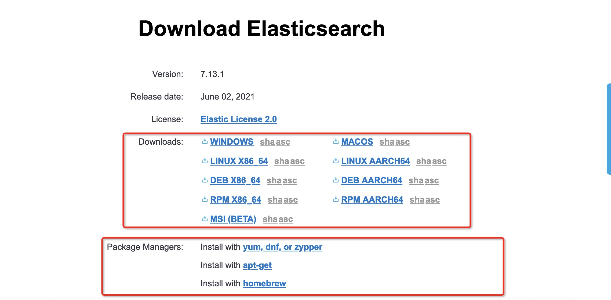
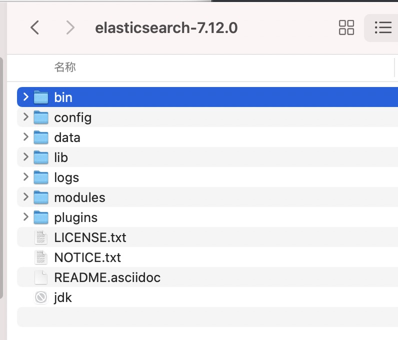
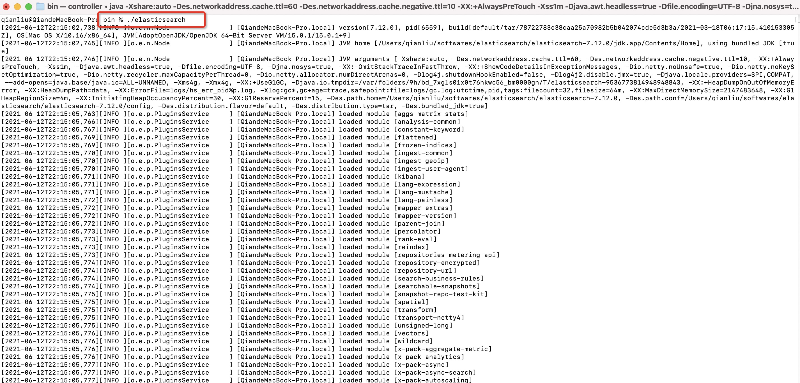
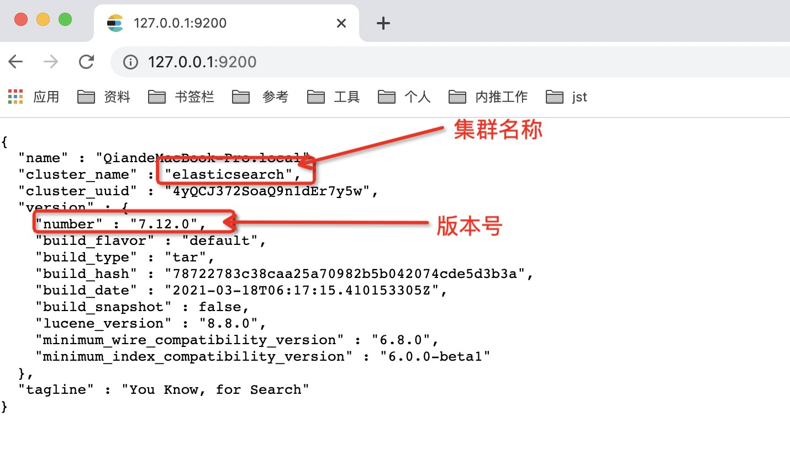
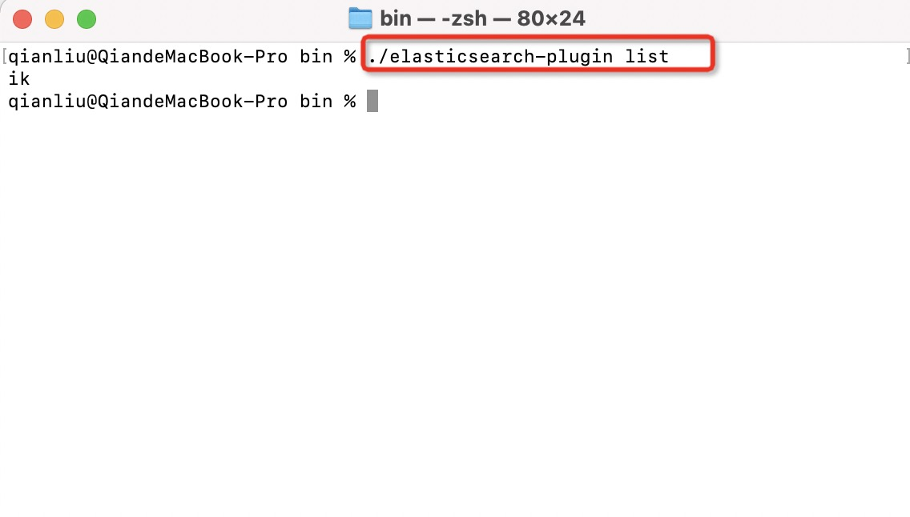
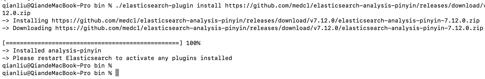
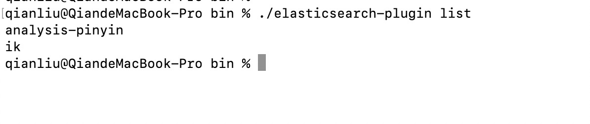
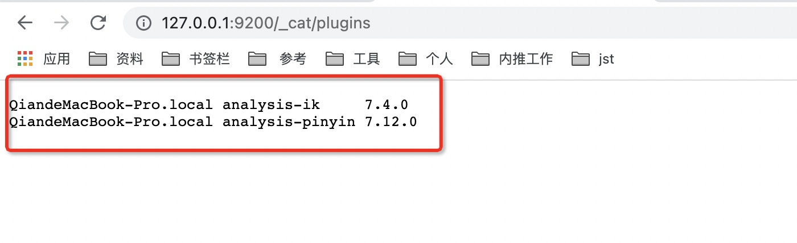

## Elasticsearch 不完全入门指北系列（一）：介绍与安装


ElasticSearch，简称 ES，主要功能是全文搜索以及数据分析等，故常用于搜索和大数据场景，这是一篇入门级文档，这里我们主要介绍 ES 在搜索场景下的使用。

在学习和实践的过程中，我们可以自行安装 kibana，或者 elasticsearch head 插件，或者 elasticvue 插件作为可视化工具协助。

### 1. 搜索引擎是什么？ES 是什么？

#### 1.1 搜索引擎是什么？

搜索引擎狭义的是指类似百度、谷歌这样的网站，即输入一个关键词，然后搜索引擎给出一个搜索结果出来，只是这个结果可能会由于不同的搜索引擎而得到不同的结果。广义的是指各种信息搜索系统或网站。

搜索引擎是指根据一定的策略、运用特定的计算机程序从互联网上采集信息，在对信息进行组织和处理后，为用户提供检索服务，将检索的相关信息展示给用户的系统。它是根据用户需求与一定算法，运用特定策略从互联网检索出制定信息反馈给用户的一门检索技术。

搜索引擎是工作于互联网上的一门检索技术，它旨在提高人们获取搜集信息的速度，为人们提供更好的网络使用环境。从功能和原理上搜索引擎大致被分为全文搜索引擎、元搜索引擎、垂直搜索引擎和目录搜索引擎等四大类。

搜索引擎技术的核心模块一般包括爬虫、索引、检索和排序等，同时可添加其他一系列辅助模块，以为用户创造更好的网络使用环境。比如网络爬虫技术、检索排序技术、网页处理技术、大数据处理技术、自然语言处理技术等，为信息检索用户提供快速、高相关性的信息服务。

#### 1.2 ES 是什么？

> Elasticsearch is a real-time, distributed storage, search, and analytics engine.
>
> Elasticsearch 是一个**实时**的**分布式存储、搜索、分析**的引擎。

Elasticsearch 是一个基于 Apache Lucene(TM) 的开源搜索引擎。无论在开源还是专有领域，Lucene 可以被认为是迄今为止最先进、性能最好的、功能最全的搜索引擎库。但是，Lucene 只是一个库。想要使用它，你必须使用Java来作为开发语言并将其直接集成到你的应用中，更糟糕的是，Lucene 非常复杂，你需要深入了解检索的相关知识来理解它是如何工作的。 Elasticsearch 也使用 Java 开发并使用 Lucene 作为其核心来实现所有索引和搜索的功能，但是它的目的是通过简单的 RESTful API 来隐藏 Lucene 的复杂性，从而让全文搜索变得简单。 不过，Elasticsearch 不仅仅是 Lucene 和全文搜索，我们还能这样去描述它：

- 分布式的实时文件存储，每个字段都被索引并可被搜索
- 分布式的实时分析搜索引擎
- 可以扩展到上百台服务器，处理PB级结构化或非结构化数据

而且，所有的这些功能被集成到一个服务里面，你的应用可以通过简单的RESTful API、 各种语言（Java、Python、.NET等）的客户端甚至命令行与之交互。上手 Elasticsearch 非常容易。它提供了许多合理的缺省值，并对初学者隐藏了复杂的搜索引擎理论。它开箱即用（安装即可使用），只需很少的学习既可在生产环境中使用。 Elasticsearch 在 Elastic License 2.0 下许可使用，可以免费下载、使用和修改。随着你对Elasticsearch的理解加深，你可以根据不同的问题领域定制 Elasticsearch 的高级特性，这一切都是可配置的，并且配置非常灵活。

### 2. Elasticsearch 的安装

在安装 Elasticsearch 之前，您需安装并配置好 JDK, 设置好环境变量 `$JAVA_HOME`。

众所周知，Elasticsearch 版本很多，不同的版本对 Java 的依赖也有所差别：

- Elasticsearch 5 需要 Java 8 以上版本；
- Elasticsearch 6.5 开始支持 Java 11;
- Elasticsearch 7.0 开始，内置了 Java 环境，所以说，安装 7.0+ 版本会方便很多。

#### 2.1 Elasticsearch 的下载与启动

ES 的安装是非常简单的，直接访问 Elasticsearch 官网 https://www.elastic.co/cn/downloads/elasticsearch 下载安装包即可，根据你本身的系统进行选择下载（当然你也可以通过包管理软件进行下载，我是为了方便就直接下载压缩包了）：



然后将压缩包解压到你想要放的目录，解压后的目录结构如下：



| 目录/文件 | 配置文件          | 描述                                     |
| --------- | ----------------- | ---------------------------------------- |
| bin       |                   | 脚本文件目录，如启动脚本、安装插件脚本等 |
| config    | elasticsearch.yml | elasticsearch 配置文件                   |
| data      | path.data         | 数据持久化文件目录                       |
| lib       |                   | 依赖相关类库                             |
| logs      | path.log          | 日志文件目录，比如错误日志、gc日志等等   |
| modules   |                   | 包含的所有 ES 模块，比如 x-pack 等       |
| plugins   |                   | 所有已安装的插件                         |
| jdk       |                   | Java 运行环境                            |

>注意点:
>
>- 修改 JVM 参数，配置文件路径为 `config/jvm.options`，ES V7.1 版本默认为 `1g`, 老版本为`2g`, 你可以自行修改。
>- `Xmx` 和`Xms` 数值请设置相同；
>- `Xmx` 不要超过机器内存的 `50%`；
>- 内存总量不要超过 30GB, 参见官方文档 https://www.elastic.co/cn/blog/a-heap-of-trouble；

启动就需要执行启动脚本，进入刚才的解压目录，进入 `bin` 目录，执行：

```sh
./elasticsearch
```



ES 的默认访问端口是 9200，接着我们浏览器访问 `http://127.0.0.1:9200` ，如果能看到下面的结果就证明我们完成安装并启动成功了：



关闭 ES 的话，在终端界面 `Ctrl + C` 终止当前进程就好了，简单有效【狗头保命】，当然也可以找到进程再杀死。

#### 2.2 插件的安装

插件的安装我们可以使用插件安装脚本进行安装，即 `bin` 目录下的 `elasticsearch-plugin` 脚本，首先我们可以查看已经安装了哪些插件：

```shell
./elasticsearch-plugin list
```



可以看到我已经安装了一个插件，`ik`，一个分词工具。接着我们来安装一个新的插件，`pinyin` 即拼音分词器。之后的系列文章我会给大家介绍这些插件的用处。

ES 插件的安装命令如下：

```shell
./elasticsearch-plugin install {插件名}
```

比如安装拼音分词器命令如下：

```shell
./elasticsearch-plugin install https://github.com/medcl/elasticsearch-analysis-pinyin/releases/download/v7.12.0/elasticsearch-analysis-pinyin-7.12.0.zip
```



然后我们再通过查看插件命令就可以看到最新的已安装的插件列表了：



重启ES后，安装的插件才会生效。除了命令行，也可以通过访问 `http://127.0.0.1:9200/_cat/plugins` 来查看已经安装的插件：



### 总结

本篇简单介绍了一下搜索引擎以及 ES 是什么，接着给大家演示了一下如何安装和启动 ES，怎么安装 ES 的插件，欢迎大家多多实践，如果遇到问题，也欢迎评论给出，共同解决。在之后的文章会继续完善和不全 ES 相关的内容，敬请期待！