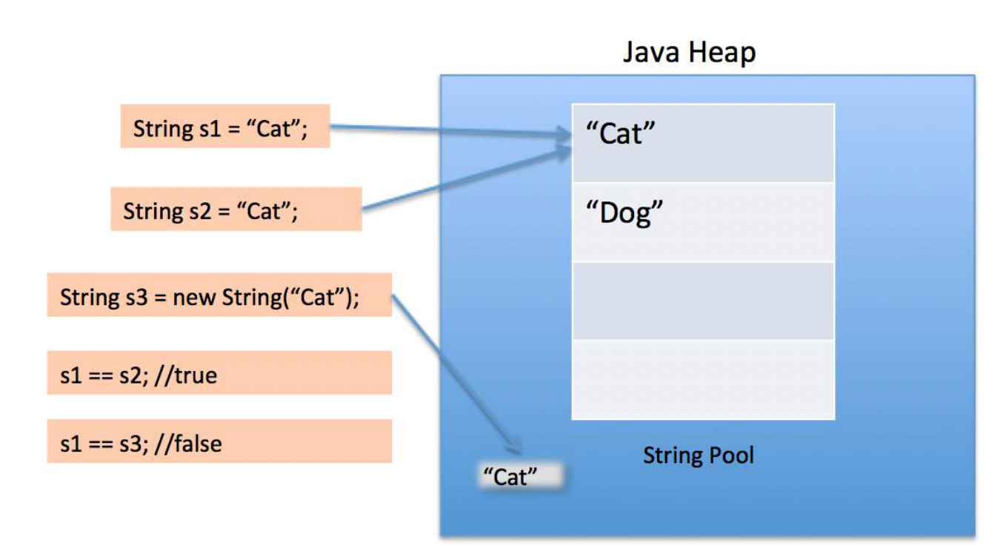

## Java基础005：字符串

字符串（`java.lang.String`）是存储在你程序中的一些文本片段。字符串并不是Java中的[基础类型](https://stackoverflow.com/questions/10430582/primitive-data-types-in-java)，却是非常常用的一种类型。

在Java中，`String` 是不可变的，意味着它们不能被更改。（[java - What is meant by immutable? - Stack Overflow](https://stackoverflow.com/questions/279507/what-is-meant-by-immutable))）

### 1、比较字符串

为了比较两个字符串是否相等，你可能会用得上 `String` 对象中的 `equals` 或者 `equalsIgnoreCase` 方法。

例如，下面的代码片段将确定 `String` 的两个实例是否在所有字符上都相等：

```java
String firstString = "Test123";
String secondString = "Test" + 123;

if (firstString.equals(secondString)) {
    // 两个字符串有同样内容会进入此判断
}
```

下面的例子则会忽略两个字符串的大小写来进行比较：

```java
String firstString = "Test123";
String secondString = "TEST123;

if (firstString.equalsIgnoreCase(secondString)) {
    // 两个字符串有同样内容会进入此判断，忽略字符的大小写
}
```

**注意**：`equalsIgnoreCase` 不允许本地化设置。举个栗子，在英语中，如果你对比 “Taki”、“TAKI” 两个单词，那么它们是相等的；但是，在土耳其语中则是不同的（土耳其语中小写的 `I` 是 `ı`）。对于这样的情况，解决方案是，使用 `Locale` 将两个字符串都转换为小写（或大写），然后使用 `equals` 进行比较。

```java
String firstString = "Taki";
String secondString = "TAKI";

System.out.println(firstString.equalsIgnoreCase(secondString)); //prints true

Locale locale = Locale.forLanguageTag("tr-TR");

System.out.println(firstString.toLowerCase(locale).equals(
                   secondString.toLowerCase(locale))); //prints false
```

##### 不要使用 `==` 运算符来比较字符串

除非你可以保证所有的字符串都调用过 `intern()` 存入常量池，否则你就**不应该**使用 `==` 或者 `!=` 运算符来比较字符串。这些运算符实际上是测试引用，并且由于多个 `String` 对象可以表示同一个字符串，因此很容易给出错误的答案。

取而代之的是，要使用 `String.equals()` 方法， 会基于字符串对象的值来进行比较。详细解释请参考陷阱：使用 `==` 比较字符串。

##### 在 `switch` 语句中比较字符串（`Version ≥ Java SE 7`）

从 Java 1.7 开始，可以在 `switch` 语句中将 `String` 变量与字面量进行比较。 确保 `String` 对象 不为 `null`，否则它总是会抛出 `NullPointerException`。 使用 `String.equals` 比较值，即区分大小写。

```java
String stringToSwitch = "A";
switch (stringToSwitch) {
    case "a":
        System.out.println("a");
        break;
    case "A":
        System.out.println("A"); //the code goes here
        break;
    case "B":
        System.out.println("B");
        break;
    default:
        break;
}
```

##### 与常量字符串比较

当一个 `String` 对象与常量值比较时，你可以把常量值放在 `equals()` 左边，进而可以保证即使其他字符串为 `null` 时，也不会抛出 `NullPointerException`。

```java
"baz".equals(foo)
```

如果 `foo` 为 `null` ，`foo.equals("baz")` ，则会抛出 `NullPointerException` 异常，`"baz".equals(foo)` 则会返回 `false`。

一个更易读的替代方法是使用 `Objects.equals()`，它对两个参数都会进行 `null` 检查，即两个参数都是可为 `null` 的：`Objects.equals(foo, "baz")`。

（**注意：** 对于一般情况下是避免 `NullPointerExceptions` 更好，还是让它们发生然后修复根本原因，这是值得商榷的。当然，将回避策略称为“最佳实践”是不合理的。）

##### 字符串顺序

`String` 对象使用 `String.compareTo` 方法实现 `Comparable<String>` 接口。这使得 `String` 对象的自然排序是区分大小写的。`String` 类提供了一个名为 `CASE_INSENSITIVE_ORDER` 的 `Comparator<String>` 常量，适用于不区分大小写的排序。

##### 与内存常量池中的字符串比较

Java 语言规范 (`JLS 3.10.6`) 声明如下：

> “此外，字符串文字总是引用 String 类的同一个实例。这是因为字符串的值——或者，更一般地，作为常量表达式值的字符串——使用 `String.intern` 方法进行 `intern`，以便共享唯一实例。”

这意味着使用 `==` 来比较两个字符串字面量的引用是安全的。此外，对使用 `String.intern()` 方法生成的 `String` 对象的引用也是如此。

比如：

```java
String strObj = new String("Hello!");
String str = "Hello!";
// 这两个字符串引用指向的字符串是相等的
if (strObj.equals(str)) {
   System.out.println("The strings are equal");
}

// 这两个字符串引用指向的并不是相同的对象
if (strObj != str) {
   System.out.println("The strings are not the same object!");
}
// 如果 intern 了一个 string 便等价于给定一个常量，结果便是一个字符串和这个常量有着相同的引用
String internedStr = strObj.intern();

if (internedStr == str) {
    System.out.println("The interned string and the literal are same object!");
}

```

在这背后，`intern()` 的机制是维护一个哈希表，其中包含所有可访问的字符串。 当在 `String` 上调用 `intern()` 时，该方法会在哈希表中查找对象：

- 如果找到了字符串，则便会返回一个对应引用的值。

- 否则，该字符串的拷贝便会被加入到哈希表中，然后返回引用的值。

可以使用 interning（驻留） 来允许使用 `==` 比较字符串。 但是，这样做存在重大问题（[Pitfall - Interning strings so that you can use is a bad idea (programming-books.io)](https://www.programming-books.io/essential/java/pitfall-interning-strings-so-that-you-can-use-is-a-bad-idea-d552ac0324f14954998b22255d3eacce.html)），在大多数情况下不建议这样做。

### 2、使用 `String` 对象来改变字符的大小写

`String` 类型提供了两个方法可以让字符串在大写和小写之间进行切换：

- `toUpperCase` 将所有字符转换为大写

- `toLowerCase` 将所有字符转换为小写

这两个方法都会将转换后的字符串作为一个新的 `String` 实例返回，由于 `String` 在 Java 中是不可变的，原始的字符串对象并不会被修改。

```java
String string = "This is a Random String";

String upper = string.toUpperCase();
String lower = string.toLowerCase();
System.out.println(string); // prints "This is a Random String"
System.out.println(lower); // prints "this is a random string"
System.out.println(upper); // prints "THIS IS A RANDOM STRING"
```

非字母字符，例如数字和标点符号，不受这些方法的影响。 请注意，这些方法也可能在某些条件下错误地处理某些 `Unicode` 字符。

**注意：** 这些方法对区域设置敏感，如果用于要独立于区域设置进行解释的字符串，则可能会产生意外结果。 比如编程语言标识符、协议键和 HTML 标记。

比如，土耳其语言环境中的 `"TITLE".toLowerCase() `返回 `"tıtle"`，其中 `ı (\u0131)` 是 `LATIN SMALL LETTER DOTLESS I ` 字符。 要获得对区域设置不敏感的字符串的正确结果，请将 `Locale.ROOT` 作为参数到相应的大小写转换方法（例如 `toLowerCase(Locale.ROOT)` 或 `toUpperCase(Locale.ROOT)` ）。

尽管在大多数情况下使用 `Locale.ENGLISH` 也是正确的，但不用切换语言的方法是使用 `Locale.ROOT`。

##### 使用 ASCII 更改字符串中特定字符的大小写：

下面算法可以使用，步骤如下：

1. 声明一个字符串

2. 输入字符串

3. 将字符串转为一个字符数组

4. 输入要搜索的字符

5. 在字符数组中搜索字符

6. 如果找到了，检查该字符是小写还是大写
   
   - 如果是大写，则给这个字符的 `ASCII` 码加上 32
   
   - 如果是小写，则给这个字符的 `ASCII` 码减去 32

7. 更改字符数组中的原始字符

8. 将字符数组转换回字符串

看，字符的大小写就已经发生了改变。

下面是这个算法的一个代码示例：

```java
        Scanner scanner = new Scanner(System.in);
        System.out.println("Enter the String");
        String s = scanner.next();
        char[] a = s.toCharArray();
        System.out.println("Enter the character you are looking for");
        System.out.println(s);
        String c = scanner.next();
        char d = c.charAt(0);
        for (int i = 0; i <= s.length(); i++) {
            if (a[i] == d) {
                if (d >= 'a' && d <= 'z') {
                    d -= 32;
                } else if (d >= 'A' && d <= 'Z') {
                    d += 32;
                }
                a[i] = d;
                break;
            }
        }
        s = String.valueOf(a);
        System.out.println(s);
```

### 3、在另一个字符串中查找一个字符串

检查一个特定字符串 `a` 是否包含在字符串 `b` 中，我们可以使用方法 `String.contains()` ：

```java
b.contains(a); // 如果 b 包含 a，返回 true，否则 false
```

`String.contains()` 可以用来校验一个字符序列是否在一个字符串中出现。这个方法可以在字符串 `b` 中查询字符串 `a`，而且是大小写敏感的。

```java
String str1 = "Hello World";
String str2 = "Hello";
String str3 = "helLO";


System.out.println(str1.contains(str2)); // true
System.out.println(str1.contains(str3)); // false
```

 要找到一个字符串在另一个字符串中开始的确切位置，请使用 `String.indexOf()`：

```java
String s = "this is a long sentence";
int i = s.indexOf('i'); // 字符串中第一个 'i' 在索引 2 的位置
int j = s.indexOf("long"); // s 中第一次出现 "long" 的索引为 10
int k = s.indexOf('z'); // k 是 -1 因为 'z' 并没有在字符串 s 中出现
int h = s.indexOf("LoNg"); // h 是 -1 因为 "LoNg" 也没有在字符串 s 中找到
```

`String.indexOf()` 方法返回 字符 或者 字符串 在另一个字符串出现的第一个索引位置。返回 `-1` 则表示未找到。

**注意：** `String.indexOf()` 是大小写敏感的。

下面的例子可以忽略大小写：

```java
String str1 = "Hello World";
String str2 = "wOr";

str1.indexOf(str2); // -1
str1.toLowerCase().contains(str2.toLowerCase()); // true
str1.toLowerCase().indexOf(str2.toLowerCase()); // 6
```

### 4、字符串池和堆存储

正如许多 Java 对象，所有的字符串实例，甚至于字面量（常量），都在堆内存中创建。当 JVM 发现堆中没有等效引用的 `String` 字面量时，JVM 会在堆上创建相应的 `String` 实例，并将对新创建的 `String` 实例的引用存储在 `String` 池中。 对同一 `String` 常量值的任何其他引用都将替换为堆中先前创建的 `String` 实例。

让我们看下下面的例子：

```java
    public static void main(String[] args) {
        String a = "alpha";
        String b = "alpha";
        String c = new String("alpha");
        // 三个字符串都是相等的
        System.out.println(a.equals(b) && b.equals(c));
        // 只有 a 和 b 指向相同的堆对象
        System.out.println(a == b);
        System.out.println(a != c);
        System.out.println(b != c);
    }
```

上面代码的输出如下：

```
true
true
true
true
```



当我们使用双引号创建一个字符串对象时，第一步便是在字符串池中查询是否有相同的字符串对象，如果找到的话则返回指针，否则在池中创建一个新的字符串对象然后返回指针。

然而使用 `new` 运算符，我们强制 `String` 类在堆空间创建了一个新的字符串对象。我们可以使用 `intern()` 方法来把它放进字符串池，或者引用字符串池中具有相同值的其他字符串对象。

字符串池也是在堆中创建的。

在 Java 7 之前，`String` 常量存储在 `PermGen`（永久代） 方法区的运行时常量池中，它大小是固定的。字符串池也存在于 `PermGen`。

> 在 JDK 7 中，interned 字符串不再分配在 Java 堆的永久代中，而是与应用程序创建的其他对象一起分配在 Java 堆的主要部分（称为年轻代和年老代）中。此更改将导致更多数据驻留在主 Java 堆中，而永久代中的数据更少，因此可能需要调整堆大小。 由于此更改，大多数应用程序只会看到相对较小的堆使用差异，但加载许多类或大量使用 String.intern() 方法的大型应用程序将看到更显着的差异。

### 5、拆分字符串

你可以使用一个特定的分隔字符，或者正则表达式来拆分字符串，使用如下签名的 `String.split()` 方法：

```java
public String[] spilit(String regex)
```

注意，分隔字符或正则表达式将从生成的字符串数组中删除。

使用分隔字符的例子：

```java
String lineFromCsvFile = "Mickey;Bolton;12345;121216";
String[] dataCells = lineFromCsvFile.split(";");
// Result is dataCells = { "Mickey", "Bolton", "12345", "121216"};
```

使用正则表达式的例子：

```java
String lineFromInput = "What     do you need     from me?";
String[] words = lineFromInput.split("\\s+"); // 一个或者多个空格
// Result is words = {"What", "do", "you", "need", "from", "me?"};
```

你甚至可以直接使用一个字符串常量：

```java
String[] firstNames = "Mickey, Frank, Alicia, Tom".split(", ");
// Result is firstNames = {"Mickey", "Frank", "Alicia", "Tom"};
```

**警告：** 不要忘记，分隔符是会被当作正则表达式处理的。

```java
"aaa.bbb".split("."); // 将会返回一个空数组
```

在上面的例子里 `.` 被看作匹配任何字符的正则表达式通配符，并且由于每个字符都是分隔符，因此结果是一个空数组。

##### 基于作为正则表达式元字符的分隔符进行拆分

下面的字符是在正则表达式中的一些特殊字符（aka 元-字符）：

```
< > - = ! ( ) [ ] { } \ ^ $ | ? * + .
```

使用上面的字符来拆分字符串时，你需要使用 `\\` 转义或者 `Pattern.quote()` ：

- 使用 `Pattern.quote()`：
  
  ```java
  String s = "a|b|c";
  String regex = Pattern.quote("|");
  String[] arr = s.split(regex);
  ```

- 转义特殊字符：
  
  ```java
  String s = "a|b|c";
  String[] arr = s.split("\\|");
  ```

##### 拆分会移除空值

`split(delimiter)` 默认情况下从结果数组中删除尾随的空字符串。 要关闭此机制，我们需要使用重载版本的 `split(delimiter, limit) ` 并将 `limit` 设置为负值，例如:

```java
String[] split = data.split("\\|", -1);
```

`split(regex)` 其内部返回 `split(regex, 0)` 的结果。

`limit` 参数控制应用该表达式的次数，因此会影响结果数组的长度。

如果限制 `n` 大于零，则表达式将最多应用 `n - 1` 次，数组的长度将不大于 `n`，并且数组的最后一个条目将包含最后一个匹配分隔符之外的所有输入。 如果 `n` 为负数，则该表达式将被应用尽可能多的次数，并且该数组可以具有任意长度。 如果 `n `为零，则该表达式将被应用尽可能多的次数，数组可以有任意长度，并且尾随的空字符串将被丢弃。

##### 使用 `StringTokenizer` 拆分

除了 `split()` 方法，字符串也可以使用 `StringTokenizer` 拆分。

`StringTokenizer` 不仅相对于 `String.split()` 更有限制性，而且更难使用。它本质上是为提取由一组固定字符（作为字符串给出）分隔的标记而设计的。 每个字符将充当分隔符。 由于这个规则，它的速度大约是 `String.split()` 的两倍。

默认的字符接话是空格（`\t\n\r\f`）。下面的例子会分别打印出每个单词：

```java
String str = "the lazy fox jumped over the brown fence";
StringTokenizer tokenizer = new StringTokenizer(str);
while (tokenizer.hasMoreTokens()) {
    System.out.println(tokenizer.nextToken());
}
```

输出结果为：

```
the
lazy
fox
jumped
over
the
brown
fence
```

你也可以使用不同的字符集合来分隔：

```java
String str = "jumped over";
// 字符 `u` 和 `e` 都会被当作分隔符
StringTokenizer tokenizer = new StringTokenizer(str, "ue");
while (tokenizer.hasMoreTokens()) {
    System.out.println(tokenizer.nextToken());
}
```

输出结果为：

```
j
mp
d ov
r
```

### 6、使用分隔符来连接字符串

一个字符串数组可以使用静态方法 `String.join()` 连接：

```java
String[] elements = {"foo", "bar", "foobar"};
String singleString = String.join(" + ", elements);
System.out.println(singleString); // 输出 "foo + bar + foobar"
```

同样，`Iterable` 有一个重载的 `String.join()` 方法。

要对 连接 进行细粒度控制的话，你也可以使用 `StringJoiner` 类：

```java
StringJoiner sj = new StringJoiner(", ", "[", "]");
// 最后两个参数是可选的，它们定义了结果字符串的前缀和后缀
sj.add("foo");
sj.add("bar");
sj.add("foobar");
System.out.println(sj); // 打印 "[foo, bar, foobar]"
```

要连接一个字符串的流（stream）的话，可以使用 `Collectors.joining()`：

```java
Stream<String> stringStream = Stream.of("foo", "bar", "foobar");
String joined = stringStream.collect(Collectors.joining(", "));
System.out.println(joined); // 打印 "foo, bar, foobar"
```

这里同样可以选择设置前缀后缀：

```java
Stream<String> stringStream = Stream.of("foo", "bar", "foobar");
String joined = stringStream.collect(Collectors.joining(", ", "{", "}"));
System.out.println(joined); // 打印 "{foo, bar, foobar}"
```

### 7、字符串拼接和 `StringBuilder`

字符串的拼接可以使用 `+` 运算符实现。例如：

```java
String s1 = "a";
String s2 = "b";
String s3 = "c";
String s = s1 + s2 + s3; // abc
```

通常，编译器实现将使用 `StringBuilder` 的方法执行上述连接。 编译后，代码将类似于以下内容：

```java
StringBuilder sb = new StringBuilder("a");
String s = sb.append("b").append("c").toString();
```

`StringBuilder` 有几个用于追加不同类型的重载方法，例如，追加一个 `int` 而不是一个 `String`。 例如，一个实现可以转换：

```java
String s1 = "a";
String s2 = "b";
String s = s1 + s2 + 2; // ab2
```

转换成下面：

```java
StringBuilder sb = new StringBuilder("a");
String s = sb.append("b").append(2).toString();
```

上面的例子说明了一个简单的串联操作，它可以在代码中的一个地方高效完成。 串联涉及 `StringBuilder` 的单个实例。 在某些情况下，连接是以累积方式执行的，例如循环：

```java
String result = "";
for(int i = 0; i < array.length(); i++) {
    result += extractElement(array[i]);
}
return result;
```

在这种情况下，通常不会应用编译器优化，每次迭代都会创建一个新的 StringBuilder 对象。 这可以通过显式转换代码以使用单个 StringBuilder 来优化：

```java
StringBuilder result = new StringBuilder();
for(int i = 0; i < array.length(); i++) {
    result.append(extractElement(array[i]));
}
return result.toString();
```

`StringBuilder` 初始化时，只会申请有 16 个字符的空白空间。 如果你事先知道将会构建更大的字符串，则可以提前使用足够的大小对其进行初始化，这样可能会有所帮助，而不需要调整内部缓冲区的大小：

```java
StringBuilder buf = new StringBuilder(30); // 默认是16个字符
buf.append("0123456789");
buf.append("0123456789"); // 否则会导致内部缓冲区的重新分配
String result = buf.toString(); // 产出一个20个字符的字符串拷贝
```

如果你要生成很多字符串，建议重用 `StringBuilders`：

```java
StringBuilder buf = new StringBuilder(100);
for(int i = 0; i < 100; i++) {
    buf.setLength(0); // 清空缓冲区
    buf.append("This is line ").append(i).append('\n');
    outputfile.write(buf.toString());
}
```

如果（且仅当）多个线程同时写入同一个缓冲区，请使用 `StringBuffer`，它是 `StringBuilder` 的 `synchronized` 版本。 但是因为通常只有一个线程写入缓冲区，所以使用非同步的 `StringBuilder` 通常更快。

##### 使用 `concat()` 方法

```java
String s1 = "Hello ";
String s2 = "world";
String s = s1.concat(s2); // Hello world
```

这会返回一个新字符串，它是 `s1`，末尾追加了 `s2`。 还可以将 `concat()` 方法与字符串常量一起使用，如下所示：

```java
"My name is ".concat("Buyya");
```

### 8、子字符串（Substring）

```java
String s = "this is an example";
String a = s.substring(11); // a 将从字符串的字符 11 的位置保留到末尾("example")
String b = s.substring(5, 10); // b 将从字符串的字符 5 的位置保留到字符 10 的位置("is an")
String c = s.substring(5, s.length() - 3); // c 将从字符串的字符 5 的位置保留到字符串到末尾字符3的位置("is an exam")
```

子字符串也可以应用于切分并将字符添加/替换到其原始字符串中。 例如，你遇到了一个包含中文字符的中文日期，但你想将其存储为格式良好的日期字符串。

```java
String datestring = "2015年11月17日";
datestring = datestring.substring(0, 4) + "-" +
        datestring.substring(5, 7) + "-" +
        datestring.substring(8, 10);
// 结果为 2015-11-17
```

`substring()` 方法会提取一段字符串。当提供一个参数时，该参数是要提取的起始位置，并且该片段会一直延伸到字符串的结尾。 当给定两个参数时，第一个参数是起始字符的，第二个参数是结束后字符的索引（不包括索引处的字符）。 一个简单的检查方法是从第二个参数中减去第一个参数应该产生字符串的预期长度。

在 JDK < 7u6 版本中，`substring` 方法实例化一个 `String`，它与原始 `String` 共享相同的背后的 `char[]`，并将内部偏移和计数字段设置为结果开始和长度。 这种共享可能会导致内存泄漏，这可以通过调用 `new String(s.substring(...))` 来强制创建副本来防止，之后可以对 `char[]` 进行垃圾回收。

从 JDK 7u6 之后，`substring` 方法总是复制整个底层 `char[]` 数组，使得复杂度与之前的常量相比是线性的，但同时保证没有内存泄漏。

### 9、独立于平台的换行符

由于新行分隔符因平台而异（例如，类 `Unix` 系统上的 `\n` 或 `Windows` 上的 `\r\n`），因此通常需要一种独立于平台的访问方式。 在 Java 中，它可以从系统属性中检索：

```java
System.getProperty("line.separator");
```

由于获取换行符还是挺常见的需求，从 Java 7 起，可以使用返回与上述代码完全相同的结果的快捷方法：

```java
System.lineSeparator()
```

**注意：** 由于换行符在程序执行期间不太可能发生更改，因此最好将其存储在静态最终变量中，而不是每次需要时都从系统属性中获取它。

使用 `String.format` 时，使用 `%n` 而不是 `\n` 或 `\r\n` 来输出与平台无关的换行符。

```java
System.out.println(String.format('line 1: %s.%nline 2: %s%n', lines[0],lines[1]));
```

### 10、反转字符串

这有两种方式来从后向前地反转字符串。

1. `StringBuilder/StringBuffer`
   
   ```java
   String code = "code";
   System.out.println(code);
   
   StringBuilder sb = new StringBuilder(code);
   code = sb.reverse().toString();
   // edoc
   System.out.println(code);
   ```

2. 字符数组
   
   ```java
   String code = "code";
   System.out.println(code);
   char[] array = code.toCharArray();
   for (int index = 0, mirroredIndex = array.length - 1; index < mirroredIndex; index++, mirroredIndex--) {
       char temp = array[index];
       array[index] = array[mirroredIndex];
       array[mirroredIndex] = temp;
   }
   // 打印 edoc
   System.out.println(new String(array));
   ```

### 11、为自定义对象添加 `toString()` 方法

假设你定义了下面的一个 `Person` 类：

```java
    public class Person {
        String name;
        int age;

        public Person(int age, String name) {
            this.age = age;
            this.name = name;
        }
    }
```

如果你实例化了一个新的 `Person` 对象：

```java
Person person = new Person(25, "John");
```

然后之后你用下面的代码来打印这个对象：

```java
System.out.println(person.toString());
```

然后你就会得到类似下面的结果：

```
Person@6d86b085
```

这是在 `Object` 类（`Person` 的父类）中定义的 `toString()` 方法实现的结果。 `Object.toString()` 的文档指出：

> `Object` 类的 `toString` 方法返回一个字符串，该字符串由对象作为实例的类的名称、`at` 符号字符“@”和对象的哈希码的无符号十六进制表示形式组成。 换句话说，此方法返回一个等于以下值的字符串：
> 
> ```java
> getClass().getName() + '@' + Integer.toHexString(hashCode())
> ```

所以，要想得到一个有意义的输出的话，你得重载（`override`）一下 `toString()` 方法：

```java
@Override
public String toString() {
    return "My name is " + this.name + " and my age is " + this.age;
}
```

现在输出的内容就会是：

```
My name is John and my age is 20
```

你也可以写成：

```java
System.out.println(person);
```

实际上，`println()` 隐式调用了对象的 `toString()` 方法。

### 12、移除字符串起始与末尾的空格

`trim()` 方法返回一个删除了开头和尾部空格的新字符串。

```java
String s = new String("    Hello World!!   ");
String t = s.trim(); // t = "Hello World!!"
```

如果你处理没有任何空格要删除的字符串，那么将返回相同的字符串实例。

请注意， `trim()` 方法有自己的空白概念，这与 `Character.isWhitespace()` 方法使用的概念不同：

- 所有代码为 `U+0000` 到 `U+0020` 的 `ASCII` 控制字符都被视为空格，并被 `trim()` 删除。 这包括 `U+0020` `'SPACE'`、`U+0009` `'CHARACTER TABULATION'`、`U+000A` `'LINE FEED'` 和 `U+000D` `'CARRIAGE RETURN'` 字符，还包括 `U+0007` `'BELL'` 等字符。

- `trim()` 无法识别 `U+00A0` `'NO-BREAK SPACE'` 或 `U+2003` `'EM SPACE'` 等 Unicode 空格。

### 13、大小写敏感的 `switch`

`switch` 本身不能被参数化为不区分大小写，但如果绝对需要，可以使用 `toLowerCase()` 或 `toUpperCase` 对输入字符串不敏感：

```java
switch (myString.toLowerCase()) {
    case "case1":
       ...
    break;
    case "case2":
       ...
    break;
}
```

##### 注意：

- `Locale` 可能会影响更改大小写的发生方式！

- 必须注意不要在标签中包含任何大写字符 - 这些逻辑分支永远不会被执行！

### 14、替换字符串中的部分字符串

有两种方式来替换字符串：正则表达式或者完全匹配。

**注意：** 原始的字符串对象并不会被改变，返回的结果才会保留变更的字符串。

##### 完全匹配

**用另一个单个字符替换一个单个字符：**

```java
String replace(char oldChar, char newChar);
```

> 返回一个新字符串，该字符串是用 `newChar` 替换此字符串中所有出现的 `oldChar` 所产生的。

```java
String s = "popcorn";
System.out.println(s.replace('p', 'W'));
```

结果是：

```
WoWcorn
```

**用另一个字符序列替换字符序列：**

```java
String replace(CharSequence target, CharSequence replacement);
```

> 用指定的字面量替换序列替换此字符串中与目标序列匹配到字面量的每个子字符串。

```java
String s = "metal petal et al.";
System.out.println("etal", "etallica");
```

结果是：

```
metallica petallica et al.
```

##### 正则

**注意：** 分组使用 `$` 来引用组，比如 `$1`。

**替换全部匹配：**

```java
String replaceAll(String regex, String replacement);
```

> 用给定的替换字符串，替换此字符串中与给定正则表达式匹配的每个子字符串。

```java
String s = "spiral metal petal et al.";
System.out.println(s.replaceAll("(\\w*etal)","$1lica"));
```

结果是：

```
spiral metallica petallica et al.
```

**只替换第一个匹配到的字符串：**

```java
String replaceFirst(String regex, String replacement);
```

> 用给定的替换字符串，替换此字符串的第一个与给定正则表达式匹配的子字符串。

```java
String s = "spiral metal petal et al.";
System.out.println(s.replaceFirst("(\\w*etal)","$1lica"));
```

结果是：

```
spiral metallica petal et al.
```

### 15、获取一个字符串的长度

可以调用 `length()` 方法来获 `String` 对象的长度。获取到的长度等于字符串中 `UTF-16` 代码单元（字符）的数量。

```java
String str = "Hello, World!";
System.out.println(str.length()); // 打印13
```

`String` 中的 `char` 是 `UTF-16` 值。 值 `≥ 0x1000` 的 `Unicode` 代码点（例如，大多数表情符号）使用两个字符位置。 要计算字符串中 `Unicode` 代码点的数量，无论每个代码点是否适合 `UTF-16` 字符值，都可以使用 `codePointCount` 方法：

```java
int length = str.codePointCount(0, str.length());
```

你也可以使用 `codePoints` 的流（`IntStream`）获取，比如 Java 8：

```java
long length = str.codePoints().count();
```

### 16、获取字符串中的某位字符

```java
String str = "My String";
System.out.println(str.charAt(0)); // "M"
System.out.println(str.charAt(1)); // "y"
System.out.println(str.charAt(2)); // " "
System.out.println(str.charAt(str.length-1)); // 最后一位字符 "g"
```

要获取字符串中的第 `n` 个字符，只需字符串对象调用 `charAt(n)`，其中 `n` 是检索的字符的索引。

**注意：** 索引是从 0 开始的，所以第一个元素的位置在 `n=0`。

### 17、得到子串或者字符在一个字符串中出现的次数

`org.apache.commons.lang3.StringUtils` 中的 `countMatches` 方法通常用于计算字符串中子字符串或字符的出现次数：

```java
String text = "One fish, two fish, red fish, blue fish";
// 统计一个子字符串出现的次数
String stringTarget = "fish";
int stringOccurrences = StringUtils.countMatches(text, stringTarget); // 4
// 统计一个字符出现的次数
char charTarget = ',';
int charOccurrences = StringUtils.countMatches(text, charTarget); // 3
```

否则，你也可以使用正则表达式来调用标准的 Java API 实现相同的效果：

```java
    String text = "One fish, two fish, red fish, blue fish";
    System.out.println(countStringInString("fish", text)); // 打印 4
    System.out.println(countStringInString(",", text)); // 打印 3


    public static int countStringInString(String search, String text) {
        Pattern pattern = Pattern.compile(search);
        Matcher matcher = pattern.matcher(text);
        int stringOccurrences = 0;
        while (matcher.find()) {
            stringOccurrences++;
        }
        return stringOccurrences;
    }
```


### 总结

本文我们回顾了一些 Java `String` 对象的一些常用 API，另外 `StringUtils` 也为我们封装了很多字符串操作的工具方法，大家也可以自行去尝试和探索。


### 链接：

- java中的字符串是不可变的： https://stackoverflow.com/questions/1552301/immutability-of-strings-in-java
