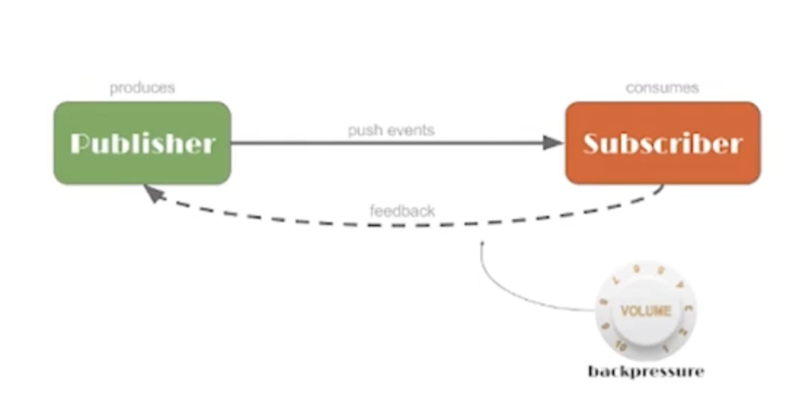
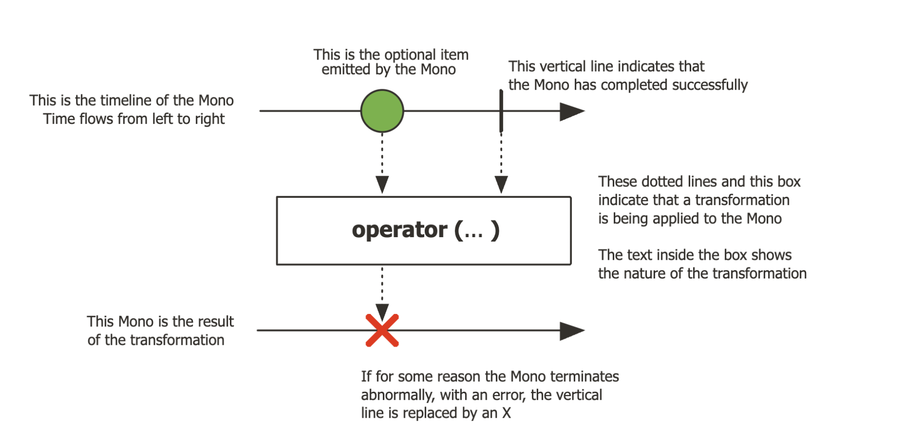
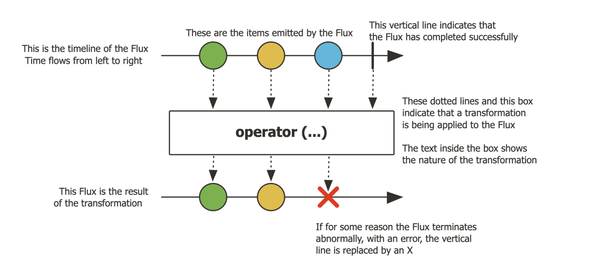
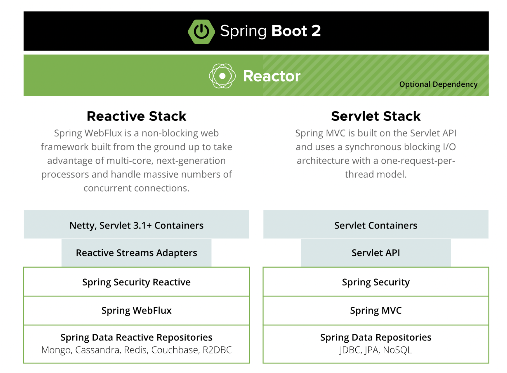
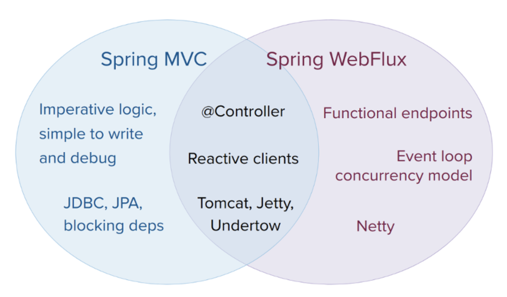

## Spring WebFlux 的简单介绍与示例


WebFlux 是 Spring Framework5.0 中引入的一种新的反应式 Web 框架。通过Reactor 项目实现 Reactive Streams 规范，是一个完全异步和非阻塞的框架。其本身不会加快程序执行速度，但在高并发情况下借助异步IO能够以少量而稳定的线程处理更高的吞吐，规避文件IO/网络IO阻塞带来的线程堆积。

我们先从一些基础概念开始，先来了解一下函数式编程、反应式编程、Reactor，然后再来认识一下 Spring WebFlux。

### 1. 函数式编程（Functional Programming）

> 在计算机科学中，函数式编程是一种编程范式，它将计算视为对数学函数的评估，并避免了状态和可变数据。

在函数式编程中，由于数据全部都是不可变的，所以没有并发编程的问题，是线程安全的。它将计算机运算看做是数学中函数的计算，主要特点是将计算过程分解成多个可复用的函数，并且避免了状态以及变量的概念。函数式编程虽然也可以归结到面向过程的程序设计，但其思想更接近数学计算。

函数式编程的特点：

- 函数是“一等公民”：所谓"第一等公民"（first class），指的是函数与其他数据类型一样，处于平等地位，可以赋值给其他变量，也可以作为参数，传入另一个函数，或者作为别的函数的返回值。

- 闭包和高阶函数：闭包是起函数的作用并可以像对象一样操作的对象。与此类似，FP 语言支持高阶函数。高阶函数可以用另一个函数（间接地，用一个表达式） 作为其输入参数，在某些情况下，它甚至返回一个函数作为其输出参数。这两种结构结合在一起使得可以用优雅的方式进行模块化编程，这是使用 FP 的最大好处。

- 递归: 用递归做为控制流程的机制。例如在 Haskell 的世界中，没有变量赋值，流程跳转，如果要实现一些简单的功能，比如求一个数组中的最大值，都需要借助递归实现。

- 惰性求值(Lazy Evaluation)：它表示为“延迟求值“和”最小化求值“。惰性求值使得代码具备了巨大的优化潜能。支持惰性求值的编译器会像数学家看待代数表达式那样看待函数式编程的程序：抵消相同项从而避免执行无谓的代码，安排代码执行顺序从而实现更高的执行效率甚至是减少错误。 惰性求值另一个重要的好处是它可以构造一个无限的数据类型，无需要担心由无穷计算所导致的 out-of-memory 错误。

- 没有"副作用"(side effect)：指的是函数内部与外部互动（最典型的情况，就是修改全局变量的值），产生运算以外的其他结果。函数式编程强调没有"副作用"，意味着函数要保持独立，所有功能就是返回一个新的值，没有其他行为，尤其是不得修改外部变量的值。

### 2. 反应式编程（Reactive Programming）

> 在计算机中，反应式编程是一种面向数据流和变化传播的编程范式。这意味着可以在编程语言中很方便地表达静态或动态的数据流，而相关的计算模型会自动将变化的值通过数据流进行传播。

传统的编程方式，是顺序执行的，上一个任务没有完成的话需要等待直至完成之后才会执行下一个任务。无论是提升机器的性能还是代码的性能，本质上都需要依赖上一个任务的完成。如果需要响应迅速，就得把同步执行的方式换成异步，方法执行变成消息发送。这变成了异步编程的方式，它是反应式编程的重要特性之一。

反应式编程有以下几个特点：

- 异步编程：提供了合适的异步编程模型，能够挖掘多核CPU的能力、提高效率、降低延迟和阻塞等。

- 数据流：基于数据流模型，响应式编程提供一套统一的 Stream 风格的数据处理接口。和 Java 8 中的 Stream 相比，反应式编程除了支持静态数据流，还支持动态数据流，并且允许复用和同时接入多个订阅者。

- 变化传播：简单来说就是以一个数据流为输入，经过一连串操作转化为另一个数据流，然后分发给各个订阅者的过程。这就有点像函数式编程中的组合函数，将多个函数串联起来，把一组输入数据转化为格式迥异的输出数据。

反应式编程一方面在用户界面编程领域以及基于实时系统的动画方面都有广泛的应用。另一方面，在处理嵌套回调的异步事件，复杂的列表过滤和变换的时候也都有良好的表现。

相关概念：

- 可观察的（发布者） + 订阅者 + 订阅关系（观察者模式）

- 函数式编程

- 背压/回压（BackPressure）

- Lazy，懒加载，需要使用的时候再去调用或计算



### 3. Reactor

> Project Reactor文档地址：https://projectreactor.io/

Reactor 是完全无阻塞，并可以提供高效的需求管理。 它直接与 Java 的函数式 API、CompletableFuture、Stream 和 Duration 交互。

不再需要自己编写 Reactive Stream！ Reactor 的模块是可嵌入的和可互操作的。 专注于提供丰富且功能强大的 Reactive Streams API。 可以在任何粒度级别使用 Reactor：

- 在 Spring Boot 和 WebFlux 等框架中

- 在驱动程序和客户端中，例如 CloudFoundry Java 客户端

- 在 RSocket 和 R2DBC 等合约或协议中

Reactor 提供了两个响应式和可组合的 API，Flux [N] 和 Mono [0|1]，它们广泛地实现了响应式扩展。

- [Mono](https://projectreactor.io/docs/core/release/api/reactor/core/publisher/Mono.html)

- [Flux](https://projectreactor.io/docs/core/release/api/reactor/core/publisher/Flux.html)

**Mono** 是具有基本 rx 运算符的 Reactive Streams Publisher 通过 onNext 信号最多发出一个项目，然后以 onComplete 信号（成功的 Mono，有或没有值）终止，或者只发出一个 onError 信号（失败的 Mono）。*不同于 `Optional` 的是，`Optional` 更像是 `true/false` 的结果返回，是对有效值校验。*

```java
Mono mono = Mono.just(“Alex”);  
Mono mono = Mono.empty();
```



**Flux** 具有 rx 运算符的反应式流发布器，它发出 0 到 N 个元素，然后完成（成功或有错误）。

```java
Flux flux = Flux.just(“A”, “B”, “C”);  
Flux flux = Flux.fromArray(new String[]{“A”, “B”, “C”});  
Flux flux = Flux.fromIterable(Arrays.asList(“A”, “B”, “C”)); //To subscribe call method flux.subscribe();
```



### 4. Spring WebFlux

Spring 组合提供了两个并行堆栈。 一种是基于带有 Spring MVC 和 Spring Data 结构的 Servlet API。 另一个是完全响应式堆栈，它利用了 Spring WebFlux 和 Spring Data 的响应式存储库。



Spring WebFlux 是一个完全非阻塞、基于注解的 Web 框架，构建在 Project Reactor 之上，可以在 HTTP 层上构建响应式应用程序。 WebFlux 使用新的路由功能特性将函数式编程应用于 Web 层并绕过声明性控制器和 RequestMapping。 WebFlux 要求需要将 Reactor 作为核心依赖项导入。

在 Spring 5 中添加了 WebFlux 作为 Spring MVC 的响应式替代方案，并增加了对以下方面的支持：

- **非阻塞线程**：完成指定任务而不等待先前任务完成的并发线程。

- **Reactive Stream API**：一种标准化工具，包括用于具有非阻塞背压的异步流处理选项。

- **异步数据处理**：当数据在后台处理，用户可以继续使用正常的应用程序功能而不会中断。

最终，WebFlux 取消了 SpringMVC 的 `thread-per-request` 模型，而是使用多 EventLoop 非阻塞模型来启用反应式、可扩展的应用程序。 随着对 Netty、Undertow 和 Servlet 3.1+ 容器等流行服务器的支持，WebFlux 已成为响应式堆栈的关键部分。

**Spring MVC or WebFlux?**

一个自然的问题要问，但它会建立一个不合理的二分法。 实际上，两者可以一起工作以扩大可用选项的范围。 两者旨在实现彼此的连续性和一致性，它们可以并排使用，并且来自每一方的反馈对双方都有好处。 下图显示了两者的关系、它们的共同点以及各自独特的支持：



对于如何选择，可以参考以下具体点：

- 如果您有一个运行良好的 Spring MVC 应用程序，则无需更改。 命令式编程是编写、理解和调试代码的最简单方法。 你可以选择大部分的依赖库，因为从历史上看，大多数都是阻塞的。

- 如果你已经在购买非阻塞 Web 堆栈，那么 Spring WebFlux 会提供与该领域中其他人相同的执行模型优势，并且还提供服务器选择（Netty、Tomcat、Jetty、Undertow 和 Servlet 3.1+ 容器）、 编程模型（带注解的 Controller 和功能性 Web 端点）的选择，以及反应库（Reactor、RxJava 或其他）的选择。

- 如果您对用于 Java 8 lambda 或 Kotlin 的轻量级、功能性 Web 框架感兴趣，也可以使用 Spring WebFlux 功能性 Web 端点。 对于要求不那么复杂的小型应用程序或微服务来说，这也是一个不错的选择，它们可以从更高的透明度和控制中受益。

- 在微服务架构中，你可以混合使用带有 Spring MVC 或 Spring WebFlux 控制器或带有 Spring WebFlux 功能端点的应用程序。 在两个框架中都支持相同的基于注释的编程模型，可以更轻松地重用知识，同时为正确的工作选择正确的工具。

- 评估应用程序的一种简单方法是检查其依赖关系。 如果你要使用阻塞持久性 API（JPA、JDBC）或网络 API，那么 Spring MVC 至少是常见架构的最佳选择。 Reactor 和 RxJava 在单独的线程上执行阻塞调用在技术上是可行的，但你应该无法充分利用非阻塞 Web 堆栈。

- 如果你有一个调用远程服务的 Spring MVC 应用程序，请尝试响应式 WebClient。 可以直接从 Spring MVC 控制器方法返回反应类型（Reactor、RxJava 或其他）。 每个调用的延迟或呼叫之间的相互依赖性越大，好处就越显著。 Spring MVC 控制器也可以调用其他响应式组件。

- 如果你有一个大型团队，请记住向非阻塞、函数式和声明式编程转变的陡峭的学习曲线。 在没有完全切换的情况下启动的一种实用方法是使用响应式 WebClient。 除此之外，从小处着手并衡量收益。 我们预计，对于广泛的应用，这种转变是不必要的。 如果不确定要寻找什么好处，请先了解非阻塞 I/O 的工作原理（例如，单线程 Node.js 上的并发性）及其影响。

**Overflow 策略**

当接收到的消息处理不了，超过系统的处理能力，比如超过回压。Spring WebFlux同样也会有一些拒绝策略：

- Ignore，忽略。

- Error，报错，抛出异常。

- Drop，丢弃。

- Lastest，取最新的。

- Buffer，缓存。默认是将无法处理的缓存起来，有能力的时候再做处理。

**体验与缺陷**

对于使用Spring WebFlux的一些初步体会：

- 基础设施不是特别完善

- 底层数据库驱动，定时任务，异常处理等等

- 日志和调试还是比较麻烦

- 新人上手难度比较高

### 5. Demo 示例

我们可以通过注解的方式来构建一个 web 应用，也可以使用创建 `Router` 的方式。

#### 5.1 使用注解构建一个 web 应用

我们使用 `spring-boot` 来构建应用，首先需要引入依赖：

```
<dependency>
	<groupId>org.springframework.boot</groupId>
	<artifactId>spring-boot-starter-webflux</artifactId>
</dependency>
```

定义启动类：

```java
@SpringBootApplication
@EnableWebFlux
public class DemoApplication {

    public static void main(String[] args) {
        SpringApplication.run(DemoApplication.class, args);
    }

}
```

定义 Controller 类，跟正常的 Spring MVC 接口定义一样，唯一的区别就是返回类型不同，只能是 `Mono` 或者 `Flux` 的：

```java
@RestController
@RequestMapping(value = "/books")
public class BookController {

    @Autowired
    private BookService bookService;

    /**
     * 获取所有图书
     *
     * @return 图书列表
     */
    @GetMapping("")
    public Flux<Book> all() {
        return this.bookService.findAll();
    }

    /**
     * 新增/创建图书数据
     *
     * @param book 要新增的图书
     * @return 刚刚新增的图书
     */
    @PostMapping("")
    public Mono<Book> create(@RequestBody Book book) {
        return this.bookService.save(book);
    }

    /**
     * 根据ID获取图书
     *
     * @param id 图书ID
     * @return 获取到的图书信息
     */
    @GetMapping("/{id}")
    public Mono<Book> get(@PathVariable("id") String id) {
        return this.bookService.findById(id);
    }

    /**
     * 更新图书信息
     *
     * @param id   图书ID
     * @param book 要更新的图书信息
     * @return 更新图书
     */
    @PutMapping("/{id}")
    public Mono<Book> update(@PathVariable("id") String id, @RequestBody Book book) {
        return this.bookService.update(id, book);
    }

    /**
     * 删除图书
     *
     * @param id 图书ID
     * @return 没有响应结果
     */
    @DeleteMapping("/{id}")
    public Mono<Void> delete(@PathVariable("id") String id) {
        return this.bookService.deleteById(id);
    }
}


```

而 Service 接口里的实现则是直接创建返回结果，这里我们只展示部分实现，例如：

```java
@Service
@Slf4j
public class BookServiceImpl implements BookService {


    @Override
    public Flux<Book> findAll() {
        return Flux.create(fluxSink -> {
            // 比如这里我们创建了 10 个对象，然后添加到 fluxSink 里
            for (int i = 0; i < 10; i++) {
                String id = String.valueOf(i + 1);
                Book book = Book.builder()
                        .id(id)
                        .name("book-" + id)
                        .author("author-" + id)
                        .build();
                // 加入到 sink
                fluxSink.next(book);
            }
            // 结束之后调用完结方法
            fluxSink.complete();
        });
    }

    @Override
    public Mono<Book> save(Book book) {
        // 直接返回对象，使用 just() 方法
        return Mono.just(book);
    }

    @Override
    public Mono<Book> findById(String id) {
        // 直接返回对象，也可以使用 create() 方法
        return Mono.create(callback -> {
            Book book = Book.builder()
                    .id(id)
                    .name("book-" + id)
                    .author("author-" + id)
                    .build();
            // 成功的时候返回的结果，success() 方法有一个带参数，一个不带参数
            // 另外还有 error() 方法，在异常的情况下返回的结果
            callback.success(book);
        });
    }
    // ...some other code
}
```

然后启动项目，接口调用和 Spring MVC 一致

这里我们还可以使用支持响应式的 `spring-data` 的 `Elasticsearch` 来共同构建，方便数据操作。这样我们就只需要引入依赖：

```
<dependency>
	<groupId>org.springframework.boot</groupId>
	<artifactId>spring-boot-starter-data-elasticsearch</artifactId>
</dependency>
```

定义好 ES 文档的对象：

```java
@Document(indexName = "posts")
@Data
@ToString
@Builder
@AllArgsConstructor
@NoArgsConstructor
public class Post {
    @Id
    private String id;

    @Field(store = true, type = FieldType.Text, fielddata = true)
    private String title;

    @Field(store = true, type = FieldType.Text, fielddata = true)
    private String content;
}
```

然后声明一个数据操作接口类：

```java
public interface PostRepository extends ReactiveElasticsearchRepository<Post, String> {
}
```

这样 Controller 就可以直接使用：

```java
@RestController
@RequestMapping(value = "/posts")
public class PostController {

    @Autowired
    private PostRepository posts;

    /**
     * 获取所有数据
     *
     * @return 数据列表
     */
    @GetMapping("")
    public Flux<Post> all() {
        return this.posts.findAll();
    }

    /**
     * 创建一条数据
     *
     * @param post 要创建的数据
     * @return 已经创建的数据
     */
    @PostMapping("")
    public Mono<Post> create(@RequestBody Post post) {
        return this.posts.save(post);
    }

    /**
     * 根据ID获取
     *
     * @param id 报告ID
     * @return 对应ID的数据
     */
    @GetMapping("/{id}")
    public Mono<Post> get(@PathVariable("id") String id) {
        return this.posts.findById(id);
    }

    /**
     * 更新一条数据
     *
     * @param id   报告ID
     * @param post 具体更新的内容
     * @return 已更新的数据
     */
    @PutMapping("/{id}")
    public Mono<Post> update(@PathVariable("id") String id, @RequestBody Post post) {
        return this.posts.findById(id)
                .map(p -> {
                    p.setTitle(post.getTitle());
                    p.setContent(post.getContent());
                    return p;
                })
                .flatMap(this.posts::save);
    }

    /**
     * 删除一条数据
     *
     * @param id 报告ID
     * @return 没有返回内容
     */
    @DeleteMapping("/{id}")
    public Mono<Void> delete(@PathVariable("id") String id) {
        return this.posts.deleteById(id);
    }

}
```


#### 5.2 使用 Router 构建一个 web 应用

首先，我们来创建一个路由，通过 URL `http://localhost:8080/hello` 可以访问我们的接口内容。这定义了用户如何请求我们将在处理程序中定义的数据。

```java
@Configuration
public class GreetingRouter {

    @Bean
    public RouterFunction<ServerResponse> route(GreetingHandler greetingHandler) {
        return RouterFunctions.route(RequestPredicates.GET("/hello")
                        .and(RequestPredicates.accept(MediaType.TEXT_PLAIN)),
                greetingHandler::hello);
    }
}
```

现在我们将添加一个处理程序来监听所有请求 `/hello` 路由的用户。 一旦路由识别出请求的路径匹配，它就会将用户发送给处理程序。 我们的处理程序接收消息并将用户带到带有我们问候语的页面。

```java
@Component
public class GreetingHandler {

    public Mono<ServerResponse> hello(ServerRequest request) {
        return ServerResponse.ok().contentType(MediaType.TEXT_PLAIN)
                .body(BodyInserters.fromValue("Hello, Spring WebFlux!"));
    }
}
```

最后运行项目，我们访问 `http://localhost:8080/hello` 便会看到响应结果：

```
Hello, Spring WebFlux!
```

### 总结

Spring WebFlux 是一个异步非阻塞式的 Web 框架，所以，它特别适合应用在 IO 密集型的服务中，比如微服务网关这样的应用中，而且需要明确说明的是，使用 WebFlux 并不能缩短接口的响应时间，它仅仅能够提升吞吐量和伸缩性。所以什么场景下使用，还需要我们仔细评估一下。

### 链接

- 反应式编程之 Spring WebFlux： https://www.bilibili.com/video/BV1E4411W7Rx

- how to build a reactive web app： https://www.educative.io/blog/spring-webflux-tutorial

- https://docs.spring.io/spring-framework/docs/current/reference/html/web-reactive.html

- Mono： https://projectreactor.io/docs/core/release/api/reactor/core/publisher/Mono.html

- Flux： https://projectreactor.io/docs/core/release/api/reactor/core/publisher/Flux.html

- SpringWebflux与SpringMVC性能对比及适用场景分析： https://juejin.cn/post/6844904138287874055

- 一文带你了解 Spring 5.0 WebFlux 应用场景： https://javajgs.com/archives/49379

- 压测对比: Spring WebFlux VS. Spring MVC： https://zhuanlan.zhihu.com/p/172010354

- Spring Boot 2.0 WebFlux 教程 (一) | 入门篇： https://juejin.cn/post/6844903824566517773

- Java I/O模型从BIO到NIO和Reactor模式： http://www.jasongj.com/java/nio_reactor/

- Spring WebFlux学习笔记： https://mikeygithub.github.io/2021/05/25/yuque/iunb14/

- Demo项目地址： https://github.com/lq920320/webflux-demo
