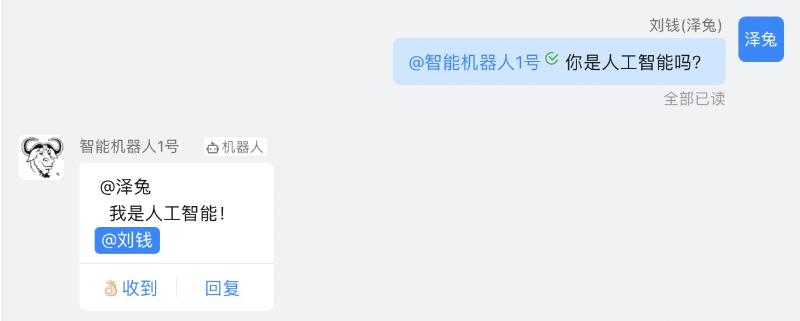
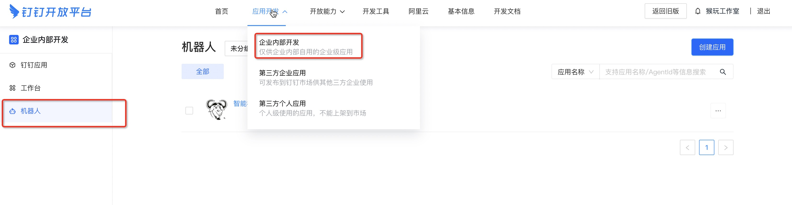
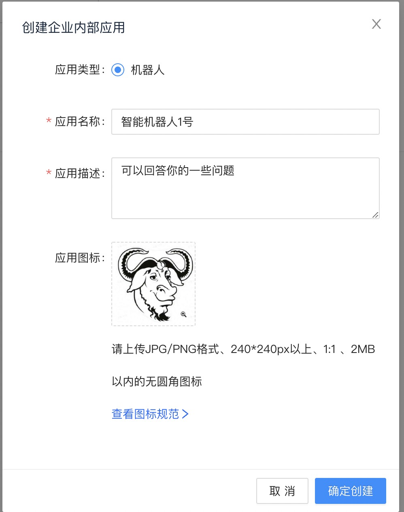
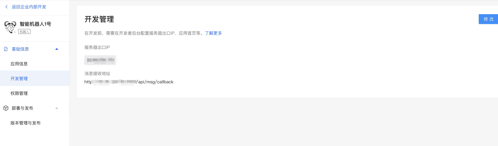
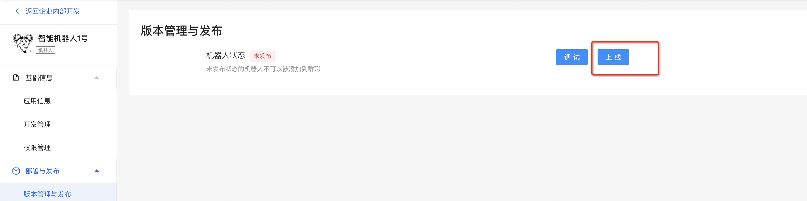
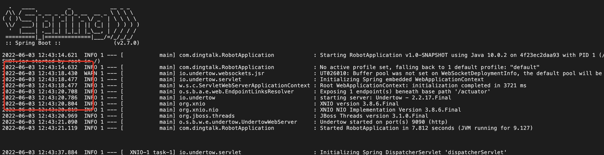
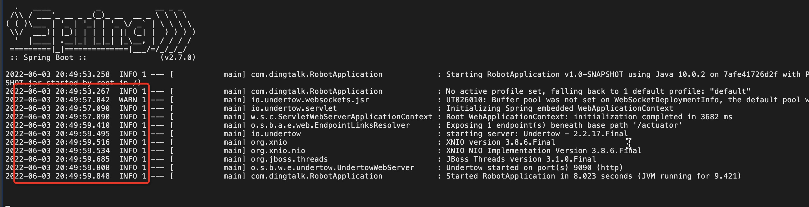

## 钉钉群聊实现@人接入与代码开发

近期要做一个功能，在钉钉群里@机器人可以实现回答提问者的一些问题或者简单的对话，甚至可以根据关键字来实现一些业务操作，比如重置密码什么的，实现的效果如下：



那么这样的一个机器人该怎么实现呢？

#### 1、创建一个企业应用机器人

登录钉钉 [开发者后台 (dingtalk.com)](https://open-dev.dingtalk.com/#/) 选择你的组织，如果没有的话，可以自己创建一个，这个问题大家可以自行百度。然后选择企业内部开发，机器人：



接着我们创建机器人，点击右上角创建应用，完善基本信息便可以成功创建一个应用机器人：



创建完成之后，我们可以看到一些该机器人的一些基本信息，包括基础 `AgentId`、`AppKey`、`AppSecret` 等等，这些信息会在之后的一些开发过程中使用到。然后还有一些管理信息，本次我们需要配置的就是开发管理的两个配置项，服务器出口IP可以不用管，是个可选配置，消息接收地址，就是我们开发的要接收群里@我们机器人信息的接口，这样就可以接收到别人对机器人“说”了些什么：



权限管理的话，目前我们没有别的需求，保持默认就好。最后是版本管理与发布，在完成机器人的基本配置和开发之后，我们点击上线便可以实现简单的人机交互了：



到此，我们基本的配置就好了。接下来就是写代码与发布了。

#### 2、写一个接收消息的接口

简单地写一个 `spring-boot` 的Web项目即可，我是简单定义了一个接口，具体的代码逻辑实现在 `DingTalkService` 里：

```java
@RestController
@RequestMapping("api/msg")
public class CallbackController {

    @Autowired
    private DingtalkService dingtalkService;

    @RequestMapping("callback")
    public void callback(HttpServletRequest request, @RequestBody JSONObject requestBody) {
        dingtalkService.callback(request, requestBody);
    }
}
```

我们在机器人后台配置的消息接收地址便是 `api/msg/callback` ，其实叫 `receive` 可能更好。

*注：文档上说接收消息的接口是POST请求，但我最开始试了，钉钉还是会使用GET请求调用一次，就典型的不靠谱，估计是为了校验接口是否畅通，所以这里的接口我写成了`RequestMapping`随便你用哪种请求来调用。*

钉钉调用过来的消息请求体结构如下，其中，我们本次需求所用的数据是 `sessionWebhook` 用来回复，`senderStaffId` 即为@机器人的那个群成员，回复的时候还要@回去的，`text.content` 的内容便是我们接收到的文本内容，需要我们处理和解析，并根据此内容进行回复的：

```json
{
    "conversationId": "xxx",
    "atUsers": [
        {
            "dingtalkId": "xxx",
            "staffId":"xxx"
        }
    ],
    "chatbotCorpId": "dinge8a565xxxx",
    "chatbotUserId": "$:LWCP_v1:$Cxxxxx",
    "msgId": "msg0xxxxx",
    "senderNick": "杨xx",
    "isAdmin": true,
    "senderStaffId": "user123",
    "sessionWebhookExpiredTime": 1613635652738,
    "createAt": 1613630252678,
    "senderCorpId": "dinge8a565xxxx",
    "conversationType": "2",
    "senderId": "$:LWCP_v1:$Ff09GIxxxxx",
    "conversationTitle": "机器人测试-TEST",
    "isInAtList": true,
    "sessionWebhook": "https://oapi.dingtalk.com/robot/sendBySession?session=xxxxx",
    "text": {
        "content": " 你好"
    },
    "msgtype": "text"
}
```

下面看下`DingTalkService.callback(HttpServletRequest request, JSONObject requestBody)` 里面的实现，第一步获取到请求头里的签名以及时间戳，然后进行校验：

```java
    @Override
    public void callback(HttpServletRequest request, JSONObject requestBody) {
        log.info("【请求体参数】：{}", JSON.toJSONString(requestBody));
        // 获取到请求头里的签名、时间戳
        String postSign = request.getHeader("Sign");
        long postTimestamp = Long.parseLong(request.getHeader("Timestamp"));
        log.info("post sign is: {}", postSign);
        log.info("post timestamp is: {}", postTimestamp);

        // 获取当前时间戳
        long currentTimeStamp = System.currentTimeMillis();
        log.info("current timestamp is: {}", currentTimeStamp);
        // 生成签名
        String sign = getSign(postTimestamp);

        long oneHourTimestamp = 3600000;
        // 这里用来校验接收到的消息是否过期（超过1个小时）或者请求的签名不对
        if (currentTimeStamp - postTimestamp >= oneHourTimestamp || !StringUtils.equals(sign, postSign)) {
            log.error("Time expired or sign wrong.");
            return;
        }
        // 发送消息
        sendMsg(requestBody);
    }
```

然后就是发送消息，因为是演示，所以这里使用了最简单的文本消息格式发送，钉钉机器人发送的消息支持文本、MarkDown，以及ActionCard三种类型的消息，感兴趣的可以自己动手尝试。下面是发送消息的代码：

```java
    public void sendMsg(JSONObject requestBody) {
        try {
            // 这里我创建了一个实体类来接收转换所需的数据，如果你不想，也可以直接解析这个JSONObject
            ReceiveMsg receiveMsg = JSON.parseObject(JSON.toJSONString(requestBody), ReceiveMsg.class);
            // 获取到sessionWebhook
            String sessionWebhook = receiveMsg.getSessionWebhook();
            // 获取到senderStaffId
            String userId = receiveMsg.getSenderStaffId();
            // 获取到接收到的内容
            String receiveContent = receiveMsg.getText().getContent();
            // 定义要发送的内容
            String sendContent = "请说点什么吧！";
            if (StringUtils.isNotBlank(receiveContent)) {
                sendContent = aiContent(receiveContent);
            }
            // 根据sessionWebhook构建一个客户端
            DingTalkClient client = new DefaultDingTalkClient(sessionWebhook);
            // 构建请求参数
            OapiRobotSendRequest request = new OapiRobotSendRequest();
            // 类型使用"text"
            request.setMsgtype("text");
            OapiRobotSendRequest.Text text = new OapiRobotSendRequest.Text();
            // 设置文本类型的消息内容
            text.setContent(sendContent);
            request.setText(text);
            // 选择你要@的成员，这里设置isAtAll为false，即不@全员
            OapiRobotSendRequest.At at = new OapiRobotSendRequest.At();
            at.setIsAtAll(false);
            at.setAtUserIds(Collections.singletonList(userId));
            request.setAt(at);
            // 执行请求，这样就可以@成员，并发送消息了
            client.execute(request);
        } catch (ApiException e) {
            log.error("Failed to send msg", e);
        }
    }
```

价值上亿的人工智能核心代码（雾）：

```java
    private String aiContent(String content) {
        if (StringUtils.isBlank(content)) {
            return "";
        }
        content = content.replace("你", "");
        content = content.replace("我", "");
        content = content.replace("吗", "");
        content = content.replace("?", "!");
        content = content.replace("？", "！");
        return content;
    }
```

到此，整个项目的核心代码便开发完成了，接着我们把这个项目发布到服务器就行了。

#### 3、发布项目

该项目是使用 `Docker` 进行发布和运行的，那么需要写一个 `Dockerfile` 来构建镜像，然后运行起来，这一部分在后续的文章再做介绍。

下面是我的 `Dockerfile`：

```dockerfile
FROM  maven:3.6.3-jdk-8-slim as build
WORKDIR /srv

COPY . /srv
RUN cd /srv && mvn clean install -Dmanven.test.skip=true

FROM openjdk:10.0.2-jre-slim

EXPOSE 9090

COPY --from=build /srv/target/*.jar /srv/
ENTRYPOINT ["java", "-server", "-jar", "/srv/dingtalk-robot-demo-1.0-SNAPSHOT.jar"]
```

这里只分享一个我遇到的问题，在项目启动之后，我发现日志的时间不太对，比如现在是`2022-06-03 20:43:21`。运行起来的容器的时区居然是伦敦时区（UTC时间），日志时间是 `2022-06-03 12:43:21`，这并不是我想要的，我想要上海时区啊，那么该怎么做呢？



##### 3.1、启动容器的时候，带上时区参数

使用 `-e` 参数来设置容器的时区：

````
docker run -e TZ=Asia/Shanghai -p 9090:9090 --name dingtalk-robot1 dingtalk-robot:v1
````

这样运行结果如下：



##### 3.2、构建镜像的时候，设置时区，即 `Dockerfile` 里设置好

另外一种方法就是在 `Dockerfile` 里写好，这样在构建镜像的时候就已经设置好了时区（我的容器里的操作系统是 Debian，大家可以自行选择对应的系统设置时区的方法）：

```dockerfile
FROM  maven:3.6.3-jdk-8-slim as build
WORKDIR /srv

COPY . /srv
RUN cd /srv && mvn clean install -Dmanven.test.skip=true

FROM openjdk:10.0.2-jre-slim

# 设置时区
ENV TZ=Asia/Shanghai \
    DEBIAN_FRONTEND=noninteractive

RUN ln -fs /usr/share/zoneinfo/${TZ} /etc/localtime \
    && echo "${TZ}" > /etc/timezone \
    && dpkg-reconfigure --frontend noninteractive tzdata \
    && rm -rf /var/lib/apt/lists/*

EXPOSE 9090

COPY --from=build /srv/target/*.jar /srv/
ENTRYPOINT ["java", "-server", "-jar", "/srv/dingtalk-robot-demo-1.0-SNAPSHOT.jar"]
```

这样我们再去构建镜像并运行，时区也就是我们设置的上海时区了：

```
docker build -t dingtalk-robot:v2 . 
```

```
docker run -p 9090:9090 --name dingtalk-robot2 dingtalk-robot:v2
```


#### 总结

本文主要跟大家分享了如何开发一个钉钉的群聊机器人，并实现@成员回复。除了文本类型之外，还支持 MarkDown，ActionCard 类型的消息。另外，还跟大家分享了一下如何解决容器里的时区问题。


#### 链接

- 钉钉文档：https://open.dingtalk.com/document/group/robot-message-type-staff-information-in-an-enterprise
- Docker 时区调整方案：https://cloud.tencent.com/developer/article/1626811
- 项目地址：https://github.com/lq920320/dingtalk-robot-demo


