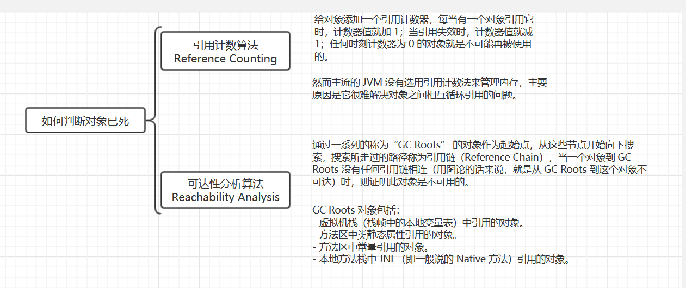
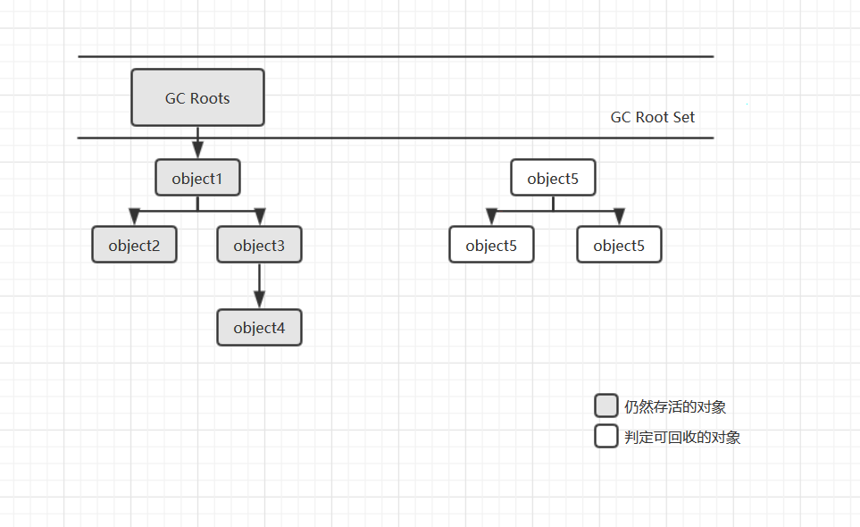

## 《深入理解Java虚拟机》（三）：对象存活状态

> ==============
>
> ### 读书笔记系列
>
> ==============

接下来的几篇笔记主要介绍一下我们最常谈论的垃圾回收以及内存分配策略。Java 技术体系中所提倡的自动内存管理最终可以归纳为自动化地解决了两个问题：给对象分配内存以及回收分配给对象的内存。既然是“自动化”，那为什么还要去了解呢？答案很简单：当需要排查各种内存溢出、内存泄露问题时，当垃圾收集成为系统达到更高并发量的瓶颈时，我们就需要对这些“自动化”的技术实施必要的监控和调节。本篇我们先从如何判断 Java 对象已死开始。

图1. 如何判断对象已死

图2. JDK 1.2 之后引用的分类

### 对象已死吗？

在堆里面存放着 Java 世界中几乎所有的对象实例，垃圾回收器在堆进行回收前，第一件事就是确定这些对象的“存活”状态。我们称不可能再被任何途径使用的对象为“死去”的对象。

#### 1. 引用计数算法

给对象添加一个引用计数器，每当有一个对象引用它时，计数器值就加 1；当引用失效时，计数器值就减 1；任何时刻计数器为 0 的对象就是不可能再被使用的。

客观地说，引用计数算法（Reference Counting）的实现简单，判定效率也很高。但是，至少主流的 Java 虚拟机里面没有选用引用计数算法来管理内存，其中最主要的原因是它很难解决对象之间相互循环引用的问题。

比如：对象 `objA` 和对象 `objB` 都有字段 `instance`，赋值令 `objA.instance = objB` 及 `objB.instance = objA`，除此之外，这两个对象再无任何引用，实际上这两个对象已经不可能再被访问，但是它们因为互相引用着对方，导致它们的引用计数都不为 0，于是引用计数算法无法通知 `GC` 收集器回收它们。

#### 2. 可达性分析算法

通过一系列的称为“GC Roots” 的对象作为起始点，从这些节点开始向下搜索，搜索所走过的路径称为引用链（Reference Chain），当一个对象到 GC Roots 没有任何引用链相连（用图论的话来说，就是从 GC Roots 到这个对象不可达）时，则证明此对象是不可用的。

可作为 GC Roots 的对象包括以下几种：

-  虚拟机栈（栈中的本地变量表）中引用的对象
- 方法区中静态属性引用的对象
- 方法区中常量引用的对象
- 本地方法栈中 `JNI` （即一般说的 `Native` 方法）引用的对象

#### 3. 引用介绍 

无论是通过引用计数算法判断对象的引用数量，还是通过可达性分析算法判断对象的引用链是否可达，判定对象是否存活都与“引用”有关。在 JDK 1.2 前：如果 `reference` 类型的数据中存储的数值代表的是另外一块内存的起始地址，就称这块内存代表着一个引用。所以此时对象只有被引用和没被引用两个状态。我们希望描述这样一类对象：当内存空间还足够时，则能保留在内存之中；如果内存空间在进行垃圾收集后还是非常紧张，则可以抛弃这些对象。很多系统的缓存功能都符合这样的应用场景。

在 JDK 1.2 后，Java 对引用的概念进行了扩充，将引用分为强引用（Strong Reference）、软引用（Soft Reference）、弱引用（Weak Reference）、虚引用（Phantom Reference）4 种。

#### 4. 生存还是死亡

即使在可达性分析算法中不可达的对象，也并非是“非死不可”的，这时候他们暂时处于“缓刑”阶段，要真正宣告一个对象死亡，至少要经历两次标记过程：如果对象在进行可达性分析后发现没有与 GC Roots 相连接的引用链，那它将会被第一次标记并且进行一次筛选，筛选的条件是此对象是否有必要执行 `finalize()` 方法。当对象没有覆盖 `finalize()` 方法，或者 `finalize()` 方法已经被虚拟机调用过，虚拟机将这两种情况都视为“没有必要执行”。

如果这个对象被判定为有必要执行 `finazlize()` 方法，那么这个对象将会放置在一个叫做 `F-Queue` 的队列之中，并在稍后由一个虚拟机自动建立的、低优先级的 `Finalizer` 线程去执行它。这里所谓的“执行”是指虚拟机会触发这个方法，但并不承诺会等待它运行结束，这样做的原因是，如果一个对象在 `finalize()` 方法中执行缓慢，或者发生了死循环（更极端的情况），将很可能会导致 `F-Queue` 队列中其他对象永久处于等待，设置导致整个内存回收系统崩溃。`finalize()` 方法是对象逃脱死亡命运的最后一次机会，稍后 GC 会对 `F-Queue` 中的对象进行第二次小规模的标记，如果对象要在 `finalize()` 中成功拯救自己——只要重新与引用链上的任何一个对象建立关联即可，譬如把自己（`this` 关键字）赋值给某个变量或者对象的成员变量，那么在第二次标记时它将被移除出“即将回收”的集合；如果对象这时候还没有逃脱，那基本上它就真的被回收了。

注：任何一个对象的 `finalize()` 方法都只会被系统自动调用一次，如果对象面临下一次回收，它的 `finalize()` 方法不会再次被执行。

#### 5. 回收方法区

方法区（永久代）的垃圾收集主要回收两部分内容：废弃常量和无用的类。

废弃常量：没有任何地方引用的常量值或者字面值。

“无用的类”判定条件：

- 该类所有的实例都已被回收，也就是 Java 堆中不存在该类的任何实例。
- 加载该类的 `ClassLoader` 已被回收。
- 该类对应的 `java.class.Class` 对象没有在任何地方被引用，无法再任何地方通过反射访问该类的方法。

### 总结

如何判断一个对象已死呢？就是没有被任何对象有效引用的情况，即单独的对象便可以为“死亡”状态。借用《海贼王·狂热行动》中的一句台词：在 Java 世界中，一个对象，是注定无法存活的！（*原台词：在大海上，一个人，是注定无法生存的！*）