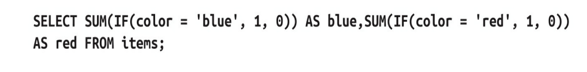

## 高性能MySQL：从回表说起

数据库，可谓是程序员必备技能之一，而 MySQL 应该是全世界应用最广的数据库了，没有之一。那么如何写出一条高性能的 SQL 语句就成了摆在我们面前的第一个问题，今天我们就来读一下 《高性能MySQL》这本书的部分章节，来探讨下如何写出高性能的 SQL 语句。首先，我们先从一个问题说起：什么是回表？

### 什么是回表？

MySQL 中的索引有很多不同的分类方式，可以按照数据结构分，可以按照逻辑角度分，也可以按照物理存储分，其中，按照物理存储方式，可以分为 聚簇索引 和 非聚簇索引。

我们日常所说的主键索引，其实就是**聚簇索引**（Clustered Index）；主键索引之外，其他的都称之为非主键索引，非主键索引也被称为**二级索引**（Secondary Index），或者叫作辅助索引。

对于 MySQL 的索引结构，是一棵 B+ 树，就像下面聚簇索引的结构：


其中，节点是具体的索引值，叶子节点包含了一条记录的全部数据。

而二级索引的数据结构，同样也是一棵 B+ 树，节点是索引值，不同的是叶子节点存储的并不是完整的记录数据，而只是二级索引列+主键列的值

所以，当我们的 SQL 语句，使用了二级索引的条件，并且所查询的列不在二级索引的叶子节点上时，就需要再使用 **主键索引** 去查询一次完整的数据，也就是我们所说的**回表操作**。

为了查询语句性能的提升，我们应该是尽量避免回表操作的，不过如果无法避免，下面的内容也许会对你有一点启发。

### 高性能的索引策略

**索引**，对于良好的查询性能起着至关重要的作用，尤其是当表中的数据越来越大的时候，索引对性能的影响愈发重要。

索引可以包含一列或多列的值。如果索引包含多列，那么列的顺序也十分重要，因为 MySQL 只能有效地使用索引的最左前缀列。创建一个包含两列的索引，和创建两个只包含一列的索引是大不相同的。

#### 前缀索引和索引的选择性

有时候为了提升索引的性能，同时也节省索引空间，可以只对字段的前一部分字符进行索引，称为 **前缀索引**，这样做的缺点是，会降低索引的选择性。

**索引的选择性** 是指，不重复的索引值（也称为基数，cardinality）和数据表的记录总数（＃T）的比值，范围从 `1/＃T` 到 `1` 之间。索引的选择性越高则查询效率越高，因为选择性高的索引可以让MySQL在查找时过滤掉更 多的行。唯一索引的选择性是 1，这是最好的索引选择性，性能也是最好的。

一般情况下，列前缀的选择性也是足够高的，足以满足查询性能，对于 BLOB、TEXT或者很长的VARCHAR类型的列，必须使用前缀索引，因 为MySQL并不支持对这些列的完整内容进行索引。这里的关键点在于，既要选择足够长的前缀以保证较高的选择性，同时 又不能太长（以便节约空间）。前缀应该足够长，以使得前缀索引的选 择性接近于索引整列。换句话说，前缀的“基数”应该接近于完整列的“基数”。为了确定前缀的合适长度，需要找到最常见的值的列表，然后和最常见的前缀列表进行比较。

比如说，我们在对一个用户表中的一个地址信息进行查询时，可以对地址信息创建前缀索引，假设你的用户都是上海市的，即“上海市xx区xx街道”，显然对“上海市”创建前缀索引，那是非常不合适的，要找到不重复最多的长度创建。

前缀索引是一种能使索引更小、更快的有效办法，但它也有缺点： MySQL 无法使用前缀索引做 `ORDER BY` 和 `GROUP BY` 操作，也无法使 用前缀索引做覆盖扫描。

#### 多列索引

很多人对多列索引的理解不够，一个常见的错误就是，为每列创建独立的索引，或者按照错误的顺序创建多列索引。

在多列上独立地创建多个单列索引，在大部分情况下并不能提高 MySQL 的查询性能。MySQL 引入了一种叫“索引合并”（index merge） 的策略，它在一定程度上可以使用表中的多个单列索引来定位指定的行。在这种情况下，查询能够同时使用两个单列索引进行扫描，并将结果进行合并。这种算法有三个变种：`OR` 条件的联合（union），`AND` 条件的相交（intersection），组合前两种情况的联合及相交。下面的查询就使用了两个索引扫描的联合，通过 `EXPLAIN` 中的 `Extra` 列可以看到这点：


索引合并策略有时候效果非常不错，但更多的时候，它说明了表中的索引建得很糟糕：

- 当优化器需要对多个索引做相交（相交操作是使用“索引合并”的 一种情况，另一种是做联合操作）操作时（通常有多个 `AND` 条件），通常意味着需要一个包含所有相关列的多列索引，而不是多个独立的单列索引。

- 当优化器需要对多个索引做联合操作时（通常有多个 `OR` 条件），通常需要在算法的缓存、排序和合并操作上耗费大量 CPU 和内存资源，尤其是当其中有些索引的选择性不高，需要合并扫描返回的大量数据的时候。

- 更重要的是，优化器不会把这些操作计算到“查询成本”（cost） 中，优化器只关心随机页面读取。这会使得查询的成本被“低估”，导致该执行计划还不如直接进行全表扫描。

如果在EXPLAIN中看到有索引合并，那么就应该好好检查一下查询语 句的写法和表的结构，看是不是已经是最优的，要尽量避免优化器使用包含索引合并的执行计划。

而对于 `选择合适的索引顺序` ，有一条重要的经验法则：将选择性最高的列放到索引最前列。

当不需要考虑排序和分组时，将选择性最高的列放在前面通常是很好的。这时索引的作用只是优化查询语句中的WHERE条件。在这种情况下，按这个原则设计的索引确实能够最快地过滤出需要的行，对于在 WHERE 子句中只使用了索引部分前缀列的查询来说，选择性也更高。 然而，性能不只依赖于所有索引列的选择性（整体基数），也和查询条件的具体值有关，也就是和值的分布有关。可能需要根据那些运行频率最高的查询来调整索引列的顺序，让这种情况下索引的选择性最高。

*经验法则和推论在多数情况下是有用的，但要 注意，不要假设平均情况下的性能也能代表特殊情况下的性能，特殊情况可能会摧毁整个应用的性能。*

最后，尽管关于选择性和基数的经验法则值得去研究和分析，但一定别 忘了查询子句中的排序、分组和范围条件等其他因素，这些因素可能会 对查询的性能造成非常大的影响。

#### 聚簇索引

**聚簇索引** 并不是一种单独的索引类型，而是一种数据存储方式，具体的细节依赖于其实现方式。当表有聚簇索引时，它的数据行实际上存放在索引的叶子页（leaf page）中。术语“聚簇”表示数据行和相邻的键值紧凑地存储在一起。因为无法同时把数据行存放在两个不同的地方，所以一个表只能有一个聚簇索引。

因为是存储引擎负责实现索引，因此，不是所有的存储引擎都支持聚簇索引。本文我们主要关注 `InnoDB` ，但是这里讨论的原理对于任何支持聚簇索引的存储引擎都是适用的。

下图展示了聚簇索引中的记录是如何存放的。注意，叶子页包含了一条记录的全部数据，但是节点页只包含了索引列。在这个例子中，索引列包含的是整数值：


有些数据库服务器允许你选择用于聚簇的索引，但是MySQL内置的存储引擎都不支持这个特性。InnoDB 根据主键聚簇数据。这意味着图中所示的“索引列”就是主键列。

如果你没有定义主键，InnoDB 会选择一个唯一的非空索引代替。如果没有这样的索引，InnoDB 会隐式定义一个主键（比如 `ID` ）来作为聚簇索引。这样做的缺点在于，所有需要使用这种隐藏主键的表都依赖一个单点的“自增值”，这可能会导致非常高的锁竞争，从而出现性能问题。

聚集的数据有一些重要的优点：

- 你可以把相互关联的数据保存在一起。

- 数据访问更快。聚簇索引将索引和数据保存在同一个 B树 中， 因此从聚簇索引中获取数据通常比在非聚簇索引中查找要快。

- 使用覆盖索引扫描的查询可以直接使用页节点中的主键值。

当然也有一些缺点：

- 聚簇数据最大限度地提高了 I/O 密集型应用的性能，但如果数据全部都放在内存中，则访问的顺序就没那么重要了，聚簇索引也就 没什么优势了。

- 插入速度严重依赖于插入顺序。按照主键的顺序插入行是将数据加载到 `InnoDB` 表中最快的方式。但如果不是按照主键的顺序加载数据，那么在加载完成后最好使用 `OPTIMIZE TABLE` 命令重新组织一下表。

- 更新聚簇索引列的代价很高，因为它会强制 `InnoDB` 将每个被更新的行移动到新的位置。

- 基于聚簇索引的表在插入新行，或者主键被更新导致需要移动行的时候，可能面临页分裂（page split）的问题。当行的主键值要求必须将这一行插入某个已满的（数据）页中时，存储引擎会将该页分裂成两个页面来容纳该行，这就是一次页分裂操作。页分裂会导致表占用更多的磁盘空间。

- 聚簇索引可能导致全表扫描变慢，尤其是行比较稀疏，或者由于页分裂导致数据存储不连续的时候。

- 二级索引（非聚簇索引，普通索引）可能比想象中的要更大，因为二级索引的叶子节点包含了引用行的主键列。

- 二级索引访问需要两次索引查找，而不是一次，即我们前文所说的“回表操作”。

#### 覆盖索引

一般我们都会根据查询的 `WHERE` 条件来创建合适的索引，不过这只是索引优化的一个方面。设计优秀的索引应该考虑到整个查询，而不单是 `WHERE` 条件部分。索引的确是一种高效找到数据的方式，但是如果 MySQL 还可以使用索引直接获取列的数据，这样就不再需要读取数据行了。如果索引的叶子节点中已经包含要查询的数据，那么还有什么必要再回表查询呢？如果一个索引包含（或者说覆盖）所有需要查询的字段的值，我们就称之为**覆盖索引**。需要注意的是，只有 B树 索引可以用于覆盖索引。

覆盖索引是非常有用的工具，能够极大地提高性能。试想一下，如果不需要回表：

- 索引条目通常远小于数据行大小，所以如果只需要读取索引，那 么 MySQL 就会极大地减少数据访问量。

- 因为索引是按照列值的顺序存储的（至少在单页内如此），所以对于 I/O 密集型的范围查询会比随机从磁盘读取每一行数据的 I/O 要少得多。

- 由于 `InnoDB` 的聚簇索引的特点，覆盖索引对 `InnoDB` 表特别有用。`InnoDB` 的二级索引在叶子节点中保存了记录的主键值，所以如果二级索引能够覆盖查询，则可以避免对主键索引的二次查询。

当执行一个被索引覆盖的查询（也叫作索引覆盖查询）时，在 `EXPLAIN` 的 `Extra` 列可以看到 “Using index” 的信息。例如，表 `sakila.inventory` 有一个多列索引（`store_id`，`film_id`）。MySQL 如果只需访问这两列，就可以使用这个索引做覆盖索引，如下所示：


在大多数存储引擎中，索引只能覆盖那些只访问索引中部分列的查询， 不过，可以更进一步优化 `InnoDB` 。回想一下，`InnoDB` 的二级索引的叶子节点都包含了主键的值，这意味着 `InnoDB` 的二级索引可以有效地利用这些“额外”的主键列来覆盖查询。

例如，`sakila.actor` 表使用 `InnoDB` 存储引擎，并在 `last_name` 字段有二级索引，虽然该索引的列不包括主键列 `actor_id` （但是二级索引的叶子节点是包含主键值的），但下面的查询也能够使用索引来对 `actor_id` 列做覆盖查询：


#### 使用索引扫描来排序

MySQL有两种方式可以生成有序的结果：通过排序操作，或者按索引 顺序扫描。如果在 `EXPLAIN` 的输出结果中，`type` 列的值为“index”，则说明 MySQL 使用了索引扫描来做排序（注意，不要和 `Extra` 列的“Using index”搞混）。

扫描索引本身是很快的，因为只需要从一条索引记录移动到紧接着的下 一条记录。但如果索引不能覆盖查询所需的全部列，那么就不得不每扫描一条索引记都回表查询一次对应的记录。这基本上都是随机 I/O， 因此按索引顺序读取数据的速度通常要比顺序地全表扫描慢，尤其是在 I/O 密集型的应用负载上。

MySQL可以使用同一个索引既满足排序，又用于查找行。如果可能的话，设计索引时应该尽可能地同时满足这两项任务，这样是最好的。

可以利用索引排序的情况：

- 当索引的顺序和 `ORDER BY` 子句的顺序完全一致，并且所有列的排序方向（倒序或正序）都一样时，MySQL 才能使用索引来对结果做排序。

- 如果查询需要联接多张表，则只有当 `ORDER BY` 子句引用的字段全部在第一个表中时，才能使用索引排序

- `ORDER BY` 子句和查找型查询的限制是一样的：需要满足索引的最左前缀的要求，否则， MySQL需要执行排序操作，而无法利用索引排序。

- 有一种特殊情况，如果前导列为常量的时候，`ORDER BY` 子句中的列也可以不满足索引的最左前缀的要求。如果在 `WHERE` 子句或者 `JOIN` 子句中将这些列指定为了常量，就可以“填补”索引字段的间隙了。

一些不能使用索引作排序的查询：

- 使用了两种不同的排序方向，但是索引中的列都是按正序排序的。

- 查询的 `ORDER BY` 子句中，引用了一个不在索引中的列。

- 查询的 `WHERE` 和 `ORDER BY` 中的列无法组合成索引的最左前缀。

- 查询在索引列的第一列上是范围条件，所以 MySQL 无法使用索引的其余列。

- 列上有多个等于条件（`IN` 语句）。对于排序来说，这也是一种范围查询。

#### 冗余和重复索引

当你执意要在同一列创建多个索引的时候，MySQL 虽然会抛出一个警告，但不回阻止你，但这样重复的索引不仅影响性能，同时也会造成磁盘空间的浪费。

**重复索引** 是指在相同的列上按照相同顺序创建的相同类型的索引。应该避免创建这样的重复索引，发现以后应该立即移除。

**冗余索引** 和重复索引有一些不同。如果创建了索引（A，B），再创建索引（A），那么 （A）就是冗余索引，因为这只是前一个索引的前缀索引，因此， 索引（A，B）也可以当作索引（A）来使用（这种冗余只是对 B树 索引来说的）。但是如果再创建索引（B，A），则不是冗余索引，索引 （B）也不是，因为B不是索引（A，B）的最左前缀列。另外，如果新建的是其他不同类型的索引（例如，哈希索引或者全文索引），那么无论覆盖了哪些索引列，也不会是 B树 索引的冗余索引。

大多数情况下都不需要冗余索引，应该尽量扩展已有的索引而不是创建新的索引。但有时候出于性能方面的考虑也需要冗余索引，因为扩展已有的索引会导致其变得太大，从而影响其他使用该索引的查询的性能。**这个要视情况而定**。

表中的索引越多，插入的速度越慢。一般来说，增加新索引会导致 `INSERT`、`UPDATE`、`DELETE` 等操作的速度变慢，特别是当新增索引后达到了内存瓶颈的时候。解决冗余索引和重复索引的方法很简单，删除这些索引就可以了，但首先要做的是找出这样的索引。

#### 未使用的索引

除了冗余索引和重复索引，可能还会有一些服务器永远不用的索引。这 样的索引完全是累赘，建议删除。

找到未使用索引的最好办法就是使用系统数据库 `performance_schema` 和 `sys`。在 `sys` 数据库中，在 `table_io_waits_summary_by_index_usage` 视图中可以非常简单地知道哪些索引从来没有被使用过。

### 查询性能优化

同样都是写 SQL，为什么他的查询语句快，我的慢，他的效率高，我的低呢？我应该从哪些方面考虑问题呢？

这一节我们就来解答一下这个问题，会从查询设计的一些基本原则开始 —— 这也是在发现查询效率不高的时候首先需要考虑的因素。然后会介绍一些更深的查询优化的技巧， 并会介绍一些MySQL优化器内部的机制。我们将展示MySQL是如何执 行查询的，你也将学会如何去改变一个查询的执行计划。最后，我们要看一下 MySQL 优化器在哪些方面做得还不够，并探索查询优化的模式，以帮助MySQL更有效地执行查询，避开它的弱点。

#### 为什么查询会变慢？

通常来说，查询的生命周期大致可以按照如下顺序来看：从客户端到服务器，然后在服务器上进行语法解析，生成执行计划，执行，并给客户端返回结果。其中，“执行”可以被认为是整个生命周期中最重要的阶段，这其中包括大量为了检索数据对存储引擎的调用以及调用后的数据处理，包括排序、分组等。（*当然，这个生命周期不一定完整。*）

在完成这些任务的时候，查询需要在不同的地方花费时间，包括网络、CPU计算、生成统计信息和执行计划、锁等待（互斥等待）等操作，尤其是向底层存储引擎检索数据的调用操作，这些调用需要在内存操作、CPU 操作和内存不足时导致的 I/O 操作上消耗时间。根据存储引擎不同，可能还会产生大量的上下文切换以及系统调用。

在每一个消耗大量时间的查询案例中，我们都能看到一些不必要的操作、某些操作被额外地重复了很多次、某些操作执行得太慢等。优化查询的目的就是减少和消除这些操作所花费的时间。

#### 慢查询基础：优化数据访问

这里有一个查询语句：

```sql
SELECT * FROM cities;
```

当这张表里只有中国的市级城市时，那查询起来还是很快的，但是当我们把全世界的城市都放进去之后，那查询速度就不一定了。所以说，当一条查询性能很差，最常见的原因是访问的数据太多。

某些查询可能不可避免地需要筛选大量数据，但这并不常见。大部分性能低下的查询都可以通过减少访问的数据量的方式进行优化。对于低效的查询，我们发现通过下面两个步骤来分析总是很有效：

- 确认应用程序是否在检索大量且不必要的数据。比如上面的查询语句，是否我只需要查询前 100（访问了太多行） 个城市，或许只需要查询城市名称（访问了太多列）就行了。

- 确认MySQL服务器层是否在分析大量不需要的数据行。

##### 是否向数据库请求了不需要的数据

比如下面的一些典型案例：

- **查询了不需要的记录**。一个常见的错误是，常常会误以为 MySQL 只会返回需要的数据，实际上 MySQL 却是先返回全部结果集再进行计算。一些开发者习惯使用这样的技术，先使用SELECT语句查询大量的结果，然后获取前面的N行后关闭结果集（例如，在新闻网站中取出100条记录，但是只是在页面上显示前面10条）。他们认为 MySQL 会执行查询，并只返回他们需要的10条数据，然后停止查询。实际情况是，MySQL 会查询出全部的结果集，客户端的应用程序会接收全部的结果集数据，然后抛弃其中大部分数据。最简单有效的解决方法就是在这样的查询后面加上LIMIT子句。

- **多表联接时返回全部列**。

- **总是取出全部列**。每次看到 `SELECT *` 就要抵制一下。当然，查询返回超过需要的数据也不总是坏事。在许多案例中，人们会告诉我们，这种有点浪费数据库资源的方式可以简化开发，因为能提高相同代码片段的复用性，如果清楚这样做对性能的影响，那么这种做法也是值得考虑的。如果应用程序使用了某种缓存机制，或者有其他考虑，获取超过需要的数据也可能有其好处，但不要忘记这样做的代价是什么。获取并缓存所有的列的查询，相比多个独立的只获取部分列的查询可能更有好处。

- **重复查询相同的内容**。如果你不够小心，很容易出现这样的错误 —— 不断地重复执行相同的查询，然后每次都返回完全相同的数据。比较好的方案是，当初次查询的时候将这个数据缓存起来，需要的时候从缓存中取出，这样性能显然会更好。

##### MySQL 是否在扫描额外的记录

对于 MySQL 来说，最简单的衡量查询开销的三个指标如下：

- 响应时间

- 扫描的行数

- 返回的行数

没有哪个指标能够完美地衡量查询的开销，但它们大致反映了 MySQL 在内部执行查询时需要访问多少数据，并可以大概推算出查询运行的时间。这三个指标都会被记录到 MySQL 的慢日志中，所以检查慢日志记录是找出扫描行数过多的查询的好办法。

**响应时间**

**响应时间**是两部分之和：服务时间和排队时间。虽然表面上不够精确，但确实也可以反映一些问题。**服务时间** 是指数据库处理这个查询真正花了多长时间。**排队时间** 是指服务器因为等待某些资源而没有真正执行查询的时间 —— 可能是等 I/O 操作完成，也可能是等待行锁，等等。

概括地说，了解这个查询需要哪些索引以及它的执行计划是什么，然后计算大概需要多少个顺序和随机 I/O，再用其乘以在具体硬件条件下一次 I/O 的消耗时间。最后把这些消耗都加起来，就可以获得一个大概参考值来判断当前响应时间是不是一个合理的值。

**扫描行数和返回行数**

理想情况下扫描的行数和返回的行数应该是相同的，但实际中这种“美事”并不多。例如，在做一个联接查询时，服务器必须要扫描多行才能 生成结果集中的一行。扫描的行数与返回的行数的比率通常很低，一般 在1:1到10:1之间，不过有时候这个值也可能非常非常大。

**扫描的行数和访问类型**

`EXPLAIN` 语句中的 `type` 列反映了访问类型。访问类型有很多种，从全表扫描到索引扫描、范围扫描、唯一索引查询、常数引用等。这里列出的这些，速度从慢到快，扫描的行数从多到少。你不需要记住这些访问类型，但需要明白扫描表、扫描索引、范围访问和单值访问的概念。

如果你没办法找到合适的访问类型，那么最好的解决办法通常就是增加 一个合适的索引。

一般地，MySQL 能够使用如下三种方式应用WHERE条件，从好到坏依次为：

- 在索引中使用 `WHERE` 条件来过滤不匹配的记录。这是在存储引擎层完成的。

- 使用索引覆盖扫描（在 `Extra` 列中出现了 `Using index` ）来返回记录，直接从索引中过滤不需要的记录并返回命中的结果。这是在 MySQL服务器层完成的，无须再回表查询记录。

- 从数据表中返回数据，然后过滤不满足条件的记录（在 `Extra` 列中出现`Using where` ）。这在 MySQL 服务器层完成，MySQL 需要先从数据表中读出记录然后过滤。

不幸的是，MySQL 不会告诉我们生成结果实际上需要扫描多少行数据，而只会告诉我们生成结果时一共扫描了多少行数据。扫描的行中的大部分都很可能是被 `WHERE` 条件过滤掉的，对最终的结果集并没有贡献。如果发现查询需要扫描大量的数据但只返回少数行，那么通常可以尝试下面的技巧去优化它：

- 使用索引覆盖扫描，把所有需要用的列都放到索引中，这样存储引擎无须回表获取对应行就可以返回结果了。

- 改变库表结构。例如，使用单独的汇总表。

- 重写这个复杂的查询，让MySQL优化器能够以更优化的方式执行这个查询。

### 重构查询的方式

在优化有问题的查询语句时，可以将查询转换为返回相同结果的等价形式，以获得更好的性能。但是，如果可以获得更好的效率，还应该考虑重写查询以检索不同的结果。通过修改应用代码和查询，最终达到一样的目的。

#### 一个复杂查询还是多个简单查询

设计查询的时候，一个需要考虑的重要问题是，是否需要将一个复杂的查询分成多个简单的查询。在传统实现中，总是强调需要数据库层完成尽可能多的工作，这样做的逻辑在于以前人们总是认为网络通信、查询解析和优化是一件代价很高的事情。

在其他条件都相同的时候，使 用尽可能少的查询当然是更好的。但是有时候，将一个大查询分解为多 个小查询是很有必要的。别害怕这样做，好好衡量一下这样做是不是会 减少工作量。

不过，在设计应用的时候，如果在一个查询能够胜任时还将其写成多个独立的查询是不明智的。*当然，这也是需要视具体情况而定的，比如复杂且耗时的联表查询。*

#### 切分查询

有时候对于一个大查询，我们需要“分而治之”，将大查询切分成小查询，每个查询的功能完全一样，只完成一小部分，每次只返回一小部分查询结果。

比如一次删除一万行数据一般来说是一个比较高效而且对服务器影响最小的做法（如果是事务型引擎，很多时候小事务能够更高效）。同时，需要注意的是，如果每次删除数据后，都暂停一会儿再做下一次删除，也可以将服务器上原本一次性的压力分散到一个很长的时间段中，可以大大降低对服务器的影响，还可以大大减少删除时锁的持有时间。

#### 分解联接查询

很多高性能的应用都会对联接查询进行分解。简单地说，可以对每一个表进行一次单表查询，然后将结果在应用程序中进行联接。

这样做的优点包括：

- 让缓存的效率更高。许多应用程序可以方便地缓存单表查询对应的结果对象。

- 将查询分解后，执行单个查询可以减少锁的竞争。

- 在应用层做联接，可以更容易对数据库进行拆分，更容易做到高性能和可扩展。

- 查询本身的效率也可能会有所提升。使用 `IN()` 代替联接查询，可以让MySQL 按照 `ID` 顺序进行查询，这可能比随机的联接要更高效。

- 可以减少对冗余记录的访问。在应用层做联接查询，意味着对于某条记录应用只需要查询一次，而在数据库中做联接查询，则可能需要重复地访问一部分数据。从这点看，这样的重构还可能会减少网络和内存的消耗。

在有些场景下，在应用程序中执行联接操作会更加有效。比如，当可以缓存和重用之前查询结果中的数据时、当在多台服务器上分发数据时、 当能够使用 `IN()` 列表替代联接查询大型表时、当一次联接查询中多次引用同一张表时。

### 优化特定类型的查询

MySQL 内部的优化器会自动帮助我们优化一些查询语句的性能，它将尝试预测一个查询使用某种执行计划时的成本，并选择其中成本最小的一个，但也会存在一些局限，比如对 `UNION` 语句的限制等。针对一些特定的类型，我们也会有自己的一些技巧和经验在，所以本节只是做一个简单汇总，对于未来的 MySQL 版本或者你的使用场景不一定适用。

#### 优化 `COUNT()` 查询

`COUNT()` 聚合函数，以及如何优化使用了该函数的查询，很可能是 MySQL 中最容易被误解的前 10 个话题之一。`COUNT()` 函数是干嘛的呢？有两种非常不同的作用：它可以统计某列的值的数量，也可以统计行数。在统计列值时要求列值是非空的(不统计 `NULL` )。如果在 `COUNT()` 的括号中指定了列或者列的表达式，则统 计的就是这个表达式有值的结果数。

优化 `COUNT()` 的问题在于如何在一个查询中统计同一列的不同值的数量，以减少查询的语句量。使用 `COUNT()` 而不是 `SUM()` 实现同样的目的，只需要将满足条件设置为真，不满足条件设置为 `NULL` 即可。比如我们把下面的语句一改为语句二：




有时候，某些业务场景并不要求完全精确的统计值，此时可以用**近似值**来代替。比如统计网站的每日活跃用户数，如果不需要那么精确，在统计语句中我们是可以删除类似 `DISTINCT` 这样的约束的。`EXPLAIN` 出来的优化器估算的行数就是一个不错的近似值， 执行 `EXPLAIN` 并不需要真正地去执行查询，所以成本很低。

通常来说，`COUNT()` 查询需要扫描大量的行（意味着要访问大量数据）才能获得精确的结果，因此是很难优化的。除了前面提到的方法，在 MySQL 层面还能做的就只有索引覆盖扫描了。如果这还不够，那就需要考虑修改应用的架构，可以增加类似 `Memcached` 这样的外部缓存系统。不过，可能很快你就会陷入一个熟悉的困境：“快速、精确和实现简单”。三者永远只能满足其二，必须舍掉一个。

#### 优化联接查询

这里提到的有以下几点：

- 确保 `ON` 或者 `USING` 子句中的列上有索引。在创建索引的时候就 要考虑到联接的顺序。

- 确保任何 `GROUP BY` 和 `ORDER BY` 中的表达式只涉及一个表中的列，这样MySQL 才有可能使用索引来优化这个过程。

- 当升级 MySQL 的时候需要注意：联接语法、运算符优先级等其他可能会发生变化的地方。因为以前是普通联接的地方可能会变成笛卡儿积，不同类型的联接可能会生成不同的结果，甚至会产生语法错误。

#### 优化 `LIMIT` 和 `OFFSET` 子句

在系统中需要进行分页操作的时候，我们通常会使用 `LIMIT` 加上偏移量的办法实现，同时加上合适的 `ORDER BY` 子句。如果有对应的索引，通常效率会不错，否则，MySQL 需要做大量的文件排序操作。

一个非常常见又令人头疼的问题是，在偏移量非常大的时候，例如，可能是 `LIMIT 1000,20` 这样的查询，这时 MySQL 需要查询 10,020 条记录然后只返回最后 20 条，前面 10,000 条记录都将被抛弃，这样的代价非常高。如果所有的页面被访问的频率都相同，那么这样的查询平均需要访问半个表的数据。要优化这种查询，要么是在页面中限制分页的数量，要么是优化大偏移量的性能。

优化此类分页查询的一个最简单的办法就是尽可能地使用索引覆盖扫描，而不是查询所有的行。然后根据需要做一次联接操作再返回所需的列。比如（其中 `film_id` 有索引，`description` 字段没有索引）：

```sql
SELECT film_id, description FROM film ORDER BY title LIMIT 50,5;
```

如果这个表很大的话，可以改写为：

```sql
SELECT film.film_id, file.description 
FROM film 
INNER JOIN (
    SELECT film_id FROM film ORDER BY title LIMIT 50,5
) AS lim USING(film_id);
```

这种“延迟联接”之所以有效，是因为它允许服务器在不访问行的情况下检查索引中尽可能少的数据，然后，一旦找到所需的行，就将它们与整个表联接，以从该行中检索其他列。类似的技术也适用于带有 `LIMIT` 子句的联接。

`LIMIT` 和 `OFFSET` 的问题，其实是 `OFFSET` 的问题，它会导致 MySQL 扫描大量不需要的行然后再抛弃掉。如果可以使用书签记录上次取数据的位置，那么下次就可以直接从该书签记录的位置开始扫描，这样就可以 避免使用 `OFFSET`。比如，如果按照租借记录做翻页，那么可以根据最新一条租借记录向回追溯，这种做法可行是因为租借记录的主键是单调增长的。首先使用下面的查询获得第一组结果：

```sql
SELECT * FROM rental 
ORDER BY rental_id DESC LIMIT 20;
```

假设上面的查询返回的是主键为 16,049 到 16,030 的租借记录，那么下一页查询就可以从 16,030 这个点开始：

```sql
SELECT * FROM rental 
WHERE retal_id < 16030 
ORDER BY retal_id DESC LIMIT 20;
```

该技术的好处是无论翻页到多么靠后，其性能都会很好。

其他优化办法还包括使用预先计算的汇总表，或者联接到一个冗余表，冗余表只包含主键列和需要做排序的数据列。

#### 优化 `SQL_CALC_FOUND_ROWS`

分页的时候，另一个常用的技巧是在 `LIMIT` 语句中加上 `SQL_CALC_FOUND_ROWS` 提示(hint)，这样就可以获得去掉 `LIMIT` 以后满足条件的行数，因此可以作为分页的总数。

看起来，MySQL 做了一些非常“高深”的优化，像是通过某种方法预测了总行数。但实际 上，MySQL 只有在扫描了所有满足条件的行以后，才会知道行数，所 以加上这个提示以后，不管是否需要，MySQL 都会扫描所有满足条件的行，然后再抛弃掉不需要的行，而不是在满足 `LIMIT` 的行数后就终止扫描。所以该提示的代价可能非常高。

一个更好的设计是将翻页器具体的页数换成“下一页”按钮，假设每页显示 20 条记录，那么我们每次查询时都是用LIMIT 返回 21 条记录并只显示 20 条，如果第 21条存在，那么就显示“下一页”按钮，否则就说明没有更多的数据，也就无须显示“下一页”按钮了。

另一种做法是先获取并缓存较多的数据，然后每次分页都从这个缓存中获取。这样做可以让应用程序根据结果集的大小采取不同的策略，如果结果集小于 1000，就可以在页面上显示所有的 分页链接，因为数据都在缓存中，所以这样做不会对性能造成影响。如果结果集大于 1000，则可以在页面上设计一个额外的“找到的结果多于 1000 条”之类的按钮。这两种策略都比每次生成全部结果集再抛弃不需要的数据的效率高很多。（类似“查看更多”这种功能）

有时候也可以考虑使用 `EXPLAIN` 的结果中的 `rows` 列的值来作为结果集总数的近似值（实际上，Google 的搜索结果总数也是一个近似值）。当需要精确结果的时候，再单独使用 `COUNT(*)` 来满足需求，这时如果能够使用索引覆盖扫描则通常也会比 `SQL_CALC_FOUND_ROWS` 快得多。

### 总结

在选择索引和编写利用这些索引的查询时，有如下三个原则始终需要记住：

- 单行访问是很慢的，特别是在机械硬盘中存储（SSD的随机I/O要 快很多，不过这一点仍然成立）。如果服务器从存储中读取一个数据块只是为了获取其中一行，那么就浪费了很多工作。最好读 取的块中能包含尽可能多的所需要的行。

- 按顺序访问范围数据是很快的，有两个原因。第一，顺序 I/O不需要多次磁盘寻道，所以比随机 I/O 要快很多（特别是对于机械硬盘）。第二，如果服务器能够按需顺序读取数据，那么就不再需 要额外的排序操作，并且 `GROUP BY`查询也无须再做排序和将行按组进行聚合计算了。

- 索引覆盖查询是很快的。如果一个索引包含了查询需要的所有列，那么存储引擎就不需要再回表查找行。

总的来说，编写查询语句时应该尽可能选择合适的索引以避免单行查 找，尽可能地使用数据内部顺序从而避免额外的排序操作，并尽可能地使用索引覆盖查询。

那么如何判断一个系统创建的索引是合理的呢？

一般来说，我们建议按响应时间来对查询进行分析。找出那些消耗最长时间的查询或者那些给 服务器带来最大压力的查询，然后检查这些查询的 schema、SQL 语句和 索引结构，判断是否有查询扫描了太多的行，是否做了很多额外的排序 或者使用了临时表，是否使用随机 I/O 访问数据，或者是否有太多回表查询查询那些不在索引中的列的操作。对于具体的 SQL 来说，还是要多看 `EXPLAIN` 的执行计划。

如果一个查询无法从所有可能的索引中获益，则应该看看是否可以创建一个更合适的索引来提升性能。如果不行，还可以看看是否可以重写该查询，将其转化成一个能够高效利用现有索引或者新创建索引的查询。

理解查询是如何被执行的以及时间都消耗在哪些地方，依然是前面我们介绍的响应时间的一部分。如果再加上一些诸如解析和优化过程的知识，就可以更进一步地理解我们所讨论的 MySQL 如何访问表和索引的内容了。这也可从另一个维度帮助你理解MySQL在访问表和索 引时查询和索引的关系。 

优化通常需要三管齐下：不做、少做、快速地做。


### 参考：

- 什么是回表： https://zhuanlan.zhihu.com/p/401198674

- 《高性能MySQL：经过大规模运维验证的策略》第七章：创建高性能的索引

- 《高性能MySQL：经过大规模运维验证的策略》第八章：查询性能优化
