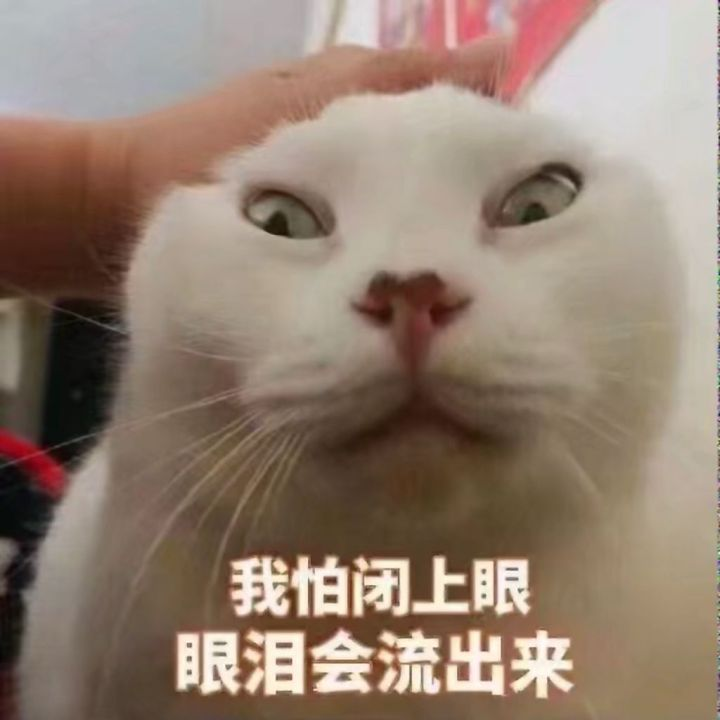
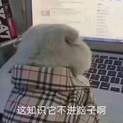
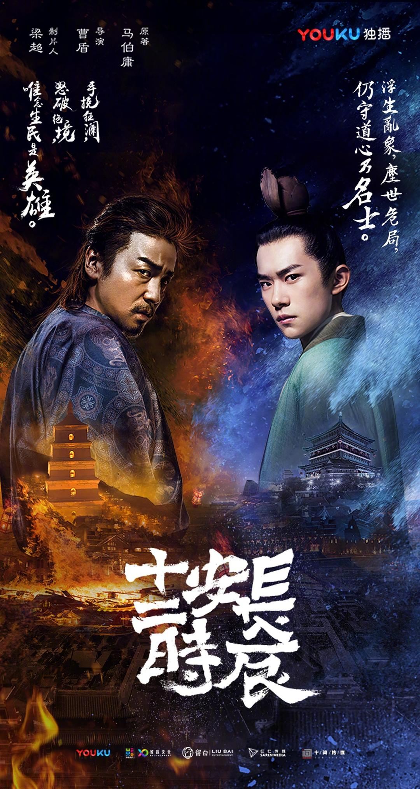
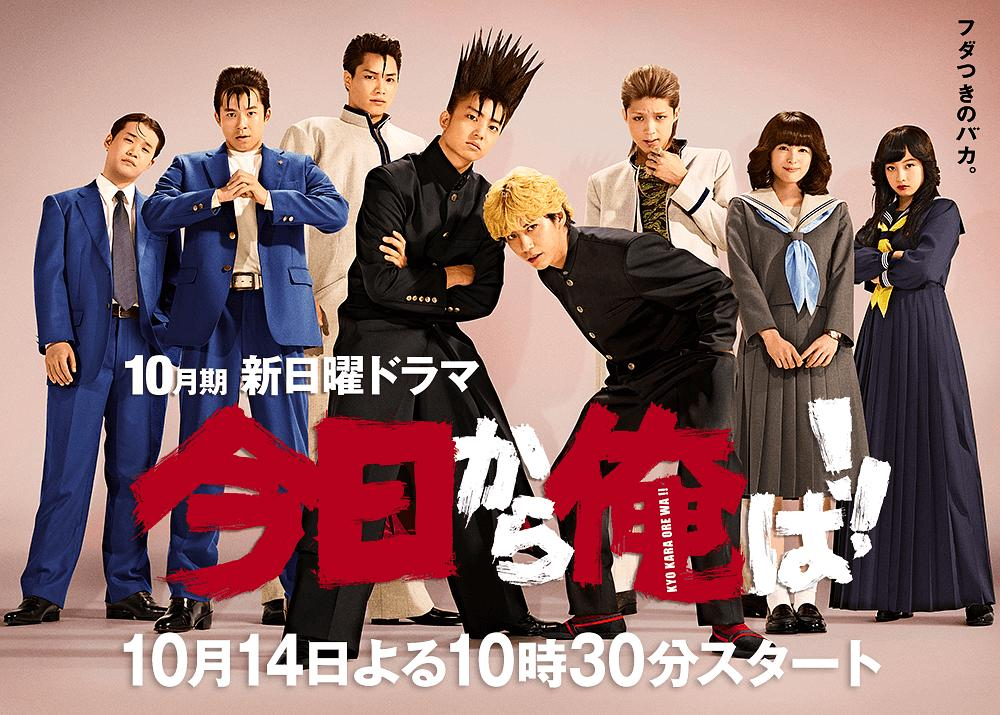
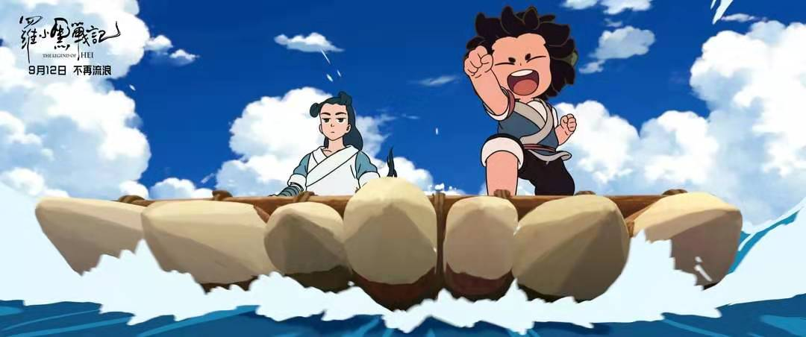
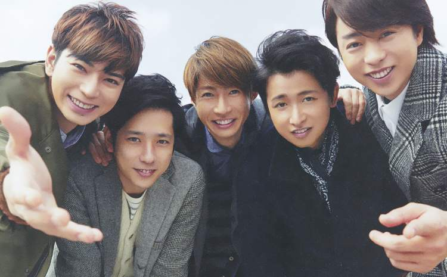

## 我的 2019 —— 个人年终终结及盘点

2019 年，从体感上讲，就像是光一样，溜得贼快。虽说时间本来就是光速，但又对“时光”这一词加深了理解。

这一年，既没有做出什么大成就，也没有完成什么小目标，好在，该坚持的事一直在坚持；这一年，既没有变得更自信一点，也没有在社交上有什么进步，好在，遇到的人大多都是不错的人，哪怕只是萍水相逢；这一年，既没有获得更多的快乐和自由，也没有感觉更充实和轻松，倒也还行，至少没有增加更多的抑郁和焦虑了。好在，过去的都已过去，未来的仍然未来，当下正是我要坚持做的事。

那么，就来一次个人的 2019 年年度盘点以及立一下 2020 年的 flag 吧！

### 网络社交

今年年初，鬼使神差地开始在微博上开始发布一些评论，然后就会有互动，然后就认识了几个网友，还都是妹子。其中一个还加了微信，接着就开始一段网络交友的经历。不得不说，人家妹子的声音是真的好听。过了一两周，妹子说我太闷，绝交了……

**感想：** 我果然不适合社交，不管是线上还是线下。

### 打击与学习

上半年也经历了离职和面试，不得不说，不要轻易裸辞，不然压力贼大，除非你业务水平很强。然后面试的时候被碾压成渣渣，然后开始了一段时间的梳理和学习，发现自己原来啥都不会啊！落后就要挨打，持续不断地学习和磨练才能不会淘汰。

**感悟：** “不自信”和“打击”的程度直接决定了我的学习动力。再也不能心不在焉，走马观花了。

### 博客与公众号

之前一直不怎么写博客和笔记，这一年虽然写得不多，而且也是不定期更新的，但对比以前，至少敢发出来了，这算是个人历史上浓墨重彩的一笔啊。在接下来的一年里，坚持写，坚持发，争取做到定期更新吧。公众号倒是很早以前就申请了，一直没怎么用，后来发现也可以当做博客来写，大家感兴趣的可以关注一下哦，而且近期我用公众号关联了一个人工智障机器人，可以调戏一下。

**感悟：** 讲出来，写出来，让别人理解你在说什么，那么你就可以去做培训班的老师了！

### 娱乐篇

#### 今年我最喜欢的电视剧 Top 2

今年好看的电视剧倒还挺多的，比较火的也很多，不过最喜欢的还是下面两部（仅代表个人观点）：

- 《长安十二时辰》

这电视剧还是充会员然后熬夜看的，看完之后的感想就一个：易烊千玺好帅！

- 《我是大哥大》

这部日剧算是集沙雕，中二，热血高校于一体，可谓很符合我胃口，看完之后的感想：年轻真好。

#### 今年我最喜欢的电影

- 《罗小黑战记》

这对于动漫爱好者来说算是一件大事了，虽然也看了《One Piece》的二十周年剧场版，但对比下来，国产的看着更喜欢，感想：无限好帅！

#### 今年我最喜欢的偶像

- ARASHI （岚）

出道于 1999 年的日本偶像团体（从左至右：松本润，二宫和也，相叶雅纪，大野智，樱井翔），国民级偶像，今年我才知道，综艺是真的搞笑，然后慢慢了解之后，觉得这几个人简直是实现梦想的代言人啊！各自努力，汇聚山顶。饭上之后的感想就是：虽然有时候前行的方向不是那么明确，但努力总归是没错的！

### 2020 年的 flag

- 产出至少两个相对完整的个人项目
- 为开源项目提交 PR
- 定期更新博客
- 变得更自信一点，技术更强一点
- 成为一名 B 站的 up 主

2020 年，加油！