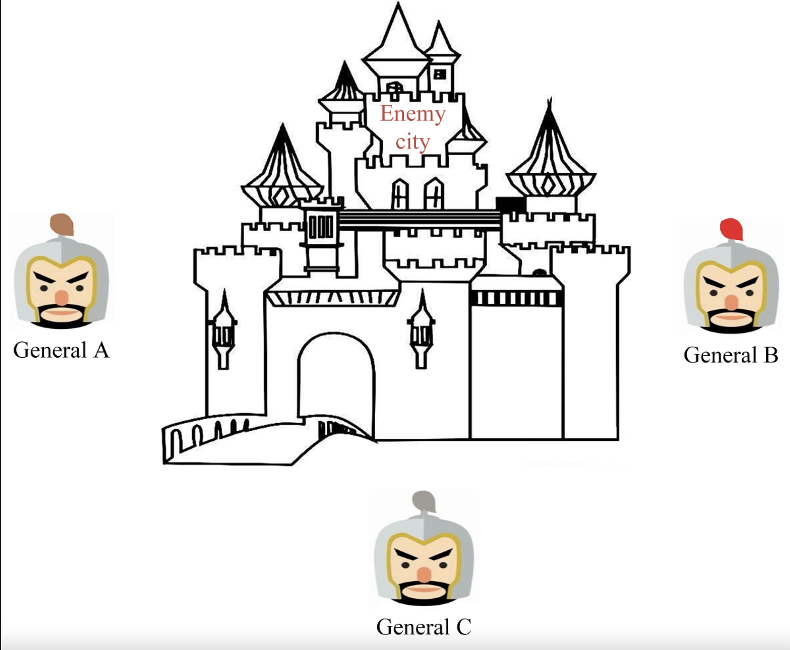
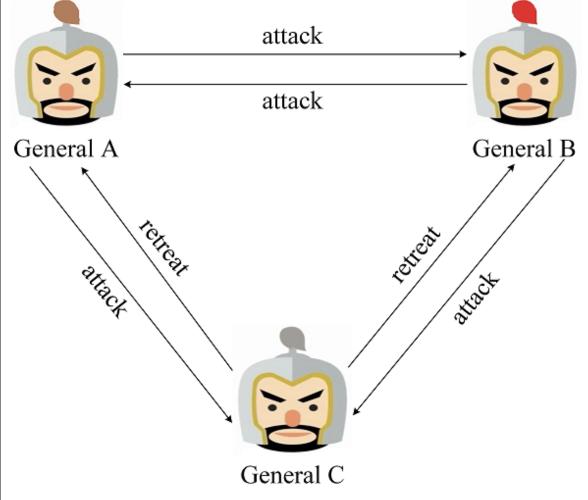
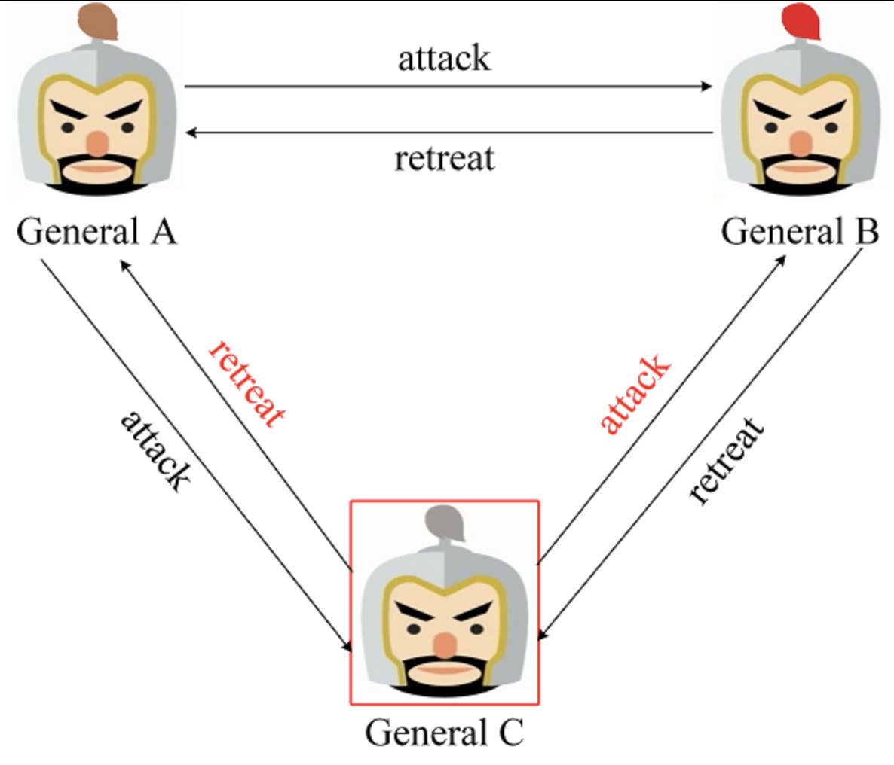
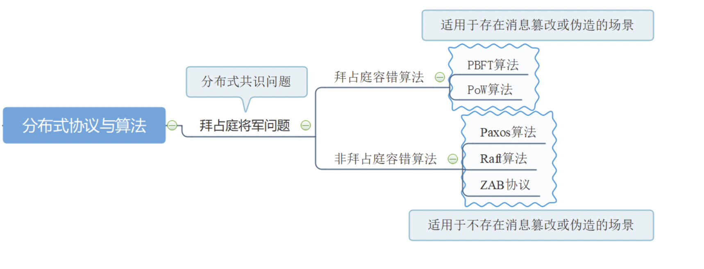

## 从拜占庭将军问题到分布式系统的一致性

本篇我们会以拜占庭问题为引，来谈论一下关于分布式系统中一致性的问题。

### 拜占庭问题

拜占庭问题（Byzantine failures）也叫拜占庭将军问题，是由莱斯利·兰伯特提出的点对点通信中的基本问题。含义是在存在消息丢失的不可靠信道上试图通过消息传递的方式达到一致性是不可能的。

拜占庭问题其本质是一个协议问题，拜占庭帝国军队的将军们必须全体一致决定是否攻击某一支敌军。问题是这些将军在地理上是分隔开来的，并且将军中存在叛徒。叛徒可以任意行动以达到以下目标：欺骗某些将军采取进攻行动；促成一个不是所有将军都同意的决定，如果将军们不希望进攻时促成进攻行动；或者迷惑某些将军，使他们无法做出决定。如果叛徒达到这些目的之一，则任何攻击行动的结果都是要失败的，只有完全达成一致的努力才能获得胜利。这时候，在已知有成员谋反的情况下，其余忠诚的将军在不受叛徒的影响下如何才能达成一致的协议，而拜占庭问题也就此形成。

图1. 拜占庭将军问题

拜占庭问题可以这样描述，军队的几个师驻扎在敌城外, 每个师都由各自的将军指挥。将军们只能通过信使相互沟通，在观察敌情之后，他们必须制定一个共同的行动计划，如 **进攻(Attack)** 或者 **撤退(Retreat)** ，且只有当半数以上的将军共同发起进攻时才能取得胜利。

当三个将军都忠诚时，可以通过投票确定一致的行动方案，图2展示了一种场景，即 General A、B 通过观察敌军军情并结合自身情况判断可以发起攻击，而 General C通过观察敌军军情并结合自身情况判断应当撤退。最终三个将军经过投票表决得到结果为 进攻:撤退 = 2:1，所以将一同发起进攻取得胜利。对于三个将军，每个将军都能执行两种决策（进攻或撤退）的情况下，共存在 6 种不同的场景，图2 是其中一种, 对于其他 5 种场景可简单地推得，通过投票三个将军都将达成一致的行动计划。

图2. 三个将军均为忠诚的场景

当三个将军中存在一个叛徒时，就有可能扰乱正常当作战计划。比如图3，当 General C 为叛徒时，他给 General A 和 General B 发送了不同的消息，在这种场景下 General A 通过投票得到 进攻:撤退 = 1:2，最终将做出撤退当行动计划，General B 通过投票得到 进攻:撤退 = 2:1，最终将作出进攻的行动计划。结果只有General B发起了进攻并战败。

图3. 二忠一判的场景

事实上，对于三个将军中存在一个叛徒的场景，想要总能达到一致的行动方案是不可能的。详细的证明可参看Leslie Lamport的论文。此外，论文中给出了一个更加普适的结论：如果存在 *m* 个叛将, 那么至少需要 *3m+1* 个将军, 才能最终达到一致的行动方案。当然在这篇论文中也给出了解决方案，分别是口信消息型解决方案（A solution with oral message）和签名消息型解决方案（A solution with signed message），感兴趣大家可以去 [这篇文章](https://liebing.org.cn/2020/02/14/byzantine_generals_problem/) 看看，我这里不再详述。

### 共识与一致性

上面我们说到，拜占庭是一个协议共识问题，也就是说让多数人达成一致的意见，即少数人服从多数人。这一术语很多时候会与一致性（Consistency）放在一起讨论，而二者的含义并不完全相同。

#### 一致性

一致性（Consistency），早期也叫（Agreement），在分布式系统领域中是指对于多个服务节点，给定一系列操作，在约定协议的保障下，使得它们对处理结果达成“某种程度”的协同。

理想情况（不考虑节点故障）下，如果各个服务节点严格遵循相同的处理协议（即构成相同的状态机逻辑），则在给定相同的初始状态和输入序列时，可以确保处理过程中的每个步骤的执行结果都相同。因此，传统分布式系统中讨论一致性，往往是指在外部任意发起请求（如向多个节点发送不同请求）的情况下，确保系统内大部分节点实际处理请求序列的一致，即对请求进行全局排序。

规范来看，分布式系统达成一致性的过程，应该满足：

- 可终止性（Termination）：一致的结果在有限时间内能完成；

- 约同性（Agreement）：不同节点最终完成决策的结果是相同的；

- 合法性（Validity）：决策的结果必须是某个节点提出的提案。

要实现理想的严格一致性（Strict Consistency）代价很大。除非系统所有节点都不发生任何故障，而且节点间通信没有延迟，此时整个系统等价于一台机器。实际上，实现较强的一致性要求同步操作，容错性差，同时会牺牲部分性能和可扩展性。实际系统往往会选择不同强度的一致性，主要包括强一致性（Strong Consistency）和弱一致性（Weak Consistency）两大类。

一致性的含义比共识宽泛，在不同场景（基于事务的数据库、分布式系统等）下意义不同。具体到分布式系统场景下，一致性指的是多个副本对外呈现的状态。如顺序一致性、线性一致性，描述了多节点对数据状态的共同维护能力。而共识，则特指在分布式系统中多个节点之间对某个事情（例如多个事务请求，先执行谁？）达成一致看法的过程。因此，达成某种共识并不意味着就保障了一致性。

实践中，要保障系统满足不同程度的一致性，往往需要通过共识算法来达成。

#### 共识算法

共识算法解决的是分布式系统对某个提案（Proposal），大部分节点达成一致意见的过程。提案的含义在分布式系统中十分宽泛，如多个事件发生的顺序、某个键对应的值、谁是主节点……等等。可以认为任何可以达成一致的信息都是一个提案。

对于分布式系统来讲，各个节点通常都是相同的确定性状态机模型（又称为状态机复制问题，State-Machine Replication），从相同初始状态开始接收相同顺序的指令，则可以保证相同的结果状态。因此，系统中多个节点最关键的是对多个事件的顺序进行共识，即排序。

*注：计算机世界里采用的是典型的“多数人暴政”，足够简单、高效。*

那么达成共识的基本问题就摆在了面前：

- 首先，如何提出一个待共识的提案？如通过令牌传递、随机选取、权重比较、求解难题等；

- 其次，如何让多个节点对该提案达成共识（同意或拒绝），如投票、规则验证等。

理论上，如果分布式系统中各节点都能以十分“理想”的性能（瞬间响应、超高吞吐）稳定运行，节点之间通信瞬时送达（如量子纠缠），则实现共识过程并不十分困难，简单地通过广播进行瞬时投票和应答即可。

可惜的是，现实中这样的“理想”系统并不存在。不同节点之间通信存在延迟（光速物理限制、通信处理延迟），并且任意环节都可能存在故障（系统规模越大，发生故障可能性越高）。如通信网络会发生中断、节点会发生故障、甚至存在被入侵的节点故意伪造消息，破坏正常的共识过程。

一般地，把出现故障（Crash 或 Fail-stop，即不响应）但不会伪造信息的情况称为“非拜占庭错误（Non-Byzantine Fault）”或“故障错误（Crash Fault）”；伪造信息恶意响应的情况称为“拜占庭错误”（Byzantine Fault），对应节点为拜占庭节点。显然，后者场景中因为存在“捣乱者”更难达成共识。

此外，任何处理都需要成本，共识也是如此。当存在一定信任前提（如接入节点都经过验证、节点性能稳定、安全保障很高）时，达成共识相对容易，共识性能也较高；反之在不可信的场景下，达成共识很难，需要付出较大成本（如时间、经济、安全等），而且性能往往较差（如工作量证明算法）。

*注：非拜占庭场景的典型例子是通过报数来统计人数，即便偶有冲突（如两人同时报一个数）也能很快解决；拜占庭场景的一个常见例子是“杀人游戏”，当参与者众多时很难快速达成共识。*

当然，共识问题的最坏情况就是永远达不成共识，这也就是共识问题的理论界限，即便在网络通信可靠的情况下，一个可扩展的分布式系统的共识问题通用解法的下限是——没有下限（无解）。

这个结论，被成为“FLP不可能原理”。该原理及其重要，可以看做是分布式领域里的“测不准原理”。

*注：不光分布式系统领域，实际上很多领域都存在类似测不准原理的约束，或许说明世界本源就存在限制。*

### FLP 不可能原理 与 CAP 原理

#### FLP不可能原理

**FLP 不可能原理**：在网络可靠、但允许节点失效（即便只有一个）的最小化异步模型系统中，不存在一个可以解决一致性问题的确定性共识算法（No completely asynchronous consensus protocol can tolerate even a single unannounced process death）。

提出并证明该定理的论文《Impossibility of Distributed Consensus with One Faulty Process》是由 Fischer、Lynch 和 Patterson 三位科学家于 1985 年发表，该论文后来获得了 Dijkstra（就是发明最短路径算法的那位计算机科学家）奖。

FLP 不可能原理告诉我们，**不要浪费时间去试图为异步分布式系统设计面向任意场景的共识算法**。

FLP 不可能原理实际上说明对于允许节点失效情况下，纯粹**异步**系统无法确保共识在有限时间内完成。即便对于非拜占庭错误的前提下，包括 Paxos、Raft 等算法也都存在无法达成共识的极端情况，只是在工程实践中这种情况出现的概率很小。

那么，这是否意味着研究共识算法压根没有意义？

不必如此悲观。学术研究，往往考虑的是数学和物理意义上理想化的情形，很多时候现实世界要稳定得多（感谢这个世界如此鲁棒！）。比如，出现了几次失败的场景，你重试几次说不定就成功了。遇事不决，直接重启！

**科学告诉你，什么是不可能的；工程则告诉你，付出一些代价，可以把它变成可行。**

这就是科学和工程不同的魅力。FLP 不可能原理告诉大家不必浪费时间去追求完美的共识方案，而要根据实际情况设计可行的工程方案。

那么，退一步讲，在付出一些代价的情况下，共识能做到多好？

回答这一问题的是另一个很出名的原理：CAP 原理。

*注：科学告诉你去赌场是愚蠢的，因为最终总会输钱；工程则告诉你，如果你愿意接受最终输钱的风险，中间说不定能偶尔小赢几笔呢！*

#### CAP 原理

**CAP 原理**：分布式系统无法同时确保一致性（Consistency）、可用性（Availability）和分区容忍性（Partition），设计中往往需要弱化对某个特性的需求。该原理认为，分布式系统最多只能保证三项特性中的两项。

一致性、可用性和分区容忍性的具体含义如下：

- 一致性（Consistency）：任何事务应该都是原子的，所有副本上的状态都是事务成功提交后的结果，并保持强一致；

- 可用性（Availability）：系统（非失败节点）能在有限时间内完成对操作请求的应答；

- 分区容忍性（Partition）：系统中的网络可能发生分区故障（成为多个子网，甚至出现节点上线和下线），即节点之间的通信无法保障。而网络故障不应该影响到系统正常服务。

比较直观的理解，当网络可能出现分区时，系统时无法同时保证一致性和可用性的。要么，节点收到请求后因为没有得到其它节点的确认而不应答（牺牲可用性），要么节点只能应答非一致的结果（牺牲一致性）。由于大部分时候网络被认为是可靠的，因此系统可以提供一致可靠的服务；当网络不可靠时，系统要么牺牲掉一致性（多数），要么牺牲掉可用性。

*注意：网络分区是可能存在的，出现分区情况后很可能会导致发生“脑裂“现象。*

对于不同的应用场景，我们在设计系统时，也必然要考虑到对某项特性进行弱化（弱化而非放弃）：

- 弱化一致性：对结果一致性不敏感的应用，可以允许在新版本上线后过一段时间才最终更新成功，期间不保证一致性。比如网站的静态页面的内容，实时性较弱的查询类数据库等。简单分布式同步协议如 `Gossip`，以及 `CouchDB` 、`Cassandra` 数据库等，都为此设计。

- 弱化可用性：对结果一致性很敏感的应用，例如银行取款机，当系统出现故障时会拒绝服务。`MongoDB`、`Redis`、`MapReduce` 等均为此设计。`Paxos`、`Raft` 等共识算法，也是主要处理这种情况。

- 弱化分区容忍性：现实中，网络分区出现概率较小，但很难完全避免。两阶段的提交算法，某些关系型数据库以及 `Zookeeper` 主要考虑了这种设计。实践中，网络可以通过双通道等机制增强可靠性，实现高稳定的网络通信。

### ACID 原则与多阶段提交

#### ACID 原则

学习过数据库事务的同学对这几个字母应该不陌生，对于分布式系统的事务也是一样的，ACID 是用来描述一致性的原则，其描述了分布式数据库需要满足的一致性需求，同时允许付出可用性的代价。

- 原子性（Atomicity）：每次事务都是原子的，事务包含的所有操作，要么全部成功，要么全部失败，一旦有失败，则需要回退到执行事务之前；

- 一致性（Consistency）：数据库的状态在事务执行前后的状态是一致和完整的，无中间状态，即只能处于成功事务提交后的状态；

- 隔离型（Isolation）：各种事务可以并发执行，但彼此之间互相不影响。按照标准 SQL 规范，从弱到强可以分为读未提交、读已提交、可重复读和串行化。

- 持久性（Durability）：状态的改变是持久的，不会失效。一旦某个事务提交，则它造成的状态变更就是永久的。

与 ACID 相对的一个原则是 eBay 技术专家 Dan Pritchett 提出的 BASE（Basic Availability，Soft-state，Eventual Consistency）原则。BASE 原则面向大型高可用分布式系统，主张牺牲掉对强一致性的追求，而实现最终一致性，来换取一定的可用性。

*注：ACID 和 BASE 在英文中分别是“酸”和“碱”，看似对立，实则是对 CAP 三特性的不同取舍。*

#### 两阶段提交

对于分布式事务一致性研究成果包括著名的两阶段提交算法（Two-phase Commit 2PC）和三阶段提交算法（Three-phase Commit，3PC）。

两阶段提交算法最早由 Jim Gray 于 1979 年在论文《Notes on Database Operating Systems》中提出。其基本思想十分简单，既然在分布式场景下，直接提交事务可能出现各种故障和冲突，那么可将其分解为预提交和正式提交两个阶段，规避风险。

- 预提交（PreCommit）：协调者（Coordinator）发起执行某个事务的执行并等待结果。各参与者（Participant）执行事务但不提交，反馈是否能完成，并阻塞等待协调者指令；

- 正式提交（DoCommit）：协调者如果得到所有参与者的成功答复，则发出正式提交指令，否则发出状态回滚指令。

两阶段提交算法因为其简单容易实现的优点，在关系型数据库等系统中被广泛应用。当然其缺点也很明显：

- 第一阶段，各参与者同步阻塞等待时，无法处理请求，会导致系统性能较差；

- 存在协调者单点故障问题，最坏情况下协调者纵使在第二阶段故障，无法完成提交。

- 可能产生数据不一致的情况。例如第二个阶段时，协调者将正式提交请求发给部分参与者后发生故障。

#### 三阶段提交

三阶段提交算法针对两阶段提交算法第一阶段中参与者阻塞问题进行了优化。具体来说，将预提交阶段进一步拆成两个步骤：询问提交和预提交。

完整过程如下：

- 询问提交（CanCommit）：协调者询问参与者是否能进行某个事务的提交。参与者需要返回答复是否准备好，但无需执行提交，也无需阻塞。这就避免出现参与者被阻塞的情况；

- 预提交（PreCommit）：协调者检查收集到的答复，如果全部为真，则发起执行事务请求。各参与参与者（Participant）需要执行事务但不提交，并反馈能否完成。注意此时说明所有参与者都已经处于准备好状态。；

- 正式提交（DoCommit）：协调者如果得到所有参与者的成功答复，则发出正式提交请求，否则发出状态回滚指令。本阶段时，如果参与者一直收不到请求，则超时后继续提交。

三阶段提交主要解决了阻塞问题和协调者单点故障问题。第三阶段时，如果参与者无法及时收到协调者的消息，可以在超时后自动进行提交。但是当协调者发出的回滚消息未被部分参与者收到时，会出现不一致的情况。

其实，无论两阶段还是三阶段提交，都只是一定程度上缓解了提交冲突的问题，并无法确保系统的一致性。首个有效的共识算法是后来提出的Paxos 算法。

### Paxos 算法

1990 年由 Leslie Lamport 在论文《The Part-time Parliament》中提出的 [Paxos](http://research.microsoft.com/users/lamport/pubs/lamport-paxos.pdf) 共识算法，在工程角度实现了一种最大化保障分布式系统一致性（存在极小的概率无法实现一致）的机制。Paxos 算法本质上与前者相同，被广泛应用在 Chubby、ZooKeeper 这样的分布式系统中。Leslie Lamport 作为分布式系统领域的早期研究者，因为相关杰出贡献获得了 2013 年度图灵奖。

论文中为了描述问题编造了一个虚构故事：在古代爱琴海的 Paxos 岛，议会如何通过表决来达成共识。议员们通过信使传递消息来对议案进行表决。但议员可能离开，信使可能走丢，甚至重复传递消息。

Paxos 是首个得到证明并被广泛应用的共识算法，其原理类似于两阶段提交算法，进行了泛化和扩展，通过消息传递来逐步消除系统中的不确定状态，作为后来很多共识算法（如 Raft、ZAB 等）的基础。

#### 基本原理

算法中存在三种逻辑角色的节点，在实现中同一节点可以担任多个角色：

- 提案者（Proposer）：提出一个提案，等待大家批准（Chosen）为决议（Value）。系统中提案都拥有一个自增的唯一提案号。往往由客户端担任该角色；

- 接受者（Acceptor）：负责对提案进行投票，接受（Accept）提案。往往由服务端担任该角色；

- 学习者（Learner）：获取批准结果，并帮忙传播，不参与投票过程。可为客户端或服务端。

算法需要满足安全性（Safety） 和存活性（Liveness）两方面的约束要求。实际上这两个基础属性也是大部分分布式算法都该考虑的：

- Safety：保证决议（Value）结果是对的，无歧义的，不会出现错误情况。 * 只有是被提案者提出的提案才可能被最终批准；
  
  - 在一次执行中，只批准（chosen）一个最终决议。被多数接受（accept）的结果成为决议。

- Liveness：保证决议过程能在有限时间内完成。
  
  - 决议总会产生，并且学习者能获得被批准的决议。

基本思路类似两阶段提交：多个提案者先要争取到提案的权利（得到大多数接受者的支持）；成功的提案者发送提案给所有人进行确认，得到大部分人确认的提案成为批准的决议。

Paxos 并不保证系统总处在一致的状态。但由于每次达成共识至少有超过一半的节点参与，这样最终整个系统都会获知共识结果。一个潜在的问题是提案者在提案过程中出现故障，这可以通过超时机制来缓解。极为凑巧的情况下，每次新一轮提案的提案者都恰好故障，又或者两个提案者恰好依次提出更新的提案，则导致活锁，系统会永远无法达成共识（实际发生概率很小）。

Paxos 能保证在超过一半的节点正常工作时，系统总能以较大概率达成共识。读者可以试着自己设计一套非拜占庭容错下基于消息传递的异步共识方案，会发现在满足各种约束情况下，算法过程总会十分类似 Paxos 的过程。这也是为何 Google Chubby 的作者 Mike Burrows 说：“这个世界上只有一种一致性算法，那就是 Paxos（There is only one consensus protocol, and that's Paxos）”。

### 总结

本文我们从拜占庭问题聊起，说到了分布式系统的一致性问题。本质上的一致性，其实追求的还是最终一致性，并不存在完美的解决方案，而是在现实各种约束条件下，往往需要通过牺牲掉某些需求，来设计出满足特定场景的协议。工程领域中不少问题都不存在一劳永逸的通用解法；而实用的解决思路都是合理地在实际需求和条件限制之间进行灵活的取舍。

### 链接

- 拜占庭将军问题： https://liebing.org.cn/2020/02/14/byzantine_generals_problem/

- 拜占庭问题与算法: https://yeasy.gitbook.io/blockchain_guide/04_distributed_system/bft

- 分布式系统核心技术： https://yeasy.gitbook.io/blockchain_guide/04_distributed_system/problem

- Paxos 算法与 Raft 算法： https://yeasy.gitbook.io/blockchain_guide/04_distributed_system/paxos

