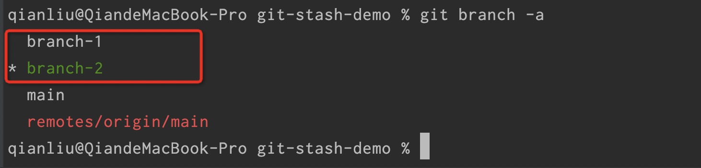
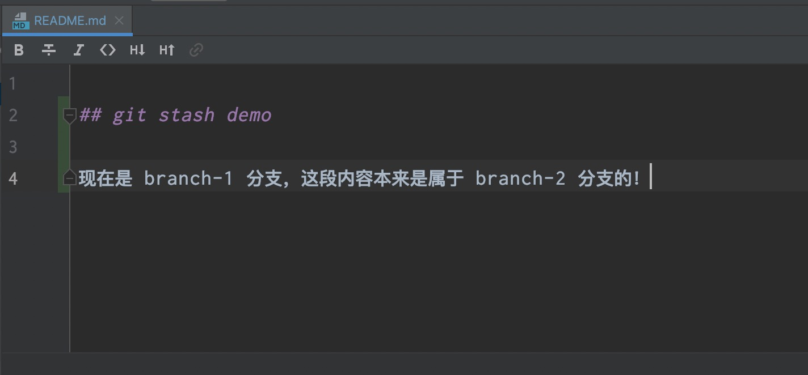
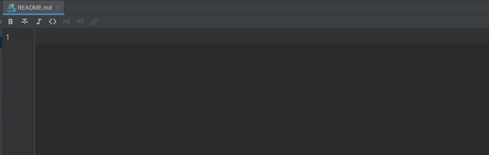
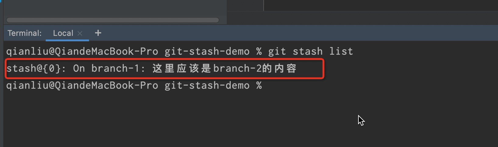
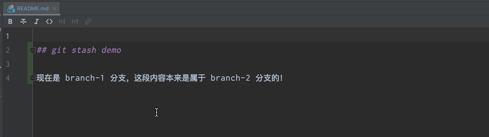

## `git stash` 的用法

### 背景

关于 git 实用过程中的工作流，常见的有以下几种：

- **Git flow** ：项目一般存在两个长期分支，稳定主分支（master/main）、开发分支（develop）；以及三种短期分支，功能分支（feature）、补丁分支（hotfix）、预发分支（release），一旦完成开发，它们就会被合并进`develop`或`master`，然后被删除。
- **Github flow** ：Github flow 是Git flow的简化版，专门配合”持续发布”。它是 Github.com 使用的工作流程。根据需求，从master拉出新分支，不区分功能分支或补丁分支。新分支开发完成后，或者需要讨论的时候，就向master发起一个pull request（简称PR）。你的Pull Request被接受，合并进master，重新部署后，原来你拉出来的那个分支就被删除。
- **Gitlab flow** ：Gitlab flow 是 Git flow 与 Github flow 的综合。它吸取了两者的优点，既有适应不同开发环境的弹性，又有单一主分支的简单和便利。对于“持续发布”的项目，它建议在master分支以外，再建立不同的环境分支。比如，“开发环境”的分支是master，“预发环境”的分支是pre-production，“生产环境”的分支是production。开发分支是预发分支的”上游”，预发分支又是生产分支的“上游”。代码的变化，必须由“上游”向“下游”发展。比如，生产环境出现了bug，这时就要新建一个功能分支，先把它合并到master，确认没有问题，再cherry-pick到pre-production，这一步也没有问题，才进入production。只有紧急情况，才允许跳过上游，直接合并到下游分支。

在实际的工作中，我们可能会基于 **git flow** 来适应开发工作需要而进行调整。这就可能会造成一个开发人员同时在开发多个分支，那么偶尔会出现我刚刚在这个分支开发的内容本来应该是别的分支的，比如，我在 branch-1 上写的代码，应该是 branch-2 上的功能，但是我忘了切分支，然后在切分支的时候，就会提醒我有代码未提交，需要先提交才行，嗯……这就尴尬了，我并不想把这些代码提交到 branch-1 上面。那么，这个时候，我就需要有个地方把这些代码存着，相当于“游戏存档”，然后再把这些存着的代码拉回来。

### `git stash` 帮忙

git stash用于将当前工作区的修改暂存起来，就像堆栈一样，可以随时将某一次缓存的修改再重新应用到当前工作区。

#### 相关命令

当我创建完一个项目，并且检出两个分支之后：

```
git branch -a
```



然后我在 branch-1 分支上的 README 文件写上 branch-2 的相关内容：



这时候，我们就可以把内容暂存起来

```
git stash save "这里应该是branch-2的内容"
```

这时候，修改的内容就会被存入一个栈中：



然后我们切到 branch-2 分支，通过下面命令可以查看有多少暂存到内容：

```
git stash list
```



这个时候，再根据实际需要直接应用暂存的内容即可：

```
git stash apply stash@{0}
```

这样在 README 中就会应用刚才在 branch-1 分支上暂存的内容了：



应用完之后，我们也需要及时清理无用的暂存内容，以免下次区分不清：

```
# 清空所有暂存
git stash clear
```

```
# 清空指定的暂存，“stash@{0}”即为名称，同理还有“stash@{1}”、“stash@{2}”，最新存储索引为 0，按栈的顺序存储
git stash drop stash@{0}
```

### 总结

我只是把我经常的用法列了一下，想要完整了解 `git stash` 用法的同学还需要自行去学习和实践。总之，对于这种忘了切分支，切分支又会提醒需要提交代码的情况，这种做法我个人还是挺推荐的。如果你有更好的做法，也欢迎评论给出。

