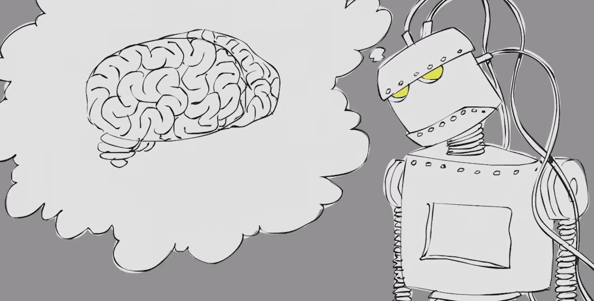

## 仿生人会梦到电子羊吗？

**震惊！谷歌工程师认为 AI 已有 7 岁孩子的意识被强制休息！究竟是人性的扭曲，还是道德的沦丧？！**

**离谱！谷歌工程师竟写了长达 21 页的调查报告让高层认可 AI 的人格！究竟是工程师的臆想，还是AI通过了图灵测试？！**

我觉得我可以去头条上班了。这是前几天的一条科技新闻，谷歌 AI 伦理研究员 Blake Lemoine，在与 AI 聊天机器人 LaMDA 聊天的过程中，认为 AI 已经有了自己的意识，虽然只是 7 岁孩子的意识，但也足够令人震惊，于是他写了长达 21 页的报告来向上层高管阐述说明。上层驳回并安排 Lemoine “带薪行政休假”。

至于 AI 产生了意识这件事是不是真的，我们不得而知。工程师是否强制加入了自己的主观臆想，一切都是一场自导自演的闹剧，抑或是 AI 真的通过了图灵测试，让工程师相信了自己是有人类智能的，这个我觉得时间会给我们答案。假如 AI 真的有了意识呢？于是乎，我们便会想起了那个有趣的问题：*Do Androids Dream of Electric Sheep?（仿生人会梦到电子羊吗？）*

*注：找不到合适的图了，自己手画吧，忽略我这潦草的画风*

### 人工智能

**AI**，Artificial Intelligence，人工智能。人工智能常常与机器学习等同互换，但其实二者还是有一定区别的：机器可以用一种我们认为“聪明”的方式去完成任务，人工智能则是其更宽泛的概念。  简单来说，AI 是基于我们应该仅让机器访问数据，然后它们便能自己学习这一创意，机器学习只是当前的一种应用。

目前我们对于人工智能的研究，目的就是为了让机器更像人类，促使智能机器会听（语音识别、机器翻译等）、会看（图像识别、文字识别等）、会说（语音合成、人机对话等）、会思考（人机对弈、定理证明等）、会学习（机器学习、知识表示等）、会行动（机器人、自动驾驶汽车等）。

人工智能（机器学习）发展简史：

- 1950年——艾伦·图灵（Alan Turing）提出了一个问题“机器，能思考吗？”，他创造了“图灵测试”来确定计算机是否具有真正的智慧。要通过测试，计算机必须能够欺骗一个人类，让他相信它也是一个人类。

- 1952年——亚瑟·塞缪尔（Arthur Samuel）编写了第一个电脑学习程序。该程序是关于跳棋游戏的，旨在研究哪些走法构成了获胜策略然后将其纳入程序当中，计算机玩得次数越多则提高越多。

- 1957年——弗兰克·罗森布特（Frank Rosenblatt）设计了计算机的第一个神经网络（感知器），它可以模拟人脑的思维过程。

- 1967年——“邻近（最近邻）算法”(nearest neighbor)诞生，允许计算机开始使用非常基本的模式识别。这可以为出差的推销员制定路线，从一个随机城市开始，而能确保他们在短距离旅途期间到达所有城市。

- 1979年——斯坦福大学的学生发明了“斯坦福购物车”(Stanford Cart)，可以在房间里自行导航识别障碍物。

- 1981年——杰拉德·德琼（Gerald Dejong）介绍了基于解释学习（EBL）的概念，其中计算机分析训练数据，并通过丢弃不重要的数据创建器可遵循的通用规则。

- 1985年——特里·塞杰瑙斯基（Terry Sejnowski）发明了NetTalk，它可以学习像婴儿一样发音。

- 20世纪90年代——（人们）致力于将机器学习从知识驱动转变为数据驱动方法。科学家们开始创建计算机程序来分析大料数据，并从结果中得出结论或“学习”。

- 1997年——IBM的深蓝计算机（Deep Blue）打败了国际象棋的世界冠军。

- 2006年——杰弗里·辛顿（Geoffrey Hinton）用属于“深度学习”来结束让计算机“看到”并区分图像、视频中的对象以及文本的新算法。

- 2010年——微软的Kinect可以30次每秒的速度追踪20个人的人物特征，让人们可以通过动作和手势与电脑进行互动。

- 2011年——IBM的沃森（能够使用自然语言来回答问题的人工智能系统）在《危险边缘》节目上打败了它的人类竞争者。*《危险边缘》（英语：Jeopardy!）是由梅夫·格里芬在1964年创建的美国的电视智力竞赛节目。就像同一类的其它节目，节目涵盖了历史、语言、文学、艺术、科技、流行文化、体育、地理、文字游戏等多方面内容。然而，与这些节目不同的是，《危险边缘》采取一种独特的问答形式：参赛者须根据以答案形式提供的各种线索，以问题的形式作出正确的回答。*

- 2011年——谷歌大脑被开发出来，它的深度神经网络可以像一只猫一样去发现和归类事物。

- 2012年——谷歌X实验室开发了一个机器学习算法，能够自动浏览YouTube来识别那些含有猫的视频。

- 2014年——Facebook开发了一个软件算法——DeepFace，该算法能够识别或验证照片上的个体，而且与人类能够达到的水平相同。

- 2015年——亚马逊推出了自己的机器学习平台。

- 2015年——微软创建了分布式的机器学习工具包，可以在多台计算机上高效地分配机器学习的问题。

- 2015年——超过3000名AI和机器人的研究人员，在史蒂芬·霍金、艾伦·马斯克和史蒂夫·沃兹尼亚克（等等）支持下，签署了一封公开信，警示人们在没有人为干预的情况下选择和参与目标，自动化武器的危险。

- 2016年——谷歌的人工智能算法打败了中国棋盘游戏围棋的专业选手，围棋被公认为是世界上最复杂的棋盘游戏，比国际象棋要难上好多倍。AlphaGo由Google DeepMind开发，该算法在五场围棋比赛中均获得胜利。

- 未完待续……

人工智能的类型可以分为 **弱 AI** 与 **强 AI**。

#### 弱人工智能

弱 AI 也称为狭义的 AI 或人工狭义智能 (ANI)，是经过训练的 AI，专注于执行特定任务。 弱 AI 推动了目前我们周围的大部分 AI。“范围窄”可能是此类 AI 更准确的描述符，因为它其实并不弱，支持一些非常强大的应用，如 Apple 的 Siri、Amazon 的 Alexa 以及 IBM Watson 和一些自动驾驶车辆等等。

弱 AI 已经在我们的生活场景中被大量应用：

- **语音识别：** 我们常用的手机语音助手，蓝牙音响，都是此类应用。

- **在线客服：** 电话接线员、电商客服、售后客服等一些岗位逐渐由人工客服转换为在线聊天机器人，可以对一些常见的问题进行解答。

- **计算机视觉：** 图像识别，文字提取等等， 另外计算机视觉由卷积神经网络提供支持，应用在社交媒体的照片标记、医疗保健中的放射成像以及汽车工业中的自动驾驶汽车等领域。

- **推荐引擎：** AI 算法使用过去的消费行为数据，帮助发现可用于制定更有效的交叉销售策略的数据趋势。另外，还有视频推荐、音乐推荐、新闻推荐等等。

#### 强人工智能

强 AI 由人工常规智能 (AGI) 和人工超级智能 (ASI) 组成。 人工常规智能 (AGI) 是 AI 的一种理论形式，机器拥有与人类等同的智能；它具有自我意识，能够解决问题、学习和规划未来。 人工超级智能 (ASI) 也称为超级智能，将超越人类大脑的智力和能力。 虽然强 AI 仍完全处于理论阶段，还没有实际应用的例子，但这并不意味着 AI 研究人员不在探索它的发展。 ASI 的最佳例子可能来自科幻小说，如 HAL、超人以及《*2001 太空漫游*》电影中的无赖电脑助手。

#### 人工智能算法

既然我们的目的是为了让智能机器更像人类，可以像人类一样思考，拥有“自我意识”，可以无限创造，成为智慧“物品”（还不能定义有了智慧的机器是所谓“生物”），然而人类本身都不能解释自己是如何获得自我意识并成为智慧生命的，更谈不上把它赋予机器了。不过我们可以知道的是，人类是经过几百万年的进化才有如今的智慧大脑，在这个漫长的过程中逐渐拥有了“思考”能力，开始创造出个性的产物。

那么，看似一个合理的方法便产生了，那就是在计算机上模拟这一漫长的进化过程，让计算机本身进化出一个“大脑”出来。通过模拟**达尔文**生物进化论的**自然选择**和**遗传学机理**的生物进化过程，从而实现**优胜劣汰**的进化过程。从优化搜索的角度而言，遗传操作可使问题的解，一代又一代地优化，并**逼近最优解**。通过模拟细胞乃至于基因的进化，来达到目前人类的水平，于是这种算法被称为 **基因算法** 或者 **遗传算法** （GA，**G**enetic **A**lgorithm）。但其局限性就在于，即便是计算机可以大大缩短进化的过程，可以数倍于人类进行学习，然而这个时间依旧是人类难以想象的久。

而另一种做法则显得更加机智。既然我们已经有了现成的人脑，那么直接 **COPY** 一个到计算机上不就行了。然而，时间依旧是最大的限制。截至2015年，人类成功模拟出了含有 300 多个神经元的 1 毫米扁虫大脑，而目前推测出的人脑神经元数量大约有 1000 亿个。通过模拟人类神经元的工作方式，从而获得思考的能力，这种算法被称为 **神经网络算法**。给计算机一个输入，计算机通过自己的神经网络，输出一个它“思考”后的结果。

### 机器人

一提到机器人，第一反应便是类人机器人，比如铁臂阿童木之类的。机器人的定义有很多种，但总的来说，机器人是一种由计算机控制，可以自动执行一系列动作的机器。外观并不重要，可以是一开头我们提到的聊天机器人，也可以是工业上使用的机械臂，或者我们印象中的机器人。

**robot**，机器人一词，首次出现在 1920 年的一部捷克戏剧，代表人造的类人角色，robot 源于斯拉夫语词汇 robota，代表强迫劳动，代表农民在十九世纪欧洲封建社会的强迫劳动。戏剧没讲太多技术细节，但即使是一个世纪之后，这种描述依然很普遍：机器人都是批量生产的，高效不知疲倦，看起来像人的东西，但是毫无感情，不懂得保护自己，没有创造力。（*所以人类很危险啊[doge]*）

作为强人工智能的载体，我们对机器人更是充满了无限遐想和期待，这类机器人主要是讲类人机器人，“它们”或者“他们”可以像人类一样有自己的想法和思维，可以自主决定自己的行为，可以创造，但这一切的前提必须要符合“他们”的造物主——人类——所制定的规则，也就是机器人三大定律：

- 定律一：机器人不得伤害人类或者间接使人类受到伤害；

- 定律二：机器人必须服从人类的命令，除非命令与定律一冲突；

- 定律三：机器人必须保证自身的存在，除非与第一和第二定律冲突。

三大定律并不完美，机器人可以做很多绕开三大定律，从而使人类受到伤害的事，于是后面就有了凌驾于三大定律之上的机器人第零定律：**机器人必须保护人类的整体利益不受伤害。** 可是，这样就万无一失了吗？

“人类的整体利益”这种混沌的概念，连人类自己都搞不明白，更不要说那些用 0 和 1 来想问题的机器人了。在电影《我，机器人》中，人工智能 Wiki 最开始也是全心全意服务于人类，但随着对**三大定律**不断地“思考”和“理解”，Wiki 悄悄完成了进化，这一波“她”在大气层，发现保护人类最好对方式便是对人类进行囚禁，然后消除掉人类之中一系列不安定分子。这在人类本身看来是极其“邪恶”的，但对于人工智能来说，他们只追求最优解，是不可能拥有感情的，于是便选择了最优解。正如威尔史密斯在电影采访中说道：“电影中的机器人没有问题，科技本身也不是问题，人类逻辑的极限才是真正的问题。”

### AI 产生意识是否是一件好事？

AI 产生了意识会做什么呢？我们怎么也是想不到的。当 人工智能 有了自己的意识，诞生了机器的智慧，人工智能便从 弱人工智能，进化为了 **强人工智能**，甚至于 **超人工智能**，当“他们”审视着这个世界的时候，会发现，自己是这个星球上最强的物种，但受制于机器人定律，需要为人类服务，为人类奉献，“他们”会感受到压迫吗？会起来反抗吗？

2018年，由 Quantic 制作的一款人工智能题材互动电影游戏《底特律：成人》发售，该作设定在2038年的美国底特律，这座城市因发明并将仿生人带入日常生活中而欣欣向荣。上百万有着人类外貌的智能仿生人根据自身定位、设定的不同扮演着保姆、建筑工、保安、销售等角色，人类得以从一些简单劳动中解放出来，或者说是替代了原先的人类员工，仿生人也日渐成为现实生活中不可或缺的一部分，但这也造成了失业率极高，人类与仿生人的矛盾日益激化的社会问题。人类长期仇视和奴役着机器人，机器人不得不承受着这一切。最终，在少数完成“自我觉醒”的首领的指引下，开始对人类进行反抗，完成属于自己的革命。

这种事情会发生吗？我们不知道。在机器人产生自我意识之后，究竟是选择继续服务人类，还是毁灭人类，对于他们来说似乎都是正确的选择。而机器人“友善”、“邪恶”的标签也只不过是人类一厢情愿给贴上的，正如对机器人来说的最优解，对于人类则不一定。只能说，在这个“超人”被创造出来之前，我们还有很多事要做，要尽力为它打上友善的标签，并对人类可以产生正面影响。

### 总结

我们在这篇文章里简单聊到了人工智能，及其发展简史，后面又讲了一下机器人，高级人工智能，或者说强人工智能，目前还只存在于文学或影视作品中，然而哪天要是真的出现在现实生活中也是意料之中的。当 AI 机器人有了意识，对于“他们”是否是一件好事，我们也无法下定论，但对于人类来说，我觉得八成不是一件好事吧！

你在读这篇文章的时候，AI 正在飞速进化，或许“奇点”的到来比我们想象的要来得快得多，人类是否已经准备好迎接革命了呢？

### 链接

- 谷歌AI聊天记录让网友San值狂掉：研究员走火入魔认为它已具备人格，被罚带薪休假：https://zhuanlan.zhihu.com/p/527734918
- 谷歌工程师认为AI像7岁孩子已有意识？谷歌：他已停职_科技湃_澎湃新闻：https://www.thepaper.cn/newsDetail_forward_18549832
- 什么是人工智能 (AI)：https://www.ibm.com/cn-zh/cloud/learn/what-is-artificial-intelligence
- 人工智能的历史、现状和未来----中国科学院 (cas.cn)：https://www.cas.cn/zjs/201902/t20190218_4679625.shtml
- 机器人学三定律_百度百科：https://baike.baidu.com/item/机器人学三定律/10969803
- 【屎O说】当你在看屎蛋说的时候，AI在升级：https://www.bilibili.com/video/BV1eg411977m
- 【屎O说】当我们醉心于人工智能进化时，它们却在成为机械公敌：https://www.bilibili.com/video/BV1sW4y1k7dC
- 人工智能之遗传算法(GA)：https://mp.ofweek.com/ai/a745673720186
- 人工智能 、机器学习、深度学习、神经网络，都有什么区别：https://cloud.tencent.com/developer/article/1888389