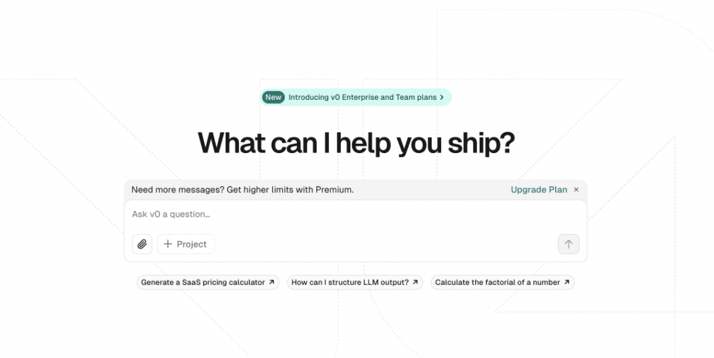
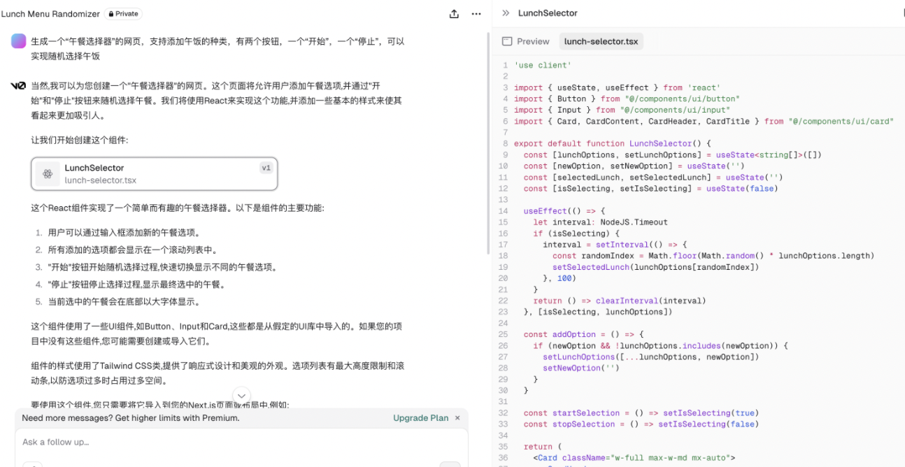
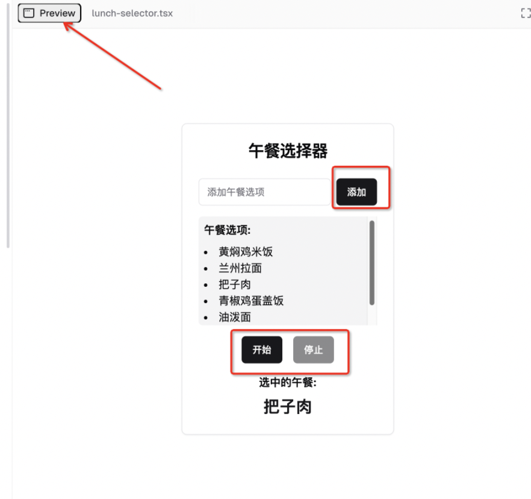
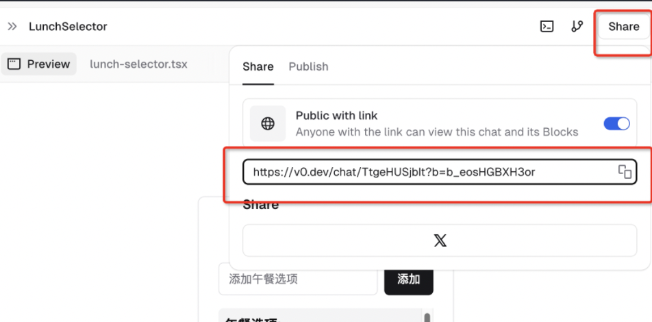
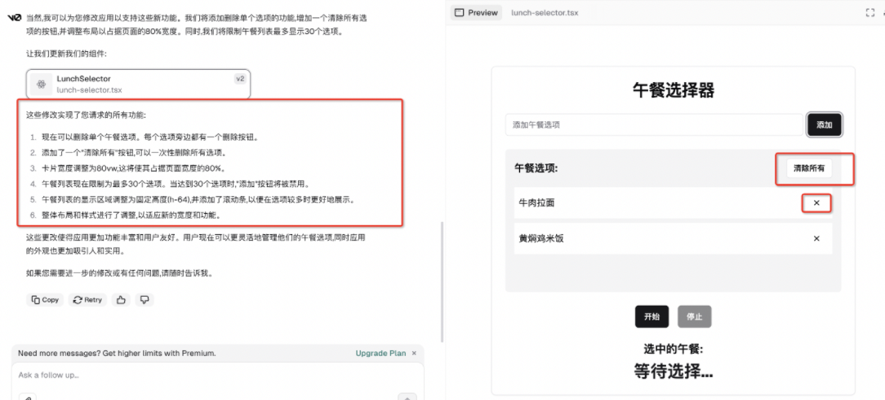

## 网站推荐：如何用 AI 快速制作一个午餐选择器？

今天我们来推荐一个 AI 生成（网页）应用的网站，`https://v0.dev/chat` ，可以让你体验一下程序员的乐趣 —— 创造的乐趣。

当你决定要写一个网页应用来解决自己一天中最重要的问题：**午餐吃什么**？那么这个时候，新手的入门教程会怎么教你呢？

- 首先，会给你一个 w3school 的教程： [HTML Tutorial](https://www.w3schools.com/html/default.asp)；

- 然后专业一点的，会让你下载一个 IDE，`VS Code` 之类，可以更好地按照格式和运行环境来写出一个网页应用；

- 如果你想再搞一点颜色和动效，那么就要开始学习一点 `CSS` 的用法；

- 如果你想更花里胡哨一点，有一点交互效果，那么就要开始学习 `javascript` 的语法；

- ……

- 最后，你就可以在浏览器里打开，来使用你的应用了，一点按钮，崩溃了，然后又要开始改 bug 了……

- 如此循环往复……


就这样，一颗冉冉升起的**程序员新星**往往在第一步就陨落了……

然而今天要介绍的网站，可以帮你生成一个应用，即使你是一个小白，也可以制作自己的应用。它的首页长这样，你可以输入你的需求：



比如我们就要做一个“午餐选择器”，就可以输入：

```
生成一个“午餐选择器”的网页，支持添加午饭的种类，
有两个按钮，一个“开始”，一个“停止”，可以实现随机选择午饭。
```

那么它就开始了它的表演，代码和描述完全是它自己生成的，这个过程中我们全程没有参与：



我比较喜欢的功能是它的预览功能，点击预览，我们可以看到自己的网页应用了，甚至不用下载，不用修改和调整：



我们可以看到：

- “午餐选择器”是我们给这个应用的名称；

- “添加”按钮可以添加我们的午餐选项，我随便给加了几个；

- 点击“开始”可以实现随机选择，“停止”便会选中要吃什么；


还有一点比较好的功能是，你可以分享你的应用，让你的亲朋好友用上你的智慧成果：



当然，你可能觉得少了点什么，样式不够美观，要删除某个选项之类的，我们依然可以继续提出自己的修改意见：

```
要修改一下我们的应用，可以支持删除某个午餐选项，
并且有全部清除的选项。
另外，这个功能区域可以扩大一点，占整个页面的80%吧，
午餐的列表最多可以展示30个吧
```

然后我们就得到了一个这样的应用界面：



如此，应该是一个相对完备的功能了，当然，我们也可以让它支持点击回车就可以添加成功等等功能，可以继续进行对话……

可以说，这个 AI 网站省去了我们最初的创意实现过程，这个灵感是转瞬即逝的，可能下一毫秒我们就不知道要干嘛了，有了应用的初始版本，我们可以继续基于这个版本迭代升级，完成一个更伟大的项目，这就需要专业知识来辅助了，当然，AI 可以继续参与这个过程。

好了，当你知道了这个网站之后，请大肆释放你的创造灵感吧！