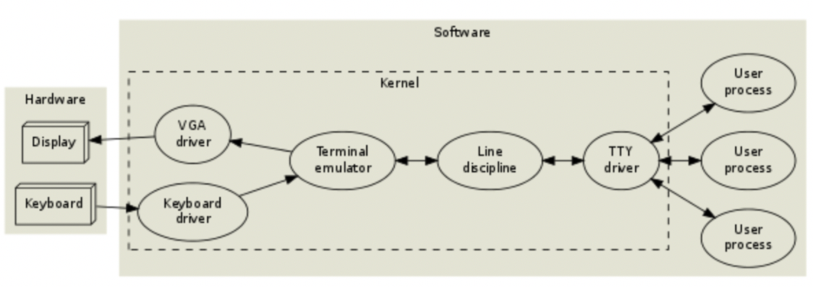

## 计算机科普：`TTY` 是什么？

每当我打开这个黑乎乎的窗口我就在想，这个`ttys` 究竟是个什么东西，后来意识到这可能是个复数，那么 `tty` 是个什么呢？

通过电脑的终端配置我们可以看到，这个 `ttys001` 就是 `TTY` 名称，每打开一个终端，就会有不同的编号，我没有尝试过可以打开多少个窗口，但是有位无聊的老兄去做了这个实验。

结合百科上的解释，`TTY` 是由虚拟控制台，串口以及伪终端设备组成的终端设备。

在 `Linux` 操作系统中，`TTY` 也许是跟终端有关系的最为混乱的术语。`TTY` 是`TeleTYpe` 的一个老缩写，不要问为啥这么缩写，上古大神的思维都很跳跃。`Teletypes`，或者 `teletypewriters`，原来指的是电传打字机，是通过串行线用打印机键盘通过阅读和发送信息的东西，和古老的电报机区别并不是很大。之后，当计算机只能以批处理方式运行时（当时穿孔卡片阅读器是唯一一种使程序载入运行的方式），电传打字机成为唯一能够被使用的“实时”输入/输出设备。最终，电传打字机被键盘和显示器终端所取代，但在终端或 `TTY` 接插的地方，操作系统仍然需要一个程序来监视串行端口。于是就有，对一个虚拟网络控制台（`VNC`）来说，一个伪装的 `TTY`(`Pseudo-TTY`，即假冒的`TTY`，也叫做“PTY”）是等价的终端。当你运行一个 `xterm`(终端仿真程序）或 `GNOME` 终端程序时，`PTY` 对虚拟的用户或者如 `xterm` 一样的伪终端来说，就像是一个 `TTY` 在运行。“Pseudo”的意思是“duplicating in a fake way”（用伪造的方法复制），它相比“virtual”（虚拟）或“emulated”（仿真）更能真实的说明问题。

简单来说，这是一个历史问题。在 `linux` 系统中更能清楚知道它的本来用途，`tty` 也是一个 `Unix` 命令，用来给出当前终端设备（终端是一种字符型设备，它有多种类型，通常使用 `tty` 来简称各种类型的终端设备）的名称。

现在我们有了这样的几个概念，**终端（terminal）**、**`tty`** 和**控制台（console**），它们有什么区别呢？

上古时期，都有实体，理解完全不是难事，这个 IBM 的广告，美女左手是`terminal` ，右手是 `console`。

`terminal` 相对的是 `console`：

- `terminal` 是终端，不在主机上，远端控制

- `console` 是主机上的面板开关，本机控制

- `terminal` 是一个设备，最早借用了 `teletypewriter` 的产品形态，简称 `tty` 长得像台打字机，其实输入输出确实都打印在纸上后来进化出一个 `crt`显示器，所以上古时期，`terminal` 包含`tty`，`tty`就是`terminal`的一种。

实体 `terminal` 时代的逻辑流程图如下：

到了 PC 时代，本机自带了键盘鼠标，于是混乱就开始了：

- 实体的 `terminal` 设备，已经消失了，没有打字机形态的 `tty`，也不存在`video tty`（音视频录入设备）。
- 但是，基因被传承了下来，还是有 `terminal`，`tty` 这样的名称存在，并且逻辑上一以贯之。
- `shell` （外壳/接口）作为 `kernel` （内核）的中间层，也发明了出来，有时候会搞不清打开的是`terminal` 还是 `shell`。（**特别是在 windows 操作系统**）

下面的图可以更好的帮助理解。我们平时打开的 `iterm2` 之类的，实际上是 `terminal` 应用并不直接与 `shell` 交互，更不与内核交互，它是一个带显示器的远程对讲机，和虚拟代理人交互。

实体 `tty` 不存在了，但是虚拟出一个伪终端，`pseudo tty`，简称 `pty` 这个 `pty` 虚拟出来一个 `master`（代理人/主人），你可以理解成一个坐在实体终端机前面的小人； `pty` 又虚拟出一个 `slave`（仆人），你可以理解成上古时代的终端机。

为什么要这样做呢？好比把之前主机的实体外设，在主机内部模拟了一下老的传统被传承了下来，设定有一个人，在敲终端机保持了系统的一贯性，只是各种名称，带来了混乱 `master` 与外部 `terminal` 应用交互，`slave` 与 `shell` 交互，`shell` 与`kernel` 交互。

现代的 `tty` 架构（`Linux` 控制台）：

思考题：下面红框里的设备是 `Console` 还是 `Terminal` ？

答案公布：是 `Console` ，上面有显示寄存器状态的指示灯和直接操作寄存器的开关，而且它与电脑主机紧密结合，无法远程操作。

如今计算机存在于我们生活中的角角落落，手机、电脑、地铁、车机系统、公交车、信号灯、导航等等等等，已经成为我们生活中不可缺少的工具之一，我们也对计算机有了相当的了解，即便如此，当你对它有了一些好奇的发现之后，依然会让我们觉得，计算机竟突然变得这么陌生。

### 相关链接

- [The TTY demystified](https://www.linusakesson.net/programming/tty/index.php)

- https://www.zhihu.com/question/21711307