## Dockerfile 最佳实践

> 原文地址：https://blog.docker.com/2019/07/intro-guide-to-dockerfile-best-practices/

如今在 github 上已经有超过一百万的 Dockerfile 文件，但并非所有的 Dockerfile 都是同个级别的。效率至关重要，本博客系列将介绍 Dockerfile 最佳实践的如下五个方面，以帮助您编写更好的 Dockerfile：递增的构建时间，图像大小，可维护性，安全性和可重复性。如果您刚开始使用 Docker，那么这第一篇博客便很适合你。该系列的下一篇文章将会更进一步。

*重要提示：下面的提示遵循不断改进 Dockerfile 的过程，以获得基于 Maven 的示例Java 项目。 因此，最后一个 Dockerfile 是推荐的 Dockerfile，而所有中间文件只是为了说明特定的最佳实践。*

### 递增的构建时间

在开发周期中，构建Docker镜像，进行代码更改，然后重构的时候，利用缓存是很重要的。 缓存有助于避免在不需要时再次运行构建步骤。

#### Tip #1：顺序对缓存很重要

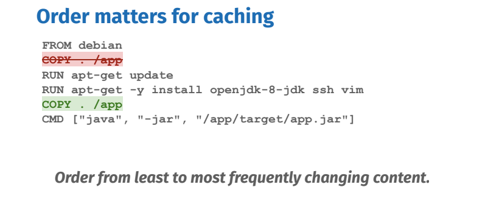

然而，构建步骤（Dockerfile 指令）的顺序很重要，因为当通过更改文件或修改 Dockerfile 中的行来使步骤的缓存无效时，其缓存的后续步骤将会中断。 从最少到最频繁更改的步骤进行排序以优化缓存。

#### Tip #2：更具体的 COPY 限制缓存破灭

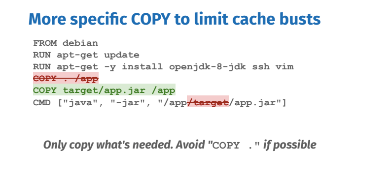

只复制所需的内容。 尽可能的避免`COPY .`。将文件复制到镜像中时，请确保您要复制的内容非常具体。 对正在复制的文件，任何更改都将会破坏缓存。 在上面的示例中，镜像中只需要预先构建的 jar 应用程序，因此只需复制它。 这样不相关的文件更改不会影响缓存。

#### Tip #3：识别可缓存的单元，例如 apt-get update＆install

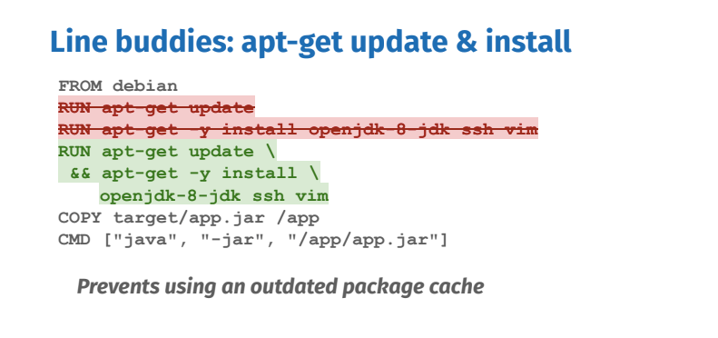

每个`RUN` 指令都可以看作是可缓存的执行单元。 其中太多可能是不必要的，而将所有命令链接到一个 `RUN` 指令可能会轻易破坏缓存，从而损害开发周期。 从包管理器安装包时，您总是希望更新索引并在同一个 `RUN` 中安装包：它们一起形成一个可缓存单元。 否则您可能会安装过时的软件包。

### 减小镜像大小

镜像大小是很重要的，那意味着较小的镜像等于更快的部署和较小的攻击面。

#### Tip #4：移除不必要的依赖

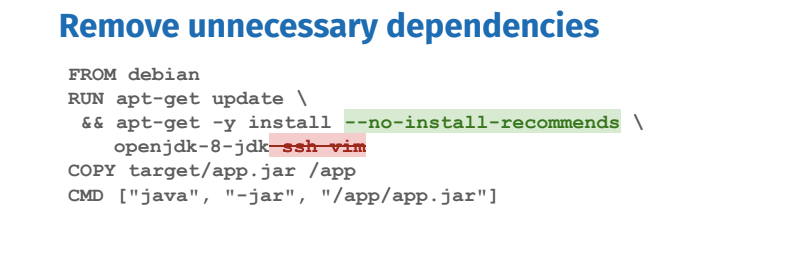

移除不必要的依赖项，不要安装调试工具。 如果需要，以后可以随时安装调试工具。 某些包管理器（如 apt ）会自动安装由用户指定的包推荐的包，从而不必要地增加占用空间。 Apt 具有 `-no-install-recommendations` 标志，可确保不安装实际不需要的依赖项。 如果需要，请明确添加。

#### Tip #5：删除包管理器缓存

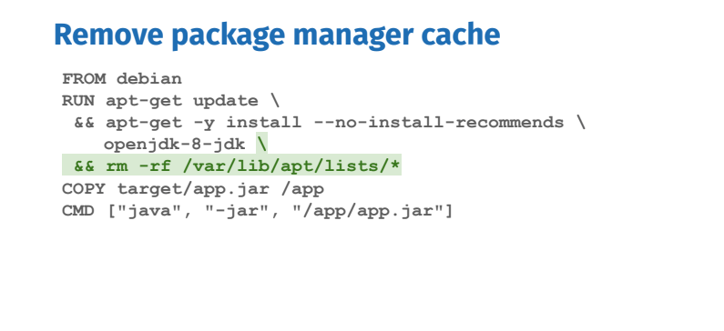

包管理器维护自己的缓存，这可能最终出现在镜像中。 处理它的一种方法是在安装包的相同RUN指令中删除缓存。 在另一个RUN指令中删除它不会减小图像大小。

还有其他方法可以减少图像大小，例如多阶段构建，这将在本博文末尾介绍。 下一组最佳实践将探讨如何优化Dockerfile的可维护性，安全性和可重复性。

### 可维护性

#### Tip #6：尽可能使用官方镜像

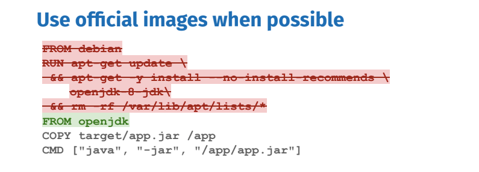

官方镜像可以节省大量维护时间，因为所有安装步骤都已完成并且应用了最佳实践。 如果您有多个项目，他们可以共享这些镜像，因为它们使用完全相同的基本镜像。

#### Tip #7：使用更具体的 tag 

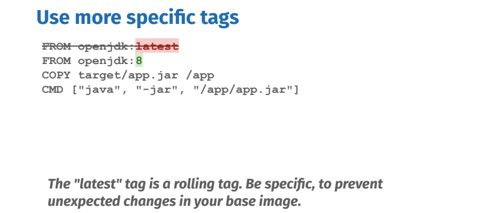

不要使用 latest 标签。虽然它具有始终可用于Docker Hub上的官方图像的便利性，但随着时间的推移可能会发生重大变化。 根据您在没有缓存的情况下重建Dockerfile的时间间隔，您可能会构建失败。

替代的是，对您的基础镜像使用更具体的标签。在此例中，我们使用 `openjdk:8`。 还有更多可用的标签，因此请查看该图像的Docker Hub文档，其中列出了所有现有的版本。

#### Tip #8：寻找最小的 Flavor

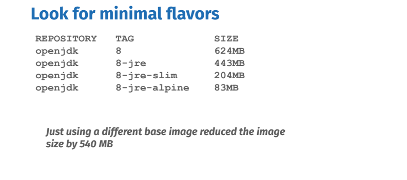

这些标签中的一些具有最小的 flavor，这意味着它们甚至可以是更小的镜像。 纤薄的变体基于剥离的Debian，而 alpine 则是基于更小的Alpine Linux分布镜像。 一个显著的区别是debian仍然使用GNU libc而alpine使用musl libc。musl libc 虽然小得多，但在某些情况下可能会导致兼容性问题。 在openjdk的情况下，jre风格只包含java运行时，而不是sdk；这也大大减少了镜像大小。

> flavor：（物理学）夸克和反夸克的一种

### 再生性

到目前为止，上面的 Dockerfiles 假设你的 jar 包是在主机上构建的。 这并不理想，因为您失去了容器提供的一致环境的好处。 例如，如果您的 Java 应用程序依赖于特定库，则可能会引入不受欢迎的不一致性，而这具体取决于构建应用程序的计算机。

#### Tip #9：在一致的环境中构建源代码

源代码是您想要构建 Docker 镜像的真实来源。 Dockerfile只是蓝图。

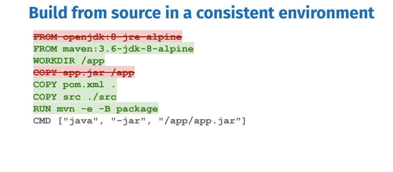

您应该首先确定构建应用程序所需的所有内容。 我们简单的 Java 应用程序需要 Maven 和 JDK，所以让我们的 Dockerfile 基于 Docker Hub 中包含 JDK 的特定最小官方 maven 镜像。 如果需要安装更多依赖项，可以在 `RUN` 步骤中执行此操作。

`pom.xml` 和 `src` 文件夹将被复制，因为它们是生成带有 `mvn` 包的 `app.jar` 应用程序的最终 `RUN` 步骤所需的。 （`-e` 标志显示错误，`-B` 以非交互式名称“批处理”模式运行）。

我们解决了环境不一致的问题，但引入了另一个问题：每次更改代码时，都会获取 `pom.xml` 中的所有依赖项。 因此有了下一个技巧。

#### Tip #10：在单独的步骤中获取依赖项

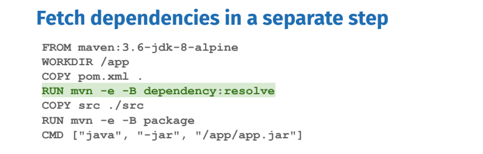

通过再次考虑可缓存的执行单元，我们可以判定获取依赖项是一个单独的可缓存单元，只需要依赖于对 `pom.xml` 文件而不是源代码的更改。 两个 `COPY` 步骤之间的 `RUN` 步骤告诉 `Maven` 只获取依赖项。

通过在一致的环境中构建引入了另外一个问题：我们的镜像比以前更大，因为它包含运行时不需要的所有构建时依赖项。

#### Tip #11：使用多阶段构建以移除构建依赖（推荐的Dockerfile）

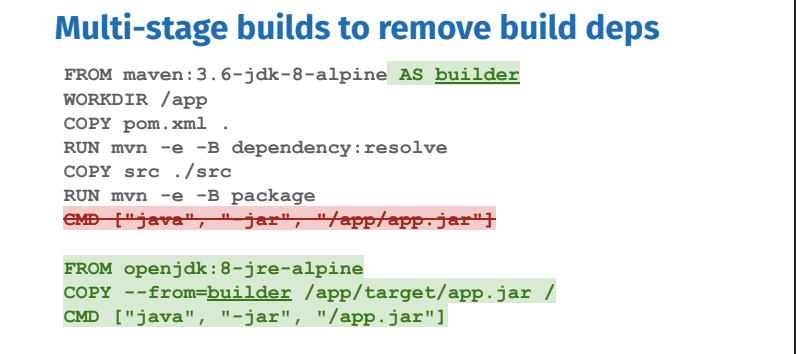

多阶段构建可由多个 `FROM` 语句识别。 每个 `FROM` 开始一个新的阶段。 它们可以用 `AS` 关键字命名，我们用它来命名我们的第一阶段“builder”，以便稍后引用。 它将在一致的环境中包含所有构建依赖项。

第二阶段是我们的最后阶段，将产生最终镜像。它将包括运行时的严格必要条件，在本例中是基于 `Alpine` 的最小 `JRE`（Java运行时）。 中间 `builder` 阶段将被缓存但不会出现在最终镜像中。 要将构建工件添加到最终图像中，请使用 `COPY --from = STAGE_NAME` 。 在本例中，`STAGE_NAME` 是 `builder`。

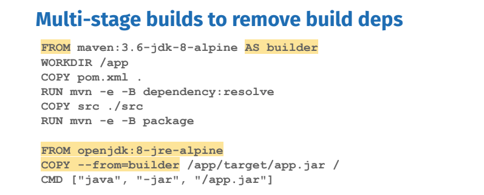

多阶段构建是消除构建时依赖性的首选解决方案。

我们从不一致地构建臃肿的镜像，到在一致环境中构建出最小镜像，同时缓存友好。 在下一篇博客文章中，我们将更多地介绍多阶段构建的其他用途。