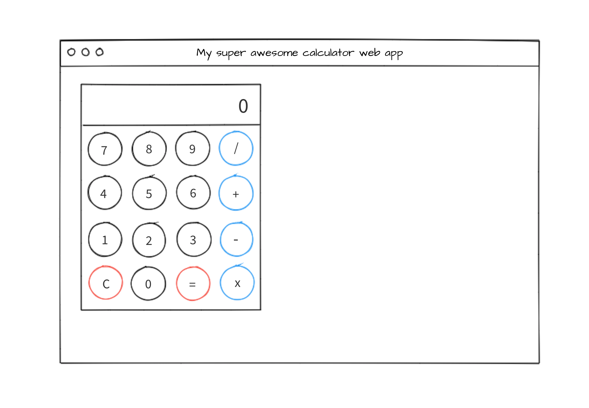

## 渣翻：开发人员是如何思考的——一次关于一个简单网页应用背后计划与设计的演练

我喜欢很多关于如何做出不同应用程序的很棒的教程。尽管如此，在创建我自己的应用程序时，我依旧会常常感到困惑。

所以我写了这篇文章来引导你经历一下我的思考过程，以下便是我如何计划并开发自己的项目的过程。

在我们开始之前的快速说明：本文不是关于创建**任意**项目的的“银弹”指南。这只是我个人完成项目的方式。它可能适合你，也可能不适合你。

这里没有“正确”的方式去创建任何一个应用。请记住：条条大路通罗马。（除非，你正带着一枚闪亮的戒指前往 Mordor ，那不幸的是，你只有一条路。）（*译者：《魔戒》梗*。）

我准备用 `React.js` 来编写示例应用代码。我在本文末尾添加了一个 `Code Sandbox` 和完成的应用程序。

因此，您还需要熟悉设置 `React` 项目。 不过不用担心，无论您使用何种语言编写应用程序，本文中的原则仍然适用。

OK，我们开始吧。今天我们要设计的是一个……`TODO-LIST`！

开玩笑啦，我们准备做一个简单的计算器。

### "What does it do?"（它是干嘛的？）

这是我在开始任何一个项目前问自己的第一个问题。我希望我的计算器可以：

- 对数字进行加、减、乘以及除
- 显示计算结果
- 重置显示

目前应该是足够了。以这种方式规划功能可以让你了解应用程序将要执行的操作，并开始将你置于“范围内”。

这种方法也为你提供了坚实的目标。一旦你实现了所有的功能，你就完成了（这个项目），之后便可开始考虑你的下一个项目了——Huzzah!（好诶！）

否则，你最终可能会尽量添加太多功能，甚至在睡梦中看到计算器。当然，如果你想，你可以持续添加功能。但要确保有最终目标努力。

在现实世界中——取决于你的角色——可能有客户或产品为你定义“它做了什么（what does it do）”的部分。您作为开发人员的工作将把这些要求分解为更详细的任务，我们将在稍后介绍。

### "What does it look like?"（它该长啥样呢？）

现在既然我已经有了它的功能的想法，接着我就会开始考虑它会是什么样子。

如果你正苦于设计，可以通过多种方式实现这一目标：

- 看一些相似应用的例子
- 浏览可以使用的元素的 CSS 框架
- 或者用你的想象力。（并非每个项目都必须看起来“不可思议”。）

我今天感觉特别有艺术气息，所以我打算用一个快速线框来绘出我想要的计算器的样子：

啊！优秀！我应该去做个艺术家。

那么我有了功能列表，而且我的画像就算是梵高，也都会引以为傲的。

现实中，当你作为团队的一员工作时，设计师可能会提供类似的东西。或者，更好的是，你可能会获得一个可以使用的工作原型。

### "How do I position and style the elements?"（我要如何定位和设计元素呢？）

对于我的 `app` 应该做什么以及是什么样子，我觉得还不错。现在是时候更加技术化了。

此时我就在想，“OK，我有了一些按钮，还有一个大显示器。我将如何把它们放到某个位置上呢？”

我喜欢把实施一个设计方案认为是有一点像建房子。打地基（**布局**），构建外部结构（**按钮**，**输入框**），然后添加最后的润色（**颜色**，**图标**，**样式**）。

当谈到布局时，我首先想到的是 `CSS Grid`，`Flexbox` 或框架（如 `Bootstrap`）。我将使用 `Flexbox`，因为它是响应性的，因此可以非常轻松地在一行排列元素，而且我喜欢这种布局。这节省了我不得不安装我们不需要的额外依赖项。

### "How does it behave?"（它是怎么运行的呢？） 

现在是时候来考虑应用会怎么运行了。这基本上会将我们的功能分解为更多细节以帮助**设计代码**。

当我自问时，我会这么来考虑这些事情：

- 当 `App` 加载时会是什么样的？
- 当用户点击按钮时会发生什么？样式会变化吗？
-  `UI` 如何对各种用户操作做出反应？

回答这个问题的另一种方式便是去实际用一下某个现有的例子。

给你一个小任务：打开你电脑上的计算器，然后做些什么。加法，乘法，随便什么。

执行操作时，看看会发生什么，是否可以捕获尽可能详细的信息。

这是我发现的：

- 当应用加载时，显示屏是设置为了“0”而且所有的按钮均是“非激活”状态。
- 当用户点击一个数字时，显示屏会更新成新的数值。单击的按钮将更改样式以向用户指示点击是否成功。
- 当用户单击运算符时，所选所选的运算符将以某种方式指示它已被选中。
- 如果已经点击了运算符，然后用户点击数字按钮时，则在用户点击下一个数字之前，显示屏将首先重置为零。
- 点击等于按钮时，将使用初始数字，所选的运算符和输入的下一个数字执行计算。
- 当用户点击清除按钮时，显示器会重置为0，整个应用也会重置。

现实中，我们不会总是拥有一个例子或原型等奢侈品。但随着你经验的增长，基于线框或者模型来实现也变得越来越容易。这就是为什么我想建议初学者复制现有的应用程序，因为这为你提供了一个实践批判思维和分析的例子。

但为什么我们必须深入细节呢？好问题。答案是因为计算机非常聪明，但也非常愚蠢。（不信？试着从你的代码里随机删除一个花括号，就会乱套了。）

我们给计算机的说明必须**非常具体**。例如，回顾上面的行为，点击一个数字会有所不同，具体取决于是否点击了运算符。

我们作为人类知道计算器是如何工作的，但对计算机而言，得我们告诉它才行。

### "What will my code look like?"（我的代码会是什么样的？）

就像是我花了一段时间设计了 UI ，对于代码我也会如此。这有许多好处：

- 会让我仔细考虑需要什么组件
- 让我思考工作流程
- 这意味着编写代码会更容易/更快，因为我有一个计划
- 及早发现问题和问题点

我之前提到过，对于这个项目，我的目标是保持简单，所以我会坚持这种实现方式。一开始，我会将所有内容保存在一个组件中。但是，在下列情况下，我将开始重构并拆分成组件：

- 代码增长到难以管理或推理的程度
- 有很多重复的代码
- 页面上的单个元素需要它自己的功能和状态

你有没有在结束一个项目的时候，然后想到，“噢，我忘了一些事情，我必须要重新设计所有东西！”通过提前计划，你将避免这个陷阱。考虑到这一点，这是我认为我会需要的东西。不要整天考虑它，在计划和刚入门之间找到平衡点。让我们将 UI 模型分解为它的各个部分，并考虑将需要哪些代码。

#### The Display（布局）

我的显示屏向用户显示当前的数字，因此我需要一些**状态值**。点击什么都不会发生，那么我便不需要任何东西在那个位置。

#### The number buttons（数字键）

因为数字键会影响显示屏展示的数字，所以我需要一个由 `onClick` 事件调用的**函数**来管理它。目前无需将所选数字存储在状态里。

#### The operator buttons（运算符按钮）

运算符按钮是一个有趣的按钮——当不同的事情发生时（记住我们上文关于"How does it behave?"的内容）。因为我需要知道当前选择的运算符，所以我也将它存储为状态值。

#### The equals buttons（等于按钮）

等于按钮应该取展示值，运算符，先前的输入值并计算结果。简单！

不完全是，我们遇到了第一个问题！让我们回顾一下我们的行为。

> 如果点击了运算符按钮，然后用户点击数字按钮，则显示器将首先重置，然后显示用户点击的数字。

用户点击运算符并开始输入下一个数字时，用户输入显示器的第一个数字会被重置——这意味着我们的应用程序不知道当用户点击等号是第一个数字是什么（我告诉过你计算机是很笨的）！让我们想一下：

运算符按钮被点击后，此时显示器重置，并使用用户输入的下一个数字进行更新。从逻辑上讲，点击运算符时存储先前的显示值是有意义的。为此，我需要一个函数和一个状态值，用于存储点击运算符时的显示值。

#### The clear button （清除按钮）

这是比较简单的一个——重置我们的状态值为 0，允许用户再次使用。我将需要一个 `onClick` 函数关联到这个按钮来处理这个问题。

### "What do I need to test? And what can go wrong?"（我需要测试哪些？什么会出错呢？）

取决于你的谈话对象，可以采用不同的方式进行测试。有些人喜欢做 TDD （首先编写测试），有些人喜欢在最后编写它们。我都会做，这取决于项目。但主要的是，你总得在某个时候去写它们（测试）。

我考虑测试的时候，会看一下下面的需求。第一个需求（或者功能）是：

- 数字的加、减、乘以及除

所以我需要测试这个应用程序可以做这些事情。我不会对如何编写测试深入细节，但是一个好的测试用例应该覆盖：

- 需求和常见用例
- 边界条件（例如用户输入 99999999999999999999 + 9999999999999999999999）
- 错误情况和中断异常（例如用户试图除以零）

“我应该写多少测试呢？”，这可能是你的下一个问题。不幸的是，并没有一个硬性指标。你可以有无穷无尽的输入量。如果遵循上述要点，你将拥有适用于任何项目的可靠测试组。

及早考虑你的测试将有助于考虑代码中可能出现的错误，并在设计的早期阶段提供相应的保障。

### Let's look at the code（让我们看一下代码）

这不是一个编码教程，所以我不打算在本文中深入探讨每一步的细节。请参阅末尾的代码沙盒以查看工作示例（*译者注：读者可去查看原文操作沙盒*），包括下面概述的每个步骤的代码/演示。代码分支可以随意 fork，运行，破坏，随心所欲就好。

在编写代码时，我们会按照这个计划：

- 重点是首先使用我们的线框作为参考来获取 UI 布局和元素
- 实现逻辑（JS，时间处理程序等）
- 最后的修饰
- 记住做最简单的事情来让一切都可工作——一开始就没必要担心重构和性能！

#### 第一步：布局和基本 UI 元素

（在下面的沙盒中，点击  `Step 1` 按钮查看工作示例，可参阅 `app-step-1.js`  以查看代码！）

请记住，我们将从布局开始，并将我们应用的“脚手架”结合在一起。这将包括添加 `HTML`  和使用 `Flexbox`，以定位我们的显示和按钮。他们什么也做不了，但看起来好看啊！某种程度上。

#### 第二步：添加逻辑

（在下面的沙盒中，单击 `Step 2` 按钮查看工作示例，请参阅 `app-step-2.js` 以查看代码！）

我们已经完成了对这部分的规划，所以让我们回顾一下。在我们“我的代码会是什么样的”章节中，我们必须创建一对不同的状态对象和函数来处理事件。

为此，我从“我的代码会是什么样的？”列表中一次选择一项，并参考“它是如何操作的？”将所有东西拼凑在一起。我实现了功能，并测试它是否正常工作（通常是自动化但手动也行）。例如：

列表中的第一个项是**显示屏**。 所以我将为此添加状态变量和逻辑。 测试它是否正常工作，然后转到数字键，然后重复。 这是提前编写测试的益处 —— 你可以经常运行该用以以确保没有任何功能损坏。

#### 第三步：添加铃声和口哨声

（在下面的沙盒中，单击 `Step 3` 按钮查看工作示例，请参阅 `app-step-3.js` 以查看代码！）

真棒，我们差不多完成了！现在逻辑是可运行的，我们现在将添加一些更精细的手指触感（圆形按钮，边框，更大的显示屏）到应用程序，我们已经完成了！我们的基本计算器现在可以做些事情了！

#### 第四步：交给你了！

我故意剩下一些东西，你可以继续尝试，如果你愿意的话。 使用我们目前学到的方法——考虑行为，你需要什么功能/状态对象等。

- 我们的计算器与线框设计不完全匹配——你可以为按钮添加一些颜色吗？如果在点击是更改所选按钮的颜色怎么样？
- 没有测试！看看你是否可以添加一些。
- 存在一些重复的代码——你能找到一种渲染按钮方法，来让我们不需要通过硬编码完成 16 个按钮元素吗？
- 错误处理——不存在！这是不好的。如果你试图除以零会发生什么？或者你的数字比显示屏宽？
- 当用户开始输入数字时，前面的另都会添加到显示品中，例如 `000003` 这不是一个好的用户体验，你可以解决它吗？

### 译者总结

如何开始写一个自己的应用程序或者项目？如果你往往很难开头的话，本文作者给我们提供了一个很好的思路，从功能开始，然后是外观，然后是逻辑，等完成这些设计功能之后，便可以开始完善代码和测试了。当然，作者本人也说了，这种方式可能适合你，也可能不适合你，但最开始我们的目标应该是一致的。在开始一个应用程序或者项目的时候，我们不应该过多考虑设计规范与设计模式这些事情，而是致力于让项目简单易懂，结构清晰，可工作，有完善的测试点和测试用例，在编写代码的时候你自然会涉及到设计原则与设计模式这些东西，我深信，这些东西已经融入了你的血肉。在完成应用程序或者项目之后，我们再来审视一下自己的代码，进而接着去考虑重构和抽象出中间件这些工作。

希望你看完这篇文章会有一定的启示。

### 链接

原文地址：

https://www.freecodecamp.org/news/a-walk-through-the-developer-thought-process/