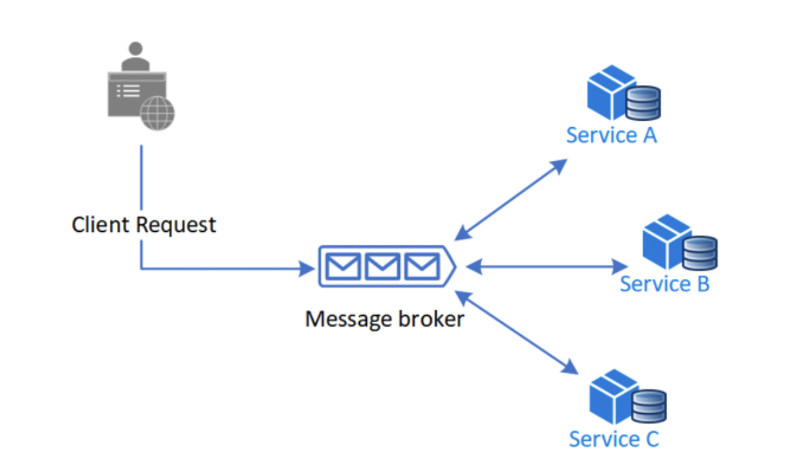
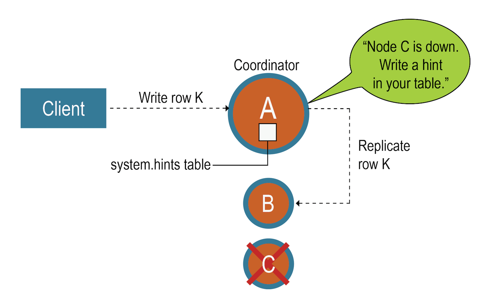

## 渣翻：分布式系统的设计模式

> 原文地址： https://www.freecodecamp.org/news/design-patterns-for-distributed-systems/

当我刚开始作为后端工程师的职业生涯时，我一直在为单个系统工作。

这工作不错，但在我的脑海里一直有一个这样的想法：

> “伙计，我想在大型系统上工作，例如谷歌，Netflix等...”

在一位同事谈论之前，我甚至不知道“**分布式系统**”这个术语。

然后我开始研究 —— 我研究了很多，它看起来很复杂，同时我觉得也是很愚蠢的事物。

但我曾经也是很兴奋的。

我研究了一段时间的分布式系统概念，但直到几年后我看到它的全部操作才完全理解它。

现在我有一些经验，我想和大家分享我对分布式系统的了解。

### 1. 先决条件

我将在这里讨论的主题对于初学者程序员来说可能有点高级。为了帮助你做好准备，以下是我假设你知道的内容：

- 中等编程水平（任何语言都可以）

- 基本的计算机网络知识（TCP/IP、网络协议等）

- 基本数据结构和算法（大 O 表示法、搜索、排序等）

- 数据库（关系数据库、NoSQL 数据库等）

*这听起来很多，但也别气馁，可以慢慢学，原文有学习链接，我这里就不贴了。*

**以下是我们将介绍的内容：**

1. 什么是分布式系统？

2. 分布式系统中的常见挑战

3. 命令和查询责任分离（CQRS）模式

4. 两阶段提交（2PC）模式

5. Saga 模式

6. 复制负载均衡服务 （RLBS） 模式

7. 分片服务模式

8. 边车（Sidecar）模式

9. 预写日志技术

10. 脑裂模式

11. 提示切换（Hinted Handoff）模式

12. 读取修复模式

13. 服务注册表模式

14. 断路器（Circuit Breaker）模式

15. 领导人选举模式

16. 隔板（隔舱）模式

17. 重试模式

18. 离散聚集（Scatter Gather）模式

19. 布隆过滤器（Bloom Filters）数据结构

### 2. 什么是分布式系统？


*网飞的系统架构图*

当我开始我的职业生涯时，我是一家机构的前端开发人员。我们过去常常收到客户的请求，然后我们只是建立他们的网站。那时，我并不完全了解我正在构建的东西背后的架构和基础设施。现在回想起来，一点也不复杂。

我们有一个用 PHP 和 `Yii2`（PHP框架）编写的后端服务，还有一个用 `JavaScript` 和 `React` 编写的前端。所有这些都被部署到 ps.kz 托管的一台服务器（哈萨克斯坦托管服务提供商），并使用 NGINX 作为 Web 服务器在互联网上开放。

此体系结构适用于大多数项目。但是，一旦应用程序变得更加复杂和流行，裂缝就会开始显现。

你会遇到如下问题：

- **复杂性** – 代码库太大，太复杂，一个人无法处理。创建新功能和维护旧功能也很难。

- **性能问题** - 你的应用程序的受欢迎程度导致它有大量的网络流量，并且已被证明对于单个服务器来说太多了。因此，应用程序已开始面临性能问题。

- **不灵活** – 拥有单一代码库意味着只能使用你开始使用的技术栈。如果你想改变它，那么你要么必须用另一种语言重写整个项目，要么分解应用程序。

- **脆弱的系统** – 代码高度耦合在一起意味着如果任何功能中断，那么整个应用程序就会中断。这会导致更多的停机时间，也将使企业损失更多的钱。

有许多方法可以优化整体式应用程序，并且可以走得很远。许多大型科技公司，如 Netflix，谷歌和 Facebook（Meta）都是从单体应用程序开始的，因为它们更容易启动。

但他们都开始面临大规模单体的问题，必须找到一种方法来解决这个问题。

他们做了什么？他们重组了他们的架构。因此，他们现在不再拥有包含其业务所有功能的单一超级服务，而是拥有多个相互通信的独立服务。

这是分布式系统的基础。

有些人将分布式系统误认为是微服务。真相是 —— 微服务是一个分布式系统，但分布式系统并不总是遵循微服务架构。

因此，考虑到这一点，让我们为分布式系统提出一个正确的定义：

> 分布式系统是一种计算环境，其中各种组件分布在网络上的多台计算机（或其他计算设备）上。

### 3. 分布式系统中的常见挑战

分布式系统比单体系统复杂得多，这就是为什么在迁移或启动新项目之前，应该提出一个问题：**我真的需要它吗？**

如果你决定确实需要一个分布式系统，那么将面临一些常见的挑战：

- **异构性** – 分布式系统允许我们使用各种不同的技术。问题在于我们如何在所有不同服务之间保持一致的通信。因此，必须商定和通过共同标准，以简化这一进程。

- **可扩展性** – 扩展并非易事。有许多因素需要牢记，例如规模、地理位置和管理。有许多边缘情况，每种情况都有自己的优点和缺点。

- **开放性** – 如果分布式系统可以扩展和重新开发，则认为它们是开放的。

- **透明度** – 透明度是指分布式系统隐藏其复杂性并对外体现出单个系统的能力。

- **并发** – 分布式系统允许多个服务使用共享资源。当多个服务尝试同时访问相同的资源时，可能会出现问题。我们使用并发控制来确保系统保持稳定状态。

- **安全性** – 安全性由三个关键组件组成：可用性、完整性和机密性。

- **故障处理** – 分布式系统中出错的原因有很多（例如，软件、网络、硬件等）。最重要的是我们如何以优雅的方式处理这些错误，以便系统能够自我修复。

是的，设计健壮且可扩展的分布式系统并不容易。但你并不孤单。其他聪明人也面临类似的问题，并提供了称为设计模式的常见解决方案。让我们来介绍一些最流行的。

PS. 我们不仅会介绍模式，还会介绍任何有助于分布式系统的东西。这可能包括数据结构、算法、常见场景等...

### 4. 命令和查询责任分离 （CQRS） 模式


*其实就是我们常说的读写分离。*

假设您有一个拥有数百万用户的应用程序。你有多个服务来处理后端，但只有单个数据库来提供服务。

当你在同一数据库上进行读取和写入时，会出现问题。写入的计算成本比读取高得多，并且系统开始受到影响。

这就是 CQRS 模式解决的问题。

它指出写入（命令）和读取（查询）应分开。通过分离写入和读取，我们可以允许开发人员分别优化每个任务。

例如，你可以选择高性能数据库进行写入操作，选择缓存或搜索引擎进行读取操作。

#### 4.1 优点

- **代码简化** – 通过分离写入和读取来降低系统复杂性。

- **资源优化** – 通过为写入和读取提供单独的数据库来优化资源使用情况。

- **可伸缩性** – 提高读取的可伸缩性，因为只需添加更多数据库副本即可。

- **减少错误数量** – 通过限制可以修改共享数据的实体，我们可以减少意外修改数据的机会。

#### 4.2 缺点

- **代码复杂性** – 通过要求开发人员单独管理读取和写入来增加代码复杂性。

- **增加开发时间** – 这可能会增加开发时间和成本（仅在开始时）。

- **其他基础结构** – 这可能需要其他基础结构来支持单独的读取和写入模型。

- **延迟明显** – 发送高吞吐量查询时，可能会导致延迟更加明显。

#### 使用案例

当应用程序的写入和读取具有不同的性能要求时，最好使用 CQRS。但这并不总是最好的方法，开发人员在采用该模式之前应仔细考虑利弊。

下面是一些使用 CQRS 模式的用例：

- **电子商务** – 产品目录和建议的单独读取模型，而写入端处理订单处理和库存管理。

- **银行** – 优化余额查询和报告的读取模型，而写入端处理交易和计算。

- **医疗保健** – CQRS 可用于优化患者搜索、医疗记录检索和生成报告的读取，而写入端则管理数据更新、计划和治疗计划。

- **社交媒体** – 通过应用 CQRS，读取模型可以有效地处理提要生成、个性化内容建议和用户配置文件查询，而写入端处理内容创建、更新和参与跟踪。

### 5. 两阶段提交（2PC）模式


2PC 解决了数据一致性（*译者：后面我们会有文章来主要介绍数据一致性*）问题。当有多个服务与关系数据库通信时，很难保持数据的一致性，因为一个服务可以创建（数据库）事务，而另一个服务会中止事务。

2PC 是一种协议，可确保所有服务在事务完成之前提交或中止事务。

它分两个阶段工作。第一阶段是**准备阶段**，事务协调器告知服务准备数据。然后是**提交阶段**，该阶段向服务发出发送准备好的数据的信号，然后提交事务。

2PC 系统确保默认情况下所有服务都已锁定，这意味着他们还不能写入数据库。

锁定后，服务将完成“准备”阶段以准备好其数据。然后，事务协调器逐个检查每个服务，以查看它们是否有任何准备好的数据。

如果它们准备好了，那么服务就会被解锁，数据就会被提交。如果没有，则事务协调器将转到另一个服务。

2PC 确保一次只能运行一个服务，这使得该过程比 CQRS 更具抵抗力和一致性。

#### 5.1 优点

- **数据一致性** – 确保分布式事务环境中的数据一致性。

- **容错** – 提供处理事务失败和回滚的机制。

#### 5.2 缺点

- **阻塞** – 协议可能会在系统中引入延迟或阻塞，因为它可能必须等待无响应的参与者或解决网络问题才能继续处理事务。

- **单点故障** – 依赖单个协调器会引入潜在的故障点。如果协调器失败，协议可能会中断，导致事务失败或延迟。

- **性能开销** – 协议中额外的通信轮次和协调步骤引入了开销，这可能会影响整体性能，尤其是在参与者众多或网络延迟较高的场景中。

- **缺乏可扩展性** – 随着参与者数量的增加，协调和通信开销也会增加，这可能会限制协议的可扩展性。

- **恢复期间阻塞** – 协议可能会在恢复期间引入阻塞，直到失败的参与者重新联机，从而影响系统可用性和响应能力。

#### 5.3 使用案例

2PC 最适合用于处理必须准确的重要事务操作的系统。以下是一些 2PC 模式有益的用例：

- **分布式数据库** – 在分布式数据库系统中的多个数据库之间协调事务提交或中止。

- **金融系统** – 确保跨银行、支付网关和金融机构的原子和一致的交易处理。

- **电子商务平台** – 协调库存管理、支付处理和订单履行等服务，以实现可靠和一致的交易处理。

- **预订系统** – 协调预订流程中的分布式资源和参与者，以实现一致性和原子性。

- **分布式文件系统** – 跨分布式文件系统中的多个节点或服务器协调文件操作以保持一致性。

### 6. Saga 模式

*Saga 设计模式是一种在分布式事务场景中跨微服务管理数据一致性的方法，即也是处理分布式事务的设计模式。*

那么，让我们假设你有一个电子商务应用程序，它有三个服务，每个服务都有自己的数据库。有一个 `/product` 的 API 接口，你可以将产品及其所有信息添加到其中。

每当你创建产品时，还必须创建其价格和元数据。这三者都在具有不同数据库的不同服务中进行管理。因此，你要实现以下简单方法：

```
创建产品 -> 创建价格 -> 创建元数据
```

但是，如果创建了一个产品但未能创建价格怎么办？一个服务如何知道另一个服务的事务失败？

Saga 模式解决了这个问题。有两种方法可以实现 Saga ：**协调和编排。**

#### 6.1 协调


第一种方法称为协调。你有一个中央服务（协调器），它以正确的顺序调用所有不同的服务。中央服务确保如果发生故障，它将知道如何通过还原事务或记录错误来补偿故障。

##### 6.1.1 优点

- 适用于涉及多个服务或随时间添加的新服务的复杂事务。

- 适用于控制流程中的每个参与者并控制活动流程的情况。

- 不会引入循环依赖项，因为业务流程协调程序单方面依赖于 saga 参与者。

- 服务不需要了解其他服务的命令。关注点有明确的分离，从而降低了复杂性。

##### 6.1.2 缺点

- 额外的设计复杂性要求您实现协调逻辑。

- 如果业务流程协调程序失败，则整个系统将失败。

##### 6.1.3 何时使用 协调？

你要考虑：

- 如果你需要协调工作流的集中式服务。

- 如果你想要一个清晰而集中的工作流程视图，以便更容易理解和管理整个系统行为。

- 如果你有需要高度协调和集中控制的复杂动态工作流。

#### 6.2 编排



另一方面，编排方法不使用中央服务。相反，服务器之间的所有通信都是通过事件（消息）进行的。服务将对事件做出反应，并知道在成功或失败时该怎么做。

因此，对于我们上面的例子，当用户创建产品时，它将：

1. 创建一个名为 `product-created-successfully` 的事件

2. 然后，价格服务将通过为产品创建价格来对事件做出反应，然后它将创建另一个名为 `price-created-successfully` 的事件

3. 相同的逻辑也适用于元数据服务。

##### 6.2.1 优点

- 适用于不需要复杂协调逻辑的简单工作流。

- 易于实施，因为它不需要额外的服务实施和维护。

- 没有单点故障，因为责任在服务之间分配。

##### 6.2.2 缺点

- 难以调试，因为很难跟踪哪些 Saga 服务侦听哪些命令。

- Saga 服务之间存在循环依赖的风险，因为它们必须使用彼此的命令。

- 集成测试很困难，因为必须运行所有服务才能模拟事务。

##### 6.2.3 何时使用 编排？

你要考虑：

- 应用程序需要在多个微服务之间保持数据一致性，而无需紧密耦合。

- 存在长期事务，如果一个微服务长时间运行，不希望阻塞其他微服务。

- 如果操作在序列中失败，则需要能够回滚。

### 7. 复制负载均衡服务（RLBS）模式


这本质上是一个**负载均衡器** —— 我不知道为什么他们让它听起来如此令人生畏。负载均衡器是在一组资源之间平均分配网络流量的软件或硬件，但情况并非总是如此——它还可以将不同的路由路由到不同的服务。

比如：

- `/frontend` 转到前端服务。

- `/api` 转到后端服务。

#### 7.1 优点

- **性能** – 负载均衡在多个资源之间均匀分配工作负载，防止任何单个资源过载。这样可以缩短响应时间，减少延迟，并提高访问系统的用户或客户端的整体性能。

- **可扩展性** – 负载均衡支持水平扩展，这意味着你可以使用更多服务器，而不是更强大的服务器。

- **高可用性** – 如上所述，负载均衡也允许我们垂直扩展，这意味着我们有多个服务器。如果一台服务器发生故障，则负载均衡器将检测到该故障，并且可以将流量重定向到其他工作服务器。

- **更好的资源利用率** – 负载平衡通过在多个服务器或资源之间均匀分配流量来帮助优化资源利用率。这可确保有效使用每个服务器或资源，从而有助于降低成本并最大限度地提高性能。

#### 7.2 缺点

- 复杂性 – 实施和配置负载均衡可能很复杂，尤其是对于大型系统。

- **单点故障** – 虽然负载均衡增强了系统可用性，但它们也可能成为单点故障。如果负载均衡器本身发生故障，则可能导致其背后的所有资源的服务中断。

- **开销增加** – 负载均衡计算不是免费的，如果它们不受控制，那么它们可能会成为整个系统的瓶颈。

- **会话（Session）处理挑战** – 负载均衡处理有状态的应用程序时会有点棘手，因为你需要维护会话。它需要其他机制，例如粘性会话或会话同步，这增加了复杂性。

#### 7.3 何时使用负载均衡

负载均衡主要用于：

- 你有一个高流量的网站，并且希望分散负载，以便服务器不会炸掉。

- 你拥有来自世界各地的用户，并希望从他们最近的位置为他们提供数据。你可以在亚洲拥有一台服务器，在欧洲拥有另一台服务器。然后，负载均衡会将亚洲用户路由到亚洲服务器，将欧洲用户路由到欧洲服务器。

- 你有一个面向服务的体系结构，其中 API 对应于不同的服务。负载均衡可用作简单的 API 网关。

### 8. 分片服务模式


*左图为副本服务，右图为分片服务。*

副本服务，即复制的服务。任何请求都可以由任何服务处理。这是因为它们是彼此的复制品。

这适用于无状态服务。但是，如果有状态的服务怎么办？那么分片方法会更合适。

分片服务仅接受某些类型的请求。例如，你可能需要让一个分片服务接受所有缓存请求，而另一个分片服务接受高优先级请求。

**但是，我们如何实现这一点呢？**

好吧，如果我们严格谈论的是应用程序服务，那么你可以使用面向服务（SOA）的体系结构方法，独立开发和部署多个服务。

然后，你可以使用负载均衡按 URL 路径将请求路由到相应的服务。

PS. *分片不仅用于应用服务，还可用于数据库、缓存、CDN 等。*

#### 8.1 优点

- **可扩展性** – 分片允许你在多个节点或服务器之间分配负载，从而实现水平扩展。随着工作负载的增加，可以添加更多分片。

- **性能** – 单个节点不必处理所有请求，尤其是在计算繁重的情况下。每个节点都可以接收请求的子集，从而提高系统性能。

- **成本效益** – 分片可以成为扩展系统的经济高效的解决方案。莫可以使用商用硬件并将工作负载分布在多个较便宜的服务器上，而不是投资单个高容量服务器。

- **故障隔离** – 分片提供一定级别的故障隔离。如果一个分片或节点发生故障，其余分片可以继续为请求提供服务。

#### 8.2 缺点

- **复杂性** – 分片不容易实现。它需要仔细规划和设计来处理数据分发、一致性和查询协调。

- **运营开销** – 管理分片系统涉及额外的运营任务，例如监控、维护和备份，这可能需要更多资源和专业知识。

#### 8.3 使用案例

分片服务模式通常用于以下场景：

- **性能要求** – 如果你的系统正在处理单个服务器无法处理的大量数据或高读/写工作负载，则分片可以将工作负载分布到多个分片之间。这样可以实现并行处理并提高整体性能。

- **可扩展性要求** – 当你预计未来需要水平可扩展性时，可以从一开始就实施分片，以提供添加更多分片的灵活性，并随着工作负载的增长扩展系统。

- **成本考虑因素** – 如果垂直扩展（升级到更强大的硬件）变得成本过高，分片通过将工作负载分布在多个较便宜的服务器或节点上，提供了一种经济高效的替代方案。

- **地理分布** – 当你需要跨不同的地理位置或数据中心分布数据时，分片可能非常有用，可以提高性能并减少不同区域的用户的延迟。

但请记住，在对服务进行分片时必须仔细考虑，因为实现和还原非常复杂且成本高昂。

### 9. 边车（Sidecar）模式


*载人的摩托车是主应用，载狗的边车是 sidecar*


在面向服务（SOA）的体系结构中，你可能具有许多常见功能，例如错误处理、日志记录、监视和配置。过去，有两种方法可以解决此问题：

**在服务中实现常见功能**

这种方法的问题在于，功能性程序紧密链接，并通过有效利用共享资源在同一进程中运行。这使得组件相互依赖，如果一个功能失败，则可能导致另一个功能失败或整个服务失败。

**在单独的服务中实现常见功能**

这似乎是一个很好的方法，因为功能性程序可以用任何语言实现，并且它不与其他服务共享资源。缺点是，当我们在不同的容器上部署两个服务时，它会增加应用程序的延迟，并且增加了托管、部署和管理方面的复杂性。

**我们怎么做更好呢？**

一种方法是使用边车模式。它指出，容器应该只解决一个问题并做好。因此，我们有一个带有两个容器的单个节点（虚拟机或物理机）。

第一个是包含业务逻辑的应用程序容器。第二个容器（通常称为 sidecar）用于扩展/增强应用程序容器的功能。

现在你可能会问，“但是，它是如何变得更有用呢？”

首先记住，sidecar 服务在与应用程序容器相同的节点中运行。所以它们共享相同的资源（如文件系统、内存、网络等......）

**一个例子**

假设你有一个生成日志并将其保存在卷（持久化数据）中的旧版应用程序，并且希望将它们提取到外部平台（如 ELK）中。

一种方法是扩展主应用程序。但由于代码混乱，这很困难。

因此，你决定采用 sidecar 方法并开发一个功能性程序服务，该服务：

- 从卷中捕获日志

- 将日志传输到 Elastic（日志服务弹性服务器）

节点的体系结构如下：


泰酷辣，你没有更改应用程序中的任何代码，并且通过插入 sidecar 扩展了其功能。甚至可以将此日志聚合器 sidecar 容器插入其他应用程序。

#### 9.1 优点

- **模块化** – Sidecar 允许您独立开发和维护功能性程序功能。

- **可伸缩性** – 如果 sidecar 上的负载过多，可以通过添加更多容器而轻松地进行水平扩展。

- **隔离** – sidecar 与主应用程序隔离，提供额外的安全层。

#### 9.2 缺点

- **复杂性** – 它需要对多个容器及其依赖项进行额外管理。

- **资源开销** – 因为我们有一个额外的容器，这可能会增加应用程序的整体资源使用率。

- **协调** – Sidecar 必须以与主应用程序正常工作的方式进行协调，这会增加复杂性。

- **调试** – 使用 sidecar 模式进行调试更加困难，因为它需要跟踪主应用程序和 sidecar 之间的交互。

#### 9.3 使用案例

当你想要在不接触核心业务逻辑代码的情况下向应用程序添加其他功能时，sidecar 模式非常有用。通过部署 sidecar，核心逻辑可以保持轻量级并专注于其主要任务，而边车可以处理其他功能。

如果需要，也可以将 sidecar 重用于其他应用程序。现在我们知道了何时使用此模式，让我们看一下它有益的一些用例：

- **日志记录和监控** – Sidecar 容器从主容器收集日志和指标，提供集中存储和实时监控以提高可观测性。

- **缓存** – Sidecar 容器缓存频繁访问的数据或响应，通过减少对外部服务的重复请求来增强性能。

- **服务发现和负载平衡** – Sidecar 容器向服务发现系统注册主容器，从而在主容器的多个实例之间实现负载平衡和容错。

- **安全性和身份验证** – Sidecar 容器处理身份验证任务，从主容器解放了 OAuth、JWT 验证或证书管理等职责。

- **数据转换和集成** – Sidecar 容器执行数据转换和集成任务，促进主容器与外部系统之间的无缝通信和同步。

- **代理和网关** – Sidecar 容器充当代理或网关，提供速率限制、SSL 终止或协议转换等功能，以增强通信功能。

- **性能优化** – Sidecar 容器处理 CPU 密集型任务或后台进程，优化资源使用并提高主容器的性能。

### 10. 预写日志技术

想象一下：你正在处理连接到包含敏感用户信息的数据库的服务。有一天，服务器崩溃了。数据库崩溃。除了备份之外，所有数据都消失了。

将数据库与备份同步，但备份不是最新的。已经 1 天了，你坐在角落里哭泣。

谢天谢地，这很可能永远不会发生。

因为大多数数据库都有一种称为预写日志 （`write-ahead log`， WAL） 的东西。

#### 10.1 什么是预写日志？

预写日志是一种常用的技术，用于保留：

- **原子性** – 每笔交易都被视为一个单元。要么执行整个事务，要么不执行任何事务。这可确保数据不会损坏或丢失。

- **持久性** – 确保即使在系统故障的情况下，数据也不会丢失。

#### 10.2 它是如何工作的？

WAL 将您所做的每个更改存储到硬盘上的文件上。例如，假设您创建了自己的内存数据库，名为 KVStore。如果发生系统故障，需要实现：

- 不会丢失的数据。

- 要恢复到内存中的数据。

因此，你决定实现预写日志。

每次执行任何事务（`SET` 或 `REMOVE`）时，该命令都将记录到硬盘上的文件中。这使我们能够在系统故障时恢复数据。内存将被刷新，但日志仍存储在硬盘驱动器中。整体架构如下所示：


#### 10.3 不全是阳光和彩虹

尽管它很有用，但 WAL 并不容易实现。有很多细微差别，但最常见的是：

**性能**

如果在大多数编程语言中使用标准文件处理库，则很可能会需要文件“flush”（刷）到硬盘上。将日志刷入磁盘将为你提持久性的有力保证。但这严重限制了性能，并可能很快成为瓶颈。

你可能会问，“我们为什么不延迟刷新或异步刷新？

好吧，这可能会提高性能，但如果服务器在刷新条目之前崩溃，则有丢失日志条目的风险。此处的最佳做法是实现批处理等技术，以限制刷新操作的影响。

**数据损坏**

另一个注意事项是我们必须确保检测到损坏的日志文件。要解决此问题，请通过 CRC（循环冗余校验）记录保存日志文件，该记录在读取时验证文件。

**存储**

单个日志文件可能难以管理，并且会占用所有可用存储空间。若要解决此问题，可以使用以下技术：

- **分段日志** – 将单个日志拆分为多个分段。

- **低水位线** – 此技术可告诉我们能安全丢弃日志的哪一部分。

这两种技术可以一起使用，因为它们都是相辅相成的。

#### 10.4 重复条目

WAL 只会追加，这意味着只能添加数据。由于此行为，我们可能会有重复的条目。因此，当应用日志时，它需要确保忽略重复项。

解决此问题的一种方法是使用 `hashmap`，其中对同一键的更新是幂等的。如果没有，那么需要有一种机制来用唯一标识符标记每个事务并检测重复项。

#### 10.5 使用案例

总体而言，WAL 主要用于数据库，但在其他领域也可能有益。预写日志 （WAL） 广泛用于各种系统和数据库。以下是预写日志的一些常见用例：

- **文件系统** – 文件系统可以使用预写日志记录来维护数据一致性。通过在将更改应用到文件系统之前记录更改，WAL 允许崩溃恢复，并帮助防止在系统故障时数据损坏。

- **消息队列和事件溯源** – 预写日志通常用于消息队列和事件溯源体系结构。日志充当事件的可靠有序记录，允许可靠的消息传递、事件重放和系统状态还原。

- **分布式系统** – 需要跨多个节点保持一致性的分布式系统可以从预写日志中受益。通过协调日志复制和重播，WAL 有助于同步数据更新并确保分布式环境中的一致性。

### 11. 脑裂（Split-Brain）模式


这绝对是一个有趣的名字，不是吗？它可能会让你想到大脑的两半。嗯，它实际上也是有些类似。

分布式系统中的节点在分布式系统中相互断开连接但仍继续运行时，就会发生脑裂。脑裂？节点应该一起工作时，但是它却独立工作？听起来很像？希望如此。（*通俗点来解释就是有了好几个大脑，谁也不听谁的*）

无论如何，最大的问题是它会导致：

- 数据不一致

- 争夺资源

这通常会在开发人员尝试修复问题时关闭集群。这会导致停机，从而使企业亏损。

#### 11.1 有什么解决办法？

一种解决方法是使用世代数。每次选举集群 leader 时，世代数都会递增。例如，如果旧 leader 的世代数为 1，则第二个领导者的世代数将为 2。（*第 1 代，第 2 代……*）

每个请求中都包含世代号，现在客户端可以信任编号最高的 leader。但请记住，世代数必须保留在磁盘上。

一种方法是使用预写日志。看吧，事物都是相互连通的。

此解决方案被归类为领导人选举，但还有其他解决方案：

- **基于仲裁的共识** – 使用 `Raft` 或 `Paxos` 等算法来确保只有大多数节点可以做出决策，从而防止在裂脑情况下做出冲突的决策。

- **网络分区检测** – 使用监视技术或分布式故障检测器来识别网络分区并采取适当的措施。

- **自动对帐** – 实施自动解决冲突的机制，并在解决脑裂后确保数据一致性，例如合并冲突的更改或使用时间戳或矢量时钟。

- **应用程序级解决方案** – 通过使用最终一致性模型、无冲突数据结构或 CRDT，将应用程序设计为容许脑裂方案。

- **手动干预** – 在某些情况下，可能需要手动干预来解决脑裂方案，涉及人工决策或管理操作，以确定正确的系统状态并执行数据协调。

#### 11.2 优点

- **数据一致性** – 实施修复可确保共享数据在整个分布式系统中保持一致。

- **系统稳定性** – 解决脑裂方案通过避免冲突操作和保持一致的行为来提高系统稳定性。

#### 11.3 缺点

- **复杂性增加** – 由于所需的复杂逻辑和机制，修复脑裂场景会增加系统的复杂性。

- **性能开销** – 由于额外的处理和通信要求，脑裂解析机制可能会影响系统性能和延迟。

- **更高的资源利用率** – 解决脑裂方案可能需要分配更多资源，这可能会增加成本。

- **增加故障面** – 引入脑裂解决机制可能会无意中引入新的故障模式或漏洞。

- **配置和调整复杂性** – 实施修补程序需要仔细配置和持续维护，以确保在不同情况下的最佳行为。

### 12. 提示切换（Hinted Handoff）模式



提示切换技术可确保你拥有：

- **容错** – 即使一个或多个组件发生故障，系统也能继续工作的能力。

- **数据的可用性** – 能够在任何给定时间访问和修改数据。

#### 12.1 它解决了什么问题？

假设你有一个银行服务，该服务与具有三个副本的节点进行通信。没有一个节点是领导者，因此架构是无领导者的。发送请求以将客户的余额更新为 100 美元，并将此副本发送到所有副本。前两个副本的请求成功，但最后一个副本已关闭。几秒钟后，关闭的副本再次恢复，但它有的是旧数据。

#### 12.2 如何解决这个问题？

提示切换技术是说，当特定数据的节点脱机时，系统的其他节点将临时存储针对不可用节点的更新或修改。

因此得名“提示”（hints）。

因此，当不可用的节点恢复活动状态时，它可以检索提示并应用。这个过程是这样的：

1. **检测** – 当一个节点发生故障时，其他节点会检测到此故障并将该节点标记为不可用。

2. **提示生成** – 当节点收到要发送到不可用节点的请求时，它会将其存储在本地，通常存储在磁盘上的文件中。

3. **提示传递** – 当节点可用重新联机时，它会向其他节点发送一条消息，请求在其脱机时所做的所有提示。其他节点发送提示，节点应用提示。

通过使用这种技术，我们确保我们的数据是一致的和可用的，即使节点发生故障或暂时不可用。

#### 12.3 优点

- **提高数据可用性** – 提示切换通过将责任转移到其他节点，确保数据在临时节点故障期间保持可访问性。

- **数据一致性** – 提示切换通过在故障节点恢复时将故障节点与其他节点同步来帮助保持数据一致性。

- **减少延迟** – 提示切换可最大程度地减少节点故障对系统性能的影响，将请求路由到备用节点并减少延迟。

- **可扩展性** – 提示切换支持动态重新分配数据职责，使系统能够处理增加的工作负载和节点更改。

#### 12.4 缺点

- **增加复杂性** – 实施提示切换会增加系统的复杂性，使开发、调试和维护更具挑战性。

- **存储开销** – 提示切换需要存储额外的元数据，从而产生跟踪切换状态的存储开销。

- **潜在的数据过时性** – 发生故障后，恢复的节点可能会暂时过时数据，直到发生同步，从而导致潜在的不一致。

- **网络流量增加** – 提示切换涉及转移数据责任，从而导致网络流量增加并对网络性能产生潜在影响。

#### 12.5 使用案例

提示切换通常在分布式数据库系统或分布式存储系统中实现，其中数据可用性和一致性至关重要。以下是实现提示切换有益的一些方案：

- **云存储系统** – 当节点暂时不可用时，提示切换可将客户端请求无缝重定向到云存储系统中的可用节点。

- **消息传递系统** – 提示切换允许分布式消息传递系统在代理节点发生故障时将消息路由到其他活动代理，从而确保消息传递和系统可操作性。

- **分布式文件系统** – 分布式文件系统中的提示切换允许在数据节点发生故障时将数据责任临时转移到其他节点，确保数据可用性和不间断的读/写操作。

- **内容分发网络 （CDN）** – CDN 中的提示切换有助于在服务器暂时不可用时将内容分发请求重定向到网络中的其他服务器，从而确保向用户持续提供内容。

### 13. 读取修复模式


在分布式系统中，可以将数据分区为多个节点。但这带来了一个新的挑战，我们必须在所有节点中保持一致的数据。例如，如果更新节点 A 上的数据，由于各种原因，更改可能不会立即传播到其他节点。

#### 13.1 所以我们就使用了“读取修复”模式

当客户端从节点读取一段数据时，该节点将检查数据是否为最新数据。如果不是，则它从另一个节点接收最新数据。一旦它收到最新数据，它将用新数据更新节点的旧数据。因此，被成为“修复”。

#### 13.2 但这是在应用程序端完成的

在应用程序端执行操作非常灵活，因为你可以为每个服务创建自己的自定义逻辑，但它会增加复杂性和开发时间。值得庆幸的是，还有其他三种实现读取修复的方法：

- **基于写入的读取修复** – 在写入操作期间使用最新数据主动更新多个副本或节点。

- **后台修复** – 计划定期后台修复进程以扫描和修复数据库中的不一致。

- **特定于数据库的读取修复** – 利用数据库提供的内置读取修复机制或冲突解决功能。

#### 13.3 优点

- **数据一致性** – 读取修复通过自动检测和更正副本或节点之间的不一致来保持数据一致性。

- **改善用户体验** – 读取修复提供可靠和准确的数据，通过减少冲突或过时的信息来增强用户体验。

- **容错** – 读取修复通过解决数据不一致和降低级联故障的风险来提高系统弹性。

- **性能优化** – 读取修复通过最大限度地减少对单独修复过程的需求和分配修复工作负载来提高性能。

- **简化开发** – 读取修复可自动执行一致性检查，从而简化应用程序开发。

#### 13.4 缺点

- **增加复杂性** – 实现读取修复会增加系统设计、开发和维护工作的复杂性。

- **性能开销** – 读取修复可能会引入额外的延迟和计算开销，从而影响整体系统性能。

- **放大故障的风险** – 不正确的读取修复实施可能会传播不一致或放大故障。

- **可扩展性挑战** – 协调大型系统的修复可能具有挑战性，会影响性能和可扩展性。

- **兼容性和可移植性** – 读取修复机制可能特定于某些数据库或技术，从而限制了兼容性和可移植性。

#### 13.5 使用案例

在各种情况下，读取修复可能非常有用，在这些方案中，跨副本或节点维护数据一致性至关重要。以下是你应该考虑使用读取修复的一些情况：

- **分布式数据库系统** – 在分布式数据库系统中使用读取修复，其中数据跨多个节点或副本复制，以确保数据一致性。

- **高数据一致性要求** – 当应用程序需要高级别的数据一致性时，例如在财务系统、协作编辑平台或实时分析中，实现读取修复。

- **读取密集型工作负载** – 考虑对读取密集型工作负载进行读取修复，以检测和协调读取操作期间的不一致，通过减少对单独修复过程的需求来提高性能。

- **具有网络延迟或故障的系统** – 在具有网络延迟或偶尔节点故障的环境中使用读取修复来自动检测和更正由这些问题引起的数据不一致。

### 14. 服务注册模式

使用分布式系统时，你将拥有具有可以纵向扩展或缩减的实例的服务。一个服务一次性可以有十个实例，也可以有两个实例。这些实例的 IP 地址是动态创建的，然后就出现问题了。假设有一个客户端，它想要与服务端通信。如果动态创建 IP 地址，它如何知道服务的 IP 地址？

答案是服务注册表。

#### 14.1 这是个啥？

服务注册表通常是运行的独立服务，用于保存有关可用实例及其位置的信息。但是，服务注册表如何知道所有这些信息呢？

当我们创建任何服务的实例时，我们会使用我们的名称、IP 地址和端口号将自己注册到服务注册表。然后，服务注册表将此信息存储在其数据存储中。当客户端需要连接到服务时，它会查询服务注册表以获取连接到服务所需的信息。

现在我们知道了什么是服务注册表，让我们谈谈服务发现的模式。

#### 14.2 客户端发现


第一个也是最简单的方法是客户端调用服务注册表并获取有关服务的所有可用实例的信息。当你想要执行以下操作时，这是很有效的：

- 让一些东西简单明了。

- 让客户端决定调用哪些实例。

但这里的显著缺点是它将客户端与服务注册表耦合。因此，必须为服务使用的每种编程语言和框架实现客户端发现逻辑。

#### 14.3 服务器端发现


另一方面，服务器端发现强制客户端通过负载均衡器发出请求。负载均衡器将调用服务注册表并将请求路由到特定实例。

服务器端发现具有以下优点：

- 将服务注册表的详细信息抽象到负载均衡器意味着客户端只需向负载均衡器发出请求。

- 它内置在大多数流行的提供程序中，例如 AWS ELB（弹性负载均衡器）。

唯一的缺点是，你的基础架构中还有另一个必须维护的组件（服务注册表）。

### 15. 断路器模式


假设有三个服务：A、B 和 C。它们都按顺序相互调用 – A 调用 B，B 调用 C。只要服务工作中，一切都很顺利。但是，如果其中一个服务关闭，那么其他服务将失败。如果服务 C 关闭，则 B 和 A 也会关闭。

#### 15.1 我们如何解决这个问题

我们可以使用断路器模式，它充当两个服务之间的中间件。

它监视第二个服务的状态，并在发生故障或无响应时停止对服务的请求，并向组件返回回退响应或错误消息。中间件有三种状态：

- **关闭** – 服务可以正常与第二个服务通信。

- **打开** – 当中间件检测到一定数量的连续故障时，它将转换为打开状态，并且对服务的所有请求都会立即被阻止。

- **半打开** – 一段时间后，中间件将转换为半打开状态，允许将有限数量的请求发送到第二个服务。如果成功，则中间件将转换为关闭状态，否则它将转换为打开状态。

总体而言，断路器模式通过提供回退机制和减少故障服务的负载来提高复原能力。它还提供了对服务状态的洞察，这有助于我们更快地识别故障。

#### 15.2 优点

- **容错** – 断路器通过防止级联故障和减少不可用或容易出错的依赖项的影响来增强系统稳定性。

- **快速失败机制** – 断路器可快速检测故障，从而通过避免等待失败的请求完成来加快恢复速度并减少延迟。

- **优雅降级** – 断路器通过在故障期间提供替代响应或回退机制，使系统能够优雅地降级功能。

- **负载分配** – 断路器可以在高流量或服务遇到问题时跨可用资源平衡负载。

#### 15.3 缺点

- **复杂性增加** – 实施断路器会增加系统的复杂性，影响开发、测试和维护工作。

- **开销和延迟** – 断路器在截获请求并根据电路状态评估请求时引入处理开销和延迟。

- **误报** – 即使依赖项可用，断路器也可能错误地阻止请求，从而导致误报并影响系统可用性和性能。

- **对监控的依赖性** – 断路器依赖于准确的监控和运行状况检查，如果这些检查不可靠，断路器的有效性可能会受到影响。

- **对远程服务的有限控制** – 断路器提供保护，但缺乏对基础服务的直接控制，需要外部干预才能解决某些问题。

#### 15.4 使用案例

断路器模式在系统依赖于远程服务或外部依赖项的特定方案中非常有用。以下是建议使用断路器模式的一些情况：

- **分布式系统** – 构建与多个服务或外部 API 通信的分布式系统时，断路器模式通过减轻这些依赖项中故障的影响来帮助提高容错能力和复原能力。

- **不可靠或间歇性服务** – 如果要与已知不可靠或具有间歇性可用性的服务或依赖项集成，则实施断路器可以保护你的系统免受这些依赖项导致的长时间延迟或故障的影响。

- **微服务体系结构** – 在微服务体系结构中，各个服务都有自己的依赖项，实施断路器可以防止跨服务级联故障，并在故障期间实现功能的正常降级。

- **高流量场景** – 在系统遇到高流量或负载的情况下，断路器可以通过将请求重定向到备用服务或提供回退响应来帮助有效地分配负载，从而保持系统稳定性和性能。

- **弹性和响应式系统** – 当你想要构建具有弹性和响应故障的系统时，断路器模式非常有用。它允许系统快速检测问题并从中恢复，从而减少对用户的影响并确保更流畅的用户体验。

### 16. 领导选举模式


领导者选举模式是一种模式，它在分布式系统中赋予单个事物（进程、节点、线程、对象）超能力。此模式用于确保一组节点可以有效且高效地进行协调。

因此，当你有三个或五个节点执行类似的任务（例如数据处理或维护共享资源）时，不希望它们相互冲突（即竞争资源或干扰彼此的工作），就可以使用该模式。

#### 16.1 选举一位协调一切的领导者

领导者将负责关键决策或在其他流程之间分配工作负载。任何节点都可以成为领导者，所以我们在选举它们时应该小心，我们并不希望两个领导人同时出现。

因此，我们必须有一个好的选择领导者的制度。它必须是健壮的，这意味着它必须应对网络中断或节点故障。

#### 16.2 如何选择领导者

一个名为 `Bully` 的算法为每个节点分配一个唯一标识符。具有最高标识符的节点最初被视为领导者。如果低排名节点检测到领导者发生故障，它会向所有其他高排名节点发送信号以接管。如果它们都没有响应，那么节点将使自己成为领导者。

另一种流行的算法称为 `Ring` ，环算法。每个节点都排列在一个逻辑环中。具有最高标识符的节点初始化为环。如果排名较低的节点检测到环出现故障，那么它将请求所有其他节点将其领导者更新到下一个最高节点。

上述两种算法都假设每个节点都拥有唯一标识。

#### 16.3 优点

- **协调** – 领导者选举允许通过建立集中控制点在分布式系统中更好地组织和协调。

- **任务分配** – 领导者可以在节点之间有效地分配和分配任务，从而优化资源利用率和工作负载平衡。

- **容错** – 领导者选举通过在当前领导者失败时及时选举新领导者来确保系统弹性，从而最大限度地减少中断。

- **一致性和顺序** – 领导者保持一致的操作，并在分布式系统中执行任务的正确顺序，确保一致性。

#### 16.4 缺点

- **开销和复杂性** – 领导者选举引入了额外的复杂性和通信开销，增加了网络流量和计算要求。

- **单点故障** – 如果领导者发生故障或变得不可用，对单个领导者的依赖可能会导致系统中断。

- **选举算法** – 由于性能、容错和可扩展性方面的权衡各不相同，实施和选择合适的领导者选举算法可能具有挑战性。

- **对网络条件的敏感性** – 领导者选举算法可能对网络条件敏感，在延迟、数据包丢失或网络分区的情况下可能会影响准确性和效率。

#### 16.5 使用案例

- **分布式计算** – 在分布式计算系统中，领导者选举对于协调和同步多个节点的活动至关重要。它允许选择负责分配任务、保持一致性和确保有效资源利用的领导者。

- **共识算法** – 领导者选举是共识算法（如Paxos和Raft）的基本组成部分。这些算法依赖于选举领导者，以在分布式节点之间就操作的状态或顺序达成一致。

- **高可用性系统** – 领导者选举用于需要高可用性和容错的系统。通过在当前领导者发生故障时快速选举新的领导者，这些系统可以确保不间断运行并减轻故障的影响。

- **负载均衡** – 在负载均衡方案中，领导者选举可用于选择负责在多个服务器节点之间分配传入请求的领导节点。这有助于优化资源利用率和均匀分配工作负载。

- **主从数据库复制** – 在数据库复制设置中，领导者选举用于确定负责接受写入操作的主节点。选定的主节点与从节点协调数据同步，确保副本集的一致性。

- **分布式文件系统** - 领导者选举通常用于分布式文件系统，例如Apache Hadoop 的 HDFS。它有助于维护元数据的一致性，并跨节点群集实现高效的文件访问和存储管理。

### 17. 隔舱（隔板，Bulkhead）模式


*隔舱模式是一种可以承受故障的应用程序设计模式。 在隔舱体系结构中，应用程序的元素被隔离到池中，因此如果一个失败，其他元素将继续运行。 它以船体的分节隔板（隔舱）命名。 如果船体受到破坏，只有受损的分段才会进水，从而可以防止船只下沉。*

在分布式系统中，由于各种原因，总会有失败的场景。这就是为什么我们需要确保我们的系统在发生故障时具有弹性。改善这一点的一种方法是使用**隔板模式**。

假设我们有两个服务，A 和 B。A 的某些请求依赖于 B。但问题是服务 B 非常慢，这使得 A 变慢并阻塞其线程。这使得对 A 的所有请求都很慢，即使是那些不依赖于 B 的请求。

隔板模式通过为请求 B 分配特定数量的线程来解决这个问题。这可以防止 A 由于请求 B 而消耗掉所有线程。

#### 17.1 优点

- **故障隔离** – 隔板模式包含单个服务中的故障，从而最大限度地减少它们对整个系统的影响。

- **可扩展性** – 服务可以独立扩展，支持在需要时分配资源，而不会影响整个系统。

- **性能优化** – 特定服务可以独立接受性能优化，确保高效运行。

- **开发敏捷性** – 代码模块化和关注点分离有助于并行开发工作。

#### 17.2 缺点

- **复杂性** – 实现隔板模式会增加系统的体系结构复杂性。

- **增加资源使用率** – 跨组件重复资源可能会增加资源消耗。

- **集成挑战** – 协调和集成服务可能具有挑战性，并引入潜在的故障点。

#### 17.3 使用案例

以下是一些常见方案，其中隔板模式是发挥了价值的：

- **微服务架构** – 隔板模式用于隔离单个微服务，确保分布式系统中的容错和可伸缩性。

- **资源密集型应用程序** – 通过将系统划分为组件，隔板模式优化了资源分配，从而能够在不影响其他组件的情况下高效处理资源密集型任务。

- **并发处理** – 隔板模式通过将专用资源分配给每个处理单元来帮助处理并发处理，从而防止故障影响其他单元。

- **高流量或高需求系统** – 在经历高流量或需求的系统中，隔板模式在组件之间分配负载，防止瓶颈并实现对增加流量的可扩展处理。

- **模块化和可扩展系统** – 隔板模式有助于模块化开发和维护，允许独立更新和部署系统中的特定组件。

### 18. 重试模式


重试模式用于处理临时故障。请求失败的原因有很多，从错误连接到部署后的重新加载。因此，假设我们有一个客户端和一个服务端。客户端向服务端发送请求，接收返回的响应代码是 500。

根据重试模式，有多种方法可以处理此问题：

- 如果问题很少见，请立即重试。

- 如果问题更常见，请在一段时间后重试（例如 50 毫秒、100 毫秒等）。

- 如果问题不是临时的（凭据无效等），请取消请求。

#### 18.1 但有时，客户端认为请求失败

有时操作是成功的，但请求无法返回某些内容。当请求不是无状态的时，就会发生这种情况，这意味着它们以某种方式更改了系统的状态（如数据库上的 CRUD 操作）。所以，我们如果发送了一个重复的请求，这可能会导致系统出现问题。

为此，我们需要某种跟踪系统。我们可以使用断路器模式来限制重复重试失败/恢复服务的影响。

#### 18.2 优点

- **弹性和可靠性** – 通过自动重试失败的请求，可以增加系统从故障中恢复的机会（弹性），并增加成功请求的机会（可靠性）。

- **错误处理** – 重试操作以透明方式向最终用户隐藏错误，使系统看起来更可靠。

- **简化实施** – 重试模式易于实现。你可以用 `retry pattern class` 包装所有请求，而不是为所有请求提供自定义错误处理逻辑。

- **性能优化** – 在某些情况下，临时错误可能会快速解决，后续重试可以成功而不会产生明显延迟。这可以通过避免不必要的故障和减少对最终用户的影响来帮助优化性能。

#### 18.3 缺点

- **延迟增加** – 尝试重试时，系统中会引入固有延迟。如果重试频繁或操作需要很长时间才能完成，则系统的整体延迟可能会增加。

- **无限循环的风险** – 如果没有适当的保护措施，如果潜在的错误条件仍然存在，重试可能会导致无限循环。

- **网络和资源使用率增加** – 重试失败的操作可能会导致额外的网络流量和资源利用率。

- **级联故障的可能性** – 如果未解决故障的根本原因，则重试操作可能会导致整个系统出现级联故障。

- **处理幂等操作的困难** – 如果多次执行请求，重试有状态请求可能会导致意外后果。

#### 18.4 使用案例

重试模式的适用性取决于正在开发的系统的特定要求和特征。**该模式对于处理临时错误最有用**。但是，还必须当心那些，对于涉及长时间延迟、有状态请求或需要手动干预的情况。

现在，让我们看一些重试请求有帮助的用例：

- **网络通信** – 通过网络使用第三方服务或 API 时，可能会发生各种错误。

- **数据库操作** – 由于暂时不可用、超时或死锁情况，数据库也面临相同的问题。

- **文件或资源访问** – 访问文件、外部资源或依赖项时，可能会因锁、权限或暂时不可用而发生故障。

- **队列处理** – 依赖于消息队列或事件驱动架构的系统可能会遇到临时问题，例如队列拥塞、消息传递失败或服务可用性波动。

- **分布式事务** – 在分布式系统中，跨多个服务或组件执行协调事务可能会面临网络分区或临时服务故障等挑战。

- **数据同步** – 在不同系统或数据库之间同步数据时，临时错误可能会中断同步过程。

### 19. 离散聚集模式


假设我们有一个进程繁重的任务，如视频压缩。我们得到一个视频，必须将其压缩成 5 种不同的分辨率，例如 240p、360p、480、720p 和 1080p。

我们有一个单一的图像压缩服务，可以接收视频并按顺序处理每个分辨率。这里的问题是它非常慢。

而离散-聚集模式建议我们同时运行多个这些过程，并将所有结果收集在一个地方。因此，对于我们的视频流程示例，看起来就是下面的样子：

1. 离散 - 我们将任务划分为多个节点，因此一个节点将负责将视频压缩为 240p，另一个节点压缩为 360p，依此类推。

2. 处理 - 每个节点将单独和同时压缩其视频。

3. 收集聚合 - 一旦所有节点完成视频压缩，视频将存储在某个服务器上，我们收集所有不同版本的链接。

现在，我们不必等待每个视频按顺序压缩，而是可以并行化整个过程并显著提高性能。

#### 19.1 优点

- **并行处理** – 离散-聚集模式通过启用子任务的并行处理来提高性能。任务可以跨多个节点或处理器并发执行。

- **可扩展性** – 离散-聚集模式允许我们水平扩展，工作负载越高，我们预配的节点就越多。

- **容错** – 此模式通过将失败的子任务重新分发到其他可用节点来增强容错能力，确保整个任务仍然可以成功完成。

- **资源利用率** – 离散-聚集模式通过跨多个节点或处理器有效地利用可用的计算资源来优化资源利用率。

#### 19.2 缺点

- **通信开销** – 此模式涉及节点之间的通信，这会带来潜在的延迟和网络拥塞，这可能会影响整体性能，尤其是在数据量较大的情况下。

- **负载平衡** – 在节点之间平衡工作负载可能具有挑战性，如果某些节点处于空闲状态而其他节点过载，则会导致潜在的效率低下和性能瓶颈。

- **复杂性** – 此模式不容易实现，并且会给系统增加一层复杂性。它需要仔细的规划和同步机制来协调子任务。

- **数据依赖关系** – 与其他模式相比，处理子任务之间的依赖关系（其中一个子任务的输出需要作为另一个子任务的输入）在离散-聚集模式中可能更复杂。

#### 19.3 使用案例

离散-聚集模式在分布式系统和并行计算方案中非常有用，在这些方案中，你可以将任务划分为较小的子任务，这些子任务可以跨多个节点和处理器并发执行。以下是可以使用离散-聚集模式的一些用例：

- **Web 爬虫** – 可以使用离散-聚集模式同时获取和爬网多个网页。

- **数据分析** – 应用离散-聚集将大型数据集划分为块，以便在数据分析任务中进行并行处理，将单个结果组合在一起以获得最终见解。

- **图像/视频处理** – 利用离散-聚集进行分布式图像/视频处理，例如并行编码帧和收集结果以最终输出。

- **分布式搜索** – 在分布式搜索系统中实现离散-聚集，以跨节点分配搜索查询，收集和排名结果以进行最终搜索输出。

- **机器学习** – 在分布式机器学习中应用离散-聚集，对离散数据进行并行模型训练，并为最终训练的模型组合模型。

- **MapReduce** — 在 MapReduce 模型中合并离散-聚集，用于大数据处理、散射输入、中间结果的并行处理以及最终输出的收集。

### 20. 布隆过滤器（数据结构）


布隆过滤器是一种数据结构，旨在有效地在内存和速度上告诉你数据项是否存在集合中。但这种效率的代价是概率性，它可以判定一个数据项：

- 不存在于集合（*如果判断了不存在则一定不存在*）

- 可能存在于集合（*如果判断了存在，则可能存在*）

#### 20.1 优点

- **空间效率** – 与哈希表或其他类似数据结构相比，布隆过滤器通常需要更少的内存来存储相同数量的元素。

- **快速查找** – 检查元素是否在布隆过滤器中具有恒定的时间复杂性，无论过滤器的大小或其包含的元素数量如何。

- **无误报** – 如果元素不在过滤器中，布隆过滤器会提供明确的“否”答案。没有漏报，这意味着如果过滤器声称某个元素不存在，则保证不存在。

- **可并行化** – 布隆滤波器可以轻松并行化，从而可以在多核系统或分布式环境中高效实施。

#### 20.2 缺点

- **误报** – 由于其概率性质，过滤器很有可能错误地声明元素存在，而实际上不存在。误报的概率随着过滤器变得更加拥挤或元素数量的增加而增加。

- **有限操作** – 布隆过滤器仅支持插入和成员测试。它们不允许删除元素或提供检索存储在过滤器中的原始元素的机制。插入元素后，无法单独将其删除。

- **固定大小** – 布隆过滤器的大小必须事先确定，并且不能动态调整大小。如果不能准确估计这些参数，过滤器可能会变得无效或浪费内存。

#### 20.3 使用案例

布隆过滤器在以下情况下最有效：误报率较低的近似成员测试是可接受的，并且内存效率是优先事项。以下是布隆过滤器特别有益的一些情况：

- **缓存系统** – 布隆过滤器可用于快速检查项目是否可能存在于缓存中。通过检查布隆过滤器，系统可以避免从缓存或底层存储中获取项目的昂贵操作（如果它不太可能存在），从而提高整体性能。

- **内容交付系统** – CDN 使用布隆过滤器来处理缓存失效。我们不检查每个边缘服务器，而是使用布隆过滤器来确定边缘服务器是否可能具有特定资源。

- **反垃圾邮件系统** – 反垃圾邮件系统根据常见的垃圾邮件数据库检查电子邮件。我们没有检查昂贵的数据库，而是使用效率更高的布隆过滤器。

- **分布式数据处理** – 在分布式数据处理框架中，如 Hadoop 或 Spark 。我们使用布隆过滤器通过预过滤数据和删除不必要的随机播放来优化联接操作。

### 结论

你不需要成为所有这些事情的专家 —— 我也不是。即使你从未直接使用或使用其中一些概念，了解它们仍然是很好的。可以尝试在简单的项目中实现它们。保持项目足够简单同样是个好主意，这样你就不会分心。

### 链接

- 微服务是什么： https://microservices.io/index.html

- Saga 分布式事务模式： https://learn.microsoft.com/zh-cn/azure/architecture/reference-architectures/saga/saga

- 隔舱模式： https://learn.microsoft.com/zh-cn/azure/architecture/patterns/bulkhead

- 微服务架构模式之 sidecar 模式（上）： https://laravelacademy.org/post/21196

- 微服务架构模式之 sidecar 模式（下）： https://laravelacademy.org/post/21197

- 《设计数据密集型应用 - 中文翻译》： https://github.com/Vonng/ddia
