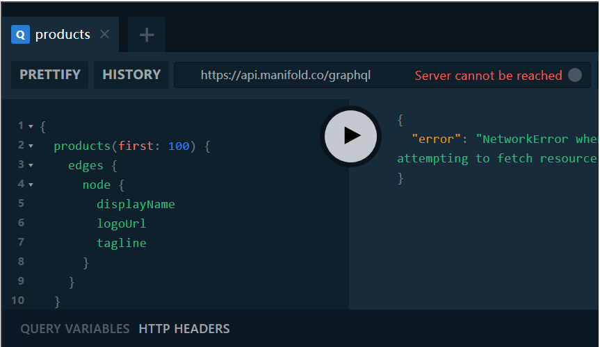

## 渣翻：GraphQL 相对于  REST  的优势

> 原文地址：https://www.manifold.co/blog/graphql-vs-rest-whats-the-advantage

自 2015 年问世以来，在 Facebook 率先使用的 [GraphQL](https://graphql.org/) ，其在 web 和原生 App 的使用率也一直在提升。之所以会被快速采用，是因为与传统的 REST API 相比，它具有多种优势。

### 优势1：较少的数据

你所使用的大多数末端数据都是从某个地方的数据库提供的。如果你直接使用 SQL 数据库，那么便会知道，请求所需的字段而非所有字段会更高效。

在 REST 中，几乎不可能仅仅指定返回所需的字段。结局便是，你通常会遇到“麻烦”，并且获得了比所需更多的数据。是否需要一次请求多条记录？现在，你手边的问题呈指数级出现。

在 Manifold，我们得努力处理 REST 端点返回的所有数据。

**REST**

```
https://api.catalog.manifold.co/v1/products
```

这个 URL 以 JSON 格式返回了 `141 KB` 的数据，而且这还不是最大的端点（接口）。（我们最重的 REST 端点返回了超过半兆的 JSON ！）对于此端点，只要我们需要任何产品数据，这些数据就会加载到客户端上。基于 REST 的工作方式，这只是我们渲染页面所需的几次调用之一。

对比一下我们的 GraphQL 的端点：

**GraphQL**



假如我们只需要三个字段，那么 GraphQL 端点仅返回我们所需要的内容，大小仅为 `9.4 KB` ，缩小了 95% 。

此外，在很多情况下，我们必须通过后续的 REST 请求来检索产品设计的数据（我们将在接下来讨论链的问题）。对于我们查询的每个产品，有时候还需要查询其详细的设计。这是一个示例，将这些多个查询合并为一个 GraphQL 查询（以及一些其他方案的比较）所返回的数据总量是怎样的：

| Scenario                 | REST weight | GraphQL weight | Reduction |
| :----------------------- | ----------: | -------------: | --------: |
| All Products + All Plans |  `562.4 KB` |      `15.4 KB` |       97% |
| All Products             |    `141 KB` |       `9.4 KB` |       95% |
| Single Product           |    `4.1 KB` |       `0.2 KB` |       95% |

试想一下：这种节省仅是对于一个用户。想象一下，大规模地这么做会怎么样——既增加了用户的加载时间，又可以提高了带宽成本。

### 优势 2：合并多个请求

GraphQL 另一个值得考虑的优势是，合并多个请求的能力。如果你曾使用过 REST 风格，那你可能已经习惯了“痛苦之链”：

1. 我们需要展示一个小组，那让我们调用 `/team/:id` 端点（接口）吧。
2. `team` 有一个 `userIDs` 的 ，我们就需要为 ID 列表中的每一项去调用 `/user/:id` 端点。
3. 我们还想展示 `user` 还加入多少其他小组。现在我们又一次调用了 `/team/:id` 端点，每个小组，每个用户一次。

我们来总结下：

```
1. /team/:id  1
2. /user/:id  n (n: number of users on a team)
3. /team/:id  n × t (t: number of teams per user)
```

如果这是一个由 20 个用户组成的小组，并且每个用户都属于 3 个小组，那么我们就是对 81 个 REST 端点执行了 ping 操作，用来渲染单个视图。

当然，你可以找到优化此 REST 链的方法，但是必须手动进行，并且可能需要针对这种情况进行优化。这些优化不是在 REST 中无偿提供的。

幸运的是，这些可以在 GraphQL 中做。你可以按照以下方法将所有这些 REST 请求合并到一个 GraphQL 查询中：

```
query TEAM_USERS {
  team(id: $teamID) {
    users {
      edges {
        node {
          avatarURL
          displayName
          teams {
            edges {
              node {
                displayName
              }
            }
          }
        }
      }
    }
  }
}
```

在 GraphQL 中，你可以在单个请求中完成相同的操作。使用 GraphQL 不仅可以提高性能，前端工程师可以仅管理一个调用而不是递归地管理三个不同的查询，进而降低前端应用程序中的代码复杂性。

**关于查询复杂度的说明**

由于 GraphQL 可以自由地关联模型，而你可以从另一个事物中查询一个事物，因此有一个称为“复杂度”的概念，其与 GraphQL 服务器相关。这种复杂度可以影响到性能。类似于 SQL 查询中的表的相互 `JOIN` ，这也并非是“无偿”的。当我们通过 GraphQL 中嵌套获取远程模型时，我们称其为 “解析”。

例如，在我们设想中的 `用户/小组` 方案中，你可能会注意到，从 `用户` 中查询 `小组` 或查询 `小组` 中的 `用户` 都是很快的。但是，如果你不停地将 `用户`，`小组`，`用户`，`小组`……一遍又一遍地链接在一起，你会发现在某个时间点存在延迟。根据你的 GraphQL 服务器，中间件和数据库的体系结构，延迟多少以及在什么级别下才变得明显将有所不同。但是无论你采用哪种配置，最好都将查询深度控制在某个级别，这将限制较大开销的查询，同时仍为你提供应用程序所需的灵活性。

### 优势 3 ：订阅

GraphQL 最后一个优势是订阅——进行查询或变动并自动获取更新的能力。通常，这是使用 WebSockets 在 GraphQL 服务器端实现的。

假设我们要使用 GraphQL 创建聊天应用。 我们可能会执行以下操作：

```
subscription MESSAGES() {
  messagesSubscribe(last: 200) {
    edges {
      node {
        text
        author {
          avatarURL
          userName
        }
      }
    }
  }
}
```

在我们的应用中，`messagesSubscribe.edges` 是一系列消息，每次发送新消息都会自动更新。否则，我们必须每秒（或更频繁）发送请求，从而在短时间内产生数百个调用。

使用订阅，建立连接后唯一传输的数据是发送或接收消息的时间（可能是建立连接本身的那一点数据）。

### REST 就没有任何优势吗？

我们谈论了很多关于 GraphQL 的了，REST 就没有任何优势吗？公平地说，GraphQL 是在 REST 的基础上构建的，因此其设计是向前的迭代。REST 一直是现代网络中最有影响力的基础构建块之一，没有它，GraphQL 就不会存在。因此，承认 REST 的影响，可以说 GraphQL 在几乎所有方面都比 REST 有了明显的改进。

### 总结

本文翻译了原文节选部分。总之，GraphQL 可以带来很多便利，并且可以提高一定的性能。大家还是可以进行多多学习和尝试的。不过，在这之前，得有一个强大且稳定的 `BFF(Backend For Frontend)` ，这样前端才能进行更多的拓展与尝试。

### 链接

- GraphQL 的 note 版的一个 demo：https://github.com/lq920320/graphql-with-nodejs-demo


