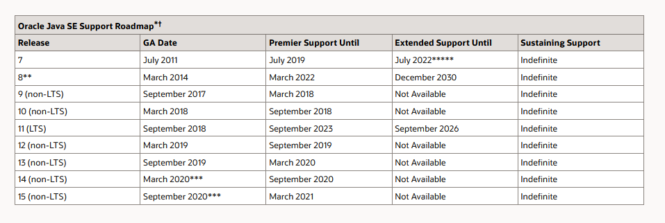

## 渣翻：从 Java 8 到 Java 15 的新语言特性




### ——你应该了解的Java语言增强功能

> 原文地址：https://advancedweb.hu/new-language-features-since-java-8-to-15/

 Java 8 引入了 `Streams` 流处理和 `Lambdas` 表达式，这是一个巨大的变更，支持了函数式编程风格，进而减少了样板代码。尽管最近的一些版本并未添加类似影响的功能，但对该语言也进行了许多较小的改进。

### Java 8 之后的语言增强功能

**Java 15**

- 文本块（Text Blocks）
  - 提示：保留尾随空格
  - 提示：为 Windows 生成正确的换行符
  - 提示：注意一致的缩进
- 有用的`NullPointerExceptions`（Helpful `NullPointerExceptions`）
  - 提示：检查您的工具

**Java 14**

- `Switch` 表达式
  - 提示：使用箭头语法

**Java 11**

- 局部变量类型推断
  - 提示：注意保持可读性
  - 提示：注意保留重要的类型信息
  - 提示：请务必阅读官方的风格指南

**Java 9**

- 在接口类中允许私有方法
- 内部匿名类的钻石操作符
- 允许将有效最终变量用作 `try-with-resources` 语句中的资源
  - 提示：当心释放的资源
- 下划线不再是一个有效的标识符名称
- 提升了警告

**接下来：Java 15 的预览功能**

- `Records`
- `instanceof` 的模式匹配
- 密封类（Sealed Classes）

### 文本块（Text Blocks）

**可用版本：`JDK 15` (Preview in `JDK 13`) `JDK 14` **

与其他现代语言相比，众所周知，在 Java 中很难表达包含多行的文本：

```java
String html = "";
html += "<html>\n";
html += "  <body>\n";
html += "    <p>Hello, world</p>\n";
html += "  </body>\n";
html += "</html>\n";

System.out.println(html);
```

为了让这种情况对程序员更友好，Java 15 引入了文本块的多行字符串文字：

```java
String html = """
          <html>
            <body>
              <p>Hello, world</p>
            </body>
          </html>
          """;

System.out.println(html);
```

它们类似于旧的 `String` 字面量，但是它们可以包含新的行和引号且不用转义。

文本块以 `"""` 开始，然后换行，以 `"""` 结束。结束编辑可以位于最后一行的末尾，也可以位于单独的行中，例如上面的示例。

它们可以在任何可以使用旧 `String` 字面量的地方使用，并且产生相似的 `String` 对象。

对于源代码中的每个换行符，结果中都会有一个 `\n` 字符。

```java
String twoLines = """
    Hello
    World
    """;
```

如果要将一行分成两行以保持源代码的可读性，可以通过把 `\` 字符放在行尾，这对非常长的一行字符串很有用。

```java
String singleLine = """
          Hello \
          World
          """;
```

文本块可以于相邻的 Java 代码对齐，因为一些无关紧要的缩进会被自动移除。编译器检查每行中用于缩进的空白，以找到缩进最少的行，并通过该最小公共缩进将每行向左移动。

这意味着，如果结束符 `"""` 位于单独的行中，则可以通过将结束标记向左移动来增加缩进量。

```java
String noIndentation = """
          First line
          Second line
          """;

String indentedByToSpaces = """
          First line 
          Second line
        """;
```

开头的 `"""` 并不计入缩进，因此不必将其与文本块对齐。例如，以下两个示例均产生具有相同缩进的字符串：

```java
String indentedByToSpaces = """
         First line 
         Second line
       """;

String indentedByToSpaces = """
                              First line 
                              Second line
                            """;
```

`String` 类还提供一些编程的方式来处理缩进。`indent` 方法接收整数参数，并返回具有指定级别额外缩进，而 `stripIndent` 返回的原始字符串的内容，而不包含所有附带的缩进。

我非常想念字符串插补拼接的功能，而文本块并不支持。如 `JEP` 所说，在未来可能会考虑，在此之前，我们可以使用 `String::formatted` 或 `String::format` ：

```java
var greeting = """
    hello
    %s
    """.formatted("world");
```

#### 提示：保留尾随空格

文本块中尾随的空格是会被忽略的。通常这没什么问题，但是在某些情况下它们确实很重要，例如，在单元测试中，将方法结果与基线值进行比较的情景。

如果是这种情况，请留意，如果一行以空格结尾，则在行末添加 `\s` 或 `\t` 而不是一个空格或制表符。

#### 提示：为 Windows 生成正确的换行符

在 Unix 和 Windows 上，行尾会用不同的控制字符表示。前者使用单个换行符（`\n`），而后者使用回车符后跟换行符（`\r\n`）。

但是，无论您选择使用哪种操作系统，还是何种方式在源代码中编写新行，文本块都将为每个新行使用一个 `\n` ，这可能会导致兼容性问题。

```java
Files.writeString(Paths.get("<PATH_TO_FILE>"), """
    first line
    second line
    """);
```

如果使用仅与 Windows 行尾格式兼容的工具（例如记事本）打开此类文件，那它将仅显示一行。如果您还以 Windows 为目标，请确保使用正确的控制字符，例如，通过调用 `String::replace` 将每个 `\n` 替换为 `\r\n`。

#### 提示：注意一致的缩进

文本块可以良好支持任何一种缩进：制表符，空格，甚至是二者混合使用。不过，请务必对块中的每一行使用一致的缩进，否则无法删除那些无关紧要的缩进。

大多数的编辑器都提供自动格式化功能，并在您敲 Enter 键时自动在每行添加缩进。确保使用这些工具的最新版本，以确保它们可与文本块配合使用，并且不要尝试添加错误的缩进。

### 有用的`NullPointerExceptions`

**可用版本：`JDK 15`(Enabled with `-XX:+ShowCodeDetailsInExceptionMessages` in `JDK 14`)**

这颗小宝石并非是通常意义上的语言功能，但它非常不错，以至于我想将其放在这个列表里。

传统上，遇到 `NullPointerException` 是这样的：

```java
node.getElementsByTagName("name").item(0).getChildNodes().item(0).getNodeValue();

Exception in thread "main" java.lang.NullPointerException
        at Unlucky.method(Unlucky.java:83)
```

从这个异常来看，哪个方法返回 `null` 并不明显。因此，许多开发人员习惯将此类语句分散在多行中，以确保他们能够确定导致异常的步骤。

从 `Java 15` 之后，再也无需这样做了。因为 `NPE` 会在声明中描述哪个部分为空。（此外，在 `Java 14` 中，您可以使用 `-XX:+ShowCodeDetailsInExceptionMessage` 启用。）

```java
Exception in thread "main" java.lang.NullPointerException:
  Cannot invoke "org.w3c.dom.Node.getChildNodes()" because
  the return value of "org.w3c.dom.NodeList.item(int)" is null
        at Unlucky.method(Unlucky.java:83)
```

该详细信息包含无法执行的操作（无法调用 `getChildNodes`）和失败原因（`item(int)` 取值为 `null`），这使得查找问题的确切来源变得更加容易。

因此，总的来说，此功能既有利于调试，又有利于代码可读性，出于技术原因而舍弃它的理由则更少。

`Helpful NullPointerExceptions` 扩展是在 JVM 中实现的，因此，即使使用旧 Java 版本编译的代码，在你使用其他 JVM 语言（如 `Scala` 或 `Kotlin`）时，可以获得相同的好处。

注意，并非所有 `NPE` 都会获取此额外信息，只有 JVM 在以下条件下创建并抛出的信息：

- 对 `null` 进行读取或写入字段
- 调用 `null` 的方法
- 访问或分配数组元素（索引不是错误信息的一部分）
- 对 `null` 进行拆箱

另请注意，此功能不支持序列化。例如，当将 `NPE` 抛出在通过 `RMI`（Remote Method Invocation，远程方法调用）执行的远程代码上时，该异常将不包括帮助信息。

当前，默认情况下会禁用 `Helpful NullPointerException`，然后必须使用 `-XX:+ShowCodeDetailsInExceptionMessages` 启用。

#### 提示：检查你的工具

当升级到 `Java 15` 时，务必检查您的应用程序和基础架构，以确保：

- 在日志文件和 Web 服务器响应中，不要出现敏感变量名。
- 日志解析工具可以处理新的消息格式。
- 构造其他详细信息所需的额外开销也是可以的。

### `Switch` 表达式

**可用版本：`JDK 14`（Preview in `JDK 12`， `JDK 13`）**

良好的旧版 `switch` 在 Java 14 中得到了改头换面。Java 一直支持旧的 `switch` 语句的同时，也向语言中添加了新的 `switch` 表达式：

```java
int numLetters = switch (day) {
    case MONDAY, FRIDAY, SUNDAY -> 6;
    case TUESDAY                -> 7;
    default      -> {
        String s = day.toString();
        int result = s.length();
        yield result;
    }
};
```

最明显的区别是，这种新形式可以用作表达式。如上示例，它可以用于填充变量，并且可以在接受表达式的任何地方使用：

```java
int k = 3;
System.out.println(
    switch (k) {
        case  1 -> "one";
        case  2 -> "two";
        default -> "many";
    }
);
```

但是，`switch` 表达式和 `switch` 语句之间还有其他更细微的区别。

首先，对于 `switch` 表达式而言，并不会一直遍历情况而导致穿透。因此，不会再有因缺少中断（`break`）语句而导致的细微错误。为了避免穿透，可以在每种情况下以都和分隔的列表指定多个常量。

第二，每种情况都有其自己的范围。

```java
String s = switch (k) {
    case  1 -> {
        String temp = "one";
        yield temp;
    }
    case  2 -> {
        String temp = "two";
        yield temp;
    }
    default -> "many";
}
```

一个分支要么是单个表达式，要么是由多个语句组成的，因此必须包装在一个块中。

第三，`switch` 表达式中的情况都是详细的。这意味着，对于 `String` ，基本类型及其包装类型，`default` 情况必须定义。

```java 
int k = 3;
String s = switch (k) {
    case  1 -> "one";
    case  2 -> "two";
    default -> "many";
}
```

对于 `enums` 枚举，要么必须存在 `default` 情况，要么必须明确涵盖所有情况。依赖后者可以很好地确保考虑所有值。在枚举中添加额外的值导致使用它的所有 `switch` 表达式编译错误。

```java
enum Day {
   MONDAY, TUESDAY, WEDNESDAY, THURSDAY, FRIDAY, SATURDAY, SUNDAY
}

Day day = Day.TUESDAY;
switch (day) {
    case  MONDAY -> ":(";
    case  TUESDAY, WEDNESDAY, THURSDAY -> ":|";
    case  FRIDAY -> ":)";
    case  SATURDAY, SUNDAY -> ":D";
}
```

由于以上原因，相对于 `switch` 语句，选择 `switch` 表达式可以让代码更易于维护。

#### 提示：使用箭头语法

`switch` 表达式不仅可以用于类似 `lambda` 的箭头形式情况。带有冒号形式的旧 `switch` 语句也可以写作使用 `yield` 的（`switch`）表达式：

```java
int result = switch (s) {
    case "foo":
    case "bar":
        yield 2;
    default:
        yield 3;
};
```

这种写法也可以当作表达式来用，但它与旧的 `switch` 语句更相似，因为：

- 用例情况会穿透。
- 用例情况共享同样的范围。

我的建议？不要使用这种格式，而是使用带箭头语法的 `switch` 表达式来获得所有的好处。

### 局部变量类型推断（Local-Variable Type Inference）

**可用版本：`JDK 11`（Without lambda support in `JDK 10`）**

自 Java 8 以来，最重要的语言改进可能就是添加了 `var` 关键字。它最初是在 Java 10 中引入的，然后在 Java 11 中得到了进一步改进。

此功能使我们通过省略显示类型规范来减少局部变量声明的时间：

```java
var greetingMessage = "Hello!";
```

尽管它看起来类似于 `JavaScript` 的 `var` 关键字，但这与动态类型无关。

从 `JEP` 中引用以下内容：

> 我们致力于通过减少与编写 Java 代码相关的类型规范来改善开发人员的体验，同时保持 Java 对静态类型安全的承诺。

声明的变量的类型是在编译时推断的。在上面的示例中，推断的类型为 `String`。使用 `var` 代替显式类型可以减少这段代码的冗余，因此更易于阅读。

这是类型推断的另一个很好的候选：

```java
MyAwesomeClass awesome = new MyAwesomeClass();
```

很明显，在许多情况下，此功能可以提高代码质量。但是，有时最好坚持使用显示类型声明。让我们看一些示例，其中用 `var` 替换类型声明反而会适得其反。

#### 提示：注意保持可读性

第一种情况是从源代码中删除显式类型信息时，使其可读性降低。

当然，IDE 可以在这方面提供帮助，但是在代码审查期间或当您快速扫描代码时，它可能会损害可读性。例如，考虑工厂类和建造类：您必须找到负责对象初始化的代码来确定类型。

这有一个小提问。以下代码使用 Java 8 的 `Date/Time API` 。猜测在以下代码段中变量的类型：

```java
var date = LocalDate.parse("2019-08-13");
var dayOfWeek = date.getDayOfWeek();
var dayOfMonth = date.getDayOfMonth();
```

好了吗？下面是答案：

第一个变量就非常直观了，`parse` 方法返回一个 `LocalDate` 对象。但是，在接下来的两个变量中，你应该更熟悉 API 才行：`dayOfWeek` 返回一个 `java.time.DayOfWeek`，而 `dayOfMonth` 仅返回一个 `int`。

另一个潜在的问题是，使用 `var` 时，读者必须更多地依赖上下文。思考一下以下代码：

```java
private void longerMethod() {
    // ...
    // ...
    // ...

    var dayOfWeek = date.getDayOfWeek();

    // ...
    // ...
    // ...
}
```

基于之前的例子，我打赌你会猜测这个变量类型为 `java.time.DayOfWeek` 。但是这次，它是 `Integer` ，因为此示例中的日期是 `Joda time` 。这是不同的 API，行为也略有不同，但是您看不到，因为它是一个较长的方法，并且您没有阅读所有的代码。

如果存在显示类型声明，那么将会很轻易弄清 `dayOfWeek` 的类型。现在，使用 `var`，读者首先必须找出日期变量的类型并检查 `getDayOfWeek` 的作用。对于 IDE 这很容易，而在扫描代码时就不那么简单了。

#### 提示：注意保留重要的类型信息

第二种情况是在使用 `var` 时会删除所有可用的类型信息，甚至于无法进行推断。在大多数情况下，Java 编译器会捕获这些情况。例如， `var` 无法推断 `lambda` 或方法引用的类型，因为对于这些功能，编译器依赖于左侧表达式来找出类型。

然而，也有一些例外。例如，`var` 和钻石操作符（Diamond Operator）配合使用时效果就不是很好。钻石操作符是一个很好的功能，可以在创建泛型实例时从表达式的右侧删除一些详细信息：

```java
Map<String, String> myMap = new HashMap<String, String>(); // Pre Java 7
Map<String, String> myMap = new HashMap<>(); // Using Diamond operator
```

因为它仅处理通用类型，所以仍然有冗余要删除。让我们尝试使用 `var` 使其更简短：

```java
var myMap = new HashMap<>();
```

该示例是有效的，并且 Java 11 环境下，甚至不会在编译器中发出有关该示例的警告。但是，通过所有这些类型推断，我们最终根本没有指定泛型类型，那么类型将会被认为是 `Map<Object, Object>`。

当然，这也可以通过不使用钻石操作符来轻松解决：

```java
var myMap = new HashMap<String, String>
```

将 `var` 与原始数据类型一起使用时，可能会出现另一组问题：

```java
byte   b = 1;
short  s = 1;
int    i = 1;
long   l = 1;
float  f = 1;
double d = 1;
```

如果没有显示的类型声明，所有这些变量的类型都将被推断为 `int`。使用原始数据类型时，请使用类型字面量（例如`1L`），或者在这种情况下完全不要使用 `var`。

#### 提示：请务必阅读官方的风格指南

最终是由您来决定何时使用类型，并确保它不会影响可读性和正确性。根据经验，坚持良好的编程习惯（如良好的命名和最小化局部变量的范围）肯定会很有帮助。请务必阅读有关 `var` 的官方风格指南和常见的问题解答。

由于 `var` 有很多陷阱，因此保守地引入它是比较好的，并且只能在局部变量上使用，该范围通常非常有限。

此外，当你谨慎地引入之后，`var` 并不是新的关键字，而是保留的类型名称。这意味着它仅在用作类型名称时才具有特殊含义，其他任何地方 `var` 仍然是有效的标识符。

当前，`var` 没有不可变的对应项（例如 `val` 或 `const`）来声明最终变量并使用单个关键字来推断其类型。希望我们会在将来的版本中得到它，直到那时，我们可以使用 `final var`。

### 在接口类中允许私有方法

**可用版本：`JDK 9` （Milling Project Coin）**

从 Java 8 开始，可以向接口添加默认方法。使用 Java 9 ，这些默认方法甚至可以调用私有方法来共享代码，以防您需要重用，但又不想公开功能。

尽管这没什么大不了的，但这是合乎逻辑的添加，它允许整理默认方法中的代码。

### 内部匿名类的钻石操作符

**可用版本：`JDK 9` （Milling Project Coin）**

Java 7 引入了 Diamond 操作符（`<>`），通过让编译器推断构造函数的参数类型来降低冗长性：

```java
List<Integer> numbers = new ArrayList<>();
```

但是，此功能以前并不适用于匿名内部类。根据项目邮件列表中的讨论，此功能为添加为原始 `Diamond Operator` 功能的一部分，因为它需要对 JVM 进行重大更改。

在 Java 9 中，移除了这个小缺陷，使得该操作符更通用：

```java
List<Integer> numbers = new ArrayList<>() {
    // ...
}
```

### 允许将有效最终变量用作 `try-with-resources` 语句中的资源

**可用版本：`JDK 9` （Milling Project Coin）**

Java 7 引用的另一个增强功能是 `try-with-resouces` ，这样开发人员便不必担心资源释放问题。

为了说明其功能，首先请考虑在此典型情形的 Java 7 之前的示例中为正确关闭资源要做的：

```java
BufferedReader br = new BufferedReader(...);
try {
    return br.readLine();
} finally {
    if (br != null) {
        br.close();
    }
}
```

使用 `try-with-resources` 资源可以自动释放，而无需花费更多时间：

```java
try (BufferedReader br = new BufferedReader(...)) {
    return br.readLine();
}
```

尽管功能强大， `try-with-resoucrces`  还是有一些缺点的，而 Java 9 是可以解决的。

尽管这种结构可以处理多个资源，但是代码就变得更加难以阅读。与普通的 Java 代码相比，在 `try` 关键字之后的列表中声明这样的变量并非常规做法：

```java
try (BufferedReader br1 = new BufferedReader(...);
    BufferedReader br2 = new BufferedReader(...)) {
    System.out.println(br1.readLine() + br2.readLine());
}
```

另外，在 Java 7 版本中，如果您已经有变量要使用这种结构，则必须引入一个虚拟变量。

为了缓和这些反驳，除了创建新的变量外，`try-with-resources` 还可以处理最终或最终有效的局部变量，实现其功能增强：

```java
BufferedReader br1 = new BufferedReader(...);
BufferedReader br2 = new BufferedReader(...);
try (br1; br2) {
    System.out.println(br1.readLine() + br2.readLine());
}
```

在此示例中，变量的初始化与它们注册到 `try-with-resources` 结构分开进行。

#### 提示：当心释放的资源

需要记住的一个警告是，有可能会引用 `try-with-resouces` 已释放的变量，在大多数情况下，它们会失败：

```java
BufferedReader br = new BufferedReader(...);
try (br) {
    System.out.println(br.readLine());
}
br.readLine(); // Boom!
```

### 下划线不再是一个有效的标识符名称

**可用版本：`JDK 9` （Milling Project Coin）**

在 Java 8 中，当 “_” 用作标识符时，编译器会发出警告。Java 9 采取了进一步的措施，使得单独使用的下划线字符成为非法标识符，并保留了该名称以在将来具有特殊语义：

```java
int _ = 10; // Compile error
```

### 提升了警告

**可用版本：`JDK 9`**

最后，让我们来说一下 Java 新版本中与编译器警告相关的更改。

现在，可以使用 `@SafeVarargs` 注解私有方法，以标记类型安全：通过 `varargs` 参数告警潜在的堆污染情况。（实际上，此更改是先前讨论的 `JEP 213` 的一部分：Milling Project Coin 版本）。可以阅读官方文档了解更多关于 `Varargs`， `Generics` 以及其潜在问题的信息。

同样，从 Java 9 开始，在导入废弃的（`@Deprecated`）类型时，编译器不再会对 `import` 语句发出警告。这些警告是无用且多余的，因为对于真正使用废弃成员的地方，总会一直显示一条别处的警告。

### 接下来：Java 15 的预览功能

Java 15 有 3 个预览功能，可以使用 `--enable-preview -source 15` 标记使其生效。它们很有可能是 Java 语言的下一个改进。下面是一些简介。

#### `Records`

`Records` 为 Java 语言引入了一种新的类型声明，可以提供更紧凑的语法来创建数据类。相对于创建私有属性字段， `getter` ，`setter` 方法和构造方法的通常语法，它允许我们可以使用简介的定义来创建数据结构：

```java
record Point(int x, int y) { }
```

我已迫不及待地想让这一特性成为流行库和框架支持的标准功能了！

### `instanceof` 的模式匹配

在大多数情况下， `instanceof` 通常会后跟类型强制转换：

```java
if (obj instanceof String) {
    String s = (String) obj;
    // use s
}
```

`JEP 305` 拓展了 `instanceof` ，使这种典型场景不再那么冗长：

```java
if (obj instanceof String s) {
    // use s
}
```

### 密封类（Sealed Classes）

`JEP 360` 的增强功能为该语言添加了密封类和接口，可用于限制可以继承或者实现它们的其它类或接口。

```java
public abstract sealed class Shape
    permits Circle, Rectangle {...}

public class Circle extends Shape {...} // OK
public class Rectangle extends Shape {...} // OK
public class Triangle extends Shape {...} // Compile error
```

此功能还增强了 `switch` 表达式。与枚举一样，如果编译时已知可能的值以及所有的情况都已处理，那么就无需再定义 `default` 分支。

```java
double area = switch (shape) {
    case Circle c    -> Math.pow(c.radius(), 2) * Math.PI
    case Rectangle r -> r.a() * r.b()
};
```

### 总结

这篇博客涵盖了自 Java 8 以来与语言相关的一些改进。密切关注 Java 平台是很重要的，因为随着每六个月发布一次新 Java 版本的快速发布节奏，都持续在为整个平台和语言交付着变更。


### 链接
- Java 版本支持 roadmap：https://www.oracle.com/java/technologies/java-se-support-roadmap.html


