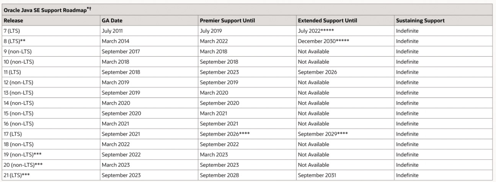
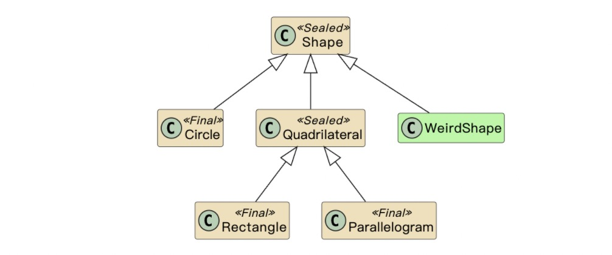

## 渣翻：从 Java 8 到 Java 18 的新语言特性



原文作者更新了，我也更新一波。在20年，我们说如果要大规模升级java版本，要等到2022年之后，嗯……今年是 2023 年。而且 2022 年发布的 `Spring Framework 6.0`、`SpringBoot 3.0` 所支持的最低 java 版本为 java 17，所以今年升级 JDK 版本还是一个不错的选择的，之后我们也会升级来体验一下 JDK 17。今天先来看下有哪些更新。

> 原文地址：https://advancedweb.hu/new-language-features-since-java-8-to-18/

当Java 8引入Streams和Lambdas时，这是一个很大的变化，使函数式编程风格可以用更少的样板来表达。从那以后，Java切换到更快的发布节奏，每六个月出现一个新的Java版本。这些版本不断为语言带来新功能。在最近的功能中，最重要的功能可能是记录，模式匹配和密封类，这使得使用纯数据编程变得更加容易。

### Java 8 之后的语言增强

**Java 18**

- `switch` 的模式匹配。


**Java 17**

- 密封类：

  - 注意：思考对比一下密封类与枚举类


**Java 16**

- `Record` 类

  - 注意：使用本地 `Record` 类对中间转换进行建模

  - 注意：考虑下你的依赖

- 对于 `instancesof` 的模式匹配

  - 注意：请继续关注更新


**Java 15**

- 文本块

  - 注意：保留尾随空格

  - 注意：为 Windows 生成正确的换行符

  - 注意：注意一致的缩进

- 有用的 `NullPointerExecption`

  - 注意：检查你的工具


**Java 14**

- `switch` 表达式

  - 注意：使用箭头语法


**Java 11**

- 局部变量类型推断
  - 注意：注意保持可读性
  - 注意：注意保留重要的类型信息
  - 注意：请务必阅读官方的风格指南

**Java 9**

- 在接口类中允许私有方法
- 内部匿名类的钻石操作符
- 允许将有效最终变量用作 `try-with-resources` 语句中的资源
  - 注意：当心释放的资源
- 下划线不再是一个有效的标识符名称
- 提升了警告

从版本 8 发布到版本 18，Java 由 203 个 JDK 增强提案 （JEP） 和更多较小的更新组成，每个更新都为平台带来了一些改进。此页面是最重要的改进的分类和精选列表。

### 新的语言特性

从Java 8开始，对语言进行了许多改进。本节是对过去几年发生的事情的快速回顾。

#### `switch` 的模式匹配（Pattern Matching for switch）

**可用版本自**：可以在 `JDK 18` `JDK 17` 中预览

以前，`switch` 非常有限：这些 `case` 只能测试精确相等性，并且只能测试几种类型的值：数字、枚举类型和字符串。

此预览功能增强了 `switch` 的功能，**使其适用于任何类型并匹配更复杂的模式**。

这些添加功能都是**向后兼容**的，使用传统常量切换就像以前一样工作，例如，使用 `Enum` 值：

```java
var symbol = switch (expression) {
  case ADDITION       -> "+";
  case SUBTRACTION    -> "-";
  case MULTIPLICATION -> "*";
  case DIVISION       -> "/";
}
```

当然，现在它也适用于 [JEP 394](https://openjdk.org/jeps/394) 引入的**类型模式**：`instanceof` 的模式匹配：

```java
return switch (expression) {
  case Addition expr       -> "+";
  case Subtraction expr    -> "-";
  case Multiplication expr -> "*";
  case Division expr       -> "/";
};
```

也有支持**守卫**模式，写为 `type parttern` && `guard expression`：

```java
String formatted = switch (o) {
    case Integer i && i > 10 -> String.format("a large Integer %d", i);
    case Integer i           -> String.format("a small Integer %d", i);
    default                  -> "something else";
};
```

这使得 `if` 语句中使用的类型模式具有非常好的对称性，因为类似的模式可以用作条件：

```java
if (o instanceof Integer i && i > 10) {
  return String.format("a large Integer %d", i);
} else if (o instanceof Integer i) {
  return String.format("a small Integer %d", i);
} else {
  return "something else";
}
```

与 `if` 条件中的类型模式类似，**模式变量的作用域对流敏感**。例如，在下面的例子中，`i `的范围是保护表达式和右侧表达式：

```java
case Integer i && i > 10 -> String.format("a large Integer %d", i);
```

通常，它的工作方式如你所希望的那样，但涉及许多规则和边缘情况。如果你有疑问，我建议阅读相应的 JEP 或查看下面 对于 `instanceof` 的模式匹配 的章节。

现在 `switch` 也可以匹配 `null` 值。传统上，当 `switch` 语句中出现了 `null` 值的 `case` ，通常会抛出 `NullPointerException`。当尝试在常量上匹配 `null` 时，情况仍然如此。但是，现在是可以添加 null 的显式情况的：

```java
switch (s) {
  case null  -> System.out.println("Null");
  case "Foo" -> System.out.println("Foo");
  default    -> System.out.println("Something else");
}
```

**当 `switch` 不完整或某个 `case` 完全主导另一个时**，Java 编译器便会发出错误：

```java
Object o = 1234;

// OK
String formatted = switch (o) {
    case Integer i && i > 10 -> String.format("a large Integer %d", i);
    case Integer i           -> String.format("a small Integer %d", i);
    default                  -> "something else";
};

// Compile error - 'switch' expression does not cover all possible input values
String formatted = switch (o) {
    case Integer i && i > 10 -> String.format("a large Integer %d", i);
    case Integer i           -> String.format("a small Integer %d", i);
};

// Compile error - the second case is dominated by a preceding case label
// 第二个 case 由前面的 case 主导，或者说走不到第二个 case
String formatted = switch (o) {
    case Integer i           -> String.format("a small Integer %d", i);
    case Integer i && i > 10 -> String.format("a large Integer %d", i);
    default                  -> "something else";
};
```

**在 Java 18 中**，模式匹配仍处于预览状态，并根据 Java 17 给出的反馈进行了一些调整：

- 出于可读性原因，已更新地位的检查，以强制常量 `case` 显示在相应的基于类型的模式之前。目标是始终首先具有更具体的 `case`。例如，以下代码片段中的 `case` 便是按此确切顺序有效。如果你尝试重新排列它们，则会出现编译错误。

  ```java
  switch(o) {
      case -1, 1 -> "special case"
      case Integer i && i > 0 -> "positive number"
      case Integer i -> "other integer";
  }
  ```

- 对于通用密封类，**现在使用密封层次结构进行详尽性检查会更加精确**。可以看一下 JEP 中的示例代码：

  ```java
  sealed interface I<T> permits A, B {}
  final class A<X> implements I<String> {}
  final class B<Y> implements I<Y> {}
  
  static int testGenericSealedExhaustive(I<Integer> i) {
      return switch (i) {
          // Exhaustive as no A case possible!
          case B<Integer> bi -> 42;
      }
  }
  ```

- [JEP 405](https://openjdk.org/jeps/405)，添加的数组和 record 模式也是针对 Java 18 的，但不幸的是它被推迟到Java 19。希望我们下次能尝试。


此功能处于预览状态🔍，必须使用 `--enable-preview` 标志显式启用。

#### 密封类（Sealed Classes）

**可用版本自**：`JDK17` (`JDK15` `JDK16` 预览)

密封类和接口可用于限制哪些其他类或接口可以扩展或实现它们。它提供了一种工具来更好地设计公共 API，并提供了枚举的替代方案来对固定数量的替代方案进行建模。

之前的 Java 版本还提供了一些实现类似目标的机制。标有 `final` 关键字的类根本无法扩展，并且使用访问修饰符可以确保类仅由同一包的成员扩展。

在这些现有基础之上，密封类添加了一种细粒度的方法，允许作者明确列出自己的子类。

```java
public sealed class Shape
    permits Circle, Quadrilateral {...}
```

在这个例子里，允许继承 `Shape` 类的只有 `Circle` 以及 `Quadiilateral` 两个子类。事实上，术语 *“允许”* 可能会有一些误导， 因为它不仅允许，而且**要求列出的类直接扩展密封类**。

另外，正如人们可能从这样的授权中所期望的那样，如果任何其他类试图继承密封类，则会出现编译错误。

```java
public abstract sealed class Shape
    permits Circle, Quadrilateral {...}

public final class Circle extends Shape {...} // OK
public final class Quadrilateral extends Shape {...} // OK
public final class Triangle extends Shape {...} // Compile error
```

继承密封类的类必须符合一些规则。

**作者们必须始终通过在允许的子类上显式定义密封类型层次结构的边界**，仅能使用以下修饰符之一：

- `final`：子类不允许被继承

- `sealed`：子类只能由某些允许的类继承

- `non-sealed`：子类可以被自由继承


因为子类也可以密封，这意味着可以定义固定选项的整个层次结构（比如图形）：

```java
// 密封的形状类，允许圆、四边形、奇怪的形状继承
public sealed class Shape
    permits Circle, Quadrilateral, WeirdShape {...}

// 圆形继承了形状
public final class Circle extends Shape {...}

// 四边形继承了形状类，同时又允许矩形、平行四边形继承
public sealed class Quadrilateral extends Shape
    permits Rectangle, Parallelogram {...}
public final class Rectangle extends Quadrilateral {...}
public final class Parallelogram extends Quadrilateral {...}

// 而奇怪的形状继承了形状类，且它可以被自由继承
public non-sealed class WeirdShape extends Shape {...}
```



如果这些类很短，并且主要与数据有关，则在同一源文件中声明所有这些类可能是有意义的，在这种情况下，**`permits` 的语句可以省略**：

```java
public sealed class Shape {
  public final class Circle extends Shape {}

  public sealed class Quadrilateral extends Shape {
    public final class Rectangle extends Quadrilateral {}
    public final class Parallelogram extends Quadrilateral {}
  }

  public non-sealed class WeirdShape extends Shape {}
}
```

`Record` 类也可以作为叶子成为密封层次结构的一部分，因为它们是隐式的 `final`。

**允许的子类必须与父类位于同一包中** —— 或者在使用 java 模块的情况下，它们必须位于同一个模块中。

##### 注意：思考一下为何使用 密封类 而非 枚举类

在密封类之前，只能使用枚举类型对固定的选项进行建模。例如：

```java
enum Expression {
  ADDITION,
  SUBTRACTION,
  MULTIPLICATION,
  DIVISION
}
```

但是，所有变更都需要在同一个源文件中，并且 `Enum` 类型不支持在需要实例而不是常量（例如表示某个类型的单条消息）时进行建模的情况。

密封类提供了一个 `Enum` 类型的非常好的替换方案，它可以使用常规的类来对那些固定选项进行建模。一旦 `switch` 模式匹配准备好，这将达到全部功率，之后密封类可以像枚举一样在 `switch` 表达式中使用，编译器可以自动检查是否涵盖了所有情况。

枚举类的值可以使用 `values()` 方法枚举。对于密封类和接口，允许的子类可以与 `getPermittedSubclasses()` 方法一起列出。

#### `Record` 类（Record Classes）

**可用版本自**： `JDK16`（`JDK14` `JDK15` 预览）

记录类向语言引入了新的类型声明，以定义不可变的数据类。与通常的私有字段、`getters` 方法 和构造函数的方式不同，它允许我们使用紧凑语法：

```java
public record Point(int x, int y) { }
```

上面的`Record`类很像定义以下内容的常规类：

- 两个私有的 `final` 属性，`int x` 和 `int y`

- 一个接收 `x` 、`y` 作为参数的构造函数

- `x()` 和 `y()` 作为属性的 `getter` 方法

- `hashCode()`、`equals()` 和 `toString()` 方法，都会使用 `x` 和 `y` 变量


它们可以像正常的类那样使用：

```java
var point = new Point(1, 2);
point.x(); // returns 1
point.y(); // returns 2
```

`Record` 类旨在成为其**浅层不可变数据的透明载体**。为了支持这种设计，它们带有一组**限制**。

默认情况下，记录类的字段不仅是 `final` 字段，甚至不可能有任何非 `final` 字段。

**首先，定义声明必须定义有关可能状态的所有内容**。它不能在 `Record` 类的正文中包含其他字段。此外，虽然可以定义其他构造函数来为某些字段提供默认值，但将所有记录字段作为参数的规范构造函数，是无法隐藏的。

最后，`Record` 类不能继承其他类，它们不能声明原生方法，并且它们是隐式`final` 的，不能是抽象的。

只能通过它的构造函数来给记录类赋值。默认情况下，一个 `Record` 类只有一个隐式的规范构造函数。如果需要验证或规范化数据，还可以显式定义规范构造函数：

```java
public record Point(int x, int y) {
  public Point {
    if (x < 0) {
      throw new IllegalArgumentException("x can't be negative");
    }
    if (y < 0) {
      y = 0;
    }
  }
}
```

隐式的规范构造函数与记录类本身具有相同的可见性。如果显式声明，则其访问修饰符必须至少与记录类的访问修饰符一样宽松。

也可以定义其他构造函数，但它们必须委托给其他构造函数。最后，将始终调用规范构造函数。这些额外的构造函数对于提供默认值可能很有用：

```java
public record Point(int x, int y) {
  public Point(int x) {
    this(x, 0);
  }
}
```

可以通过其访问器方法从记录中获取数据。对于每个字段 `x`，记录类都有一个生成的 `x()` 形式的公开 `getter` 方法。

这些 `getter` 方法也可以被具体定义：

```java
public record Point(int x, int y) {
  @Override
  public int x() {
    return x;
  }
}
```

请注意，在这种情况下可以使用 `Override` 注解来确保方法声明显式定义访问器，而不是特意地定义额外的方法。

与 `getter` 类似，默认情况下提供 `hashCode`，`equals` 和 `toString` 方法，会涵盖所有字段；当然也可以显式定义这些方法。

最后，记录类还可以具有静态和实例方法，这些方法可以方便地获取派生信息或充当工厂方法：

```java
public record Point(int x, int y) {
  static Point zero() {
    return new Point(0, 0);
  }
  
  boolean isZero() {
    return x == 0 && y == 0;
  }
}
```

总结一下：**记录类只是关于它们携带的数据**，没有提供太多的自定义选项。

由于这种特殊的设计，记录的序列化比常规类更容易和安全。正如JEP中所写：

> 记录类的实例可以序列化和反序列化。但是，不能通过提供 `writeObject`、`readObject`、`readObjectNoData`、`writeExternal` 或 `readExternal` 方法来自定义该过程。记录类的组件控制序列化，而记录类的规范构造函数控制反序列化。

由于序列化完全基于字段状态，并且反序列化始终调用规范构造函数，因此无法创建具有无效状态的 `Record` 类。

从用户的角度来看，启用和使用序列化可以像往常一样完成：

```java
public record Point(int x, int y) implements Serializable { }

public static void recordSerializationExample() throws Exception {
  Point point = new Point(1, 2);

  // Serialize
  var oos = new ObjectOutputStream(new FileOutputStream("tmp"));
  oos.writeObject(point);

  // Deserialize
  var ois = new ObjectInputStream(new FileInputStream("tmp"));
  Point deserialized = (Point) ois.readObject();
}
```

请注意，不再需要定义 `serialVersionUID`，因为记录类免除了匹配 `serialVersionUID` 值的要求。

##### 注意：使用本地记录类对中间转换进行建模

复杂的数据转换要求我们对中间值进行建模。在 Java 16 之前，典型的解决方案是依赖库中的 `Pair` 或类似的持有者类，或者定义自己的（可能是内部静态的）类来保存这些数据。

这样做的问题是，前者经常被证明不够灵活，而后者通过引入仅在单个方法上下文中使用的类来污染命名空间。虽然也可以在方法主体中定义类，但由于它们的冗长性质，也是不合适的。

Java 16 对此进行了改进，因为现在也可以在方法主体中定义本地（局部）记录：

```java
public List<Product> findProductsWithMostSaving(List<Product> products) {
  record ProductWithSaving(Product product, double savingInEur) {}

  products.stream()
    .map(p -> new ProductWithSaving(p, p.basePriceInEur * p.discountPercentage))
    .sorted((p1, p2) -> Double.compare(p2.savingInEur, p1.savingInEur))
    .map(ProductWithSaving::product)
    .limit(5)
    .collect(Collectors.toList());
}
```

记录类的紧凑语法与流 API 的紧凑语法非常匹配。

除了记录之外，此更改还**允许使用本地枚举甚至接口**。

##### 注意：检查一下你的依赖

记录类并不遵守 JavaBeans 约定：

- 它们没有默认的构造函数

- 它们没有 `setter` 方法

- 访问函数也不是 `getX()` 的形式


由于这些原因，一些期望 JavaBeans 的工具可能无法完全处理 `Record` 类。

其中一种情况是记录不能用作 JPA（例如 `Hibernate`）实体。在 jpa-dev 邮件列表中有一个关于将规范与 Java Records 对齐的讨论，但到目前为止，我没有找到有关开发过程状态的消息。然而，值得一提的是，`Record` 可以[毫无问题地用于映射](https://thorben-janssen.com/java-records-hibernate-jpa/)。

我检查过的大多数其他工具（包括 `Jackson`，`Apache Commons Lang`，`JSON-P` 和 `Guava` ）都支持 `record`，但由于它是相当新的，也有一些粗糙的边缘。例如，流行的JSON库 `Jackson` 是记录的早期采用者。它的大多数功能，包括序列化和反序列化，同样适用于记录类和 JavaBeans，但一些操作对象的功能尚未调整。

我遇到的另一个例子是 Spring，在许多情况下，它也支持开箱即用的记录类。该列表包括序列化甚至依赖注入，但是许多 Spring 应用程序使用的 ModelMapper 库不支持将 JavaBeans 映射到记录类。

我的建议是在采用 Record Class 之前升级并检查您的工具以避免意外，但一般来说，假设流行的工具已经涵盖了它们的大部分功能，这样也是相当不错的。

[查看我在 GitHub 上记录类的工具集成实验](https://github.com/dodie/java-tutorials/tree/master/working-with-structured-data)。

#### `instanceof` 的模式匹配（Pattern Matching for instanceof）

**可用版本自：** `JDK 16`（`JDK 14``JDK 15`预览）

在大多数情况下，实例通常后跟一个强制转换：

```java
if (obj instanceof String) {
    String s = (String) obj;
    // use s
}
```

至少，在过去，因为Java 16扩展了实例以使这个典型场景不那么冗长：

```java
if (obj instanceof String s) {
    // use s
}
```

模式是（`obj instanceof String`）和模式变量（`s`）的组合。

该测试的工作方式几乎与旧 `instanceof` 的测试相同，只是如果要保证始终通过，则会导致编译错误：

```java
// "old" instanceof, without pattern variable:
// compiles with a condition that is always true
Integer i = 1;
if (i instanceof Object) { ... } // works

// "new" instanceof, with the pattern variable:
// yields a compile error in this case
if (i instanceof Object o) { ... } // error
```

注意，在相反的情况下，模式匹配编译失败的地方，即便是旧的 `instanceof` 也会出现编译时异常。

仅当测试通过时，才会从目标中提取模式变量。它的工作方式几乎类似于常规的非 `final` 变量：

- 它可以被修改

- 它可以隐藏字段声明

- 如果存在同名的局部变量，则会导致编译错误


但是，也有一些特殊的范围规则：模式变量在它肯定匹配的范围内，由流程范围分析决定。

最简单的情况是上面的例子：如果测试通过，变量 `s` 可以在 `if` 语句块中使用。

但“绝对匹配”规则也适用于更复杂的条件：

```java
if (obj instanceof String s && s.length() > 5) {
  // use s
}
```

`s` 可以在条件的第二部分使用，因为仅当第一个条件成功且 instanceof 运算符具有匹配项时，才会计算它。

举一个复杂点的例子，提前返回和异常也可以保证匹配：

```java
private static int getLength(Object obj) {
  if (!(obj instanceof String s)) {
    throw new IllegalArgumentException();
  }

  // s is in scope - if the instanceof does not match
  //      the execution will not reach this statement
  return s.length();
}
```

流范围分析的工作方式与现有流分析类似，例如检查确定的赋值：

```java
private static int getDoubleLength(String s) {
  int a; // 'a' declared but unassigned
  if (s == null) {
    return 0; // return early
  } else {
    a = s.length(); // assign 'a'
  }

  // 'a' is definitely assigned
  // so we can use it
  a = a * 2;
  return a;
}
```

我真的很喜欢这个功能，因为它可能会减少 Java 程序中导致显式强制转换的不必要的膨胀。然而，与更现代的语言相比，这个功能似乎仍然有点冗长。

例如，在 Kotlin 中，你甚至不需要定义模式变量：

```kotlin
if (obj is String) {
    print(obj.length)
}
```

在 Java 的情况下，添加模式变量以确保向后兼容性，因为更改 obj 实例中的 obj 类型意味着当 obj 用作重载方法的参数时，调用可以解析为该方法的不同版本。

##### 注意：请继续关注更新

模式匹配功能在当前形式下可能看起来没什么大不了的，但很快它将获得更多有趣的功能。

[JEP 405](https://openjdk.org/jeps/405) 建议添加分解功能以匹配记录类或数组的内容：

```java
if (o instanceof Point(int x, int y)) {
  System.out.println(x + y);
}

if (o instanceof String[] { String s1, String s2, ... }){
  System.out.println("The first two elements of this array are: " + s1 + ", " + s2);
}
```

然后，[JEP 406](https://openjdk.org/jeps/406) 是关于添加模式匹配功能来切换语句和表达式：

```java
return switch (o) {
  case Integer i -> String.format("int %d", i);
  case Long l    -> String.format("long %d", l);
  case Double d  -> String.format("double %f", d);
  case String s  -> String.format("String %s", s);
  default        -> o.toString();
};
```

目前，两个 JEP 都处于候选状态，没有具体的目标版本，但我希望我们能很快看到它们的预览版本。

#### 文本块（Switch Expressions）

**可用版本自：** `JDK15`（`JDK13` `JDK14` 预览）

与其他现代语言相比，在Java中，表达包含多行的文本是出了名的困难：

```java
String html = "";
html += "<html>\n";
html += "  <body>\n";
html += "    <p>Hello, world</p>\n";
html += "  </body>\n";
html += "</html>\n";

System.out.println(html);
```

为了使这种情况对程序员更友好，Java 15 引入了称为文本块的多行字符串文字：

```java
String html = """
          <html>
            <body>
              <p>Hello, world</p>
            </body>
          </html>
          """;

System.out.println(html);
```

它们类似于旧的字符串文本，但它们可以包含新行和引号而不进行转义。

文本块以 `"""` 开头，后跟换行符，以`"""`结尾。结束标记可以位于最后一行的末尾，也可以位于单独的行中，如上例所示。

它们可以在任何可以使用旧字符串文本的地方使用，并且它们都生成类似的字符串对象。

对于源代码中的每个换行符，结果中都会有一个 `\n` 字符。

```java
String twoLines = """
          Hello
          World
          """;
```

可以通过以 `\` 字符结束该行来防止这种情况，在字符串非常长的情况下，你又希望保持源代码的可读性，这样做是很有用的。

```java
String singleLine = """
          Hello \
          World
          """;
```

文本块可以与相邻的 Java 代码对齐，因为**会自动删除附带的缩进**。编译器检查每行中用于缩进的空格以查找缩进最少的行，并通过此最小公共缩进将每一行向左移动。

这意味着，如果结束 `"""` 位于单独的行中，则可以通过将结束标记向左移动来增加缩进。

```java
// 没有缩进
String noIndentation = """
          First line
          Second line
          """;
// 有两个空格的缩进
String indentedByToSpaces = """
          First line 
          Second line
        """;
```

开头的 `"""` 不计入缩进删除，因此无需将文本块与其对齐。例如，以下两个示例生成具有相同缩进的相同字符串：

```java
String indentedByToSpaces = """
         First line 
         Second line
       """;

String indentedByToSpaces = """
                              First line 
                              Second line
                            """;
```

`String` 类还提供了一些处理缩进的编程方法。`indent` 方法接收一个整数参数并返回具有指定附加缩进级别的新字符串，而 `stripIndent` 返回原始字符串的内容，而不进行所有附带的缩进。

文本块不支持插值，这是我非常想念的功能。正如 JEP 所说，将来可能会考虑它，在此之前，我们可以使用 `String::formatted` 或 `String::format`：

```java
var greeting = """
    hello
    %s
    """.formatted("world");
```

##### 注意：（需要）保留尾随空格的时候

文本块中的尾随空格将被忽略。这通常不是问题，但在某些情况下它们确实很重要，例如在单元测试的上下文中，当方法结果与基线值进行比较时。

如果是这种情况，请注意它们，如果一行以空格结尾，请在行尾添加 `\s` 或 `\t` 而不是最后一个空格或制表符。

##### 注意：为 Windows 生成正确的换行符

行尾在Unix和Windows上用不同的控制字符表示。前者使用单行换行 （`\n`），而后者使用回车符，后跟换行符 （`\r\n`）。

但是，无论选择使用哪种操作系统或如何在源代码中对新行进行编码，文本块都会对每个新行使用一个 `\n`，这可能会导致兼容性问题。

```java
Files.writeString(Paths.get("<PATH_TO_FILE>"), """
    first line
    second line
    """);
```

如果使用仅与 Windows 行结束格式兼容的工具（例如记事本）打开此类文件，它将仅显示一行。如果还面向 Windows，请确保使用正确的控制字符，例如，通过调用 `String::replace` 将每个“`\n`”替换为“`\r\n`”。

##### 注意：留意缩进是否一致

文本块适用于任何类型的缩进：制表符空格，甚至是这两者的混合。但对块中的每一行使用**一致的缩进**很重要，否则无法删除附带的缩进。

大多数编辑器都提供自动格式化功能，并在您按 Enter 键时自动在每个新行上添加缩进。请确保使用这些工具的最新版本，以确保它们与文本块配合良好，并且不要尝试添加错误的缩进。

#### 有用的 `NullPointerException`（## Helpful NullPointerExceptions）

**可用版本自：** `JDK 15`（`JDK 14`使用 `-XX:+ShowCodeDetailsInExceptionMessages` 可以开启）

这个小宝石并不是真正的语言功能，但它非常好，我想把它包含在这个列表中。

传统上，体验 `NullPointerException` 是这样的：

```java
node.getElementsByTagName("name").item(0).getChildNodes().item(0).getNodeValue();

Exception in thread "main" java.lang.NullPointerException
        at Unlucky.method(Unlucky.java:83)
```

从异常来看，在这种情况下哪个方法返回 `null` 并不明显。出于这个原因，许多开发人员习惯于将此类语句分成多行，以确保他们能够找出导致异常的步骤。

从Java 15开始，没有必要这样做，因为 `NPE` 描述了语句中的哪个部分为空。（此外，在 Java 14 中，你可以使用 `-XX:+ShowCodeDetailsInExceptionMessages` 参数启用它。

```java
Exception in thread "main" java.lang.NullPointerException:
  Cannot invoke "org.w3c.dom.Node.getChildNodes()" because
  the return value of "org.w3c.dom.NodeList.item(int)" is null
        at Unlucky.method(Unlucky.java:83)
```

详细消息包含无法执行的操作（无法调用 `getChildNodes` ）和失败原因（ `item(int)` 是 `null` ），从而更容易找到问题的确切来源。

因此，总体而言，此功能**有利于调试，也有利于代码可读性**，出于技术原因而摒弃它的理由就少了一个。

这些有用的 `NullPointerException` 扩展是在 JVM 中实现的，因此对于使用旧 Java 版本编译的代码以及使用其他 JVM 语言（如 `Scala` 或 `Kotlin`）的代码，可以获得同样的好处。

请注意，并非所有 NPE 都会获得这些额外信息，只有那些由 JVM 创建和抛出的信息：

- 读取或写入空值上的字段

- 在 `null` 上调用方法

- 访问或分配数组的元素（索引不是错误消息的一部分）

- 对 `null` 进行拆箱


另请注意，此功能不支持序列化。例如，当在通过 `RMI` 执行的远程代码上抛出 `NPE` 时，异常将不包括有用的消息。

目前，默认情况下禁用了有用的 `NullPointerException`，并且必须使用 `-XX:+ShowCodeDetailsInExceptionMessages` 标志启用。

##### 注意：检查你的工具

升级到 Java 15 时，请务必检查应用程序和基础架构以确保：

- 敏感变量名称不会出现在日志文件和 Web 服务器响应中

- 日志解析工具可以处理新的消息格式

- 构建其他详细信息所需的额外开销是可接受的


#### `switch` 表达式（Switch Expressions）

**可用自：** `JDK 14`（`JDK 12` `JDK 13` 预览）

老式的 `switch` 在Java 14中进行了改头换面。虽然Java一直支持旧的 `switch` 语句，但它在语言中添加了新的 `switch` 表达式：

```java
int numLetters = switch (day) {
    case MONDAY, FRIDAY, SUNDAY -> 6;
    case TUESDAY                -> 7;
    default      -> {
        String s = day.toString();
        int result = s.length();
        yield result;
    }
};
```

最显著的区别是这种新形式可以用作表达式。如上例所示，它可用于填充变量，并且可以在任何接受表达式的地方使用：

```java
int k = 3;
System.out.println(
    switch (k) {
        case  1 -> "one";
        case  2 -> "two";
        default -> "many";
    }
);
```

但是，`switch` 表达式和 `switch` 语句之间还有一些其他更微妙的区别。

首先，对于 `switch` 表达式，**不会出现直通的 `case`**。因此，不再因缺少 `break` 而导致的细微错误。为了直通的需要，可以在逗号分隔的列表中为每种情况指定多个常量。

其次，**每个 `case` 都有自己的作用域**。

```java
String s = switch (k) {
    case  1 -> {
        String temp = "one";
        yield temp;
    }
    case  2 -> {
        String temp = "two";
        yield temp;
    }
    default -> "many";
}
```

分支要么是单个表达式，要么如果它由多个语句组成，则必须将其包装在一个块中。

第三， `switch` 表达式是要穷举的。这意味着，不管是对于字符串，还是原始类型或者其包装类，`default` 都是必须要定义的。

```java
int k = 3;
String s = switch (k) {
    case  1 -> "one";
    case  2 -> "two";
    default -> "many";
}
```

对于 `enum` 必须存在 `default` 案例，或者必须明确涵盖所有案例。依靠后者可以很好地确保考虑所有值。向 `enum` 添加额外值将导致使用该值的所有 `switch` 表达式出现编译错误。

```java
enum Day {
   MONDAY, TUESDAY, WEDNESDAY, THURSDAY, FRIDAY, SATURDAY, SUNDAY
}

Day day = Day.TUESDAY;
switch (day) {
    case  MONDAY -> ":(";
    case  TUESDAY, WEDNESDAY, THURSDAY -> ":|";
    case  FRIDAY -> ":)";
    case  SATURDAY, SUNDAY -> ":D";
}
```

由于所有这些原因，首选 `switch` 表达式而不是 `switch` 语句可能会让代码更易于维护。

##### 要点：使用箭头语法

`switch` 表达式不仅可以与类似 lambda 的箭头形式情况一起使用。带有冒号形式旧 switch 语句的 `case` 中也可以使用 `yield` 用作表达式：

```java
int result = switch (s) {
    case "foo":
    case "bar":
        yield 2;
    default:
        yield 3;
};
```

这种写法也可以当作表达式来用，但它与旧的 `switch` 语句更相似，因为：

- 用例情况会直通。

- 用例情况共享同样的范围。


我的建议？不要使用这种格式，而是使用带箭头语法的 `switch` 表达式来获得所有的好处。

#### 局部变量类型推理（Local-Variable Type Inference）

**可用版本自：** `JDK 11`(`JDK 10` 中不支持 lambda 中使用)

自Java 8以来，最重要的语言改进可能是添加了 `var` 关键字。它最初是在Java 10中引入的，并在Java 11中得到了进一步的改进。

此功能允许我们通过省略显式类型规范来减少局部变量声明的仪式：

```java
var greetingMessage = "Hello!";
```

虽然它看起来类似于Javascript的 `var` 关键字，但这与动态类型无关。

引用JEP中的这句话：

> 我们力求通过减少与编写 Java 代码相关的仪式来改善开发人员体验，同时保持 Java 对静态类型安全的承诺。

声明变量的类型是在编译时推断的。在上面的示例中，推断的类型是字符串。使用 `var` 而不是显式类型使这段代码的冗余减少，因此更易于阅读。

下面是类型推断的另一个很好的候选项：

```java
MyAwesomeClass awesome = new MyAwesomeClass();
```

很明显，在许多情况下，此功能可以提高代码质量。但是，有时最好坚持使用显式类型声明。让我们看几种情况，其中用 `var` 替换类型声明可能会适得其反。

##### 要点：注意保持可读性

第一种情况是从源代码中删除显式类型信息会降低其可读性。

当然，IDE 可以在这方面提供帮助，但在代码审查期间或只是快速扫描代码时，可能会损害可读性。例如，考虑工厂或构建器：你必须找到负责对象初始化的代码来确定类型。

这里有一个小问题。以下代码段使用 Java 8 的日期/时间 API。猜测以下代码片段中变量的类型：

```java
var date = LocalDate.parse("2019-08-13");
var dayOfWeek = date.getDayOfWeek();
var dayOfMonth = date.getDayOfMonth();
```

好了吗？下面是答案：

第一个非常直观， `parse` 方法返回一个 `LocalDate` 对象。但是，对于接下来的两个，您应该更熟悉 API： `dayOfWeek` 返回 `java.time.DayOfWeek` ，而 `dayOfMonth` 只是返回 `int` 。

另一个潜在的问题是，使用 `var` ，读者必须更多地依赖上下文。思考一下下面的代码：

```java
private void longerMethod() {
    // ...
    // ...
    // ...

    var dayOfWeek = date.getDayOfWeek();

    // ...
    // ...
    // ...
}
```

根据前面的示例，我敢打赌您会猜到它是 `java.time.DayOfWeek` 。但这一次，它是一个整数，因为此示例中的 `date` 来自 Joda 时间。这是一个不同的 API，行为略有不同，但你看不到它，因为它是一个更长的方法，而且你没有阅读所有的行。

如果存在显式类型声明，则弄清楚 `dayOfWeek` 的类型将变得微不足道。现在，使用 `var` ，读者首先必须找出 `date` 变量的类型并检查 `getDayOfWeek` 的作用。这对于 IDE 来说很简单，而只是扫描代码就不那么简单了。

##### 要点：注意保留重要的类型信息

第二种情况是使用 `var` 会删除所有可用的类型信息，因此甚至无法推断。在大多数情况下，Java 编译器会捕获这些情况。例如， `var` 无法推断 lambda 或方法引用的类型，因为对于这些功能，编译器依赖于左侧表达式来找出类型。

但是，也有一些例外。例如， `var` 不能很好地与钻石运算符配合使用。钻石 运算符是一个很好的功能，可以在创建泛型实例时从表达式的右侧删除一些冗长的内容：

```java
Map<String, String> myMap = new HashMap<String, String>(); // Pre Java 7
Map<String, String> myMap = new HashMap<>(); // Using Diamond operator
```

因为它只处理泛型类型，所以仍有冗余需要删除。让我们尝试用 `var` 使它更简洁：

```java
var myMap = new HashMap<>();
```

此示例是有效的，Java 11 它甚至不会在编译器中发出有关它的警告。但是，对于所有这些类型推断，我们最终根本没有指定泛型类型，类型将是 `Map<Object, Object>` 。

当然，这可以通过不使用钻石运算符轻松解决：

```java
var myMap = new HashMap<String, String>();
```

当 `var` 与基础数据类型一起使用时，可能会出现另一组问题：

```java
byte   b = 1;
short  s = 1;
int    i = 1;
long   l = 1;
float  f = 1;
double d = 1;
```

如果没有显式类型声明，所有这些变量的类型将被推断为 `int` 。使用类型文本（例如 `1L` ） 使用基元数据类型时，或者在这种情况下根本不使用 `var` 。

##### 要点：请务必阅读官方风格指南

最终由你来决定何时使用类型推断，并确保它不会损害可读性和正确性。根据经验，坚持良好的编程实践，例如良好的命名和最小化局部变量的范围肯定会有很大帮助。请务必阅读有关 `var` 的官方风格指南和常见问题解答。

因为 `var` 有很多陷阱，所以它被保守地引入并且只能用于局部变量，这很好，而局部变量的范围通常非常有限。

另外，已经谨慎地引入了， `var` 不是新关键字，而是保留类型名称。这意味着它只有在用作类型名称时才具有特殊含义，其他任何地方 `var` 仍然是有效的标识符。

目前， `var` 没有不可变的对应项（例如 `val` 或 `const` ）来声明最终变量并使用单个关键字推断其类型。希望我们能在将来的版本中得到它，在此之前，我们可以求助于 `final var` 。

#### 允许在接口中使用私有方法（## Allow private methods in interfaces）

**可用版本自：** `JDK 9`（Milling Project Coin，即微小改进）

从 Java 8 开始，可以向接口添加默认方法。在 Java 9 中，这些默认方法甚至可以调用私有方法来共享代码，以防需要重用，但又不想公开功能。

虽然这不是什么大改动，但它是一个逻辑添加，允许在默认方法中整理代码。

#### 匿名内部类的钻石运算符（Diamond operator for anonymous inner classes）

**可用版本自：** `JDK 9`（Milling Project Coin，即微小改进）

Java 7引入了钻石运算符（ `<>` ），通过让编译器推断构造函数的参数类型来减少冗长：

但是，此功能以前不适用于匿名内部类。根据项目邮件列表上的讨论，这并没有作为原始钻石运算符功能的一部分添加，因为它需要大量的JVM更改。

在 Java 9 中，这个小的毛边被移除，使运算符更普遍适用：

```java
List<Integer> numbers = new ArrayList<>() {
    // ...
}
```

#### 允许将有效最终变量用作 `try-with-resources` 语句中的资源（## Allow effectively-final variables to be used as resources in try-with-resources statements）

**可用版本自：** `JDK 9`（Milling Project Coin，即微小改进）

Java 7 引入的另一个增强功能是 `try-with-resources` ，它使开发人员不必担心释放资源。

为了说明其功能，首先请想一下在此典型情形的 Java 7 之前的示例中为正确关闭资源要做的：

```java
BufferedReader br = new BufferedReader(...);
try {
    return br.readLine();
} finally {
    if (br != null) {
        br.close();
    }
}
```

使用 `try-with-resources` 可以自动释放资源，仪式感要少得多：

```java
try (BufferedReader br = new BufferedReader(...)) {
    return br.readLine();
}
```

尽管 `try-with-resources` 功能强大，但它还是有一些Java 9解决的缺点。

尽管此构造可以处理多个资源，但它很容易使代码更难阅读。与通常的 Java 代码相比，在 `try` 关键字之后的列表中声明这样的变量有点不合常规：

```java
try (BufferedReader br1 = new BufferedReader(...);
    BufferedReader br2 = new BufferedReader(...)) {
    System.out.println(br1.readLine() + br2.readLine());
}
```

此外，在 Java 7 版本中，如果您已经有一个要使用此构造处理的变量，则必须引入一个虚拟变量。（有关示例，请参阅 [JDK-8068948](https://bugs.openjdk.java.net/browse/JDK-8068948) )。

为了减少这些批评， `try-with-resources` 得到了增强，除了新创建的局部变量外，还可以处理最终或有效的最终局部变量：

```java
BufferedReader br1 = new BufferedReader(...);
BufferedReader br2 = new BufferedReader(...);
try (br1; br2) {
    System.out.println(br1.readLine() + br2.readLine());
}
```

在此示例中，变量的初始化与其注册到 `try-with-resources` 构造是分开的。

##### 要点：注意已经释放的资源

要记住的一个警告是，现在可以引用 `try-with-resources` 已经释放的变量，在大多数情况下会失败：

```java
BufferedReader br = new BufferedReader(...);
try (br) {
    System.out.println(br.readLine());
}
br.readLine(); // Boom!
```

#### 下划线不再是有效的标识符名称（Underscore is no longer a valid identifier name）

**可用版本自：** `JDK 9`（Milling Project Coin，即微小改进）

在Java 8中，当“_”用作标识符时，编译器会发出警告。Java 9 更进一步，将唯一的下划线字符作为标识符设为非法，并保留此名称以备将来具有特殊语义：

```java
int _ = 10; // Compile error
```

#### 提升警告（Improved Warnings）

**可用版本自：** `JDK 9`

最后，让我们谈谈与较新 Java 版本中的编译器警告相关的更改。

现在可以使用 `@SafeVarargs` 注解私有方法，以标记 `Type safety: Potential heap pollution via varargs parameter` 警告误报。（事实上，此更改是之前讨论的 [JEP 213：微小改进](https://openjdk.java.net/jeps/213) 的一部分）。在官方文档中阅读有关 `Varargs `、泛型和组合这些功能可能产生的潜在指针的更多信息。

同样从 Java 9 开始，编译器在导入已弃用的类型时不会对导入语句发出警告。这些警告没有信息且冗余，因为在实际使用已弃用的成员时始终显示单独的警告。

### 总结

这篇文章涵盖了自Java 8以来与Java语言相关的改进。密切关注Java平台非常重要，因为随着新的快速发布节奏，每六个月发布一个新的Java版本，对平台和语言进行更改。

### 相关链接：

- Java 版本支持 roadmap： https://www.oracle.com/java/technologies/java-se-support-roadmap.html

- https://advancedweb.hu/a-categorized-list-of-all-java-and-jvm-features-since-jdk-8-to-18/

- https://www.marcobehler.com/guides/a-guide-to-java-versions-and-features#_java_features_8_19