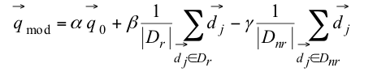

## Search Engine Algorithm Basics

原文地址：https://moz.com/blog/search-engine-algorithm-basics

## 搜索引擎算法基础

引擎并不是尽量返回与输入查询最匹配的一些页面。一个好的搜索引擎会试着回答那些底层的问题。若是你意识到了这一点，你便会理解为什么谷歌（以及其它搜索引擎）用一个非常复杂的算法来决定他们应该返回的结果。算法中的因子包括诸如页面反向链接数量的“硬因素”，也许还有一些通过喜欢和+1的社交推荐。这些通常是外部影响，还会有页面本身的因素。为此，构建页面的方式以及各种页面元素都要在算法中起到作用。但是只有通过全部分析现场以及非现场因素，Google才有可能确定哪些页面会会的查询背后的问题。因此，Google必须分析页面上的文字。

在本文中，我会详细阐述有关搜索引擎及其可选解决方案的一些问题。（很遗憾）到了文章末尾我们也没有透漏谷歌的算法，但是我们可以更进一步理解一些我们作为一个SEO（Search Engine Optimizers，搜索引擎优化工程师）经常给出的建议。会有一些公式，但是不要惊慌。本文并不仅仅是关于那些公式。文章包含一个excel文件。噢，最好的是：我会用一些荷兰美食来介绍这些问题。

看哪：Croquets是细长的而bitterballen是圆形的; -)
【Croquets： 可乐饼   bitterballen： 奶油肉丸 】

### 真或假

搜索引擎近些年来发展迅速，但是起初它们只能处理布尔操作值。简单来说，就是一个词是否包含在文档中。有些事情就是真或假，1或者0。另外你还能使用比如AND(且)，OR(或)以及NOT(非)的操作符，去搜索包含多个词语或者排除一些词语的文档。这听起来相当简单，但是它确实也有一些问题。假设我们有两个文档，包含如下文本：

**文档1：**           
"And our restaurant in New York serves croquets and bitterballen."

**文档2：**             
"In the Netherlands you retrieve croquets and frikandellen from the wall."

噢，差点忘了给你展示一下frikandellen了 ;-)

如果我们要构建一个搜索引擎，第一步就是把文本标记化。我们想要能够快速地定位到哪个文档包含条件词。如果我们把所有的“标记”（token）放入到数据库中，这会更容易一些。一个“标记”（token）可以是一个文本里的任意一个单独的词，那么文档1里有多少“标记”（token）呢？

在你自己开始回答这个问题的时刻，你可能会考虑关于“term”的定义。事实上，在例子中“New York”应该被当做一个term。如何确定这两个单词实际上是一个单词超出了本文的范畴，所以目前我们恐怕还是会把每个分开的单词当作是分开的标记。所以，在文档1中有10个标记，而文档2中有11个标记。为了避免我们的数据库中有重复的信息，我们会去存储“类型”（type）而不是那些标记。

Type是文本中的唯一标记。在文档1的例子中包含了两次"and"这一标记。在这个示例中，我会忽略"and"出现了一次大写以及一次没有大写的事实。与确定词语（term）一样，有技术来确定某些词是否确实需要大写。在这种情况下，我们假设可以在没有大写的情况下进行存储，亦假定“And”和“and”是同一类型。

通过把所有的类型（type）以及可以查找得到的文档存储在数据库中，我们便可以在Boolean（布尔值）的帮助下在数据库中搜索了。搜索"croquets"都会得到文档1和文档2的结果。对于"croquets AND bitterballen"的搜索则只会返回文档1的结果。这种方法的问题是你可能会得到太多或者太少的结果。另外，它缺少了组织结果的能力。如果我们想要提高我们的方法，我们需要确定我们可以使用的，然后是文档中存在/不存在这个词。如果你是Google，会使用哪些页面因素来组织返回结果呢？

### Zone Indexes算法

相对简单的方法就是使用zone indexes（区域索引）算法。一个页面可以被分成不同的区域。想一下有一个标题（title），描述（description），作者（author）和主体（body）。通过增加一个文档中每一个区域的权重，我们可以给每个文档都计算下，得到一个简单的得分。这是搜索引擎最初对于网页的方法之一，用于确定页面主题。区域索引的得分算法如下：

假定我们为每个区域增加如下权重：

| 区域(Zone) | 权重(Weight) |
| :-: | :-: |
| title | 0.4 |
| description | 0.1 |
| content | 0.5 |

我们执行如下搜索查询：                  
"croquets AND bitterballen"

接着我们便会得到有着如下区域的文档：

| 区域(Zone) | 内容(Content) | 布尔值(Boolean) | 得分(Score) |    
| - | - | - | - |   
| title | 	New York Café| 0 | 0 |  
| description | Café with delicious **croquets** and **bitterballen** | 1 | 0.1 |  
| content | Our restaurant in New York serves **croquets** and **bitterballen** | 1 | 0.5 |   
|   -    | - | Total | 0.6 |  

因为在某些时候，每个人都开始滥用分配给例如description的权重。对于Google来说，将主体分成不同的区域，并为主体的每个区域分配不同的权重，这是很重要的。

这确实有点困难，因为网页包含具有不同结构的各种文档。然而这种机器对XML文档的解析非常简单。解析一个HTML文档时，对于一台机器来说就更难了。结构和标签更有限，这使得分析更加困难。当然在不久的将来就会有HTML5以及Google将支持微框架，但是它仍有自己的限制在。譬如，如果你知道了Google给<content>标签中内容分配了更多的权重，并且给<footer>标签中的内容减了权重，那么你就绝不会再用<footer>标签了。

为了判定一个网页的内容，Google将不得不把一个web页面分块处理。这种方式下，Google就能判断页面上的哪一块是重要的而哪一块不是。能使用的方法之一便是文本/代码的比率。一个页面中的某一块含有的文本比HTML代码更多，就有可能是网页的主要内容。含有许多超链接或者HTML代码且很少内容的页面块有可能是菜单部分。这也是为什么选择正确的富文本编辑器是非常重要的。其中的一些编辑器用了很多不必要的HTML代码。

文本/代码比率的使用只是搜索引擎可以用来将页面划分为块的方法之一。Bill Slawski 在今年早些时候也谈到了[识别块](http://www.seobythesea.com/2011/02/how-a-search-engine-might-identify-the-functions-of-blocks-in-web-pages-to-improve-search-results/)。

区域索引算法的优点是你可以为每个文档都计算一个简单的得分，缺点当然就是许多文档可能得到相同的分数。

### Term frequency 词频

当我让你去想一下页面上你会用来确定文档关联的因素的时候，你可能会想到搜索词的频率。为使用搜索词更频繁的文档增加权重是合乎逻辑的一步。

一些SEO坚信那些在文本中使用特定百分比关键词的故事。我们都知道那不是真的，但还是让我来展示一下为什么。我会尽量用以下示例的基础上解释。接下来会出现一些公式，但如我所说，故事的概要是重点。

下面表格中的数字便是单词在文档中出现的次数（也可称作词频或者tf）。那么那个文档对于查询“croquets and bitterballen”有更高的得分呢？

|  document  | croquets | and | café | bitterballen	| Amsterdam | ...|     
| - | - | - | - | - | - | - |   
| **文档1** |8  |10  |3  |2  | 0 | |    
| **文档2** |1  |20  |3  |9  | 2 | |    
| **文档N** |...  |...  |...  |...  | ... | |    
| **查询** |1  |1  |0  |1  | 0 | |   

  
两个文档的得分如下计算得来：                
score(“croquets and bitterballen”, Doc1) = 8 + 10 + 2 = 20         
score(“croquets and bitterballen”, Doc2) = 1 + 20 + 9 = 30  

这种情况下文档2显得更符合查询（条件）。在这个例子中，单词“and”得到了最大的权重，但这是公正的吗？这是一个停止词，并且我们只想给它很小的值。我们可以通过使用逆文档频率（tf-idf）来解决这一点，即与文档频率（df）相反。文档频率是指出现一个词的文档数量。逆文档频率，那么，便是对立面。随着出现单词的文档数量的增长，idf就会缩小。

你可以通过将语料库中文档的总数除以包含该词的文档数，然后取商的对数来计算idf。

假设我们搜索词的idf如下：        
Idf(croquets)            = 5          
Idf(and)                 = 0.01          
Idf(bitterballen)        = 2

那么你便会得到下面的得分：   
 score(“croquets and bitterballen”, Doc1) = 8*5 + 10*0.01 + 2*2 = 44.1         
 score(“croquets and bitterballen”, Doc2) = 1*5 + 20*0.01 + 9*2 = 23.2  
 
现在文档1得到了更高的得分。但目前我们也没有将长度考虑在内。一个文档可以包含比另一个多得多的内容，而非更有相关性。一个长文档用这种方法得到高分是相当容易的。

### Vector model 向量模型

我们通过查看文档的余弦相似性来解决这个问题。对于此方法背后理论的准确解释超出本文的范围，但是你可以将其看作是文档中查询关键词之间的一种调和均值。我做了一个[Excel文件](https://www.onetomarket.nl/wp-content/uploads/2011/11/vectorspace-score.xls)，所以你可以自行研究。文件本身有一个说明。你需要（了解）下面的指标：

- Query terms(查询词)-在查询条件中每一个分离的词。
- Document frequency(文档频率)-Google知道有多少文档包含那个词吗？
- Term frequency(词频)-文档中每个单独查询词的频率（将Sander Tamaëla制作的焦点关键字小部件添加到书签中，对此部分非常有帮助）。

这有一个我实际使用这个模型的例子。该网站有一个网页旨在为“buying bikes”取得排名，荷兰语为“fiets kopen”。问题在于错误页（主页）正为查询获取排名。

公式的话，我们之前提到了逆文档频率（idf）。为此我们需要Google索引中文档的总数。那么我们[假设](http://www.worldwidewebsize.com/)N=104亿。

下表的解释说明：

- tf = term frequency（词频）
- df = document frequency（文档频率）
- idf = inverse document frequency（逆文档频率）
- Wt,q = weight for term in query（查询单词权重）
- Wt,d = weight for term in document（文档单词权重）
- Product = Wt,q * Wt,d
- Score = Sum of the products（结果的总和）

正在排名的主页： http://www.fietsentoko.nl/

|term|Query|-|-|-|Document|-|-|Product|              
|-|-|-|-|-|-|                
|- |tf |df |idf | Wt,q|tf|Wf|Wt,d|           
|Fiets|1|25.500.000|3.610493159|3.610493159|21|	441|0.70711|2.55302|          
|Kopen|1|118.000.000|2.945151332|2.9452|21|	441|0.70711|2.08258|            
|-|-|-|-|-|-|-|Score:|4.6356|         

我想要去取得排名的页面：http://www.fietsentoko.nl/fietsen/

|term|Query|-|-|-|Document|||Product|              
|-|-|-|-|             
|- |tf |df |idf | Wt,q|tf|Wf|Wt,d|               
|Fiets|1|25.500.000|3.610493159|3.610493159|22|	484|0.61782|2.23063|                
|Kopen|1|118.000.000|2.945151332|2.945151332|28|	784|0.78631|2.31584|              
|-|-|-|-|-|-|-|Score:|4.54647|

几天过去，Google爬取到了这个页面，我修改的文档开始为这一单词排名。我们可以得出结论，你使用单词的次数不一定重要，找到你想要排名的单词合适的平衡点非常重要。

### Speed up the process 加速过程

为了找到查询条件的文档，为此每个文档都得执行这样的计算，需要花费大量的处理能力。你可以通过增加一些静态值来确定为哪些是你要计算得分的文档解决这个问题。比如PageRank就是一个好的静态值。当你首次给那些匹配查询条件并且有很高的PageRank计算得分时，你会发现一些改变，一些文档无论如何都能出现在结果的前10个。

另外一个可能性是优胜列表的使用。对于每个单词，只去取含有该词的前N个文档。如果你有多项查询，则可以将这些列表交叉以查找包含所有查询字词的文档，并且可能会有一个高分。只有包含所有词的文档过少，你才能在所有文档中搜索。因此，你并不只是找到最佳的矢量得分来排名，也可以通过获取正确的静态分数。

### Relevance feedback  相关性反馈

基于文档的相关性，相关性反馈为查询中的单词分配更多或更少的值。通过使用相关性反馈过程，搜索引擎可以自行改变其搜索而不用通知用户。

这里第一步要做的就是判定一个文档是否（与查询）相关。虽然现在有搜索引擎可以指定一个结果或者文档是否相关，但是Google很长时间并不曾拥有这样的功能。他们的第一次尝试是为搜索结果添加一个最喜欢的星标。现在他们正使用`Google+`按钮进行尝试。如果有足够多的人开始为一个确定的结果点击按钮，Google便会开始考虑将这个文档与该查询关联起来。

另一个方法查看排名很好的当前页面。这些页面也会被考虑是相关的。该方法的风险在于主题的缥缈。如果你正在查找奶油肉丸（bitterballen）和可乐饼（croquettes），那么排名最高的页面就是阿姆斯特丹的小吃店，风险就是你会给阿姆斯特丹分配一个值，那么最终结果中只会有阿姆斯特丹的小吃店。

Google的另一种方法是简单使用数据挖掘。他们还可以查看不同页面的点击率。对于平均值，有较高的点击率并且较低的跳出率的网页，也可以认为是相关的。跳出率页面非常高的将会是不相关的。

我们使用此数据来调整查询项权重的示例是[Rochio的反馈公式](https://en.wikipedia.org/wiki/Nearest_centroid_classifier)。归结起来为给查询中的词调整其值，并且可能增加额外的查询词。公式如下：

下面这个表格是该公式的一个直观表示。假设我们带入下面的值：          
Query terms（查询词）: +1 (alpha)     
Relevant terms（相关词）: +1 (beta)        
Irrelevant terms（非相关词）: -0.5 (gamma)          

我们有下面的查询：         
“croquets and bitterballen”

以下文档的相关性如下：     
Doc1   : 相关       
Doc2   : 相关      
Doc3   : 不相关        

| Terms | Q	|Doc1|	Doc2|	Doc3|	Weight new query |                
| -------- | -- | -- |  -- |  -- |  -- |                  
| croquets | 1 |1|	1|	0|	1 + 1 – 0 = 2|                   
| and | 1	|1|	0|	1|	1 + 0.5 – 0.5 = 1|                 
| bitterballen | 1	|0|	0|	0|	1 + 0 - 0 = 1|                
| café | 0	|0|	1|	0|	0 + 0.5 – 0 = 0.5|                   
| Amsterdam | 0	|0|	0|	1|	0 + 0 – 0.5 = -0.5 = 0|

新的查询如下：            
croquets(2) and(1) bitterballen(1) cafe(0.5)

每个词的值便是在查询中获得的权重值。我们可以在矢量计算中使用这些权重。虽然单词`Amsterdam`给了一个-0.5的得分，将负值调整回0。这种方法，这样我们就不会在搜素结果中排除单词。虽然`café`并没有出现在原本的查询中，但它被添加进了查询并在新查询中给了其一个权重值。

假如Google用了这种相关性反馈的方式，那么你便可查看那些针对特定查询排名的网页。通过使用相同的词汇表，你可以确保从这种相关性反馈中获取最大收益。

### 小贴士

简而言之，我们已经考虑了给一个基于网页内容的文档分配权值的之一选项。虽然矢量方法相当准确，但它肯定不是计算相关性的唯一方法。对于模型会有很多的调整，然而它仍然只Google等搜索引擎完整算法的一部分。我们也研究了相关性反馈。希望
对于搜索引擎使用可以使用外部因素的方法，我已经给你了一些见解。现在该是你对此探讨并研究一下那个excel文件的时间了:-)

