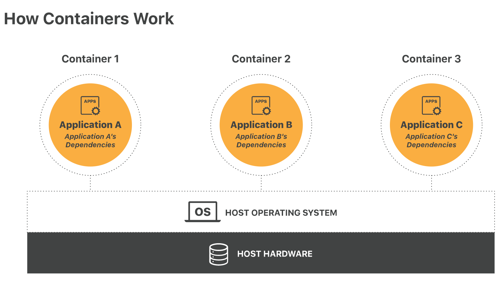
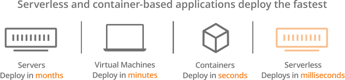

# 无服务器计算 vs. 容器 | 如何选择

无服务计算和容器都是为云托管 web 应用减小开销的架构，但是它们在几个重要方面还是有不同的。容器比虚拟机更轻量，而与基于容器的体系结构相比，无服务器部署更加轻量，且更容易扩展。

## 无服务器计算 vs. 容器

相对于在传统服务器或虚拟机上托管应用，无服务器计算和容器都使开发人员能够以更低的开销和更多的灵活性来构建应用。一名开发人员应该采用哪种架构通常取决于应用程序的需求，而无服务器应用更加具可扩展性，而且通常更具成本效益。

## 什么是容器？

一个容器既“容纳”了应用程序又包含了应用程序正常运行所需的所有元素，包括系统库、系统设置，以及其他依赖。就像“只需加水”的煎饼混合物一样，容器只需要一件事——托管和运行——就可以执行它们的功能。

任何种类的应用都可以在容器中运行。无论容器化应用程序在何处托管，它都会以相同的方式运行。 容器可以很轻易地移动和部署在任何需要的地方，就像物理运输集装箱一样，由于标准尺寸，因此可以通过各种运输工具（船、卡车、火车等）运输到任何地方，而不管其中装的是什么。 

在技术术语中，容器是将一台机器或服务器划分为单独的用户空间环境的一种方法，这样每个环境只运行一个应用程序，而不与机器上的任何其他分区进行交互。每个容器与其他容器共享机器内核（内核是操作系统的基础，与计算机的硬件交互），但是其运行状态就像它是机器上唯一运行的系统。

## 容器 vs. 虚拟机

虚拟机是模拟完整计算机系统的软件。它与机器上的其他部分隔离开来，并且就好像它是机器上唯一运行的操作系统，包括拥有自己的内核。虚拟机是在一台服务器上托管多个环境的另一种常见方式，但它们使用的（服务器的）处理能力比容器要大得多。

## 什么是无服务器计算？

无服务器应用程序被拆分为多个函数，由第三方供应商托管，第三方供应商仅根据每个函数运行的时间向应用程序开发人员收费。更多关于无服务器计算，参见[什么是无服务器计算？](https://www.cloudflare.com/learning/serverless/what-is-serverless/)。

## 无服务器计算与容器关键的不同之处是什么？

#### 物理机

虽说“无服务器”计算实际上是运行在服务器上的，但无服务器供应商会根据应用程序的需要提供服务器空间；并没有为给定的函数或应用程序分配特定的机器。另一方面，尽管需要转移时，容器可以很容易地迁移到不同的机器上，但是每个容器一次只能在一台机器上使用该机器的操作系统。

#### 可伸缩性

在基于容器的体系结构中，部署的容器数量由开发人员提前确定。相比之下，在无服务器架构中，后端本身就可以自动伸缩以满足需求。

继续航运集装箱的比喻，一家航运公司可以尝试预测某一产品的需求增加，并将更多的集装箱运到目的地，以满足这一需求，但如果需求超过预估，它是不能立即行动来生产更多装满货物的集装箱的。

无服务器体系结构则是针对这种情况的一种方式。说到计算能力，无服务器计算就像现代家庭中的供水系统：通过打开水龙头，消费者可以随时获得和使用他们需要的水，而且他们只为他们使用的水付费。这远比试图一次性买一桶水或一个船运集装箱要灵活得多。

#### 成本

由于容器一直保持运行，因此云提供商必须为服务器空间收费，即使当时没有人使用该应用程序。 

在无服务器体系结构中则没有持续的开销，因为除非调用应用程序代码，否则它不会运行。相反，开发人员只为他们的应用程序实际使用的服务器容量付费。 

#### 维护

容器托管于云，但是云提供商并不负责更新和维护他们。开发人员不得不自行管理和更新他们发布的容器。

从开发人员的角度来看，无服务器架构并没有需要管理的后端。供应商会负责运行代码服务器的所有管理和软件更新工作。

#### 部署时间

由于需要配置系统设置、库等，因此容器最初的启动时间比无服务器函数要长。配置后，容器只需几秒钟即可部署。但是，由于无服务器函数比容器微服务更小，并且不与系统依赖项捆绑在一起，因此部署它们只需要几毫秒。一旦代码上传，无服务器应用程序就可以运行。

#### 测试

因为后端环境很难在本地环境中复制，因此很难测试无服务器 web 应用程序。相反，容器无论部署在何处都运行一致，因此在将其部署到生产环境之前，测试基于容器的应用程序相对简单。 

对于支持无服务器架构的 CloudFlare Workers，我们创建了一个虚拟的[测试环境](https://cloudflayworkers.com/)来帮助改进开发过程。 

## 无服务器计算和容器的相似之处有什么？

两者都是基于云的，而且它们都大大减少了基础设施的开销——而无服务器计算相比容器更甚。在两种架构中，应用程序都会作为较小的组件进行分解和部署。基于容器的框架中，每个容器只会运行一个微服务。

## 什么是微服务？

微服务是整个应用的一部分。每个微服务执行一个服务，多个集成微服务组合构成整个应用。 虽然这个名字似乎暗示着微服务的量级是很小的，但并非必须如此。

将应用程序构建为微服务集合的一个优点是，开发人员可以一次更新一个微服务，而无需在需要进行更改时更新整个应用程序。像在无服务器架构中一样，将应用程序构建为一组函数，提供了相同的好处，但是，它是在更细粒度的层次上的。

## 在无服务器架构和容器之间开发人员该如何选择？

选择无服务器架构的开发人员能够快速发布和迭代新的应用程序，而无需担心应用程序是否可以扩展。此外，如果应用程序看不到持续不断的流量或使用情况，那么无服务器计算将比容器更具成本效益，因为代码不需要经常运行。

容器使开发人员能够更好地控制应用程序运行的环境（尽管这也需要更多的维护）以及所使用的语言和库。因此，容器对于将遗留应用程序迁移到云端非常有用，因为可以更紧密地复制应用程序的原始运行环境。

最后，使用混合架构，可以将一些无服务器函数和一些函数都部署在容器中。例如，如果一个应用程序函数需要比无服务器供应商分配的内存更多的内存，如果一个函数太大，或者某些特定函数（而不是其他函数）需要长时间运行，则混合体系结构既能使开发人员能够获得无服务器的好处，同时可以对无服务器不能支持的函数使用容器。

## Cloudflare 支持哪种类型的架构？

Cloudflare 能够使开发人员通过[Cloudflare Workers](https://www.cloudflare.com/products/cloudflare-workers/)构建高性能的无服务器应用。

## 链接

- 原文地址：https://www.cloudflare.com/learning/serverless/serverless-vs-containers/

