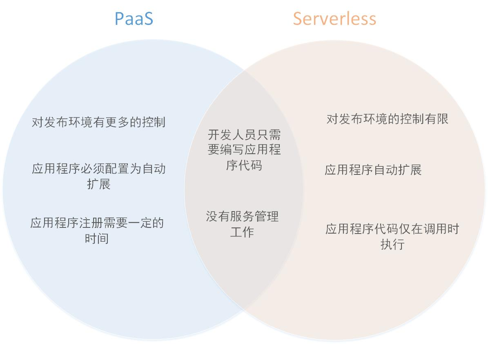

## Serverless 与 Platform-as-a-Service（PaaS）的不同

由于 [无服务计算（serverless computing）](https://www.cloudflare.com/learning/serverless/what-is-serverless/)以及 [平台即服务（platform-as-a-service，PaaS）](https://www.cloudflare.com/learning/serverless/glossary/platform-as-a-service-paas/)都是使整个后端对开发人员不可见的后端框架，所以还是有些相似指出的。然而，两者之间还是存在几处较大差异的，多数用例适用于其中一种，而非全部兼容。PaaS 和 Serverless 之间的主要差别在于可扩展性，定价，启动时间，工具以及在[网络边缘](https://www.cloudflare.com/learning/serverless/glossary/what-is-edge-computing/)部署的能力。

### 哪种架构扩展性更好呢，PaaS 还是 Serverless？

Serverless 应用程序可以即时、自动以及按需扩展，无需开发人员或供应商提供任何额外配置。还可以通过定义扩展。相比之下，虽然开发人员可以对PaaS托管的应用程序进行编码，以便根据用户需求进行伸缩，但这并不是PaaS的固有功能，开发人员必须进行一定量的预测才能正确扩展。

可以将无服务器计算与水龙头的放水行为进行比较，其中水代表计算能力。现代家庭中的水龙头可以随时打开，并可以流出尽可能多的水。PaaS更像是使用饮水机和桶装水配送。仍然可以根据需要获得尽可能多的水，但它并不像打开水龙头那么简单；如果需求增加，消费者必须要求供应商提供更多。在这两种情况下，某人正在处理“后端”——净化水源，将其带到房子里等等——但只有自来水可以精确，按需和实时缩放。

无服务器架构能够通过在请求时启动应用程序 [函数](https://www.cloudflare.com/learning/serverless/glossary/function-as-a-service-faas/) 的新实例来快速扩展。它还可以通过在不再需要时关闭函数或运行一段时间后关闭函数来快速缩减。实际上，serverless 的 Web 应用程序能够一直缩减至无活动，然后在几秒或几毫秒内响应事件再次启动。基于 PaaS 构建的应用程序则无法如此快速地伸缩或者伸缩到这种程度。

### PaaS 和 serverless 定价方面有何不同？

继续上面水的比喻，使用自来水的消费者用多少水便支付多少费用。同样，serverless 计费非常精确，开发人员只需支付他们使用的服务的费用。一些 serverless 供应商仅向开发人员收取其功能运行的准确时间，对于每个功能的每个单独实例，只需几分之一秒。其他的提供商也有按请求数收费的。

使用饮水机并且需要桶装水配送的消费者也只需支付他们使用的费用，但是他们按桶支付，而不是用液体盎司支付。同样，一些 PaaS 供应商仅针对应用程序使用的内容向开发人员收费。但是，计费并不像 serverless 那样精确。其他的 PaaS 供应商对其服务收取每月固定费用。开发人员通常能够自定义他们所支付的计算能力。然而，这是事先决定的，且对实时使用的增加和减少并没有什么反应。

这种差异并不一定意味着无服务器架构总是更实惠。正如水龙头一直开着，很快花费就会很多，具有大量恒定使用流量且不会波动很大的Web应用程序可能会因使用无服务器计算而变得昂贵。

### PaaS 和 serverless 应用程序之间的启动时间有何不同？

如上所述，只要事件触发应用程序函数，serverless 应用程序几乎可以立即激活。PaaS 构建的应用程序可以快速启动和运行，但它们不像无服务器应用程序那样轻量级，并且需要更长时间才能启动和运行。从用户的角度来避免延迟，至少 PaaS 应用程序的某些函数必须在大多数时间或者一直保持运行。

### PaaS 和 serverless 供应商提供了哪些工具？

一般来说，PaaS 供应商会为开发人员提供更多工具来构建和管理他们的应用程序，包括用于测试和调试的工具。 由于 serverless 应用程序不能在指定的机器上运行，无论是虚拟机的还是其他的，以及 serverless 函数无论在何种环境下都应该具有一致性，serverless 供应商可能会提供一些工具，但它们不能提供构建和测试应用程序的完整环境。

### Serverless 应用程序是否可以部署在网络边缘？

serverless 代码虽不能在特定服务器上，但可以在互联网的任何地方运行，这使得其可以非常靠近网络边缘的最终用户来部署 serverless 应用程序，从而大大减少延迟。Service Worker 和 [Cloudflare Worker](https://www.cloudflare.com/products/cloudflare-workers/) 便是靠近那些用户运行的 serverless 函数（参看 [Serverless JavaScript 是如何工作的？](https://www.cloudflare.com/learning/serverless/serverless-javascript/)）。

### 使用 PaaS 构建的应用程序是否可以部署在网络边缘？

从开发人员的角度来看，在 PaaS 中是没有服务器的。虽然如此，就托管代码的位置而言，PaaS 仍然与 serverless 计算有所不同。PaaS 供应商要么利用其他供应商的 IaaS（基础架构即服务）产品，要么拥有自己的物理数据中心。结果就是，构建在云平台上的应用程序可能仅在某些指定的机器上运行，进而开发人员不能通过在（网络）边缘运行代码来优化其应用程序的性能。

### 链接：

- 原文地址：https://www.cloudflare.com/learning/serverless/glossary/serverless-vs-paas/

- 原图：

