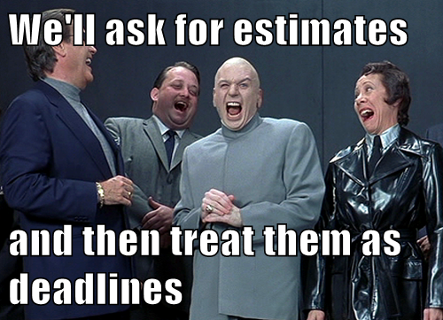

## 破坏程序员生产力的12件事

很多文章都会以技术领导及工程经理的角色阐述观点。我们经常碰到的一个共同主题是如何提高团队的生产力。但是，在你专注于提高生产力之前，你可能首先要考虑是什么在摧毁它，以便建立一个可靠的基础。不幸的是，即便[《人件》](https://book.douban.com/subject/1108725/)已发布了近30年，我们也能看到许多团队正在遭受巨大的生产力损失，以一些（消极的）异常方式！

没人期望程序员可以在没有计算机的情况下完成工作，但是很多公司希望他们可以在不经过思想的情况下去完成工作。这同样不切实际。

那么，就让我们深入探讨一下我们的列表，哪12件事阻止你的开发人员“完全投入”并提高工作效率。我将根据影响程度由大到小列出，请随意评论。

如果你想知道这一切是否值得投资，只需考虑开发人员的薪水。生产力即使提高10%也是很多了。

### 1. 中断以及会议

我认为，中断是开发者生产力的头号杀手。开发人员并不能轻易回到打断之前他们所在的正确位置。他们需要进入到开发的思维模式，然后慢慢地追溯到他们离开的地方。他们可以很轻易的就花费掉30多分钟。并且中断越多，挫折越多，工作质量就越差，bug就越多——循环往复。

> “当我试图开始工作的时候，你阻挠我的次数越多，我每次重新开始的时间就越长。如果你让我的早餐充满了中断——当这一天毫无进展的时候，不要感到惊讶。” Reddit的一名开发者。

那么会议呢？会议与一次打断的唯一不同是，会议是一次有计划的打断，造成的结果往往更糟。开发人员如果知道他们在工作时会有一个中断（会议），那么他们便不能继续进行手头的任务。因此，如果他们在一两个小时后有个会议，他们将无法取得任何进展，因为大多数工程任务需要更多时间。

[正如 Paul Graham 写道](http://www.paulgraham.com/makersschedule.html)，“一次会议可以将整个下午分成两部分，每部分都太小而无法做任何事。”

这种情况如何避免呢？这个很好记，你没理由记不住。例如，在一天的开始或午餐前举行简短的状态会议，以避免不必要的打断。

### 2. 微观管理

在不同类型的管理者中，微观管理者在开发人员的生产力方面可能是最糟糕的。当然，微观管理者会开更多的会议和造成更多的意外中断。但不仅仅是这样。他们表现出缺乏信任，通过这样，你会觉得他们不断地削弱你的技能和你完成任务的能力。开发人员在中断之间的任何动力都会在那时消失，这些影响超出了仅是生产力这方面。微观管理者可能是开发人员离职的第一个原因，或者至少是改变团队的原因。

### 3. 模糊性

有很多方法可以说明模糊性。像“它坏掉了，修复它！”这样的错误报告，并没有提供足够的信息供开发人员使用。顺带一提，有错误报告模板的话可以帮助解决这个问题。

或者对某个功能的规范不明确，在这种情况下，一旦管理者更好地详细说明了预期的行为，开发人员就会开始实施对他们来说感觉合适的事情。

不明确的优先级也属于此类别。开发人员思考他们是否正在处理正确的任务的时间，便可以轻易节省。并且有时候经理会询问他们，为什么要处理这个特定的任务（然而优先事项并没有提前定义）……好吧，那么你将会遇到很多麻烦……

### 4. 海鸥管理

你从没听说过？当管理者完全不参与工作时，就会发生这种情况，但是……他们只是偶尔俯冲一下，便能毁掉一切。在飞走以前，便指出，“这错了，还有这个，这个看着很糟糕”等等。我不得不承认我喜欢这个形容，但不幸的是，这种情况比我们想象得更频繁。这种行为让开发人员感到非常沮丧；他们将在接下来的几个小时内无法找回之前状态，有时甚至需要好几天。

### 5. 贪功

是否有管理人员或者开发人员抢走过去几周你做的工作成果呢？开发人员能力优先。抢占别人的功劳无异于为你自己带来了从别人的手里夺走报酬。这在我的列表上排名非常高，因为我觉得它产生了很多紧张（心情），而这将会在一段时间内摧毁整个开发人员的生产力。

### 6. 环境——噪声，动作，工作区设计……

对于非程序员来说可能很奇怪，但是开发人员所处的工作环境对他们的工作有重要影响。例如，有一些白噪声——响亮的交流电，听到汽车和卡车驶过——帮助他们更好地集中注意力。这就是我们这么多人戴耳机的原因。我其实刚发现RainyMood（译者：一款APP，可以聆听雨声）——非常不错。

同样，如果工作区设计为可以尽可能多的移动，那将无法帮他们集中注意力。或者让台式计算机屏幕固定一个位置，使得管理者高度可见……这会产生一些额外的压力，甚至有更多的机会被打断工作。

### 7. 规模扩张

项目管理中的规模扩张（也成为焦点扩张，需求扩张，功能扩张）是指项目范围内不受控制的变化。当项目范围未正确定义、记录或控制时，就可能会发生这种情况。

规模扩张将相对简单的请求转变为可怕的复杂且耗时的怪物！大部分时间它都发生在开发过程中！例如，对于一个简单的功能：    
版本1（实施前）：功能是“显示位置的地图”      
版本2（版本1几乎完成之时）：功能改为“显示位置的3D地图”         
版本3（版本2几乎完成之时）：功能再次更改为“显示用户可以漫游的3D地图”

### 8. 产品定义过程

所以这个第一眼看上去可能很奇怪，但实际上很容易理解。如果产品团队定义其团队的优先级而没有（通过客户反馈或任何方式）验证相应功能的兴趣点，并且开发人员发现大多数功能最终没有被使用，他们会觉得他们所做的事情是无用的，从而失去动力。我们都希望感受到（所做成果的）影响力，这对于开发人员来说可能更为重要！

### 9. 缺乏对技术债务的考虑

技术债务是一个慎重的决定，通过实施非最佳解决方案或编写非最佳代码来更快地发布软件。承担一些技术债务是不可避免的，并且可以在短期内提高软件开发的速度。但是，从长远来看，它会导致系统复杂性，从而降低开发人员的速度。非程序员经常低估成产力的损失，并且总是倾向于前进，这就成了一个问题。但如果重构永远不是优先事项的一部分，它不仅会影响生产力，还会影响产品质量。

### 10. 工具多样性和硬件

开发人员每天都会用很多工具去编写、推送以及合并他们的代码。越自动化，效果越好。不言而喻，如果你使用“古老的”工具，便会影响到生产力。同样，拥有一个大屏幕而不只是一台笔记本电脑也会有一定影响。考虑到硬件成本和开发人员的工资，但哪怕只提高5%的生产率，这些投入便值得！只需要提供开发人员团队喜欢的工具和硬件（单独用于硬件，但仅作为工具组）。

### 11. “指导”文档

在学习如何编码时，有人会要求我们要尽早且经常写注释。这一看法是，有大量的注释总比寥寥无几的好。不幸的是，许多程序员错误地将其解释为他们必须对每一行代码进行注释，这就是为什么我们经常看到这样的代码：

```
  r = n / 2; // Set r to n divided by 2

  // Loop while r – (n/r) is greater than t
  while ( abs( r – (n/r) ) > t ) {
    r = 0.5 * ( r + (n/r) );     // Set r to half of r + (n/r)
  }
```

你能知道这段代码的作用吗？我也不知道。问题是虽然有很多注释描述了代码正在做什么，但没有一句注释描述为什么这么做。如果程序中存在错误并且你偶然发现了这段代码，那么你也无从下手。

### 12. 异常紧急的Deadline

最后一条与管理者倾向于询问开发人员的估时有关，管理者强迫他们尽可能减小估计的时间，然后神奇地认为它们是最后期限。管理人员甚至会认为，由于开发人员自己“决定”了估时，他们承诺诺在截止日期前完成，因此截止日期应该生效，以便与高层管理人员共享。



毫不惊奇，开发人员认为这些截止日期是不合理的，紧迫的；这会造成紧张和无法集中注意力。

所有这些东西都单单是对于开发人员来说的吗？       
你看着这12件事，它们实际上对于大多数其他基于项目的工作来说都很常见。只是个人影响上对于开发人员更为重要，因为它们需要深入关注自己任务的进展。

如果你已意识到公司内部存在一些文中提到的问题，那么与开发人员讨论这些问题会很有趣。找他们谈话；找出是否存在问题以及如何解决。无论他们说什么，最重要的是相信他们的反馈和意见。虽然今天的技术与30年前截然不同，但经验教训仍然是想通的。在考虑团队生产力是，不能忽视认为因素。与团队成员一起考虑项目流程，环境和工作习惯，让他们知道你如何获得最高的生产力和影响力。

[原文地址](https://anaxi.com/blog/2018/10/15/top-12-things-that-destroy-developer-productivity/)

