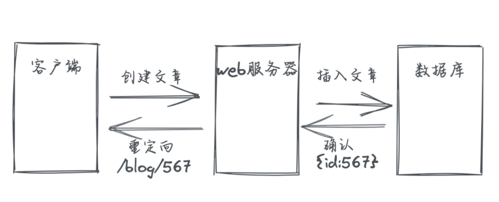
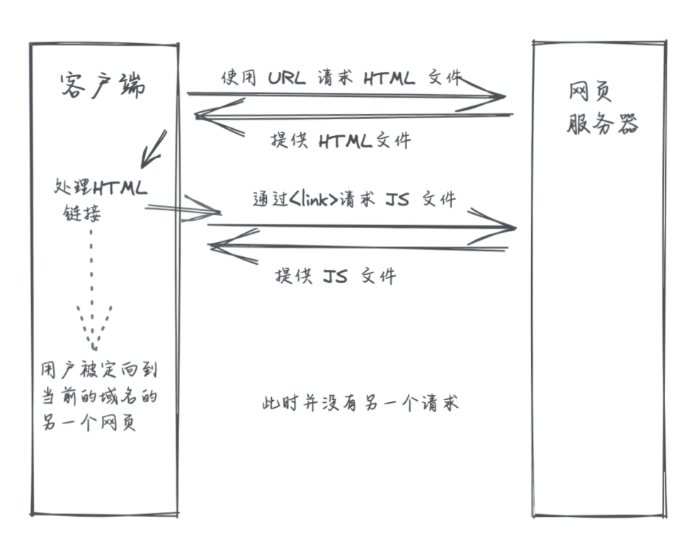

## 渣翻：Web应用 101


> 原文地址： https://www.robinwieruch.de/web-applications/

让我们以一个故事开场：当一个外行人问我关于我在做什么的时候，我会回答：“我是做网站的”。如果他们很好奇，我补充说这些网站相当复杂。如果他们继续问，我会尝试用一些例子来详细说明：Facebook，Spotify，Twitter。不是我为这些公司工作，但我希望这能给他们一个“我建立什么样的网站”的好印象。但是，大多数情况下，对话不会超出“我建立网站”的范围（不会继续问了），我觉得这样也好。

如今，网站与网站也是不同的。网站范围从产品的营销网站到成熟的社交媒体平台。作为一个刚接触 `Web` 开发的人，要掌握整个环境并不容易：从 `Web` 服务器返回的带有 `HTML` 和 `CSS` 的传统简单网站开始，变成了一个更复杂的全栈应用程序，具有复杂的客户端-服务器通信和状态管理。

如果你已经在学习 `HTML`、`CSS` 和 `JavaScript`，并且不了解网站和 `Web` 应用程序的基础知识，那么本篇综合指南也是很适合你的。

在本篇中，我想向你展示 `Web` 开发从简单网站到复杂 `Web` 应用程序的演变，其中我们阐明了以下术语：

- 客户端/服务器架构（client/server）

- 前端/后端（frontend/backend）

- 网站/网页应用（website/web application）

- 客户端应用/服务器应用（client application/server application）

- REST/GraphQL

- 网页服务器/应用服务器（web server/application server）

- 服务器端渲染 vs 客户端渲染（server-side rendering vs client-side rendering）

- 服务器端路由 vs 客户端路由（server-side routing vs client-side routing）

- 单页应用程序 vs 多页应用程序（single-page application vs multi-page application）

- 代码拆分，延迟加载，树摇，...

- 全栈应用

- 静态站点生成

- BaaS，PaaS，IaaS，...

根据你当前作为 Web 开发人员的水平，我鼓励在阅读本指南时随时休息一下，因为它非常广泛，对于初学者来说可能有点不知所措，尤其是在最后。那么，让我们开始吧...

### 一个传统的网站

如果你正在学习 Web 开发，那么很可能会从使用 HTML 和 CSS 构建的传统网站开始。一个没有样式（CSS）并且没有任何逻辑（JavaScript）的网站只是HTML。


如果在笔记本电脑或智能手机上的浏览器（例如 Firefox）中导航到特定 `URL` ，浏览器则会向负责该 `URL` 的 Web 服务器发出请求。如果 Web 服务器能够将请求与网站匹配，则它会向浏览器提供该网站的 HTML 文件。

为了将网站传输到浏览器，HTTP 用作客户端和 Web 服务器之间请求和响应的通信协议。这就是为什么每个 `URL` 前面都有“http”（或者https）的原因。

客户端和服务器之间的通信是同步的，这意味着客户端向服务器发送请求并等待来自服务器的响应。你所请求的网站不会立即显示，因为将请求从客户端发送到 Web 服务器并接收来自 Web 服务器的响应需要时间。


HTTP 请求附带四种基本的 HTTP 方法：`GET`、`POST`、`PUT` 和 `DELETE`。HTTP `GET`方法用于读取资源，而其余方法用于写入资源 - 其中资源可以是从HTML 到 JSON 的任何内容。所有四种方法都可以抽象为臭名昭著的 CRUD 操作：创建、读取、更新和删除。

```
Create  -> HTTP POST
Read    -> HTTP GET
Update  -> HTTP PUT
Delete  -> HTTP DELETE
```

在我们的网站示例中，通过访问浏览器中的 URL 从 Web 服务器向客户端提供服务，浏览器执行 HTTP GET 方法从 Web 服务器读取 HTML 文件。

#### 客户端和服务器有什么不同？

客户端是使用服务器（资源）的一个实体。它从服务器读取资源或将资源写入服务器。对于传统网站，客户端就是你的浏览器。如果在浏览器中导航到特定 `URL` ，那么浏览器会与服务器通信以请求资源（例如.HTML）以显示网站。但是，客户端也无需是浏览器（例如 `cURL`）。

服务器是为客户端提供服务的实体。在网站的传统意义上，服务器对客户端的请求做出反应，并使用来自 HTTP `GET` 请求的资源（例如.HTML CSS，JavaScript）回复，或者承认来自 HTTP `POST`，`PUT`，`DELETE` 请求的操作。目前流行的 Web 服务器包括 NGINX 或 Apache，它们是一种特定类型的服务器。


可以说没有服务器就没有客户端，没有客户端就没有服务器。它们一起工作，即使它们不需要在同一个地方。例如，计算机上的浏览器位于你的本地位置（例如德国的柏林），而为你提供网站的 Web 服务器在远程位置运行（例如德国的法兰克福）。服务器（只是另一台计算机）通常位于本地计算机以外的其他位置。为了开发 Web 应用程序或网站，你也可以在本地计算机上运行服务器（译者：可以查看文末链接 localhost 是什么）。


由于客户端不一定需要是本地计算机上的浏览器，因此它也可能在远程位置。稍后会详细介绍。

#### Web 服务器 和 应用（Application） 服务器有何不同？

一个 **Web服务器** 会提供资源（例如.HTML CSS 和 JavaScript），这些资源可以通过 HTTP 传输。当客户端从 Web 服务器请求资源时，Web 服务器通过将资源发送回客户端来满足请求。通常，这些资源只是服务器上的文件。如果将 HTML 发送到客户端，则客户端（在本例中为浏览器）将解释 HTML 网页的形式来呈现。

相比之下，**应用程序服务器** 则会提供 HTML、CSS 和 JavaScript 以外的资源。例如，如果客户端以数据友好格式请求数据，则可以发送 `JSON`。此外，应用程序服务器不绑定到协议。虽然 Web 服务器主要与 HTTP 协议一起使用，但应用程序服务器可以使用其他协议（例如用于实时通信的 WebSockets ）。最重要的事实是，应用程序服务器可以在其服务器端以特定的编程语言（例如 JavaScript 与 Node.js ，PHP，Java，Ruby，C#，Go，Rust 和 Python ）的实现细节。

Web 服务器和应用程序服务器都可以归类为服务器。因此，你经常会听到人们谈论“服务器”，其实他们指的是这两者之一。但是，人们通常说服务器是指物理计算机，它运行在 运行 Web 服务器 或 应用程序服务器 的远程位置。

你可能还会遇到两个术语：部署和托管。我将简要介绍这些术语：部署描述了在服务器上上线网站的行为，托管描述了从该服务器为网站提供服务的持续行为。因此，在你自己的计算机上开发网站时，必须使用本地主机URL打开它，这仅表示该网站的服务器是本地主机。

#### 当我更改 URL 路径时发生了什么？

当我通过 URL 访问网站并浏览该域名（例如 mywebsite.com）从一个路径（例如 `/about`）到另一个路径（`/home`）时会发生什么？对于传统网站，客户端会针对每个不同的 URL 向 Web 服务器发出新请求。


对于每个 URL，都会向专用 Web 服务器发送一个不同的 HTTP GET 方法以满足请求。当用户在浏览器中（例如 `http://www.mywebsite.com/about`）中访问其 `/about` **路径**（也称为**页面**或**路由**）上的网站时，Web 服务器会将有关此 URL 的所有信息发送回浏览器。此过程称为**服务器端路由**，因为服务器决定在每个 URL 上将哪个资源发送到客户端。稍后将了解什么是客户端路由。

#### 当我的网站不只是 HTML 会发生什么？

现代网站由HTML（结构），CSS（样式）和JavaScript（逻辑）组成。没有 CSS，网站就不会有闪闪发光，没有 JavaScript，网站就不会有动态交互。通常当使用 CSS 和 JavaScript 文件时，它们被链接到HTML文件中：

```html
<link href="/media/examples/link-element-example.css" rel="stylesheet">

<h1>Home at /home route</p>

<p class="danger">Red text as defined in the external CSS file.</p>
```

如果浏览器向 Web 服务器访问 URL 的 HTML，Web 服务器会发回 HTML 文件，其中可能包含链接到其他资源（如 CSS 或 JavaScript 文件）的 HTML 标记。对于每个链接，都会向 Web 服务器发出另一个请求以检索文件。


这些也称为[瀑布请求](https://www.keycdn.com/blog/waterfall-analysis) ，因为一个请求必须等待另一个请求完成。在我们的示例中，浏览器不知道它需要在 HTML 文件到达带有 HTML 链接标记之前请求 CSS 文件。在下一个示例中，HTML 文件链接到 JavaScript 和 CSS 文件，而 CSS 文件链接到 JPG 文件（例如，可以用作 CSS 背景）。


但是，如果一个文件中有多个引用，例如链接到 CSS 和 JavaScript 文件的初始 HTML 文件，至少这些资源是会被并行请求和解析的，如上一个示例所示，但在下一个示例中也进行了说明。


最终，浏览器将拥有特定 URL 的所有资源（例如.HTML，CSS，JavaScript，PNG，JPG，SVG），并解释HTML及其所有包含的资源，以显示所需的结果。它已准备好，供你作为用户与之交互。

### WEB 2.0 ：从一个网站到一个 web 应用

最终，仅仅从 Web 服务器提供**静态内容**是不够的。在 Web 2.0（2004 年左右）中，用户不仅可以阅读内容，还可以创建内容；这就产生了**动态内容**。还记得前面的HTTP方法吗？到目前为止，我们只看到了用于读取资源的 HTTP GET 方法，但其他 HTTP 方法呢？

随着 Wordpress 等内容管理系统的兴起，Web 服务器必须使用户不仅能够查看资源，而且还必须能够操作它们。例如，使用内容管理系统的用户必须能够登录、创建博客文章、更新博客文章、删除博客文章和注销。此时，编程语言 PHP（可以由服务器端的 Web 服务器解释）最适合这些类型的动态网站。


将逻辑放在服务器端，开发人员可以处理来自其用户的读取和写入请求。如果用户想要创建博客文章（写入操作），则用户必须在浏览器中编写博客文章，然后单击“保存”按钮将内容发送到 Web 服务器上运行的服务器端逻辑。此逻辑验证用户是否已获得授权，验证博客内容，并将内容写入数据库。所有这些权限都不允许在客户端上进行，否则每个人都可以在未经授权的情况下操作数据库。

由于我们仍然有**服务器端路由**，因此在成功创建博客文章后，Web 服务器能够将用户重定向到新页面。例如，重定向可能是新发布的博客文章。如果没有重定向，HTTP `POST`/`PUT`/`DELETE` 请求通常会导致页面刷新/重新加载。


由于用户现在能够创建动态内容，我们需要一个数据库来存储这些数据。数据库可以位于与 Web 服务器相同的物理服务器（计算机）上（最有可能在 Web 2.0 的早期），也可以位于另一台远程计算机上（最有可能在现代 Web 开发时代）。


将博客文章插入数据库后，可能会为此博客文章生成唯一标识符，该标识符可用于将用户重定向到新发布的博客文章的 URL。所有这些仍然是异步发生的。



现在，在创建博客文章后，如果博客文章的数据不是静态的，而是存储在数据库中，服务器如何发送博客文章的 HTML 文件？这就是**服务器端渲染**的原则（不要误用服务器端路由）发挥作用的地方。

具有面向消费者的网站（静态内容）的 Web 1.0 和具有面向生产者的网站（动态内容）的 Web 2.0 都从服务器返回 HTML。用户导航到浏览器中的 URL 并为其请求 HTML。但是，对于 Web 2.0 中的动态内容，发送到客户端的 HTML 不再是包含静态内容的静态 HTML 文件。相反，它与服务器上数据库中的动态内容进行插值：

```php
<?php if ($expression == true): ?>
  This will show if the expression is true.
<?php else: ?>
  Otherwise this will show.
<?php endif; ?>
```

不同编程语言的**模板引擎**（例如 JavaScript 在 Node.js 的 Pug、PHP 的 Twig、  Java 的 JSP、Python 的 Django）可以在将 HTML 和动态数据发送到客户端之前对其进行插值。在服务器端呈现的帮助下，用户生成的内容可以在客户端请求时动态创建 HTML，从而从服务器提供给 HTML 中的客户端。

我们现在说的还是网站吗？从技术上讲是的，但是通过从带有数据库的 Web 服务器（或应用程序服务器）提供动态内容来超越静态内容的网站也可以称为 Web 应用程序。这两种类型之间的界限是很模糊的。

Web 2.0 一词及其受欢迎程度在 2010 年左右减弱，因为 Web 2.0 的功能变得无处不在并失去了新颖性。

### 单页应用

2010 年后单页应用程序（SPA）的兴起使 JavaScript 重新流行起来。但我正在超越自己。在这个时代之前，网站主要使用 HTML 和 CSS 制作，只有少量 JavaScript 。少量的 JavaScript 用于动画或 DOM 操作（例如删除，添加，修改HTML元素），但除此之外并没有太多。`jQuery` 是执行此类任务的最受欢迎的库之一。

但是谁会想到整个应用程序都可以用 JavaScript 构建呢？一些早期用 JavaScript 编写单页应用程序的库/框架是 `Knockout.js`，`Ember.js` 和 `Angular.js` ；而 `React.js` 和 `Vue.js` 是后来发布的。直到今天，它们中的大多数在现代 Web 应用程序中仍然非常活跃。

在单页应用程序之前，浏览器会从网站的 Web 服务器请求 HTML 文件和所有链接文件。如果用户碰巧在同一域（例如 mywebsite.com）内从一个页面（例如 /home）导航到另一个页面（例如 /about），则每次导航都会向 Web 服务器发出新的请求。


相比之下，单页应用程序将整个应用程序封装在大部分 JavaScript 中，JavaScript具有有关如何以及在其中使用 HTML（和CSS）呈现的内容的所有知识。对于单页应用程序的最基本用法，浏览器只会请求一次 HTML 文件，其中包含一个域的链接 JavaScript 文件。



单页应用程序（这里是 React 应用程序）请求的 HTML 只是请求 JavaScript 应用程序（这里是 `bundle.js`）的中间人，在客户端上请求并解析后，将在 HTML 中呈现（此处为 `id=“app”`）：

```html
<!DOCTYPE html>
<html>
  <head>
    <title>Hello HTML File which executes a React Application</title>
  </head>
  <body>
    <div id="app"></div>
    <script src="./bundle.js"></script>
  </body>
</html>
```

从那里，React 从 `./bundle` 中接管了这个 JavaScript 的小脚本：

```javascript
import * as React from 'react';
import ReactDOM from 'react-dom';

const title = 'Hello React';

ReactDOM.render(
  <div>{title}</div>,
  document.getElementById('app')
);
```

在这个小小的 React 应用程序中，HTML div 元素中只显示一个名为 title 的变量。但是，HTML div 元素之间的所有内容都可以替换为使用 React 组件及其模板语法 JSX 构建的整个 HTML 结构。

*下面的代码是一个增加，减小的程序，有两个按钮，一个 Increase 按钮，点击数字会加 +1，一个 Descrease 点击数字会减小。代码逻辑都在客户端。*

```javascript
import * as React from 'react';
import ReactDOM from 'react-dom';

const App = () => {
  const [counter, setCounter] = React.useState(42);

  return (
    <div>
      <button onClick={() => setCounter(counter + 1)}>
        Increase
      </button>
      <button onClick={() => setCounter(counter - 1)}>
        Decrease
      </button>

      {counter}
    </div>
  );
};

ReactDOM.render(
  <App />,
  document.getElementById('app')
);
```

这本质上是早期的模板引擎，但只是在客户端而不是服务器上执行，因此这不再是服务器端渲染。

```javascript
const App = () => {
  const [books, setBooks] = React.useState([
    'The Road to JavaScript',
    'The Road to React',
  ]);

  const [text, setText] = React.useState('');

  const handleAdd = () => {
    setBooks(books.concat(text));
    setText('');
  };

  return (
    <div>
      <input
        type="text"
        value={text}
        onChange={(event) => setText(event.target.value)}
      />
      <button
        type="button"
        onClick={handleAdd}
      >
        Add
      </button>

      <List list={books} />
    </div>
  );
};

const List = ({ list }) => (
  <ul>
    {list.map((item, index) => (
      <li key={index}>{item}</li>
    ))}
  </ul>
);
```

由于从服务器到客户端执行渲染的这种变化，我们现在称之为 **客户端渲染**。换句话说：我们不是直接从 Web 服务器提供预渲染的 HTML，而是主要从 Web 服务器提供 JavaScript，它在客户端上执行，然后才渲染 HTML。通常，术语 SPA 可以与术语 **客户端渲染的应用程序** 同义使用。


如果 SPA 仅从 Web 服务器请求一次，那么当用户从同一域中的一个页面导航到另一个页面（例如 `mywebsite.com/about` 到 `mywebsite.com/home` ）而不请求另一个 HTML 时，它是如何工作的？

随着传统 SPA 的使用，我们也从服务器端路由转向客户端路由。最初为基本 SPA 请求的 JavaScript 文件封装了网站的所有页面。从一个页面（例如 `/about`）导航到另一个页面（例如 `/home`）不会对 Web 服务器执行任何请求。相反，客户端路由器（例如 React 的 `React Router`）接管从最初请求的 JavaScript 文件中呈现适当的页面。


简而言之：基本的单页应用程序使用客户端渲染/路由而不是服务器端渲染/路由，同时仅从 Web 服务器检索整个应用程序一次。它是一个页面，因为整个应用程序只有一个请求，这是一个链接到一个 JavaScript 文件的 HTML 页面；它封装了所有实际的 UI 页面并在客户端执行。

可以说，在我们有单页应用程序之前，我们一直在使用多页应用程序，因为对于每个页面（例如 /about），都会向 Web 服务器发出一个新请求，以检索所有必要的文件。但是，术语 **多页应用程序** 并不是真正存在，因为它是单页应用程序流行之前的默认设置。

### 代码拆分

我们已经了解到，默认情况下，SPA 以一个小 HTML 文件和一个 JS 文件的形式提供。JavaScript 文件开始时很小，但当你的应用程序变大时，它的大小会增加，因为更多的 JavaScript 打包在一个 `bundle.js` 文件中。这会影响 SPA 的用户体验，因为将 JavaScript 文件从 Web 服务器传输到浏览器的初始加载时间最终会增加。加载所有文件后，用户可以从一个页面导航到另一个页面而不会中断（好）。但是，相比之下，当在浏览器中请求页面时，初始加载时间会降低用户体验（不好）。


一旦应用程序的大小增长，请求整个应用程序作为 JavaScript 文件就成为一个缺点。对于更复杂的单页应用程序，**代码拆分**等技术（也称为 React + React Router 中的**延迟加载**）仅用于提供当前页面所需的一小部分应用程序（例如 `mywebsite.com/home` ）。当导航到下一页（例如 `mywebsite.com/about` ）时，会向Web服务器发出另一个请求，以请求此页面的分数。


如果回顾一下传统网站的工作原理，你会发现它与启用代码拆分的 SPA 非常相似。对于传统网站，每次用户导航到新路由时，都会加载一个新的 HTML 文件（带有可选的 CSS、JavaScript 和其他资源文件）。对于在路由级别进行代码拆分的 SPA，每次导航都指向新请求的 JavaScript 文件。

*我们还能称之为单页应用程序吗，还是回到多页应用程序？你会看到术语最终是如何变得模糊的......*

代码拆分不需要像前面的方案那样在路由级别进行。例如，也可以将较大的 React 组件提取到其独立的 JavaScript 包中，以便它只加载到实际使用它的页面上。


但是，如你所见，这会导致从 Web 服务器请求冗余代码。当用户两次导航到代码拆分路由时，也会发生同样的情况，因为它也会从 Web 服务器加载两次。因此，我们希望浏览器缓存（读取：存储在用户机器上的浏览器缓存中）结果。


现在，如果捆绑的 `table.js` 文件发生了更改，因为我们向表格引入了新功能，例如分页视图或树视图，会发生什么情况？如果启用了缓存，我们仍然会在浏览器中看到旧版本的 Table 组件。

作为此问题的解决方案，应用程序的每个新版本都会检查捆绑的代码是否已更改。如果它已更改，它将收到一个基于时间戳的带有哈希值的新文件名（例如 `table.hash123.js` 变为 `table.hash765.js`）。当浏览器请求具有缓存文件名的文件时，它将使用缓存的版本。但是，如果文件已更改并因此具有新的哈希名称，则浏览器会请求新文件，因为缓存的版本已过时。

另一个例子是第三方 JavaScript 库的代码拆分。例如，当为 React 安装带有 `Button` (按钮)和 `Dropdown` (下拉列表)等组件的 UI 库时，也可以应用代码拆分。每个组件都是一个独立的JavaScript文件。从 UI 库导入 `Button` 组件时，仅导入`Button`中的 JavaScript，而不是`Dropdown`中的 JavaScript。

为了将 React 应用程序（或库）捆绑到一个或多个（代码拆分）JavaScript 文件中，另一种称为 **树摇** 的技术开始发挥作用，它消除了死代码（未使用的代码），因此它不会被打包到最终的 `bundle` 包中。从历史上看，JavaScript 中使用以下打包器（从过去到最近）：

- Grunt (2012)
- Gulp (2013)
- [Webpack](https://www.robinwieruch.de/webpack-setup-tutorial/) (2014+)
- Rollup (mainly libraries)
- [esbuild](https://esbuild.github.io/) (2020+)

### 全栈应用

我们正在进入与SPA同时流行的全栈应用程序的范式。全栈应用程序包括客户端（例如SPA）和服务器的应用程序。如果公司正在寻找全栈开发人员，他们通常希望有人能够在两端创建客户端-服务器应用程序。有时客户端和服务器共享相同的编程语言（例如，JavaScript 在客户端上与 React，JavaScript 与 Node.js在服务器上），但也不是一定要一致。

无论如何，为什么我们需要全栈应用程序？由于客户端单页应用程序的兴起，对全栈应用程序的需求诞生了。


到目前为止，我们从带有 HTML/CSS/JavaScript 的传统网站转向现代 Web 应用程序（例如 React 应用程序）。渲染静态内容很好，但是如果只有JavaScript（和一点HTML）从 Web 服务器提供给客户端，那么在处理客户端渲染接管的 SPA 时，我们如何渲染动态内容，例如用户特定的内容，如博客文章（参见Web 2.0，但这次是客户端渲染）呢？


SPA 应用程序 - 封装在 JavaScript 文件中 - 没有任何用户特定的数据。这只是页面的逻辑；它们的外观以及它们在用户交互中的行为方式。实际数据没有嵌入在那里，因为它仍然位于数据库中的某个地方，并且不再在服务器上进行插值。这是从服务器端渲染迁移到客户端渲染时必须做出的权衡。

因此，必须从客户端到服务器（用 JavaScript / Node 或其他编程语言编写的应用程序服务器发出另一个请求，以请求丢失的数据以填补客户端上的空白。客户端模板引擎（例如 React 中的 JSX）负责用结构 （HTML） 插值内容（数据）。


本质上，在处理客户端渲染的应用程序时，有两个往返请求：一个用于 JavaScript 应用程序，另一个用于填充空白的数据。一旦所有内容都呈现在浏览器中，用户就开始与应用程序交互 - 例如通过创建新的博客文章。 JSON 是将数据从客户端发送到服务器的首选格式，反之亦然。服务器通过读取或写入数据库来处理来自客户端的所有请求；它可以在同一台物理服务器上，但并不绝对（例如，只是坐在另一台物理服务器上）。


客户端渲染的应用程序 （SPA） 附带的警告是，从一开始就没有所有数据可供其使用。他们必须要求一切来填补空白。作为浏览 Web 的最终用户，你会注意到客户端呈现的应用程序有两种方式：

- 首先，有加载微调器（几乎无处不在），有时是整个页面的加载微调器，之后的瞬间，较小的小部件有多个加载微调器（瀑布请求），因为请求数据发生在呈现初始页面之后。

- 其次，从路由到路由的导航是即时的（不包括代码拆分，因为由于对服务器的额外绑定请求，感觉有点慢）。这就是我们从SPA中获得的好处。

除了额外的数据获取往返之外，客户端呈现的应用程序还必须应对状态管理的挑战，因为用户交互和数据需要在客户端的某个位置存储和管理。

使用 SPA 时，请考虑以下挑战：用户以作者身份访问一个网站，他们可以在其中发布博客文章。在当前页面，用户会看到他们所有的博客文章，因此在加载此页面时需要获取所有这些博客文章。这些提取的博客文章在代码中作为状态保存在客户端的内存中。现在，当用户开始与页面及其数据交互时，每篇博客文章的按钮允许用户单独删除每个条目。当用户单击删除按钮时会发生什么情况？让我们演练一下这个场景：

用户单击删除按钮，该按钮向应用程序服务器发送请求，并将博客文章的标识符作为有效负载和删除它的指令（通常 HTTP `DELETE` 就足够了）。在服务器上完成所有权限检查（例如，是否授权，博客文章是否属于用户）后，服务器将操作委托给删除博客文章的数据库。数据库将操作成功确认回服务器，服务器将响应发送回客户端。现在，客户端要么从内存中的本地状态中删除博客文章，要么从服务器再次提取所有博客文章，并将内存中的博客文章替换为更新的博客文章列表。

执行客户端路由时，可以通过状态管理最大限度地减少对数据（例如博客文章）的请求。这意味着理想情况下，从一个页面导航到另一个页面，然后再返回到初始页面的用户不应触发对初始页面所需数据的第二个请求。相反，它应该已经通过使用状态管理缓存在客户端上。

最后但并非最不重要的一点是，客户端和服务器之间的接口称为 API。在这种情况下，它是两个远程实体（此处为客户端和服务器）之间的一种特定类型的 API，但是在编程中很多东西都称为 API。

### 客户端-服务器通信

传统的全栈应用程序使用 `REST` 作为其 API 范式；它采用 HTTP 方法进行 CRUD 操作。以前，我们已经在文件和用户交互之间使用 HTTP 方法进行 CRUD 操作 - 没有遵循明确的约束，例如使用PHP等服务器端语言创建博客文章。


`REST` API 连接客户端和服务器应用程序，而无需使用相同的编程语言实现它们。他们只需要提供一个库来发送和接收 HTTP 请求和响应。REST 是一种通信范式，它没有数据格式（过去是XML，但现在是JSON）和编程语言。


`REST` 的现代替代方案是用于客户端和服务器之间的 API 的 `GraphQL`。`GraphQL` 也没有绑定到数据格式，与不绑定到 HTTP 的 REST 相反，但大多数情况下，你会看到这里也使用了 HTTP 和 JSON。

到目前为止，通过讨论的技术，全栈应用程序将客户端和服务器应用程序分离。两者都通过精心选择的 API（例如 `REST` 或 `GraphQL`）进行通信。客户端应用程序在浏览器中呈现 Web 应用程序所需的所有内容，而服务器应用程序处理来自客户端的读取和写入数据请求。

### 前端与后端

我们还没有讨论术语前端和后端，因为我不想预先添加太多信息。前端应用程序可以是用户在浏览器中看到的所有内容（例如网站、Web 应用程序、SPA）。因此，你会看到前端开发人员最常使用 HTML/CSS 或像 `React.js` 这样的库。相比之下，后端通常是幕后的逻辑：它是读取和写入数据库的逻辑，与其他应用程序对话的逻辑，通常是提供 API 的逻辑。

这两个实体都产生了客户端-服务器架构（前端和后端关系），而后端需要将（A的）业务逻辑，这些逻辑不应作为源代码公开给前端应用程序（例如授权） - 否则它将在浏览器中访问 - 或（B）建立与第三方数据源（例如数据库）的敏感连接。


但是，不要在这里将客户端应用程序始终误认为是前端，将服务器应用程序始终误认为是后端。这些属于不能那么容易交换。前端应用程序通常是在浏览器中看到的东西，而后端通常执行不应在浏览器中公开的业务逻辑，并且通常还连接到数据库。

但是，相比之下，术语客户端和服务器是一个视角问题。使用另一个后端应用程序（后端 2）的后端应用程序（后端 1）将成为服务器应用程序（后端 2）的客户端应用程序（后端 1）。但是，同一后端应用程序（后端 1）仍然是另一个客户端应用程序的服务器，即前端应用程序（前端）。


如果有人问你实体在客户端-服务器架构中扮演什么角色，如果你想回答客户端-服务器问题，请始终问问自己谁（服务器）在为谁（客户端）服务，谁（客户端）使用谁的（后端）功能？

#### 微服务

例如，微服务是一种将一个大型后端（也称为整体式）拆分为较小的后端（微服务）的体系结构。每个较小的后端可能有一个特定于域的功能，但它们毕竟都服务于一个前端（或多个前端）。但是，后端也可以使用另一个后端，而前一个后端成为客户端，后者后端成为服务器。


在微服务架构中，可以使用不同的编程语言创建每个后端应用程序，而所有后端都能够通过 API 相互通信。他们选择哪种 API 范式并不重要，无论是 `REST` API 还是 `GraphQL` API，只要与服务器对话的客户端理解 API 规范即可。也可能发生的情况是，前端不仅与一个后端通信，而是并排与多个后端通信。

#### 后端即服务（Backend-As-A-Service）

在传统意义上，单个后端应用程序（仅用于为一个前端应用程序提供服务）通常连接到数据库。这是一个典型的全栈应用程序。但是，大多数情况下，后端应用程序除了读取和写入数据库、允许某些用户执行某些操作（授权）或首先对用户进行身份验证（例如.登录、登出、注册）之外，不会做太多事情。如果是这种情况，通常不需要自己实现后端应用程序。


像 Firebase 这样的后端即服务（BaaS）允许开发人员非常快速地启动并运行他们的前端应用程序。从身份验证、授权到数据库，一切都为您完成。此外，大多数 BaaS 也提供托管，例如你的 React 应用程序也可以使用 Firebase 托管。因此，Firebase 将您的 React 应用程序提供给您的客户端（浏览器），并使你的应用程序能够与它对话以获取所有其他功能（例如身份验证、数据库）。Firebase 的一个流行的开源替代品是 Supabase。

### 超越全栈应用

如果所有这些对你来说还不是太混乱，请尝试跟上我了解全栈应用程序的最新发展。随着从传统网站到全栈应用程序的所有开发，你可能已经注意到从 X 到 Y 的转变通常会使事情变得更加复杂......

- 服务器端路由（X）到 客户端路由（Y）
  
  - 捆绑包太大，可以通过代码拆分来解决

- 服务器端渲染（X）到客户端渲染（Y）
  
  - 对数据的额外（瀑布）请求
    
    - 开发人员的额外数据获取和状态管理工作
    
    - 为终端用户提供大量装载微调器（loading spinners）

在下文中，我想向您介绍两种方法，它们的哲学（SSR，SSG）并不新鲜，但是当与现代库（例如React）和顶部的元框架（例如 `Next.js`，`Gatsby.js`）一起使用时，它们非常强大，这使得这些方法成为可能。我是一名 React 开发人员，这就是为什么对这些技术的建议有偏见的原因，但是，我相信您也可以根据自己的喜好找到类似的技术。

#### 服务器端渲染2.0（Server-Side Rendering, SSR）

我们之前已经了解过 Web 2.0 的服务器端渲染。在后来的某个时间点，全栈应用程序将客户端和服务器分离，并使用 React 等库引入了客户端渲染。那么再退一步，使用 React 进行服务器端渲染呢？

当使用流行的 `Next.js` 框架（它位于 React 之上）时，你仍在开发 React 应用程序。但是，在 `Next.js` 中实现的所有内容都将是服务器端渲染的 React。在 `Next.js` 中，使用 React 实现每个页面（例如 `/about`、`/home`）。当用户从一个页面导航到另一个页面时，只有一小部分服务器端渲染的 React 被发送到浏览器。它的伟大之处在于：你已经可以请求数据来填充服务器上的空白，使用 React 插入数据，并将其发送到客户端，而且没有任何间隙。


这与客户端渲染不同，因为 React 只在客户端接管，并且只有在最初渲染后才开始请求数据填补空白，而客户端上没有数据。使用 `SSR` React，你可以在服务器上插入已有的 React 中的数据，但也可以选择在应用程序渲染时，在客户端上获取数据。客户端呈现和服务器端呈现这两个选项都可以混合使用。

- 优点：客户端接收已经填充了数据的HTML（ UX 和 SEO 的改进）。

- 缺点：客户端可能需要等待更长的时间，因为填充的 HTML 是在服务器上动态创建的（HTTP 缓存最大限度地减少了问题）。

#### 静态站点生成（Static Site Generation ，SSG）

传统网站使用来自 Web 服务器的静态文件在浏览器上呈现。正如我们所了解的，没有应用程序服务器的参与，也没有服务器端渲染的参与。传统网站的方法非常简单，因为 Web 服务器只托管你的文件，并且在用户访问浏览器的每个 URL 上都会请求获取必要的文件。那么，如果我们可以将 React 用于静态文件呢？

React 本身并不是为静态文件制作的。相反，React 只是在客户端动态创建应用程序的 JavaScript 文件。然而，`Gatsby.js`，一个位于 React 之上的框架，用于 React 应用程序的静态站点生成。`Gatsby` 使用React应用程序并将其编译为静态 HTML 和 JavaScript 文件。然后，所有这些文件都可以托管在 Web 服务器上。如果用户访问 URL，则会向浏览器提供静态文件。

*构建（build）的时候只创建一次。*


与服务器端渲染 React 相比，静态文件不会在用户请求时即时创建，而只会在构建时创建一次。对于数据经常变化的动态内容（例如电子商务），这可能是一个缺点，但是，对于内容不经常更改的营销页面或博客，仅偶尔构建您的网站是完美的解决方案。

### 链接

- Localhost 是什么 ： https://www.freecodecamp.org/chinese/news/what-is-localhost/

- 涂鸦风画图工具： https://excalidraw.com/

- 有中文字体的涂鸦风画图工具： https://ajietextd.github.io/


