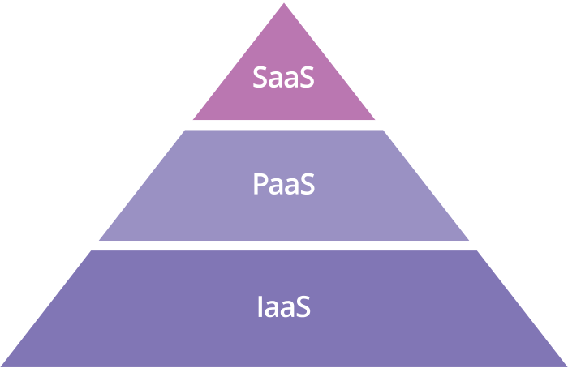

## 平台即服务（PaaS）是什么？

### 平台即服务（PaaS）是什么？

在平台即服务（PaaS）模型中，开发人员基本上租用构建应用程序所需的一切，这些都依赖于提供开发工具、基础设施和操作系统的云提供商。这是云计算三种服务模型的其中一种。PaaS 极大简化了 web 应用程序的开发；从开发人员的角度来看，所有的后端管理都是在幕后进行的。虽然 PaaS 与 [无服务器计算](https://www.cloudflare.com/learning/serverless/what-is-serverless/) 有一些相似之处，但是二者之间还是有挺大的不同的。

### 云计算的三种服务模型是什么？

云计算的三种模型即 PaaS，SaaS（软件即服务），以及 IaaS（基础设施即服务）。IaaS 是指由云供应商管理的云计算基础设施（服务器、存储等），而 SaaS 是整个应用程序指托管在云中并由 SaaS 供应商维护。如果将一位 SaaS 客户比作租户，那么 PaaS 客户就像一个租用所有重型设备和强力工具来快速建房子的人，而且这些工具设备是由其拥有者进行持续维护的。

### PaaS 与内部托管的开发环境相比如何？

PaaS 可以通过任何物联网连接访问，从而可以在一个 web 浏览器中构建整个应用程序。由于开发环境不是本地托管的，开发人员可以在世界的任何地方对应用程序进行开发。即使是分布在不同地理位置的团队也能够协作。这也意味着开发人员对开发环境的控制更少，然而这同时会带来更少的开销。

### PaaS 中包括什么？

PaaS 供应商提供的主要产品包括：

- 开发工具
- 中间件
- 操作系统
- 数据库管理
- 基础设施

虽然不同的供应商可能也会包括其它服务，但这些是核心的 PaaS 服务。

##### 开发工具

PaaS 供应商提供了各种各样软件开发必需的工具，包括源码编辑器、调试工具、编译器，以及其它必要的工具。这些工具可能会作为一个框架一起提供。特定工具将取决于供应商，但 PaaS 产品应该包括开发人员构建其应用程序所需的一切。

##### 中间件

作为服务的平台通常会包括中间件，所以开发人员不必自己来构建它。中间件是位于面向用户的应用程序和机器操作系统之间的软件；比如，中间件允许软件从键盘和鼠标输入来访问。对于运行应用程序，中间件是必需的，但最终用户并不与其进行交互。 

##### 操作系统

PaaS 供应商会提供并维护一个操作系统，用以开发人员的开发工作和应用程序运行。

##### 数据库

PaaS 提供者会管理和维护数据库。它们通常也会为开发人员提供数据库管理系统。

##### 基础设施

PaaS 是云计算服务模型中 IaaS 的下一层，IaaS 中包含的所有内容也包含在 PaaS 中。PaaS 提供商不仅可以管理服务器、存储和物理数据中心，还可以从 IaaS 提供商处购买。

### 开发人员为什么使用 PaaS？

##### 更快地投入市场

PaaS 用于构建应用程序的速度，可能比开发人员必须考虑构建、配置和供应自己的平台以及后端基础设施来构建应用的速度要更快。有了 PaaS，开发人员他们只需要编写代码和测试应用程序，而供应商会解决剩下的问题。

##### 由始自终一个环境

PaaS 允许开发人员在同等环境中构建、测试、调试、部署、托管和更新他们的应用程序。这使开发人员能够确保 web 应用在发布前能够正常运行，以及会简化应用程序开发周期。

##### 价格

在许多情况下，使用 PaaS 比 IaaS 更具成本效益。由于PaaS客户不需要管理和配置虚拟机，因此减少了开销。此外，一些提供商具有按使用付费的定价结构，供应商仅对应用程序使用的计算资源收费，通常为客户节省了资金。但是，每个供应商的定价结构略有不同，还有一些平台供应商会每月收取固定费用。

##### 许可证的便利性

PaaS 提供商会处理操作系统，开发工具以及其平台中包含的所有其他东西有关的许可证的问题。

### 使用PaaS有哪些潜在的缺点？

##### 供应商锁定

切换PaaS提供商可能会变得很困难，因为应用程序是使用供应商的工具构建的，特别是对于他们的平台（依赖）。每个供应商可能有不同的架构要求。不同的供应商可能不支持用于构建和运行应用程序的相同语言，库，API，体系结构或操作系统。要切换供应商，开发人员可能需要重建或大量更改其应用程序。

##### 供应商依赖

变更 PaaS 供应商所涉及的工作量和资源可能会使公司更依赖于他们当前的供应商。供应商内部流程或基础架构的微小变化都可能会对在旧配置下高效运行的应用程序的性能产生巨大影响。此外，如果供应商更改其定价模型，则应用程序可能会突然变得更加昂贵。

##### 安全性以及合规性的挑战

在 PaaS 架构中，外部供应商将存储应用程序的大部分或全部数据，并托管其代码。在某些情况下，供应商实际上可以通过另一个第三方（IaaS 提供商）存储数据库。虽然大多数 PaaS 供应商都是具有强大安全性的大型公司，但这让全面评估和测试保护应用程序及其数据的安全措施变得困难。此外，对于必须遵守严格的数据安全法规的公司，验证其他外部供应商的合规性将增加进入市场的障碍。

### 平台即服务与无服务计算究竟如何不同？

PaaS和无服务器计算有两处类似，开发人员只需考虑编写和上传代码，供应商会处理所有后端进程。然而在使用这两种模型时，在扩展方面会有很大差异。使用无服务器计算或 FaaS 构建的应用程序会进行自动扩展，而 PaaS 应用程序除非经过编程才能进行扩展。启动时间差异也很大；无服务器应用程序几乎可以立即启动和运行，但 PaaS 应用程序更像传统应用程序，必须在大部分时间或一直保持运行才能立即为用户提供。

另一个区别是无服务器供应商不像 PaaS 供应商那样提供开发工具或框架。最后，定价将两种模型分开。PaaS 计费并不像无服务器计算那样精确，无服务计算的费用被分解为每个函数实例运行的整数秒或分数（非整数）秒。

### 链接：

- 原文地址：https://www.cloudflare.com/learning/serverless/glossary/platform-as-a-service-paas/
