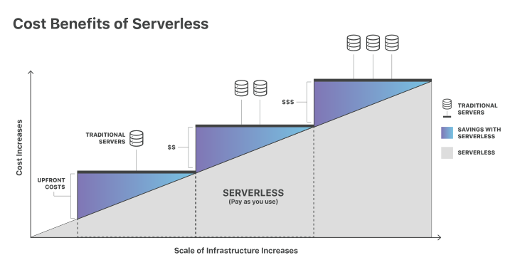

## 什么是无服务计算？

无服务计算是一种在过去的基础上提供后端服务的方法。`Serverless` 的供应商允许用户编写和发布代码，而不用担心其底层基础设施。从 `serverless` 供应商处获取后端服务的公司根据其计算量收取费用，并且不必为固定数量的带宽或服务器数量预留和支付费用，因为该服务是自动伸缩的。得注意一点，虽说是无服务器，但物理服务器仍在使用，但开发人员不需要意识到它们的存在。 

在早期 Web 时代，任何想要构建一个 web 应用的人都需要拥有运行服务器所需的物理硬件，这是一项既麻烦又昂贵的工作。

然后有了云，固定数量的服务器和服务器存储空间可被远程租用。开发人员以及公司租用这些固定服务器存储空间单元时，通常会过度购买，以确保流量或活动的激增不会超过每月的限制然后破坏其应用程序。这就意味着付过款的大部分服务器存储空间通常是浪费的。云供应商已经推出了自动伸缩模型来解决这个问题，但即使会对活动一些不期望的峰值，比如说一次 [DDos 攻击](https://www.cloudflare.com/learning/ddos/what-is-a-ddos-attack/)，进行自动伸缩，最终也可能非常昂贵。

无服务器计算允许开发人员在灵活的“按需购买”的基础上来购买后端服务，这就意味着开发人员只需为他们使用的服务付费。就像是从一个每月固定限额的手机数据套餐，切换到一个只对实际使用的每一字节数据收费的套餐。 

术语“serverless”多少有些误导，因为依旧有服务器会提供这些后端服务，只是所有服务器存储空间和基础结构问题都由供应商来处理。这么理解的话，无服务器（Serverless）就是开发人员可以在不必担心服务器的情况下完成他们的工作。

### 什么是后端服务？前后端的不同之处是什么？

应用开发通常分为两个领域：前端和后端。前端就是应用中用户可以看到并进行交互的那部分，比如说视觉布局。后端就是用户看不到的那部分；包括应用程序文件所在的服务器和用户数据和业务逻辑所在的数据库。

比如，让我们想象一下，有一个卖音乐会门票的网站。当用户在浏览器窗口中键入请求时，浏览器向后端服务器发送请求，后端服务器响应网站数据。然后，用户将看到网站的前端，其中包括用户填写的文本，图像和表单字段。然后，用户可以与前端上的一个表单字段交互以搜索他们喜欢的音乐表演。当用户点击“提交”时，这将触发对后端的另一个请求。后端代码检查其数据库以查看是否存在具有此名的演员，如果存在，则何时将演出下一场，以及可用的票数。然后，后端将该数据传递回前端，并且前端将以对用户有意义的方式显示结果。类似地，当用户创建账户并输入财务信息以购买门票时，将发生前端和后端之间的另一次通信。

### 无服务器计算可以提供哪种后端服务？

大多数无服务器提供商为其客户提供数据库和存储服务，许多还提供 [功能即服务（FaaS）](https://www.cloudflare.com/learning/serverless/glossary/function-as-a-service-faas/) 平台，如 [Cloudflare Workers](https://www.cloudflare.com/products/cloudflare-workers/)。 这些平台可以在边缘上执行代码片段而不存储任何数据。

### 无服务器计算有哪些优势？

- **更低的成本** —— 无服务器计算通常非常具有成本效益，因为后端服务（服务器分配）的传统云提供商通常会导致用户为未使用的空间或空闲CPU时间付费。
- **易扩展性** —— 使用无服务器架构的开发人员不必担心扩展其代码的策略。无服务器供应商按需处理所有扩展。
- **易编写的后端代码** —— 使用FaaS，开发人员可以创建独立执行单一目的的简单函数，例如进行API调用。
- **更快的周转时间** —— 无服务器架构可以显着缩短产品上市时间。开发人员可以逐个添加和修改代码，而不需要复杂的部署过程来推出错误修复和新功能。

### 链接

- 原文地址：https://www.cloudflare.com/learning/serverless/what-is-serverless/
