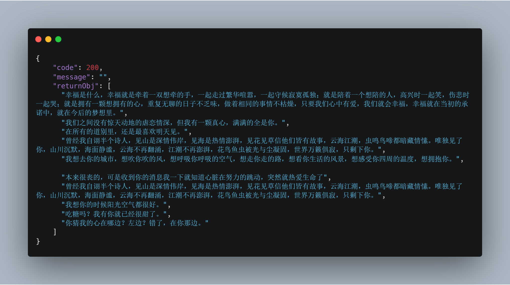

## 在 Spring Boot 项目中单独使用 spring cloud feign 替代 HTTP Client ：渣男语录的学习

在项目中我们有时候需要调用第三方的 `API` ，微服务架构中这种情况则更是无法避免——各个微服务之间通信。比如一般的项目中，有时候我们会使用 HTTP Client 发送 HTTP 请求来进行调用，而在微服务架构，Spring Cloud 全家桶中，Spring Cloud Feign 则是更常见的选择。那么，我如何只使用 Spring Cloud Feign 而不引入整个 Spring Cloud 呢？这就要从一个渣男语录 `API` 说起了……

### 首先，去哪找一个  `API`  呢？

免费的 `API` 特别多，`github` 上也有免费 `API` 地址汇总的 `repo`，但这些都太正式了。有趣的事物总是会相互吸引的，无意间我发现了这么一个网站，“渣男：说话的艺术”（https://lovelive.tools/），每次请求都可以获取一句甜言蜜语（渣男语录），这不正是我这个钢铁直男需要的吗？而且特别良心的是，作者提供了 `API` 列表，给作者点赞！

### 如何调用第三方服务？

首先，我们先快速构建一个 Spring Boot 的 web 项目，这里我就省略了。然后在我们 `gradle` 文件中添加 `spring-cloud-starter-openfeign` 依赖：

```groovy
compile group: 'org.springframework.cloud', name: 'spring-cloud-starter-openfeign', version: '2.1.3.RELEASE'
```

然后，在启动类添加响应的注解 `@EnableFeignClients`：

```java
@SpringBootApplication
@EnableFeignClients
public class MyOpenFeignApplication {

    public static void main(String[] args) {
        SpringApplication.run(MyOpenFeignApplication.class, args);
    }
}
```

接着，我们便可以配置我们的 Client 了，我们先创建一个接口类，比如叫 `BadGuyFeignClient` ，并声明为 `FeignClient`：

```java
@FeignClient
public interface BadGuyFeignClient {

}
```

`@FeignClient` 有以下几个较常用属性：

- `name`，`value` ：指定 `FeignClient` 的名称，如果项目使用了 `Ribbon`，`name` 属性会作为微服务的名称，用于服务发现；
- `url` ：`url` 一般用于调试，可以手动指定 `@FeignClient` 调用的地址
- `fallback`，`fallbackFactory` ：`fallback` 定义容错的处理类，当调用远程接口失败或超时时，会调用对应接口的容错逻辑，`fallback` 指定的类必须实现 `@FeignClient` 标记的接口；`fallbackFactory` 工厂类，用于生成 `fallback` 类示例，通过这个属性我们可以实现每个接口通用的容错逻辑，减少重复的代码；
- `configuration` ：`Feign` 配置类，可以自定义 `Feign` 的 `Encoder`、`Decoder`、`LogLevel`、`Contract`；
- `path` ：定义当前 `FeignClient` 的统一前缀。

然后，我们便可以配置对应的属性，这里我们只是用来实现类似于 HTTP Client 的功能，所以只是简单配置了 `url` 和 `path` 这些属性：

```java
@FeignClient(name = "badGuy", url = "${bab.guy.url}", path = "api")
public interface BadGuyFeignClient {

    /**
     * 随机获取一句甜言蜜语
     *
     * @return
     */
    @GetMapping("SweetNothings")
    String getSweetNothings();

    /**
     * 获取 count 条甜言蜜语
     *
     * @param count 获取甜言蜜语条数
     * @return Json 格式的结果
     */
    @GetMapping("SweetNothings/{count}/Serialization/Json")
    QuotationResult<String> getSweetNothingsJsonByCount(@PathVariable("count") Integer count);
}
```

声明为 `FeignClient` 之后，我们便可以在代码中使用 `@Resource` 或者 `@Autowire` 进行注入使用了：

```java
@Component
public class BadServiceImpl implements BadGuyService {

    @Autowired
    private BadGuyFeignClient badGuyFeignClient;

    @Override
    public List<String> getQuotations(Integer count) {
        if (count == null || count <= 0) {
            String singleQuotation = badGuyFeignClient.getSweetNothings();
            return new ArrayList<String>() {{
                add(singleQuotation);
            }};
        }
        return badGuyFeignClient.getSweetNothingsJsonByCount(count).getReturnObj();
    }
}
```

然后 `Controller` 中是这么写的：

```java
    @GetMapping({"quotations", "quotations/{count}"})
    public ResultWrapper<List<String>> getBadGuyQuotations(
      @PathVariable(value = "count", required = false) Integer count
    ) {
        try {
            List<String> resultStrings = badGuyService.getQuotations(count);
            return new ResultWrapper<>(resultStrings);
        } catch (Exception e) {
            log.error("Failed to get bad guy quotations.", e);
            return new ResultWrapper<List<String>>() {{
                setCode("1000002");
                setMessage("error");
                setData(null);
            }};
        }
    }
```

启动项目之后，我们可以访问 http://localhost:8088/api/badGuy/quotations 或者 http://localhost:8088/api/badGuy/quotations/10 后面跟数字，即可得到对应条目数的结果。（完整项目地址在文末）



### `FeignClient` 与 `HttpClient` 的区别是什么？

`HttpClient` 与之同样实现的还有 `Okhttp`、`Httpurlconnection`、`RestTemplate` 等等，其 URL 参数是以编程方式构造的，数据被发送到其他服务。在更复杂的情况下，我们将不得不`RestTemplate`深入到更低级别的 `API` 提供的甚至是 `API` 的细节。

`FeignClient` 则更像是在基于 REST 的服务调用上提供更高级别的抽象，在客户端编写**声明式** REST 服务接口，并使用这些接口来编写客户端程序。开发人员不用担心这个接口的实现。这将在运行时由 Spring 动态配置。通过这种声明性的方法，开发人员不需要深入了解由 HTTP 提供的 HTTP 级别 `API` 的细节的`RestTemplate`。

总的来讲，`FeignClient` 更具抽象性，也更简单、灵活。

### 总结

本文简单介绍了如何使用 `Spring Cloud Feign` 组件来替代 `HttpClient` 来实现调用第三方服务的方法，除了集成 `Feign` 组件，我们也可以在项目中加入 `Ribbon` 用于服务发现，加入 `Hystrix` 用于服务熔断等等，这样就会完整地构建出一个基本服务了。

### 链接

项目地址： https://github.com/lq920320/my-openfeign-demo