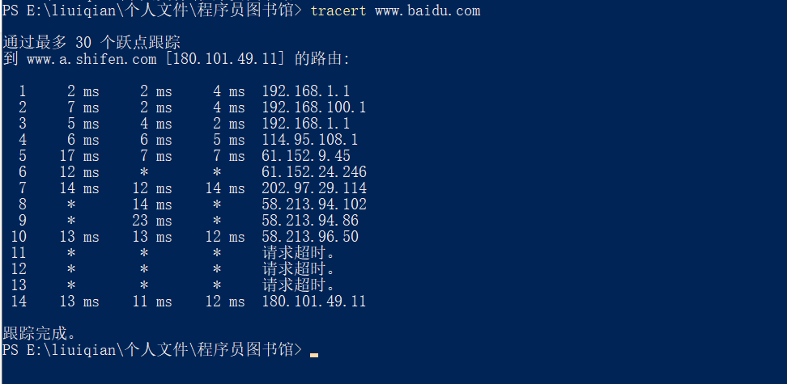
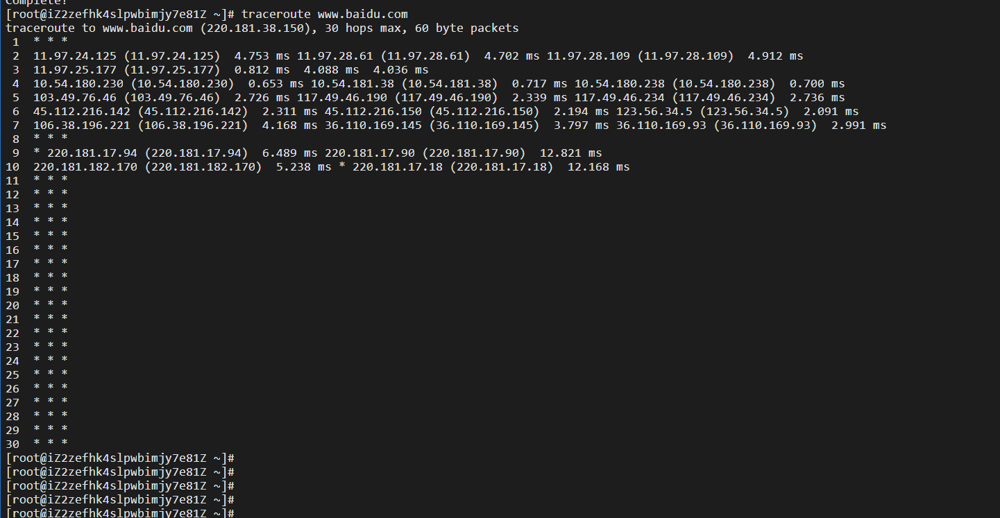
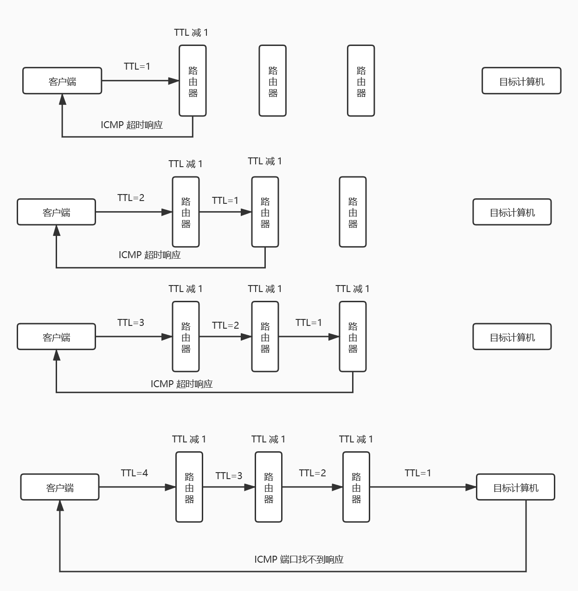

### 计算机网络：`traceroute` 是什么

我的电脑是 Windows 系统，当我在命令行中敲下 `tracert www.baidu.com` 的时候，它是如下展示的：

而在 `CentOS` 的服务器上运行 `traceroute www.baidu.com` 时（如果未安装 `traceroute`，先执行 `yum install traceroute`），它又是这么展示的：

那么为什么二者响应的数据格式会不同呢？

今天我们还是继续水文章，来聊聊 `traceroute` 是什么，以及其简单的原理。

#### `traceroute` 是什么？

> `traceroute` (Windows 系统下是`tracert`) 命令利用 `ICMP` 协议定位您的计算机和目标计算机之间的所有路由器。`TTL`   值可以反映数据包经过的路由器或网关的数量，通过操纵独立 `ICMP` 呼叫报文的 `TTL`  值和观察该报文被抛弃的返回信息，`traceroute` 命令能够遍历到数据包传输路径上的所有路由器。
>
> —— 百度百科

由上可知，我们知道 `traceroute` 是一个命令，可以定位客户端到目标计算机之间所有的路由器。然后我们也可以看到了两个英文缩写，`ICMP` 和 `TTL`，它们的全称分别是 “Internet Control Message Protocol”（Internet 控制报文协议）、“Time To Live”（生存时间），这俩又是什么呢？

> ICMP（Internet Control Message Protocol）Internet控制[报文](https://baike.baidu.com/item/报文/3164352)协议。它是[TCP/IP协议簇](https://baike.baidu.com/item/TCP%2FIP协议簇)的一个子协议，用于在 IP[主机](https://baike.baidu.com/item/主机/455151)、[路由](https://baike.baidu.com/item/路由)器之间传递控制消息。控制消息是指[网络通](https://baike.baidu.com/item/网络通)不通、[主机](https://baike.baidu.com/item/主机/455151)是否可达、[路由](https://baike.baidu.com/item/路由/363497)是否可用等网络本身的消息。这些控制消息虽然并不传输用户数据，但是对于用户数据的传递起着重要的作用。
>
> —— 百度百科

简言之，`ICMP` 通常用来传递网络通信之间的错误信息。

> TTL是 Time To Live的缩写，该字段指定IP包被路由器丢弃之前允许通过的最大网段数量。TTL是IPv4报头的一个8 bit字段。
>
> 注意：TTL与DNS TTL有区别。二者都是生存时间，前者指ICMP包的转发次数（跳数），后者指域名解析信息在DNS中的存在时间。
>
> —— 百度百科

虽然 `TTL` 翻译作“生存时间”，但看这意思更像是说“生存次数”。

至此，我们算是基本了解了相关的一些概念。那么这几个概念是如何组装到一起的呢？下面我们来简单介绍一下 `traceroute` 有趣的原理。PS：不要吐槽为啥我在“百度百科”上找定义而非“维基百科”。

#### `traceroute` 是如何工作的？

原理：`traceroute` 会从客户端首先发送一个 TTL=1 的数据（报文或者请求）到目标计算机，当路径上的路由器收到这条数据时，TTL 会减 1，此时，第一个路由器便会返回超时的 `ICMP` 响应，这样，客户端就获取到了第一个路由器的地址信息；以此类推，客户端会接着发送 TTL=2 的数据，那经过第一个路由器，TTL 减 1，经过第二个路由器，TTL 减为 0，此时，第二个路由器便会返回超时的 `ICMP` 响应，客户端也就拿到了第二个路由器的信息。直到抵达目标计算机。

那么你就可能会问了，如何判断已经到达目标计算机了呢？仔细观察上图可以知道，路由器返回的报错信息，与目标计算机返回的报错信息是不同的，而客户端就是根据返回的不同报错来判定是否到达目标计算机的。在发送请求时，客户端请求的端口号会设置成一个比较大的值，一般大于 30000，这样在路由器上返回的 `ICMP` 报文都是超时错误，而在目标计算机上返回的则是“端口不可达”的错误报文。

关于 `traceroute` 有两种实现，一种是基于 `UDP` 协议实现的发送报文（windows 系统），一种是基于 `ICMP echo request` （`ICMP` 回显请求）实现的（Unix/Linux 系统）。其两者的区别就是从客户端往下一节点发送的数据格式不同，一种是向下一节点发送 `UDP` 报文，一种是向下一节点发送 `ICMP echo request` 请求，至于更多的实现细节，大家感兴趣的话可以自行去探索。

#### 总结

`Traceroute` 是用来侦测主机到目的主机之间所经路由情况的重要工具，也是最便利的工具。前面说到，尽管 `ping` 工具也可以进行侦测，但是，因为 `ip` 头的限制，`ping` 不能完全的记录下所经过的路由器。所以 `Traceroute` 正好就填补了这个缺憾。

本文也只是简单地介绍了一下 `traceroute` 的原理，告诉大家有这么一个东西，其中还有很多问题值得去探索，比如其所使用的协议，`UDP` 报文数据的组成，以及 `ICMP` 和 `TTL` 更多的理解等等。也希望本篇文章可以达到抛砖引玉的效果。

